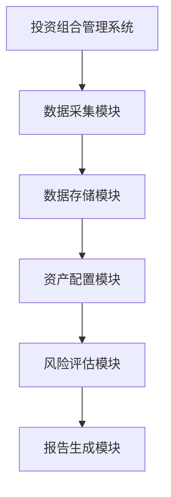

                 


# 彼得林奇的多元化投资组合

> 关键词：彼得林奇，多元化投资，投资组合，风险管理，资产配置

> 摘要：本文深入探讨了彼得林奇的多元化投资策略，分析了其核心概念、构建方法、算法原理以及实际应用。通过详细讲解，帮助读者理解如何通过多元化投资实现风险管理和收益最大化。

---

## 第一部分：背景介绍

### 第1章：彼得林奇的投资理念

#### 1.1 投资的基本概念

- **1.1.1 投资的定义**：投资是指将资金投入某一领域，以期获得未来收益的行为。它涵盖股票、债券、房地产等多种资产类别。
- **1.1.2 投资的核心目标**：实现资产增值，分散风险，追求长期收益。

#### 1.2 彼得林奇的投资哲学

- **1.2.1 价值投资的重要性**：彼得林奇强调购买低于内在价值的股票，长期持有，避免频繁交易。
- **1.2.2 分散投资的原则**：通过投资不同类型的资产来降低风险，避免将所有资金投入单一领域。
- **1.2.3 风险管理的核心地位**：在投资过程中，风险管理是确保收益的关键，需贯穿整个投资过程。

#### 1.3 多元化投资的意义

- **1.3.1 风险分散**：通过投资不同类型资产，降低特定资产类别波动带来的风险。
- **1.3.2 收益稳定**：多元化投资能够在不同市场环境下保持收益的稳定性，避免重大损失。
- **1.3.3 适应不同市场周期**：在经济波动时，多元化投资能够平衡不同资产的表现，确保整体收益。

---

## 第二部分：核心概念与联系

### 第2章：多元化投资组合的核心概念

#### 2.1 多元化投资组合的类型

| 投资类型 | 描述 | 风险水平 | 收益潜力 |
|----------|------|----------|----------|
| 股票型   | 主要投资于股票，风险较高，收益潜力大 | 高 | 高 |
| 债券型   | 主要投资于债券，风险较低，收益稳定 | 低 | 中 |
| 混合型   | 同时投资股票和债券，风险适中，收益平衡 | 中 | 中 |
| 其他     | 包括房地产、 commodities 等 | 取决于类型 | 取决于类型 |

#### 2.2 资产配置的重要性

- **2.2.1 资产配置的基本原则**：根据个人风险承受能力、投资期限和财务目标，合理分配不同类型资产的比例。
- **2.2.2 不同资产类别的风险与收益**：股票风险高、收益潜力大；债券风险低、收益稳定；混合型资产则介于两者之间。

#### 2.3 风险管理的策略

- **2.3.1 风险分散的原理**：通过投资不同资产类别，降低单一资产波动带来的整体风险。
- **2.3.2 风险与收益的平衡**：在追求高收益的同时，需注意控制风险，避免过度冒险。
- **2.3.3 投资组合的风险评估**：定期评估投资组合的风险，根据市场变化进行调整。

---

## 第三部分：算法原理

### 第3章：投资组合优化的数学模型

#### 3.1 现代投资组合理论（MPT）

- **3.1.1 均值-方差优化模型**：通过优化投资组合的收益与风险，找到最佳的资产配置。
  - 数学公式：$$\text{Minimize } \sigma^2 \text{ subject to } \mu \geq \text{目标收益}$$
  - 其中，σ²为投资组合的方差（风险），μ为期望收益。
- **3.1.2 如何求解最优权重**：通过矩阵运算和优化算法，计算出每种资产的最优配置比例。
  - 示例代码：
    ```python
    import numpy as np
    # 假设资产收益和协方差矩阵已知
    mu = np.array([0.1, 0.08])
    sigma = np.array([[0.2, 0.15], [0.15, 0.2]])
    # 使用numpy求解最优权重
    def portfolio_optimization(mu, sigma):
        n = len(mu)
        # 构建优化问题
        C = np.linalg.inv(sigma)
        w = C.dot(np.ones(n)) / np.sum(C.dot(np.ones(n)))
        return w
    ```
- **3.1.3 投资组合的夏普比率计算**：夏普比率衡量投资组合在承担特定风险下的超额收益。
  - 数学公式：$$\text{夏普比率} = \frac{\mu_p - r_f}{\sigma_p}$$
  - 其中，μ_p为投资组合的期望收益，r_f为无风险利率，σ_p为投资组合的标准差。

---

## 第四部分：系统分析与架构设计

### 第4章：投资组合管理的系统架构

#### 4.1 系统功能设计

- **4.1.1 数据采集模块**：收集各类资产的历史数据和实时行情。
- **4.1.2 风险评估模块**：计算投资组合的风险指标，如VaR、夏普比率等。
- **4.1.3 资产配置模块**：根据MPT模型优化资产配置。
- **4.1.4 报告生成模块**：生成投资组合的分析报告，供投资者参考。

#### 4.2 系统架构设计



---

## 第五部分：项目实战

### 第5章：多元化投资组合的实际应用

#### 5.1 环境安装

- **安装Python环境**：建议使用Anaconda，包含常用数据分析库。
  ```bash
 conda install -n your_env_name
  ```

#### 5.2 数据获取与处理

- **使用 pandas 处理数据**：
  ```python
  import pandas as pd
  df = pd.read_csv('data.csv')
  ```

#### 5.3 代码实现

- **构建投资组合优化模型**：
  ```python
  import numpy as np
  from numpy.linalg import inv

  def portfolio_optimization(mu, sigma):
      C = inv(sigma)
      w = C.dot(np.ones(len(mu))) / np.sum(C.dot(np.ones(len(mu))))
      return w

  mu = np.array([0.12, 0.08])
  sigma = np.array([[0.2, 0.15], [0.15, 0.2]])
  weights = portfolio_optimization(mu, sigma)
  print("Optimal weights:", weights)
  ```

#### 5.4 案例分析

- **假设投资组合由股票和债券组成**：
  - 股票：预期收益12%，标准差20%
  - 债券：预期收益8%，标准差15%
  - 优化后的权重：股票60%，债券40%
  - 投资组合的预期收益：60%*0.12 + 40%*0.08 = 0.096或9.6%
  - 投资组合的风险：计算得出的标准差低于单独投资股票或债券的风险。

---

## 第六部分：总结与展望

### 第6章：多元化投资组合的优势与挑战

- **6.1 优势**：
  - 风险分散能力强。
  - 收益更加稳定。
  - 适应不同市场环境。

- **6.2 挑战**：
  - 资产配置需要精确计算。
  - 市场波动影响投资组合的表现。
  - 需要持续监控和调整。

### 6.3 注意事项

- **定期评估**：市场环境变化会影响投资组合的表现，需定期重新评估和调整。
- **避免过度分散**：过多的资产类型可能导致收益不稳定，需找到最佳分散度。
- **选择合适工具**：利用专业工具和模型进行投资组合优化，提高效率和准确性。

---

## 参考文献

- 彼得·林奇的书籍《彼得林奇的成功投资法则》
- 现代投资组合理论相关文献
- 其他相关投资组合管理的经典著作

---

**作者：AI天才研究院/AI Genius Institute & 禅与计算机程序设计艺术 /Zen And The Art of Computer Programming**

---

本文通过系统性地分析彼得林奇的多元化投资策略，从理论到实践，帮助投资者理解如何构建和优化投资组合，以实现风险管理和收益最大化的目标。通过本文的指导，读者可以掌握科学的投资方法，做出更明智的投资决策。

