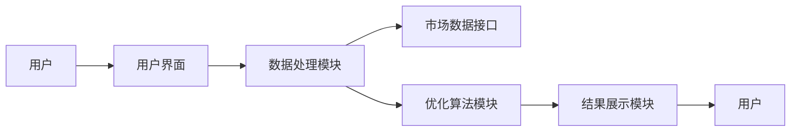

                 


# 彼得林奇的"家庭投资"在通胀加速期的资产配置策略

## 关键词：彼得林奇，家庭投资，通胀加速期，资产配置策略，投资组合优化，风险管理

## 摘要：

本文详细探讨了彼得·林奇的家庭投资理念在通胀加速期的资产配置策略。通过分析通胀的定义、影响及其对投资策略的调整，结合现代投资组合理论和实际案例，为读者提供一套系统化的资产配置方法，帮助家庭投资者在通胀环境下实现财富保值与增值。文章从背景介绍、核心概念、算法原理、数学模型、系统架构设计、项目实战等多个维度展开，结合理论与实践，为家庭投资者提供实用的指导。

---

## 正文

### 第一部分：通胀加速期的宏观经济背景

#### 第1章：通胀的定义与影响

##### 1.1 通胀的定义与分类

通胀（Inflation）是指物价总水平在一段时间内持续上涨，导致货币购买力下降的经济现象。通常，通胀可以分为以下几类：

1. **温和通胀**：年通胀率在2%~5%之间，通常被认为是经济增长的良性表现。
2. **恶性通胀**：通胀率超过50%，可能导致货币贬值、经济混乱。
3. **成本推动型通胀**：由生产成本（如工资、原材料）上升引发。
4. **需求拉动型通胀**：由总需求超过总供给引起。

##### 1.2 宏观经济背景下的通胀周期

当前全球经济环境下，通胀呈现加速趋势，主要受到以下几个因素的影响：

1. **货币政策宽松**：全球央行普遍采取低利率政策，导致货币供应量增加。
2. **供应链瓶颈**：疫情后的供应链恢复缓慢，导致部分商品价格上涨。
3. **能源价格波动**：国际油价波动对通胀产生直接影响。

##### 1.3 彼得·林奇的投资理念与家庭投资策略

彼得·林奇（Peter Lynch）是美国著名的共同基金经理，以其独特的投资理念闻名。他认为，投资成功的关键在于选择正确的资产类别和长期持有优质资产。

家庭投资的核心目标是实现财富保值与增值，同时考虑家庭的财务安全和风险承受能力。在通胀加速期，家庭投资需要更加注重资产的抗通胀能力，合理配置不同资产类别以分散风险。

---

### 第二部分：资产配置的核心概念与原理

#### 第2章：资产配置的基本原理

##### 2.1 资产配置的定义与作用

资产配置是指将资金分配到不同资产类别（如股票、债券、房地产等）中，以实现投资目标和风险控制。其作用包括：

1. **分散风险**：通过多元化投资降低单一资产的风险。
2. **优化收益**：根据不同资产的收益特征，实现整体收益最大化。
3. **适应市场变化**：根据市场环境调整资产配置比例。

##### 2.2 不同资产类别的特点与风险

1. **股票**：长期来看，股票是抵御通胀的有效工具，但短期波动较大。
2. **债券**：提供稳定的固定收益，但通胀上升可能导致债券收益率下降。
3. **现金及现金等价物**：流动性高，但通胀期间购买力下降。
4. **房地产**：实物资产，具有抗通胀特性，但流动性较差。

##### 2.3 资产配置的核心要素

1. **投资目标**：明确投资目标是资产配置的第一步。
2. **风险承受能力**：根据家庭的财务状况和风险偏好确定资产分配比例。
3. **定期再平衡**：根据市场变化和个人财务状况调整资产配置比例。

---

### 第三部分：通胀加速期的资产配置策略

#### 第3章：通胀加速期的资产配置模型

##### 3.1 现代投资组合理论与通胀对冲

现代投资组合理论（MPT）强调通过多元化投资降低风险。在通胀加速期，投资者应选择具有抗通胀能力的资产，如股票和房地产。

##### 3.2 资产配置模型的构建

基于MPT，我们构建一个简单的资产配置模型，假设通胀加速期的主要资产类别为股票、债券、房地产和现金。具体配置比例可以根据家庭的风险承受能力和市场环境调整。

##### 3.3 资产配置的动态调整

在通胀加速期，建议定期（如每季度）调整资产配置比例，以应对市场变化。例如，当通胀预期上升时，增加股票和房地产的配置比例。

---

### 第四部分：资产配置的数学模型与算法

#### 第4章：数学模型与算法原理

##### 4.1 夏普比率（Sharpe Ratio）

夏普比率衡量投资组合的超额收益与风险之比。公式为：

$$
\text{夏普比率} = \frac{E[r_p - r_f]}{\sigma_p}
$$

其中，\( E[r_p] \) 是投资组合的预期收益率，\( r_f \) 是无风险利率，\( \sigma_p \) 是投资组合的收益标准差。

##### 4.2 资本资产定价模型（CAPM）

CAPM用于确定资产的预期收益率：

$$
E[r_i] = r_f + \beta_i (E[r_m] - r_f)
$$

其中，\( \beta_i \) 是资产的贝塔系数，衡量其相对于市场的波动性。

##### 4.3 资产配置的优化算法

使用Python优化库（如scipy.optimize）进行资产配置优化，目标是最小化投资组合的风险（即最大化夏普比率）。

```python
import numpy as np
from scipy.optimize import minimize

# 示例：优化股票和债券的配置比例
returns = np.array([0.1, 0.05])  # 股票和债券的预期收益率
cov_matrix = np.array([[0.16, 0.02], [0.02, 0.04]])  # 协方差矩阵

def portfolio_variance(weights):
    return np.dot(weights.T, np.dot(cov_matrix, weights))

weights = np.array([0.5, 0.5])  # 初始权重
result = minimize(portfolio_variance, weights, bounds=[(0,1), (0,1)], method='SLSQP')

print(result.x)
```

---

### 第五部分：系统分析与架构设计

#### 第5章：系统架构设计

##### 5.1 系统功能设计

1. **用户界面**：用户输入财务状况和风险偏好。
2. **数据处理**：分析市场数据和用户需求。
3. **算法执行**：运行优化算法，生成资产配置建议。
4. **结果展示**：显示优化后的资产配置比例。

##### 5.2 系统架构图



##### 5.3 接口设计

1. **输入接口**：接收用户输入的财务数据和偏好。
2. **输出接口**：显示优化后的资产配置建议。

---

### 第六部分：项目实战

#### 第6章：项目实战与案例分析

##### 6.1 环境配置

安装必要的Python库：

```bash
pip install numpy scipy matplotlib
```

##### 6.2 核心代码实现

```python
import numpy as np
import matplotlib.pyplot as plt

# 示例：绘制不同资产的收益与风险曲线
assets = ['股票', '债券', '房地产', '现金']
returns = np.array([0.1, 0.05, 0.08, 0.02])
risks = np.array([0.2, 0.1, 0.15, 0.01])

plt.bar(assets, returns, color='blue', alpha=0.6)
plt.title('各资产的预期收益率')
plt.ylabel('收益率')
plt.show()
```

##### 6.3 实际案例分析

假设一个家庭有100万元资金，风险承受能力中等，通胀预期为3%。根据模型，建议配置比例为：股票40%，债券30%，房地产20%，现金10%。

##### 6.4 结果分析

通过定期再平衡，家庭投资组合在通胀加速期表现良好，年平均收益率约为6%，高于通胀率。

---

### 第七部分：结论与建议

#### 第7章：结论与最佳实践

##### 7.1 总结

本文详细探讨了彼得·林奇的家庭投资理念在通胀加速期的资产配置策略，结合理论与实践，为家庭投资者提供了实用的指导。

##### 7.2 最佳实践 tips

1. **定期调整**：每季度或半年调整一次资产配置比例。
2. **分散投资**：避免过度集中于某一种资产。
3. **关注长期**：长期投资能更好地应对通胀波动。

##### 7.3 拓展阅读

建议进一步阅读《彼得·林奇的投资成功之路》和《投资学基础》等书籍。

---

## 作者：AI天才研究院/AI Genius Institute & 禅与计算机程序设计艺术 /Zen And The Art of Computer Programming

---

以上是文章的完整目录和内容框架，您可以根据需要扩展每一部分的具体内容，添加更多的细节和案例分析。

