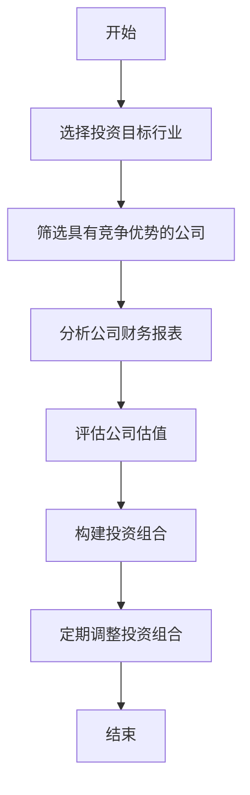
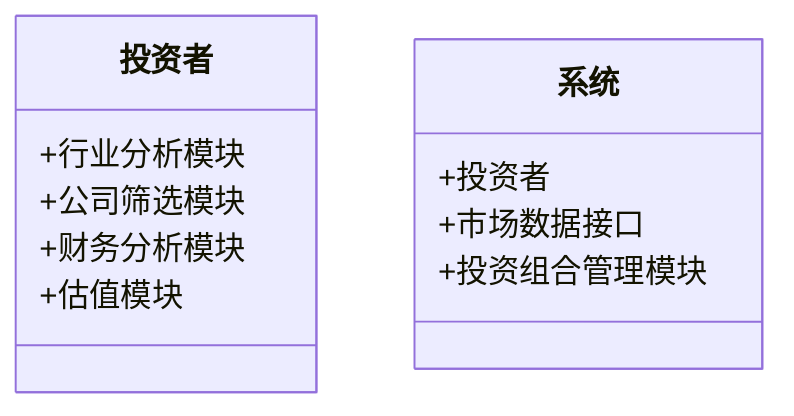
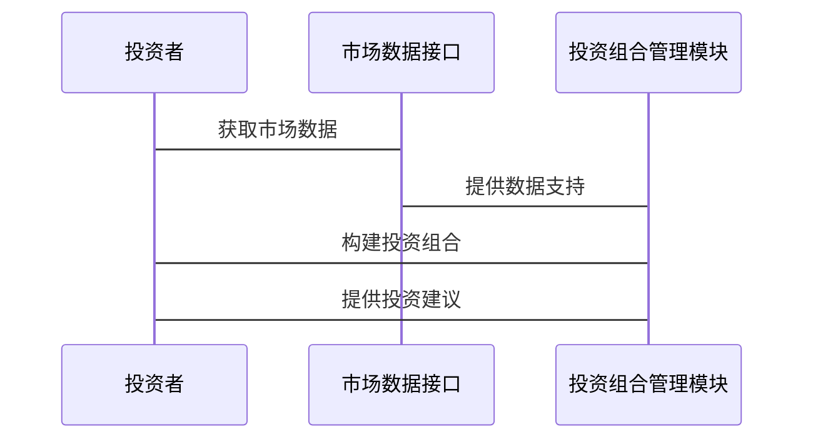

                 


# 彼得林奇的成长型价值投资：寻找十倍股的秘诀

## 关键词：成长型投资，价值投资，彼得林奇，十倍股，投资策略，数学模型，系统架构

## 摘要：  
彼得·林奇是全球最著名的成长型价值投资者之一，他的投资理念强调通过基本面分析和竞争优势识别，寻找具有长期增长潜力的十倍股。本文将从彼得林奇的成长型价值投资理论出发，详细分析其核心概念、数学模型、系统架构和实战案例，帮助读者理解如何在投资中应用这些方法。通过本文，读者将掌握如何通过基本面分析、财务指标评估和竞争优势分析，寻找具有长期增长潜力的公司，并构建稳健的投资组合。

---

# 第一部分：彼得林奇的成长型价值投资概述

## 第1章：投资概述与彼得林奇的背景

### 1.1 投资的基本概念

#### 1.1.1 投资的定义与分类  
投资是指将资金投入到能够产生未来收益的资产或项目中，常见的投资类型包括股票、债券、房地产和货币市场工具等。股票投资是本文的核心，尤其是成长型股票的投资。

#### 1.1.2 价值投资的起源与发展  
价值投资由本杰明·格雷厄姆提出，强调以低于内在价值的价格买入优质股票。彼得林奇继承并发展了这一理念，特别注重成长型股票的投资。

#### 1.1.3 彼得林奇的生平与投资理念  
彼得·林奇是富达投资的传奇经理人，他通过深入研究和长期持有优质股票，创造了卓越的投资业绩。他的理念强调：  
- 选择具有强大竞争优势的公司。  
- 长期持有，避免频繁交易。  
- 以合理价格买入优质资产。

---

## 第2章：成长型投资的核心概念

### 2.1 成长型投资的定义

#### 2.1.1 成长型投资的内涵  
成长型投资关注公司未来的增长潜力，而非当前的盈利能力。这类投资通常集中在高科技、医疗健康、消费服务等领域。

#### 2.1.2 成长型投资与价值投资的区别  
价值投资关注低估值的股票，而成长型投资关注高增长的股票。两者的区别在于：价值投资注重安全边际，成长型投资注重未来增长。

#### 2.1.3 成长型投资的适用场景  
在经济增长周期或新兴行业，成长型投资表现尤为突出。

### 2.2 十倍股的特征与寻找方法

#### 2.2.1 十倍股的定义与特征  
十倍股是指在一定时间内，股价上涨十倍或以上的股票。这类股票通常具有以下特征：  
- 高成长性：年增长率超过20%。  
- 强大的竞争优势：市场领导者或具有创新优势。  
- 合理的估值：市盈率和市净率等指标低于行业平均水平。  

#### 2.2.2 十倍股的筛选标准  
- 行业地位：行业龙头或具有独特竞争优势的公司。  
- 财务健康：高毛利、低负债、稳定的现金流。  
- 管理团队：优秀的管理团队和长期的愿景。  

#### 2.2.3 十倍股的潜在领域  
科技、人工智能、生物技术、消费升级等领域具有较大的成长潜力。

---

## 第3章：彼得林奇的投资策略

### 3.1 彼得林奇的成长型投资框架

#### 3.1.1 选股标准  
彼得林奇的选股标准包括：  
1. 公司具有强大的竞争优势。  
2. 公司具有稳定的财务状况。  
3. 公司具有良好的管理团队。  

#### 3.1.2 行业分析  
选择具有高增长潜力的行业，如科技、医疗等。  

#### 3.1.3 财务指标分析  
关注ROE（净资产收益率）、毛利率、净利率等指标。

### 3.2 投资组合管理

#### 3.2.1 投资组合的构建  
彼得林奇主张分散投资，避免过度集中。  

#### 3.2.2 投资组合的调整  
定期评估投资组合，根据市场变化进行调整。  

#### 3.2.3 风险控制  
设定止损点，避免重大损失。

---

# 第二部分：成长型价值投资的核心原理

## 第4章：基本面分析与竞争优势

### 4.1 基本面分析的核心要素

#### 4.1.1 财务报表分析  
分析利润表、资产负债表和现金流量表，评估公司的财务健康状况。

#### 4.1.2 行业地位分析  
评估公司在行业中的地位，是否为领导者或具有竞争优势。

#### 4.1.3 管理团队分析  
评估管理团队的稳定性、经验和愿景。

### 4.2 竞争优势的识别与评估

#### 4.2.1 核心竞争力的定义  
核心竞争力是指公司在市场上难以被模仿的独特优势。

#### 4.2.2 竞争优势的分类  
- 成本优势  
- 技术优势  
- 市场优势  

#### 4.2.3 竞争优势的持续性评估  
评估竞争优势是否能够在未来持续保持。

---

## 第5章：财务指标与估值方法

### 5.1 财务指标分析

#### 5.1.1 收益能力分析  
关注净利润增长率、ROE等指标。

#### 5.1.2 资产效率分析  
关注存货周转率、应收账款周转率等指标。

#### 5.1.3 财务健康性分析  
关注资产负债率、流动比率等指标。

### 5.2 估值方法与指标

#### 5.2.1 市盈率（P/E）分析  
$$P/E = \frac{\text{股价}}{\text{每股收益}}$$

#### 5.2.2 市净率（P/B）分析  
$$P/B = \frac{\text{股价}}{\text{每股净资产}}$$

#### 5.2.3 市盈率增长比（PEG）分析  
$$PEG = \frac{P/E}{\text{净利润增长率}}$$

---

# 第三部分：成长型价值投资的数学模型与算法

## 第6章：数学模型与估值方法

### 6.1 常用估值模型

#### 6.1.1 现金流折现模型（DCF）

$$DCF = \sum_{t=1}^{n} \frac{CF_t}{(1+r)^t} + \frac{TV}{(1+r)^n}$$

其中：  
- \(CF_t\)：第t年的现金流  
- \(r\)：折现率  
- \(TV\)：终值  

#### 6.1.2 市盈率模型  
$$P/E = \frac{Price}{Earnings}$$

#### 6.1.3 市净率模型  
$$P/B = \frac{Price}{Book\ Value}$$

---

## 第7章：算法与系统架构

### 7.1 算法流程图



---

## 第8章：系统架构设计

### 8.1 系统功能设计



### 8.2 系统交互设计



---

# 第四部分：项目实战

## 第9章：成长型价值投资实战案例

### 9.1 案例背景

假设我们关注人工智能行业，选择一家具有强大技术优势的公司。

### 9.2 环境配置

安装必要的工具，如Python、Pandas、Matplotlib等。

### 9.3 核心代码实现

```python
import pandas as pd
import numpy as np

# 示例数据
data = {
    '公司名称': ['公司A', '公司B', '公司C'],
    'ROE': [0.2, 0.15, 0.18],
    '毛利率': [0.6, 0.5, 0.55],
    '市盈率': [20, 15, 25]
}

df = pd.DataFrame(data)
print(df)

# 筛选高ROE和高毛利率的公司
selected = df[(df['ROE'] > 0.18) & (df['毛利率'] > 0.5)]
print(selected)
```

### 9.4 案例分析与解读

通过代码筛选出公司A，进一步分析其竞争优势和财务状况，判断其是否为十倍股。

---

# 第五部分：最佳实践与小结

## 第10章：最佳实践与小结

### 10.1 投资策略总结  
- 选择具有强大竞争优势的公司。  
- 长期持有，避免短期波动。  
- 定期评估投资组合，进行适当调整。  

### 10.2 风险管理  
- 设置止损点，控制风险。  
- 分散投资，降低集中风险。  

### 10.3 拓展阅读  
推荐阅读彼得·林奇的书籍，深入理解成长型投资的精髓。

---

# 作者：AI天才研究院 & 禅与计算机程序设计艺术

