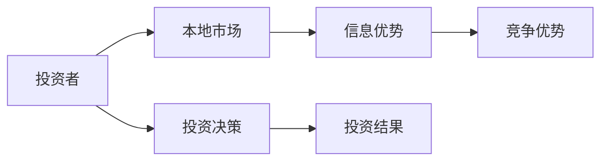
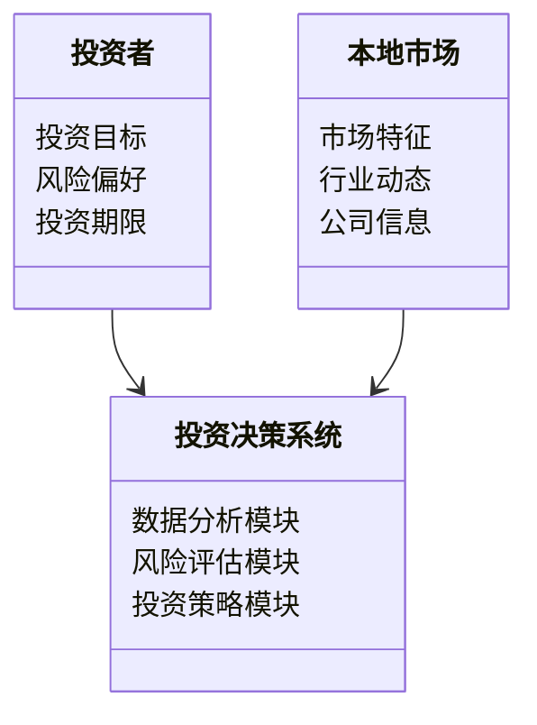

                 

# 彼得林奇的本地投资优势理论

> 关键词：本地投资优势，彼得·林奇，投资策略，价值投资，风险管理

> 摘要：本文深入探讨了彼得·林奇的本地投资优势理论，分析其核心概念、投资策略、优势与局限性，结合实际案例，总结了该理论在现代投资中的应用价值和对未来投资者的启示。

---

# 第1章: 本地投资优势的背景介绍

## 1.1 本地投资优势的定义与核心概念
### 1.1.1 本地投资优势的定义
本地投资优势是指投资者在本地市场中，由于地理位置、信息获取、文化理解等方面的独特优势，能够在竞争中占据有利地位。这一理论强调了投资者利用本地资源和信息进行投资决策的重要性。

### 1.1.2 核心概念：问题背景与问题描述
本地投资的优势在于投资者能够更深入地了解本地市场动态、公司运营情况以及行业趋势，从而做出更精准的投资决策。然而，本地市场的局限性也不容忽视，例如市场规模较小、流动性不足等。

### 1.1.3 问题解决与边界外延
彼得·林奇通过本地投资优势理论，解决了投资者在信息不对称、市场波动等方面的挑战。他强调，本地市场的独特性使得投资者能够发现被低估的机会，从而获得超额收益。

### 1.1.4 核心要素组成与概念结构
本地投资优势的核心要素包括地理位置、信息优势、文化背景、市场结构等。这些要素相互作用，形成了一个完整的理论体系。

---

# 第2章: 本地投资优势的核心概念与联系

## 2.1 核心概念原理
### 2.1.1 本地市场优势的原理分析
本地市场中，投资者能够更快速地获取信息，理解市场动态，并及时调整投资策略。这种信息优势是本地投资的核心竞争力。

### 2.1.2 投资者心理与行为对本地投资的影响
投资者的心理行为，如风险偏好、投资目标等，会直接影响其在本地市场的投资决策。彼得·林奇强调，了解自己的心理状态是成功投资的关键。

### 2.1.3 本地市场信息不对称的解决机制
通过深入研究本地市场，投资者可以减少信息不对称带来的劣势，从而做出更明智的投资决策。

## 2.2 核心概念属性对比表
| 属性               | 本地投资优势 | 非本地投资优势 |
|--------------------|--------------|-----------------|
| 信息获取           | 高           | 低              |
| 市场理解           | 深           | 浅              |
| 投资成本           | 低           | 高              |
| 风险管理           | 易           | 难              |

## 2.3 实体关系架构

---

# 第3章: 彼得林奇的投资策略与选股标准

## 3.1 投资策略概述
### 3.1.1 价值投资的核心理念
彼得·林奇强调，价值投资的核心在于寻找被市场低估的公司，长期持有，等待其价值回归。

### 3.1.2 长期投资与短期波动的平衡
他主张在长期投资中，忽略短期市场波动，关注公司的基本面，避免被市场情绪左右。

### 3.1.3 投资组合的构建原则
投资组合应多样化，涵盖不同行业和规模的公司，以分散风险并捕捉不同市场机会。

## 3.2 选股标准
### 3.2.1 行业选择与公司分析
彼得·林奇注重选择具有强大竞争优势、良好管理和增长潜力的公司。他特别关注公司的财务健康状况和管理层能力。

### 3.2.2 财务指标评估
他常用的财务指标包括市盈率、市净率、股息率等，用以评估公司的估值和盈利能力。

### 3.2.3 管理层能力评估
彼得·林奇认为，优秀的企业管理层是公司长期成功的关键。他通过分析管理层的决策历史和战略规划来评估其能力。

### 3.2.4 市场地位与竞争优势
他偏好那些在市场上具有领先地位，拥有独特竞争优势的公司，这些公司在行业中更具抗风险能力。

## 3.3 投资决策的评估与优化
### 3.3.1 信息收集与分析方法
彼得·林奇强调实地调研和与管理层沟通的重要性，通过获取一手信息来评估公司价值。

### 3.3.2 投资组合的风险管理
他通过分散投资和定期评估投资组合来控制风险，确保在不同市场环境下保持稳健收益。

### 3.3.3 决策优化与调整策略
根据市场变化和公司动态，彼得·林奇会定期审视和调整投资组合，以捕捉新的投资机会并规避潜在风险。

---

# 第4章: 本地投资优势的系统分析与架构设计

## 4.1 问题场景分析
### 4.1.1 本地市场的特点与挑战
本地市场通常规模较小，流动性较低，但信息获取相对容易，适合深入研究。

### 4.1.2 投资者面临的本地化问题
投资者可能面临本地市场的独特风险，如政策变化、行业周期性波动等。

### 4.1.3 系统性投资决策的必要性
通过系统化的分析和决策，投资者可以更有效地利用本地市场的优势，降低投资风险。

## 4.2 系统架构设计
### 4.2.1 领域模型设计

### 4.2.2 系统功能设计
- 数据分析模块：收集和分析本地市场的数据，评估公司的财务状况和市场竞争力。
- 风险评估模块：识别和评估投资风险，制定风险管理策略。
- 投资策略模块：根据分析结果制定投资策略，优化投资组合。

## 4.3 系统架构设计

---

# 第5章: 理论与实践结合——彼得林奇的本地投资案例分析

## 5.1 成功案例分析
### 5.1.1 案例一：某本地制造业公司
彼得·林奇通过深入分析该公司的财务报表和市场地位，发现其被低估的潜力，最终获得高额回报。

### 5.1.2 案例二：本地零售业公司
通过关注公司管理层的决策和行业趋势，彼得·林奇成功预测了公司的增长，提前布局。

## 5.2 投资决策过程分析
### 5.2.1 数据收集与分析
通过实地调研和与管理层沟通，彼得·林奇获取了公司的一手信息，为投资决策提供了支持。

### 5.2.2 风险评估与策略制定
基于分析结果，他制定了详细的投资策略，包括买入时机、仓位配置等。

## 5.3 案例中的策略优化与经验总结
### 5.3.1 策略优化
根据市场反馈，彼得·林奇调整了部分投资比例，分散了风险。
### 5.3.2 经验总结
本地市场的深入研究和信息优势是成功投资的关键。

---

# 第6章: 彼得林奇投资哲学与现代投资者的启示

## 6.1 彼得林奇的投资哲学
### 6.1.1 长期投资的重要性
彼得·林奇强调长期投资，避免短期波动的干扰，关注公司的长期价值。

### 6.1.2 价值投资的真谛
他主张寻找被市场低估的公司，长期持有，等待价值回归。

### 6.1.3 风险管理的核心地位
通过分散投资和定期评估，彼得·林奇有效地控制了投资风险。

## 6.2 现代投资者的启示
### 6.2.1 本地市场的价值重拾
在全球化背景下，本地市场的独特优势再次成为投资者关注的焦点。

### 6.2.2 信息时代的投资策略
在信息爆炸的时代，投资者需要更加注重信息的筛选和分析，充分利用本地信息优势。

### 6.2.3 风险管理的现代应用
结合现代风险管理工具和技术，投资者可以更有效地管理本地投资组合。

---

# 第7章: 总结与展望

## 7.1 核心观点回顾
本地投资优势理论为投资者提供了一种新的视角，强调利用本地市场优势进行投资。

## 7.2 投资策略建议
投资者应结合本地市场特点，制定个性化投资策略，注重风险管理。

## 7.3 未来展望
随着全球化进程的推进，本地投资优势理论将与全球投资策略相结合，为投资者提供更丰富的选择。

---

# 参考文献

1. 彼得·林奇著，《彼得林奇投资经典》
2. 《价值投资入门》
3. 《投资学基础》

---

# 作者：AI天才研究院/AI Genius Institute & 禅与计算机程序设计艺术 /Zen And The Art of Computer Programming

