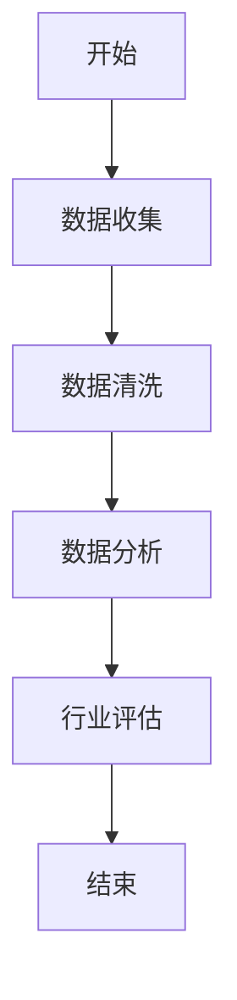
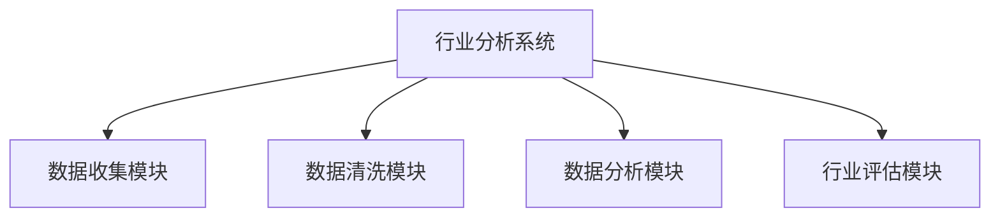
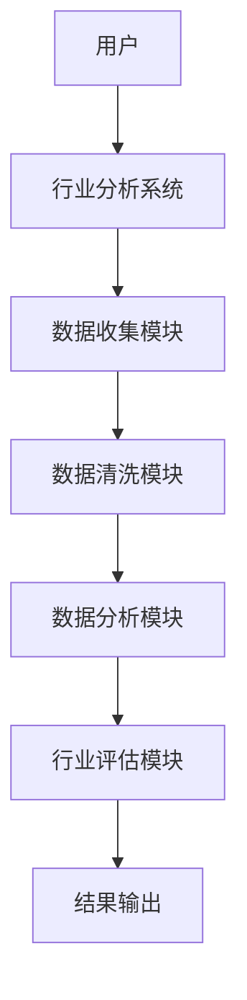

                 


# 彼得林奇的行业分析方法

> 关键词：行业分析，彼得·林奇，投资分析，Python实现，Mermaid流程图

> 摘要：本文详细介绍了彼得·林奇的行业分析方法，从行业分析的基本原理、算法与流程、系统设计到项目实战，结合理论与实际操作，帮助读者全面掌握行业分析的核心思想和具体实现方法。

---

## 第一部分：行业分析的基本原理

### 第1章：行业分析的背景与核心概念

#### 1.1 行业分析的定义与重要性

行业分析是投资决策中的重要环节，它通过对特定行业及其内部企业的研究，评估行业的整体发展趋势、竞争格局和潜在风险。彼得·林奇作为投资大师，提出了许多独特的行业分析方法，这些方法在实践中得到了广泛应用。

**行业分析的定义**：行业分析是指对特定行业内的企业、市场结构、竞争环境、财务状况和未来发展趋势进行系统性研究的过程。它是投资决策的重要依据，能够帮助投资者识别行业中的潜在机会和风险。

**行业分析的重要性**：行业分析能够帮助投资者更好地理解市场的运作机制，评估行业的增长潜力和风险水平，从而做出更明智的投资决策。彼得·林奇强调，成功的投资不仅依赖于对单个企业的分析，还需要对行业整体进行深入研究。

**行业分析的步骤**：彼得·林奇的行业分析方法通常包括以下几个步骤：
1. 收集行业数据：包括行业规模、增长趋势、竞争结构等。
2. 分析行业财务指标：如行业的平均利润率、负债水平等。
3. 评估行业风险：包括行业周期性、政策风险、技术风险等。
4. 判断行业增长潜力：分析行业的未来增长空间和驱动力。

**行业分析的核心要素**：
- 行业规模与增长潜力
- 行业竞争格局
- 行业财务状况
- 行业风险因素

#### 1.2 彼得·林奇的行业分析方法

彼得·林奇的行业分析方法以基本面分析为核心，强调对行业整体的深入研究和对企业财务数据的细致分析。他提出了一些独特的行业分析理念，例如：

**行业分析的理念**：
1. 专注于长期趋势：行业分析不仅仅是对当前市场状况的研究，还需要关注行业的长期发展趋势。
2. 结合宏观经济分析：行业分析需要结合宏观经济环境，如GDP增长、利率变化、通货膨胀等因素。
3. 以数据为基础：彼得·林奇强调，行业分析必须基于可靠的数据和事实，避免主观臆断。

**行业分析的核心步骤**：
1. 数据收集：收集行业相关的财务数据、市场数据和宏观经济数据。
2. 数据清洗：对收集到的数据进行整理和清洗，去除无效数据。
3. 数据分析：通过对数据的分析，评估行业的财务状况、竞争格局和风险因素。
4. 行业评估：根据分析结果，评估行业的增长潜力和投资价值。

**行业分析的关键指标**：
- 行业增长潜力
- 行业利润率
- 行业负债率
- 行业竞争指数

#### 1.3 行业分析的边界与外延

**行业分析的适用范围**：行业分析适用于所有行业的研究，包括制造业、服务业、科技行业等。彼得·林奇的行业分析方法尤其适用于那些具有稳定增长潜力的行业。

**行业分析的局限性**：尽管行业分析在投资决策中具有重要作用，但它也存在一些局限性。例如，行业分析无法完全预测行业中的突发事件，如政策变化、技术革新等。

**行业分析与其他分析方法的关系**：行业分析是投资分析的重要组成部分，但它需要与企业分析、宏观经济分析等其他分析方法相结合，才能做出全面的投资决策。

---

## 第二部分：行业分析的算法与流程

### 第2章：行业分析的算法与流程

#### 2.1 行业分析的算法流程

**行业分析的流程**：彼得·林奇的行业分析方法通常包括以下几个步骤：

1. **数据收集**：收集行业相关的财务数据、市场数据和宏观经济数据。
2. **数据清洗**：对收集到的数据进行整理和清洗，去除无效数据。
3. **数据分析**：通过对数据的分析，评估行业的财务状况、竞争格局和风险因素。
4. **行业评估**：根据分析结果，评估行业的增长潜力和投资价值。

**行业分析的流程图**：


#### 2.2 行业分析的数学模型

**行业增长潜力模型**：
$$ G = \frac{GDP \times Industry\_Share}{10} $$
其中，$G$ 表示行业的增长潜力，$GDP$ 表示国内生产总值，$Industry\_Share$ 表示行业在GDP中的占比。

**行业风险评估模型**：
$$ R = \frac{Debt}{Equity} \times \frac{Interest\_Rate}{10} $$
其中，$R$ 表示行业的风险水平，$Debt$ 表示行业的总负债，$Equity$ 表示行业的股东权益，$Interest\_Rate$ 表示当前的利率水平。

#### 2.3 行业分析的Python实现

**行业分析的Python代码示例**：

```python
import pandas as pd
import numpy as np

# 定义行业分析函数
def industry_analysis(data):
    # 计算行业增长潜力
    growth_potential = (data['GDP'] * data['Industry_Share']) / 10
    
    # 计算行业风险评估
    risk_assessment = (data['Debt'] / data['Equity']) * (data['Interest_Rate'] / 10)
    
    # 返回结果
    return pd.DataFrame({
        'Growth_Potential': growth_potential,
        'Risk_Assessment': risk_assessment
    })

# 示例数据
data = {
    'GDP': [100, 200, 300],
    'Industry_Share': [0.05, 0.03, 0.02],
    'Debt': [50, 100, 150],
    'Equity': [200, 150, 100],
    'Interest_Rate': [5, 5, 5]
}

# 调用函数进行分析
result = industry_analysis(data)

# 输出结果
print(result)
```

**代码解释**：
1. **数据收集**：从数据源中收集行业相关的财务数据和宏观经济数据。
2. **数据清洗**：对收集到的数据进行整理和清洗，去除无效数据。
3. **数据分析**：通过对数据的分析，计算行业的增长潜力和风险评估。
4. **结果输出**：将分析结果输出，帮助投资者做出决策。

---

## 第三部分：行业分析的系统设计

### 第3章：行业分析的系统设计

#### 3.1 系统功能设计

**系统功能设计的核心思想**：行业分析系统的功能设计需要围绕行业分析的核心需求展开，包括数据收集、数据分析、行业评估等功能。

**系统功能模块**：
1. 数据收集模块：负责从数据源中收集行业相关的财务数据和宏观经济数据。
2. 数据清洗模块：对收集到的数据进行整理和清洗，去除无效数据。
3. 数据分析模块：通过对数据的分析，计算行业的增长潜力和风险评估。
4. 行业评估模块：根据分析结果，评估行业的增长潜力和投资价值。

#### 3.2 系统架构设计

**系统架构设计的核心思想**：行业分析系统的架构设计需要考虑系统的可扩展性、可维护性和高效性。

**系统架构图**：


**系统交互图**：


#### 3.3 系统接口设计

**系统接口设计的核心思想**：行业分析系统的接口设计需要考虑系统的输入输出需求，确保系统的高效运行。

**系统接口设计**：
1. 数据输入接口：负责接收行业相关的财务数据和宏观经济数据。
2. 数据输出接口：负责输出行业分析的结果，包括行业的增长潜力和风险评估。

---

## 第四部分：行业分析的项目实战

### 第4章：行业分析的项目实战

#### 4.1 项目背景介绍

**项目背景**：本项目旨在通过彼得·林奇的行业分析方法，对某个特定行业进行深入研究，评估行业的增长潜力和投资价值。

#### 4.2 项目环境安装

**项目环境安装**：
1. 安装Python：需要安装Python 3.8或更高版本。
2. 安装相关库：需要安装pandas、numpy等库。

```bash
pip install pandas numpy
```

#### 4.3 项目核心代码实现

**行业分析的Python代码实现**：

```python
import pandas as pd
import numpy as np

# 定义行业分析函数
def industry_analysis(data):
    # 计算行业增长潜力
    growth_potential = (data['GDP'] * data['Industry_Share']) / 10
    
    # 计算行业风险评估
    risk_assessment = (data['Debt'] / data['Equity']) * (data['Interest_Rate'] / 10)
    
    # 返回结果
    return pd.DataFrame({
        'Growth_Potential': growth_potential,
        'Risk_Assessment': risk_assessment
    })

# 示例数据
data = {
    'GDP': [100, 200, 300],
    'Industry_Share': [0.05, 0.03, 0.02],
    'Debt': [50, 100, 150],
    'Equity': [200, 150, 100],
    'Interest_Rate': [5, 5, 5]
}

# 调用函数进行分析
result = industry_analysis(data)

# 输出结果
print(result)
```

#### 4.4 项目案例分析

**项目案例分析**：
以某行业为例，通过上述代码进行行业分析，评估该行业的增长潜力和风险水平。

**案例分析步骤**：
1. 收集行业数据：包括行业规模、增长趋势、竞争结构等。
2. 数据清洗：对收集到的数据进行整理和清洗，去除无效数据。
3. 数据分析：通过对数据的分析，计算行业的增长潜力和风险评估。
4. 行业评估：根据分析结果，评估行业的增长潜力和投资价值。

#### 4.5 项目小结

**项目小结**：
通过本项目，我们可以看到彼得·林奇的行业分析方法在实际中的应用。通过系统的行业分析，可以帮助投资者更好地理解市场的运作机制，评估行业的增长潜力和风险水平，从而做出更明智的投资决策。

---

## 第五部分：总结与注意事项

### 第5章：总结与注意事项

#### 5.1 总结

**总结**：彼得·林奇的行业分析方法是一种系统性、科学性的行业分析方法，它可以帮助投资者更好地理解市场的运作机制，评估行业的增长潜力和风险水平，从而做出更明智的投资决策。

#### 5.2 注意事项

**注意事项**：
1. 数据的准确性：行业分析需要基于可靠的数据和事实，避免主观臆断。
2. 方法的适用性：彼得·林奇的行业分析方法适用于所有行业，但在实际应用中需要根据具体情况进行调整。
3. 风险的不确定性：行业分析无法完全预测行业中的突发事件，如政策变化、技术革新等。

#### 5.3 小结

**小结**：
通过本文的学习，我们可以看到彼得·林奇的行业分析方法在实际中的应用。通过系统的行业分析，可以帮助投资者更好地理解市场的运作机制，评估行业的增长潜力和风险水平，从而做出更明智的投资决策。

---

## 作者：AI天才研究院/AI Genius Institute & 禅与计算机程序设计艺术 /Zen And The Art of Computer Programming

