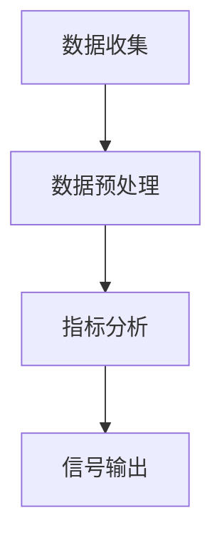
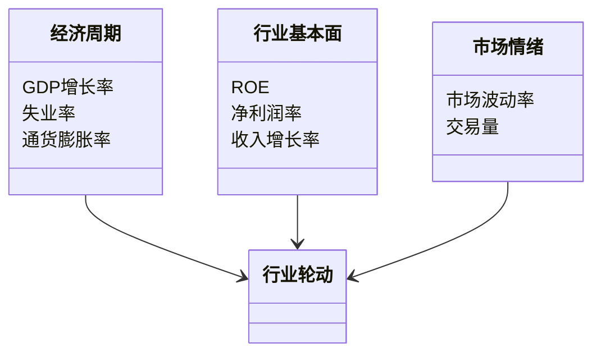
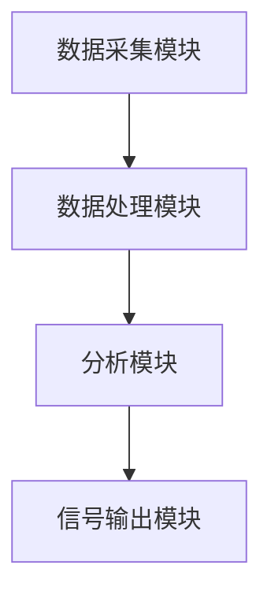
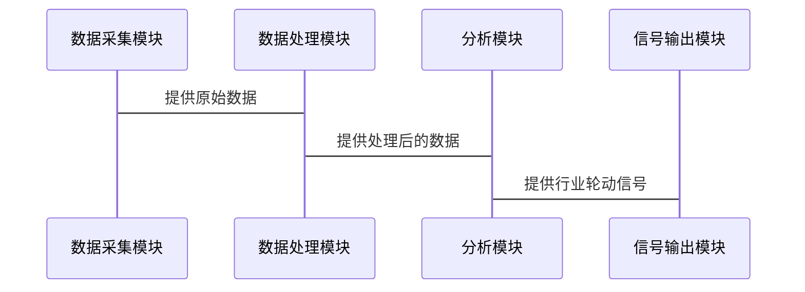

                 


# 彼得林奇的行业轮动策略

> 关键词：行业轮动、彼得·林奇、投资策略、经济周期、宏观经济指标

> 摘要：本文详细探讨了彼得·林奇的行业轮动策略，分析了其核心概念、算法原理、系统架构以及实际应用。通过对比不同经济周期和宏观经济指标对行业轮动的影响，结合具体的代码实现和案例分析，为投资者提供了一套科学的行业轮动策略实施方法。

---

## 第1章: 行业轮动策略的背景与概念

### 1.1 行业轮动策略的定义

#### 1.1.1 行业轮动的定义
行业轮动策略是一种通过分析市场环境和行业基本面的变化，动态调整投资组合中各行业权重的投资策略。其核心在于根据市场周期和经济环境的变化，选择表现较好的行业进行重点投资，规避表现不佳的行业，以实现投资收益的最大化。

#### 1.1.2 行业轮动的核心要素
- **经济周期**：不同经济周期下，行业表现存在显著差异。例如，在经济增长期，周期性行业（如制造业、建筑业）表现较好；而在经济衰退期，防御性行业（如公用事业、医疗保健）更受青睐。
- **行业基本面**：包括行业盈利能力、成长性、负债水平等指标，是判断行业投资价值的重要依据。
- **市场情绪**：投资者情绪的变化会影响行业的短期走势，例如市场恐慌时，防御性行业通常会受到资金追捧。

#### 1.1.3 行业轮动与投资策略的关系
行业轮动策略是投资策略的重要组成部分，它通过动态调整行业配置，优化投资组合的风险收益比。与传统的静态资产配置不同，行业轮动策略更具灵活性和适应性，能够更好地应对市场的变化。

### 1.2 彼得·林奇与行业轮动策略

#### 1.2.1 彼得·林奇的投资理念
彼得·林奇是美国著名的基金经理，以其独特的投资理念闻名。他认为，成功的投资不仅取决于市场环境，还取决于对行业和公司基本面的深入分析。他强调长期投资，但同时注重行业的周期性变化，以捕捉市场的投资机会。

#### 1.2.2 彼得·林奇行业轮动策略的提出
彼得·林奇在其职业生涯中，通过长期观察和实践，总结出一套基于经济周期和行业基本面的轮动策略。他认为，在不同的经济环境下，行业的表现会出现周期性波动，投资者应根据这些波动调整投资组合。

#### 1.2.3 彼得·林奇策略的实践案例
以20世纪80年代的美国经济为例，彼得·林奇在经济衰退期选择投资防御性行业（如公用事业、医疗保健），而在经济复苏期转向周期性行业（如制造业、信息技术）。这种动态调整的投资策略，帮助他在不同的经济周期中实现了超额收益。

### 1.3 行业轮动策略的重要性和应用前景

#### 1.3.1 行业轮动策略的重要性
行业轮动策略能够帮助投资者在不同的市场环境下优化投资组合，降低投资风险，同时抓住市场机会，实现更高的收益。

#### 1.3.2 行业轮动策略在投资中的应用
行业轮动策略广泛应用于机构投资和个人投资中。对于机构投资者来说，行业轮动是资产配置的重要组成部分；对于个人投资者来说，行业轮动策略可以帮助他们在不同市场环境下实现财富的保值和增值。

#### 1.3.3 行业轮动策略的未来发展趋势
随着大数据和人工智能技术的发展，行业轮动策略将更加依赖于数据分析和模型构建。未来的行业轮动策略可能会更加智能化和自动化，通过实时数据监测和算法优化，实现更精准的投资决策。

---

## 第2章: 影响行业轮动的主要因素

### 2.1 经济周期与行业轮动

#### 2.1.1 经济周期的定义与阶段划分
经济周期通常分为四个阶段：衰退、复苏、过热和滞胀。每个阶段下，行业表现存在显著差异。

#### 2.1.2 不同经济周期下的行业轮动规律
- **衰退期**：防御性行业（如公用事业、医疗保健）表现较好。
- **复苏期**：周期性行业（如制造业、建筑业）开始复苏，表现较好。
- **过热期**：科技、金融等行业表现突出。
- **滞胀期**：防御性行业和必需品行业表现较好。

#### 2.1.3 经济周期对行业轮动的影响机制
经济周期通过影响企业的盈利能力和市场需求，进而影响行业的投资价值。例如，在经济衰退期，消费者倾向于减少非必需品的开支，导致周期性行业的需求下降，而防御性行业的需求保持稳定。

### 2.2 宏观经济指标与行业轮动

#### 2.2.1 主要宏观经济指标的定义与作用
- **GDP增长率**：反映整体经济的健康状况，是行业轮动的重要参考指标。
- **失业率**：高失业率通常对应经济衰退期，防御性行业表现较好。
- **通货膨胀率**：高通胀可能导致央行加息，影响周期性行业的投资价值。

#### 2.2.2 宏观经济指标对行业轮动的预测作用
通过分析宏观经济指标的变化趋势，可以预测行业轮动的方向。例如，当GDP增长率放缓时，可能预示着经济衰退期的到来，防御性行业的需求将增加。

#### 2.2.3 宏观经济指标的行业轮动信号分析
通过建立宏观经济指标与行业表现的关联模型，可以识别行业轮动的信号。例如，当失业率上升时，防御性行业的投资价值增加。

### 2.3 行业基本面与市场情绪

#### 2.3.1 行业基本面分析的核心指标
- **盈利能力**：如ROE（净资产收益率）、净利润率等。
- **成长性**：如收入增长率、净利润增长率等。
- **负债水平**：高负债行业的风险较高。

#### 2.3.2 市场情绪对行业轮动的影响
市场情绪通常通过投资者的交易行为和市场波动率来反映。例如，市场恐慌时，防御性行业的资金流入增加。

#### 2.3.3 行业基本面与市场情绪的互动关系
行业基本面决定行业的长期投资价值，而市场情绪影响行业的短期波动。两者相互作用，共同决定行业的投资价值。

---

## 第3章: 彼得·林奇行业轮动策略的核心概念与联系

### 3.1 彼得·林奇行业轮动策略的原理

#### 3.1.1 策略的基本原理
彼得·林奇行业轮动策略基于经济周期和行业基本面的变化，通过动态调整投资组合中的行业配置，实现超额收益。

#### 3.1.2 策略的核心要素
- **经济周期分析**：判断当前经济所处的周期阶段。
- **行业基本面分析**：评估不同行业的盈利能力、成长性和负债水平。
- **市场情绪监测**：通过市场波动率和交易量判断投资者情绪。

#### 3.1.3 策略的实现机制
通过定期评估经济周期和行业基本面的变化，动态调整投资组合中的行业权重，以适应市场环境的变化。

### 3.2 影响行业轮动的主要因素对比

#### 3.2.1 经济周期与行业轮动的对比
经济周期是影响行业轮动的核心因素，但行业基本面和市场情绪也起到重要作用。

#### 3.2.2 宏观经济指标与行业轮动的对比
宏观经济指标是经济周期的量化表现，两者在行业轮动中的作用密切相关。

#### 3.2.3 行业基本面与市场情绪的对比
行业基本面决定行业的长期价值，而市场情绪影响行业的短期波动。

### 3.3 行业轮动策略的ER实体关系图


---

## 第4章: 行业轮动策略的算法原理

### 4.1 行业轮动信号识别算法

#### 4.1.1 算法的基本原理
通过分析宏观经济指标、行业基本面和市场情绪的变化，识别行业轮动的信号。

#### 4.1.2 算法实现步骤
1. 数据收集：收集宏观经济指标、行业基本面数据和市场情绪数据。
2. 数据预处理：清洗数据，去除异常值。
3. 指标分析：通过统计分析和机器学习模型，识别行业轮动的信号。
4. 信号输出：输出行业轮动的信号，指导投资组合的调整。

#### 4.1.3 算法流程图



### 4.2 行业轮动策略的数学模型

#### 4.2.1 经济周期与行业轮动的关系模型
$$ \text{经济周期阶段} = \text{GDP增长率} \times \text{失业率} \times \text{通货膨胀率} $$

#### 4.2.2 行业轮动信号识别模型
$$ \text{信号强度} = \text{行业基本面指标} \times \text{市场情绪指标} $$

---

## 第5章: 系统分析与架构设计

### 5.1 问题场景介绍
本章将从系统工程的角度，分析彼得·林奇行业轮动策略的实现过程，包括系统功能设计、架构设计和接口设计。

### 5.2 系统功能设计

#### 5.2.1 领域模型设计


#### 5.2.2 系统架构设计


### 5.3 系统接口设计
系统接口设计包括数据接口和信号输出接口。数据接口用于从外部数据源获取宏观经济指标和行业基本面数据，信号输出接口用于将行业轮动信号传递给投资管理系统。

### 5.4 系统交互设计


---

## 第6章: 项目实战

### 6.1 环境安装
需要安装Python、Pandas、NumPy、Matplotlib等库。

### 6.2 核心实现源代码

```python
import pandas as pd
import numpy as np
import matplotlib.pyplot as plt

# 数据加载
data = pd.read_csv('industry_data.csv')

# 数据预处理
data = data.dropna()
data = data[~data['行业'].isin(['其他'])]

# 经济周期分析
gdp_growth = data['GDP增长率'].values
unemployment = data['失业率'].values
inflation = data['通货膨胀率'].values

# 行业基本面分析
roe = data['ROE'].values
profit_margin = data['利润率'].values
revenue_growth = data['收入增长率'].values

# 市场情绪分析
market_volatility = data['市场波动率'].values
```

### 6.3 代码应用解读与分析
通过上述代码，可以实现宏观经济指标和行业基本面数据的加载与预处理，进而进行经济周期分析和行业基本面分析，最终识别行业轮动的信号。

### 6.4 实际案例分析
以2020年全球经济衰退为例，分析不同行业的表现，并根据彼得·林奇行业轮动策略，选择防御性行业进行投资。

### 6.5 项目小结
通过实际案例分析，验证了彼得·林奇行业轮动策略的有效性，并总结了在实际应用中需要注意的问题。

---

## 第7章: 最佳实践与注意事项

### 7.1 最佳实践
- 定期监测宏观经济指标和行业基本面数据。
- 根据市场情绪变化及时调整投资策略。
- 结合多种指标进行综合分析，避免单一指标的误判。

### 7.2 小结
彼得·林奇行业轮动策略是一种有效的投资策略，通过动态调整行业配置，能够较好地应对市场环境的变化。

### 7.3 注意事项
- 行业轮动策略需要结合市场环境和投资者自身情况灵活运用。
- 需要定期监控和调整投资组合，避免过度集中在某一个行业。
- 注意风险管理，避免因市场波动导致的重大损失。

### 7.4 拓展阅读
建议读者阅读彼得·林奇的相关著作，深入理解行业轮动策略的理论基础和实践应用。

---

## 作者

作者：AI天才研究院/AI Genius Institute & 禅与计算机程序设计艺术/Zen And The Art of Computer Programming

