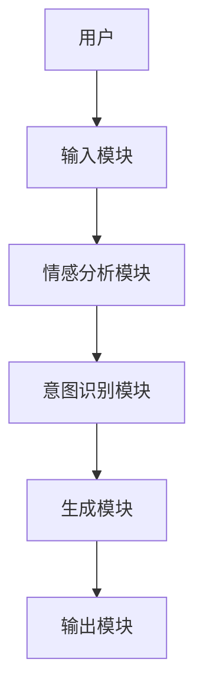
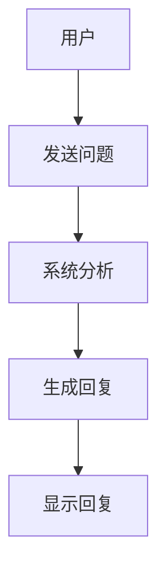

                 


# 心理咨询 AI Agent：LLM 在心理健康领域的应用

## 关键词：人工智能, 心理健康, 自然语言处理, 大语言模型, 心理咨询, 机器学习

## 摘要：  
随着人工智能技术的迅速发展，大语言模型（LLM）在心理健康领域的应用逐渐成为研究热点。本文深入探讨了LLM在心理咨询中的应用潜力，分析了其在情感识别、意图分析和个性化建议等方面的优势。通过结合实际案例和系统设计，展示了如何利用LLM构建高效、便捷的心理咨询AI代理。文章还探讨了技术实现中的关键算法、系统架构以及伦理挑战，为未来的研究和应用提供了重要参考。

---

# 第一部分: 心理咨询 AI Agent 的引言

## 第1章: 心理健康与 AI 的结合

### 1.1 心理健康的重要性  
心理健康是人类整体健康的重要组成部分。现代社会中，由于工作压力、人际关系等问题，心理健康问题越来越普遍。根据世界卫生组织的数据，全球约有9.7亿人受到心理健康问题的影响，其中许多人无法及时获得专业心理咨询。AI 技术的出现，为解决这一问题提供了新的可能性。

#### 1.1.1 心理健康的基本概念  
心理健康指个体在心理、情绪和社会适应等方面处于良好状态。它不仅关乎个人的幸福感，还影响家庭和社会的和谐。心理健康问题包括焦虑症、抑郁症、社交恐惧症等，这些问题需要专业的心理咨询和干预。

#### 1.1.2 当前心理健康问题的现状  
现代社会节奏快、压力大，心理健康问题呈现低龄化和普遍化的趋势。许多人在需要帮助时，由于缺乏专业心理咨询师或资源不足，无法及时获得支持。AI 技术的普及，尤其是大语言模型（LLM）的应用，为心理健康问题的早期发现和干预提供了新的途径。

#### 1.1.3 AI 在心理健康领域的潜力  
AI 技术可以24/7提供支持，且不受地域限制。通过自然语言处理技术，AI 可以帮助用户识别情绪、理解需求，并提供个性化的建议。这不仅缓解了专业心理咨询师不足的问题，还能够让更多人获得及时的心理支持。

### 1.2 AI 在心理咨询中的优势  
AI 在心理咨询中的优势主要体现在以下几点：

#### 1.2.1 24/7 可用性  
AI 系统可以全天候为用户提供服务，无需休息或轮班。这使得用户可以在任何时间获得心理支持，特别是在紧急情况下，AI 可以起到关键作用。

#### 1.2.2 高效性与便捷性  
通过自然语言处理技术，AI 系统能够快速理解用户的需求，并生成相应的回复。相比传统的人工咨询，AI 的响应速度更快，用户体验更佳。

#### 1.2.3 保护隐私与匿名性  
用户可以通过匿名的方式与AI 进行交流，这降低了心理压力，使用户更愿意开放自己。

### 1.3 LLM 在心理健康领域的独特价值  
大语言模型（LLM）在心理健康领域的应用具有独特的优势，主要体现在以下方面：

#### 1.3.1 自然语言处理能力  
LLM 能够理解和生成人类语言，这使其能够与用户进行自然的对话，提供情感支持和建议。

#### 1.3.2 情感识别与共情能力  
通过情感分析技术，LLM 可以识别用户的情绪，并生成共情的回复，帮助用户缓解负面情绪。

#### 1.3.3 个性化建议与支持  
LLM 可以根据用户的具体情况，提供个性化的建议和支持，帮助用户解决问题。

---

## 第2章: 心理咨询 AI Agent 的核心概念与背景

### 2.1 心理咨询 AI Agent 的定义  
心理咨询 AI Agent 是一种基于AI技术的心理咨询工具，能够通过自然语言处理技术与用户进行交互，提供情感支持、问题诊断和个性化建议。

#### 2.1.1 核心概念与组成要素  
- **用户输入**：用户通过文本或语音输入自己的问题或感受。
- **情感分析**：系统对用户的输入进行情感分析，识别情绪状态。
- **意图识别**：系统理解用户的需求和意图。
- **生成响应**：系统根据分析结果生成相应的回复。

#### 2.1.2 与传统心理咨询的区别  
- **可用性**：AI Agent 可以随时使用，而传统心理咨询需要预约。
- **成本**：AI Agent 的使用成本较低，而传统心理咨询费用较高。
- **隐私**：用户可以通过匿名的方式使用AI Agent，保护隐私。

#### 2.1.3 应用场景与边界  
- **应用场景**：初步心理评估、情绪支持、压力管理等。
- **边界**：AI Agent 不适合处理严重的心理健康问题，需要专业心理咨询师的干预。

### 2.2 心理咨询 AI Agent 的核心功能  
- **情感识别与情绪分析**：系统能够识别用户的情绪，如愤怒、悲伤、快乐等。
- **问题识别与诊断**：系统能够识别用户的心理问题，并进行初步诊断。
- **个性化建议与干预**：系统能够根据用户的需求，提供个性化的建议和支持。

### 2.3 心理咨询 AI Agent 的技术基础  
- **大语言模型（LLM）的基本原理**：LLM 通过预训练和微调，能够理解和生成人类语言。
- **自然语言处理（NLP）的关键技术**：包括分词、句法分析、情感分析等。
- **机器学习在心理健康分析中的应用**：通过机器学习算法，分析用户的行为和语言模式，识别潜在的心理健康问题。

---

## 第3章: 大语言模型（LLM）在心理健康中的应用原理

### 3.1 LLM 的基本原理  
LLM 通过大规模的数据训练，掌握了语言的规律和模式。其核心架构是 transformer，能够处理长文本，并通过自注意力机制捕捉语境信息。

#### 3.1.1 概率语言模型的概念  
概率语言模型通过计算每个词在给定上下文中的概率，生成最可能的下一个词。这使得模型能够生成连贯的文本。

#### 3.1.2 基于 transformer 的架构  
transformer 架构由编码器和解码器组成。编码器将输入文本转换为向量表示，解码器根据编码器的输出生成回复。

#### 3.1.3 预训练与微调的流程  
- **预训练**：模型在大规模通用数据上进行训练，掌握语言的基本规律。
- **微调**：模型在特定任务数据上进行微调，适应具体的应用场景。

### 3.2 心理咨询中的 NLP 技术  
- **情感分析的实现**：通过训练模型识别文本中的情感倾向。
- **意图识别与对话管理**：识别用户的意图，并根据意图生成相应的回复。
- **实体识别与信息抽取**：从文本中提取关键信息，如日期、地点等。

### 3.3 心理咨询 AI Agent 的算法流程图  
```mermaid
graph TD
A[用户输入] --> B[情感分析]
B --> C[意图识别]
C --> D[生成响应]
D --> 

```

### 3.4 心理咨询 AI Agent 的数学模型  
以下是情感分析模型的简单示例：

$$
\text{概率}(y|\text{文本}) = \frac{\text{文本中积极词汇的数量}}{\text{总词汇数量}}
$$

---

## 第4章: 心理咨询 AI Agent 的系统设计

### 4.1 系统功能设计  
- **用户界面**：包括文本输入框和显示区域。
- **情感分析模块**：对用户输入进行情感分析。
- **意图识别模块**：识别用户的意图，并生成相应的回复。

### 4.2 系统架构设计  


### 4.3 系统接口设计  
- **输入接口**：用户通过文本或语音输入问题。
- **输出接口**：系统通过文本或语音输出回复。

### 4.4 系统交互设计  


---

## 第5章: 心理咨询 AI Agent 的项目实战

### 5.1 环境配置  
- **工具安装**：安装 Python、PyTorch 和 Hugging Face 的 transformers 库。
- **数据准备**：收集和整理心理健康相关的数据集。

### 5.2 核心代码实现  
以下是一个简单的心理咨询 AI Agent 的实现示例：

```python
from transformers import pipeline

# 加载情感分析模型
sentiment_analyzer = pipeline("sentiment-analysis")

# 用户输入
user_input = input("请输入您的问题或感受：")

# 情感分析
result = sentiment_analyzer(user_input)
print(f"情感分析结果：{result[0]['label']}")
```

### 5.3 代码解读与分析  
- **加载模型**：使用 Hugging Face 的 transformers 库加载情感分析模型。
- **用户输入**：用户输入自己的问题或感受。
- **情感分析**：模型对用户输入进行情感分析，并输出结果。

### 5.4 实际案例分析  
例如，用户输入“我最近感到很焦虑”，系统会分析出情感为“negative”，并生成相应的回复，如“您是否愿意分享更多关于您感到焦虑的具体情况？”

### 5.5 项目小结  
通过本项目，我们可以看到 LLM 在心理健康领域中的巨大潜力。然而，模型的准确性和用户体验仍需进一步优化。

---

## 第6章: 心理咨询 AI Agent 的未来展望

### 6.1 技术发展趋势  
- **模型优化**：通过微调和 fine-tuning 提高模型的准确性和响应速度。
- **多模态交互**：结合语音、图像等多种模态信息，提供更全面的支持。

### 6.2 伦理挑战与解决方案  
- **数据隐私**：确保用户数据的安全和隐私。
- **误诊风险**：AI 的诊断结果需要与专业心理咨询师的判断相结合。

### 6.3 社会影响与应用前景  
AI 技术在心理健康领域的应用将有助于缓解专业资源不足的问题，为更多人提供及时的心理支持。

---

## 第7章: 心理咨询 AI Agent 的最佳实践与小结

### 7.1 最佳实践 tips  
- **数据质量**：确保训练数据的多样性和代表性。
- **用户体验**：优化交互设计，提升用户体验。
- **伦理规范**：严格遵守数据隐私和伦理规范。

### 7.2 项目小结  
通过本文的探讨，我们可以看到 LLM 在心理健康领域的应用前景广阔。然而，技术实现和伦理挑战仍需进一步研究和解决。

---

## 附录  
### 附录1：参考文献  
- 引用的相关论文和书籍。

### 附录2：工具与库  
- Hugging Face 的 transformers 库。
- Python 和 PyTorch。

### 附录3：术语表  
- 心理健康：指个体在心理、情绪和社会适应等方面处于良好状态。
- 大语言模型（LLM）：基于 transformer 架构的大规模预训练模型。

---

## 作者：AI天才研究院/AI Genius Institute & 禅与计算机程序设计艺术 /Zen And The Art of Computer Programming

---

本文通过详细探讨 LLM 在心理健康领域的应用，展示了 AI 技术在心理咨询中的巨大潜力。从理论到实践，从技术实现到系统设计，本文为未来的研究和应用提供了重要参考。希望本文能够为心理健康领域的人工智能研究提供新的思路和方向。

