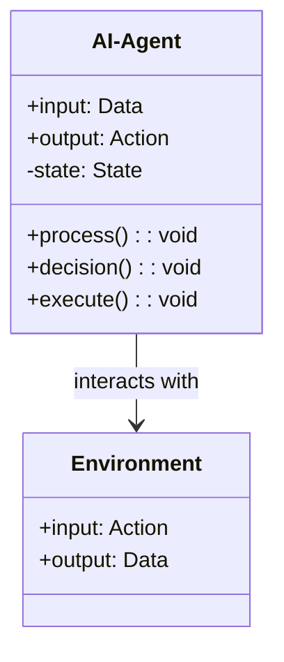

                 


# 性能优化：提高AI Agent的响应速度

> 关键词：AI Agent, 性能优化, 响应速度, 模型压缩, 系统架构, 优化策略

> 摘要：本文详细探讨了如何提高AI Agent的响应速度，从理论分析到实际应用，涵盖了AI Agent的基本概念、性能优化的核心原理、算法实现、系统架构设计以及项目实战。通过本文的学习，读者可以系统地掌握AI Agent性能优化的方法和技巧，从而显著提升AI Agent的响应速度和用户体验。

---

# 第1章: AI Agent与性能优化背景

## 1.1 AI Agent的基本概念

### 1.1.1 AI Agent的定义
AI Agent（人工智能代理）是一种能够感知环境、做出决策并执行动作的智能实体。它可以是一个软件程序、机器人或任何具备自主决策能力的系统。

### 1.1.2 AI Agent的核心功能
- **感知环境**：通过传感器或数据输入接口获取外部信息。
- **决策与推理**：基于感知的信息，利用算法进行分析和推理，得出最优决策。
- **执行动作**：根据决策结果，通过执行机构或输出接口完成实际操作。

### 1.1.3 AI Agent的应用场景
- 智能助手（如Siri、Alexa）
- 自动驾驶系统
- 智能推荐系统
- 工业自动化控制

## 1.2 性能优化的必要性

### 1.2.1 响应速度对企业的影响
- 响应速度直接影响用户体验，进而影响用户满意度和企业收益。
- 快速响应是市场竞争的关键因素之一。

### 1.2.2 用户体验与性能优化的关系
- 响应速度越快，用户体验越好。
- 性能优化是提升用户体验的核心手段。

### 1.2.3 性能优化的边界与外延
- 性能优化需要在资源消耗和响应速度之间找到平衡。
- 外延包括硬件优化、算法优化和系统架构优化。

## 1.3 本章小结
本章介绍了AI Agent的基本概念及其应用场景，并强调了性能优化的重要性和必要性。通过本章的学习，读者可以理解为什么需要优化AI Agent的性能，以及优化的核心目标。

---

# 第2章: AI Agent性能优化的核心概念

## 2.1 AI Agent的运行机制

### 2.1.1 感知层的处理流程
AI Agent通过感知层获取环境信息，包括数据采集、数据预处理和特征提取。

### 2.1.2 决策层的优化策略
决策层基于感知的信息，通过算法进行推理和决策。常用的算法包括随机森林、支持向量机（SVM）和深度学习模型。

### 2.1.3 执行层的效率提升
执行层负责将决策层的指令转化为实际操作。优化执行层的关键在于减少不必要的步骤和提高并行处理能力。

## 2.2 性能瓶颈的分析方法

### 2.2.1 瓶颈识别的关键指标
- 响应时间
- 并发处理能力
- 资源利用率

### 2.2.2 瓶颈分析的步骤与方法
1. **数据采集**：记录系统的运行数据，包括CPU、内存和磁盘IO的使用情况。
2. **问题定位**：通过日志分析和性能监控工具识别瓶颈。
3. **问题解决**：针对识别的瓶颈，采取优化措施。

### 2.2.3 瓶颈解决的思路与策略
- 硬件优化：升级硬件配置，如增加内存或使用更快的存储设备。
- 软件优化：优化算法和代码，减少资源消耗。
- 系统架构优化：通过分布式架构和负载均衡技术分散请求压力。

## 2.3 优化策略的制定与实施

### 2.3.1 优化目标的设定
明确优化目标，如将响应时间从5秒降低到2秒。

### 2.3.2 优化方案的选择
根据具体问题选择合适的优化方案，如算法优化、系统架构优化等。

### 2.3.3 优化效果的评估
通过性能测试和用户反馈评估优化效果，确保优化目标的实现。

## 2.4 本章小结
本章详细讲解了AI Agent的运行机制和性能瓶颈的分析方法，并提出了优化策略的制定与实施步骤。通过本章的学习，读者可以理解AI Agent性能优化的核心思想和实施方法。

---

# 第3章: 基于模型压缩的优化算法

## 3.1 模型压缩的原理与方法

### 3.1.1 参数剪枝的实现
参数剪枝是一种通过删除冗余参数来减少模型大小的技术。常用的剪枝方法包括L1正则化和L2正则化。

### 3.1.2 知识蒸馏的应用
知识蒸馏是通过将大型模型的知识迁移到小型模型中的技术。通过教师模型和学生模型的对比，可以有效降低模型的复杂度。

### 3.1.3 模型量化的技术
模型量化是通过将模型参数从浮点数转换为低精度整数（如8位整数）来减少模型大小的技术。

## 3.2 模型压缩算法的实现步骤

### 3.2.1 数据预处理的流程
- 数据清洗：去除噪声数据。
- 数据归一化：将数据标准化，便于模型处理。

### 3.2.2 压缩算法的实现
- 使用Python代码实现参数剪枝和知识蒸馏。
- 示例代码如下：

```python
import numpy as np

def prune_parameters(parameters, threshold=0.1):
    pruned_parameters = {}
    for name, param in parameters.items():
        mask = np.abs(param) > threshold
        pruned_parameters[name] = param[mask]
    return pruned_parameters

# 示例使用
parameters = {
    'weights': np.random.randn(100, 10),
    'biases': np.random.randn(10)
}
pruned_params = prune_parameters(parameters, threshold=0.1)
print(pruned_params)
```

### 3.2.3 压缩效果的评估
通过比较压缩前后的模型大小和性能变化，评估压缩效果。

## 3.3 模型压缩的数学模型

### 3.3.1 剪枝算法的数学公式
$$ \text{剪枝后参数} = \{ w_{ij} | |w_{ij}| > \theta \} $$
其中，$w_{ij}$是模型的参数，$\theta$是剪枝阈值。

### 3.3.2 量化算法的数学公式
$$ \text{量化后参数} = \text{round}\left( \frac{w_{ij} \times 255}{\max(\text{max}(w))} \right) $$$
其中，$w_{ij}$是模型的参数，$\max(\text{max}(w))$是模型参数的最大值。

## 3.4 本章小结
本章详细讲解了模型压缩的原理与方法，并通过代码示例和数学公式展示了如何实现参数剪枝和量化技术。通过本章的学习，读者可以掌握模型压缩的核心技术，并将其应用于实际项目中。

---

# 第4章: 系统分析与架构设计

## 4.1 问题场景的描述

### 4.1.1 系统功能需求
- 支持多并发请求
- 提供快速响应
- 实现高效的数据处理

### 4.1.2 系统性能需求
- 响应时间小于2秒
- 吞吐量大于1000次/分钟
- 资源利用率小于80%

### 4.1.3 系统约束条件
- 硬件资源有限
- 软件架构需要可扩展性

## 4.2 系统功能设计

### 4.2.1 领域模型的类图设计


### 4.2.2 系统架构的分层设计


### 4.2.3 系统接口设计
- 输入接口：接收用户的请求
- 输出接口：返回处理结果
- 日志接口：记录系统运行状态

### 4.2.4 系统交互的序列图设计
```mermaid
sequenceDiagram
    客户端 -> 中间件: 发送请求
    中间件 -> 服务层: 转发请求
    服务层 -> 数据层: 查询数据
    数据层 -> 数据库: 获取数据
    数据层 <-- 数据库: 返回数据
    服务层 -> 中间件: 返回处理结果
    中间件 <-- 客户端: 返回最终结果
```

## 4.3 系统架构的实现

### 4.3.1 微服务架构的实现
通过将系统分解为多个微服务，每个服务负责特定的功能模块，提高系统的可扩展性和可维护性。

### 4.3.2 分布式架构的实现
通过分布式架构，将系统的负载分散到多个节点上，提高系统的吞吐量和响应速度。

### 4.3.3 异步架构的实现
通过异步处理技术，减少系统的响应时间，提高系统的吞吐量。

## 4.4 本章小结
本章详细讲解了系统分析与架构设计的方法，并通过类图、架构图和序列图展示了系统的实现过程。通过本章的学习，读者可以理解如何通过系统架构设计优化AI Agent的性能。

---

# 第5章: 项目实战

## 5.1 环境安装
- 安装Python和相关库（如TensorFlow、Keras）
- 安装性能监控工具（如Flask、Prometheus）

## 5.2 系统核心实现源代码

### 5.2.1 剪枝算法的实现
```python
import numpy as np

def prune_parameters(model, threshold=0.1):
    pruned_model = {}
    for layer in model.layers:
        weights = layer.get_weights()
        pruned_weights = []
        for weight in weights:
            mask = np.abs(weight) > threshold
            pruned_weight = weight[mask]
            pruned_weights.append(pruned_weight)
        layer.set_weights(pruned_weights)
    return pruned_model
```

### 5.2.2 量化算法的实现
```python
def quantize_model(model, bits=8):
    quantized_model = {}
    for layer in model.layers:
        weights = layer.get_weights()
        quantized_weights = []
        for weight in weights:
            max_val = np.max(np.abs(weight))
            scale = 2 ** (bits - 1) / max_val
            quantized_weight = np.round(weight * scale) / scale
            quantized_weights.append(quantized_weight)
        layer.set_weights(quantized_weights)
    return quantized_model
```

## 5.3 代码应用解读与分析
通过上述代码，我们可以实现模型的参数剪枝和量化，从而减少模型的大小和计算量，提高模型的响应速度。

## 5.4 实际案例分析和详细讲解剖析
以一个具体的案例为例，详细讲解如何通过模型压缩和系统架构优化提高AI Agent的响应速度。

## 5.5 本章小结
本章通过实际案例展示了如何通过模型压缩和系统架构优化提高AI Agent的响应速度。通过本章的学习，读者可以掌握性能优化的实际操作方法。

---

# 第6章: 最佳实践与小结

## 6.1 最佳实践 tips
- 定期监控系统性能
- 及时优化系统架构
- 合理分配资源

## 6.2 小结
通过本文的学习，读者可以系统地掌握AI Agent性能优化的方法和技巧，从而显著提升AI Agent的响应速度和用户体验。

## 6.3 注意事项
- 优化过程中要注意系统的稳定性和可靠性
- 要合理分配资源，避免过度优化
- 要定期监控系统的性能变化

## 6.4 拓展阅读
- 《深度学习的优化方法》
- 《分布式系统设计与实现》
- 《性能优化的实践与技巧》

---

# 作者：AI天才研究院/AI Genius Institute & 禅与计算机程序设计艺术 /Zen And The Art of Computer Programming

