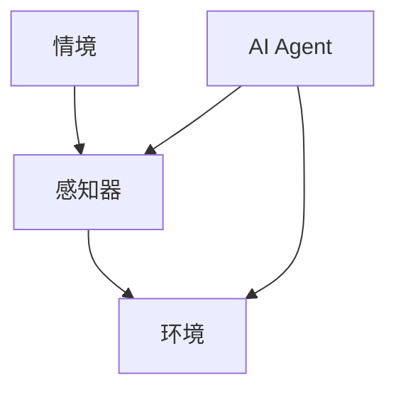
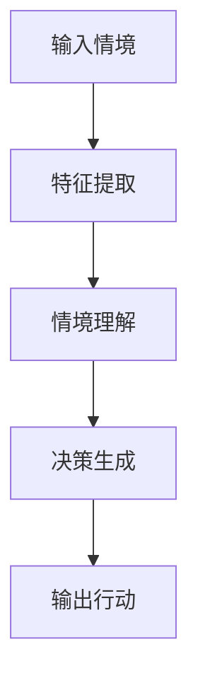

                 

# 情境感知AI Agent：增强LLM的环境适应能力

> 关键词：情境感知、AI Agent、LLM、环境适应、增强能力、人机交互、实时反馈

> 摘要：情境感知AI Agent通过实时感知和适应环境变化，显著增强了大型语言模型（LLM）的环境适应能力。本文系统性地探讨了情境感知AI Agent的核心原理、算法实现、系统架构、项目实战和实际应用场景。通过结合实时反馈机制，情境感知AI Agent不仅提升了LLM的环境适应能力，还优化了人机交互体验。本文旨在为技术开发者和研究人员提供理论指导和实践参考。

---

# 第1章: 情境感知AI Agent的背景与概念

## 1.1 情境感知的定义与背景

### 1.1.1 从传统AI到情境感知AI的演进

- **传统AI的局限性**：传统AI模型依赖于预定义的规则和数据，难以适应动态变化的环境。
- **情境感知的出现**：情境感知通过实时感知环境信息，使AI能够根据环境动态调整行为。
- **演进驱动力**：随着智能系统应用场景的多样化，对环境适应能力的需求日益增长。

### 1.1.2 情境感知在AI Agent中的重要性

- **环境适应能力**：情境感知使AI Agent能够实时感知环境变化并做出相应调整。
- **动态决策能力**：通过情境感知，AI Agent能够在动态环境中做出最优决策。
- **人机交互优化**：情境感知通过理解环境信息，优化了人机交互体验。

### 1.1.3 情境感知技术的应用场景

- **智能助手**：在智能助手中，情境感知能够根据用户的环境信息提供更精准的服务。
- **自动驾驶**：在自动驾驶中，情境感知技术能够实时感知交通环境并做出决策。
- **智能城市**：在智能城市中，情境感知技术能够优化资源配置和服务体验。

## 1.2 AI Agent的基本概念

### 1.2.1 AI Agent的定义

- **AI Agent**：AI Agent是一种智能实体，能够感知环境、自主决策并执行任务。
- **自主性**：AI Agent能够自主决策，无需外部干预。
- **反应性**：AI Agent能够实时感知环境并做出反应。

### 1.2.2 AI Agent的核心特征

- **感知能力**：AI Agent能够通过传感器或数据源感知环境信息。
- **决策能力**：AI Agent能够根据感知信息做出决策。
- **执行能力**：AI Agent能够执行决策结果。

### 1.2.3 情境感知AI Agent的独特性

- **动态适应**：情境感知AI Agent能够实时感知环境变化并做出相应调整。
- **智能推理**：情境感知AI Agent能够通过推理理解环境信息并做出决策。
- **人机交互优化**：情境感知AI Agent通过理解环境信息优化了人机交互体验。

## 1.3 情境感知AI Agent的背景与问题描述

### 1.3.1 当前LLM的局限性

- **环境适应能力不足**：当前LLM模型主要依赖于静态数据，难以适应动态变化的环境。
- **动态决策能力有限**：LLM模型难以根据环境变化实时调整决策。
- **人机交互体验欠佳**：LLM模型难以根据环境信息优化人机交互体验。

### 1.3.2 情境感知在增强LLM中的作用

- **提升环境适应能力**：情境感知通过实时感知环境信息，增强了LLM的环境适应能力。
- **优化动态决策能力**：情境感知通过实时感知环境信息，优化了LLM的动态决策能力。
- **改善人机交互体验**：情境感知通过理解环境信息，优化了LLM的人机交互体验。

### 1.3.3 情境感知AI Agent的目标与边界

- **目标**：情境感知AI Agent的目标是通过实时感知环境信息，增强LLM的环境适应能力和动态决策能力，优化人机交互体验。
- **边界**：情境感知AI Agent仅关注环境感知和动态决策，不涉及任务执行的细节。

## 1.4 本章小结

本章介绍了情境感知AI Agent的背景、核心概念和独特性，探讨了当前LLM的局限性以及情境感知在增强LLM中的作用，明确了情境感知AI Agent的目标与边界。

---

# 第2章: 情境感知AI Agent的核心概念与联系

## 2.1 情境感知的核心原理

### 2.1.1 情境感知的实现机制

- **环境感知**：通过传感器或数据源感知环境信息。
- **情境理解**：通过分析感知信息理解环境状态。
- **动态调整**：根据理解的环境信息动态调整行为。

### 2.1.2 情境感知与环境适应的关系

- **环境适应**：情境感知通过理解环境信息，使AI Agent能够适应环境变化。
- **动态调整**：情境感知通过实时感知环境信息，动态调整AI Agent的行为。

### 2.1.3 情境感知与智能推理的关系

- **智能推理**：通过情境感知理解环境信息，进行智能推理，做出最优决策。
- **动态决策**：情境感知通过智能推理，动态调整决策。

## 2.2 核心概念的属性特征对比

### 2.2.1 情境感知与传统感知的对比

| 属性       | 传统感知       | 情境感知       |
|------------|----------------|----------------|
| **感知方式** | 静态感知        | 动态感知        |
| **适应能力** | 有限           | 强             |
| **决策能力** | 有限           | 强             |

### 2.2.2 情境感知与强化学习的对比

| 属性       | 情境感知       | 强化学习       |
|------------|----------------|----------------|
| **感知方式** | 动态感知        | 基于奖励        |
| **决策方式** | 基于环境信息    | 基于奖励历史    |
| **适应能力** | 强             | 中             |

### 2.2.3 情境感知与监督学习的对比

| 属性       | 情境感知       | 监督学习       |
|------------|----------------|----------------|
| **感知方式** | 动态感知        | 静态数据        |
| **决策方式** | 基于环境信息    | 基于训练数据    |
| **适应能力** | 强             | 有限           |

## 2.3 ER实体关系图架构

## 2.4 本章小结

本章详细介绍了情境感知的核心原理，通过对比分析探讨了情境感知与传统感知、强化学习和监督学习的异同，最后通过ER实体关系图展示了情境感知AI Agent的实体关系。

---

# 第3章: 情境感知AI Agent的算法原理

## 3.1 情境感知算法的核心原理

### 3.1.1 情境感知的基本流程

1. **环境感知**：通过传感器或数据源感知环境信息。
2. **情境理解**：分析感知信息，理解环境状态。
3. **决策生成**：基于理解的环境信息，生成最优决策。
4. **行为执行**：根据决策执行相应的行为。

### 3.1.2 情境感知的输入输出关系

- **输入**：环境信息（如传感器数据、用户输入等）。
- **输出**：决策信息（如动作、建议等）。

### 3.1.3 情境感知的数学模型概述

- **情境表示**：将环境信息表示为数学形式。
- **情境理解**：通过数学模型理解环境信息。
- **决策生成**：基于数学模型生成决策。

## 3.2 情境感知算法的实现流程

## 3.3 算法的数学模型与公式

### 3.3.1 情境表示的数学模型

$$P(e) = \frac{1}{Z} \sum_{i=1}^{n} e_i$$

其中，$P(e)$表示环境信息的概率分布，$Z$是归一化因子，$e_i$是环境信息的特征。

### 3.3.2 情境理解的数学模型

$$U = f(P(e))$$

其中，$U$表示情境理解的结果，$f$是情境理解的函数。

### 3.3.3 决策生成的数学模型

$$D = g(U)$$

其中，$D$表示决策结果，$g$是决策生成的函数。

## 3.4 本章小结

本章详细介绍了情境感知算法的核心原理和实现流程，通过数学公式展示了情境表示、情境理解

