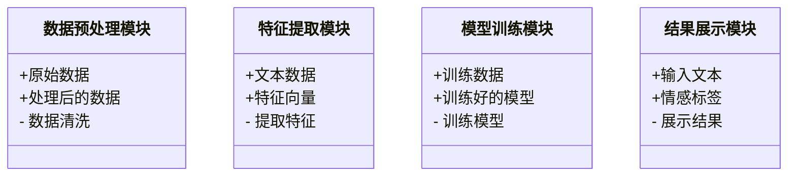
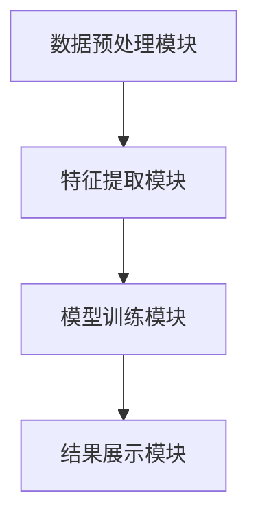

                 


```markdown
# 情感分析AI Agent：利用LLM洞察文本情感倾向

> 关键词：情感分析，AI Agent，LLM，文本分析，自然语言处理

> 摘要：本文将深入探讨情感分析AI Agent的核心概念、算法原理、系统架构及项目实战，帮助读者全面理解如何利用大语言模型（LLM）洞察文本情感倾向。

---

# 目录

1. **情感分析的背景与概述**  
   1.1 情感分析的定义与应用  
   1.2 情感分析的核心概念与联系  

2. **情感分析的核心概念与联系**  
   2.1 情感分析的核心原理  
   2.2 情感分析的核心要素对比  
   2.3 情感分析的ER实体关系图  

3. **情感分析的算法原理**  
   3.1 情感分析的算法实现  
   3.2 情感分析的数学模型  
   3.3 情感分析的代码实现  

4. **情感分析的系统架构与设计**  
   4.1 情感分析的系统分析  
   4.2 情感分析的系统架构设计  
   4.3 情感分析的系统接口设计  

5. **情感分析的项目实战**  
   5.1 情感分析的项目环境安装  
   5.2 情感分析的核心代码实现  
   5.3 情感分析的实际案例分析  

6. **情感分析的最佳实践与小结**  
   6.1 情感分析的最佳实践  
   6.2 情感分析的小结与展望  

---

# 第一部分: 情感分析的背景与概述

## 第1章: 情感分析的定义与应用

### 1.1 情感分析的基本概念

#### 1.1.1 什么是情感分析
情感分析（Sentiment Analysis），又称情感计算，是指对文本中的情感倾向进行分析和判断的过程。情感分析的目标是识别文本中蕴含的情感色彩，如正面、负面或中性。

#### 1.1.2 情感分析的应用场景
情感分析在多个领域都有广泛应用，包括：
- **社交媒体分析**：分析用户对某个品牌或产品的评论情感。
- **舆情监测**：监测媒体或网络上的公众情绪。
- **客户服务**：通过分析客户反馈优化服务流程。
- **金融领域**：分析市场情绪影响投资决策。

#### 1.1.3 情感分析与自然语言处理的关系
情感分析是自然语言处理（NLP）的一个重要分支，它依赖于文本处理、特征提取和分类等NLP技术。

---

### 1.2 情感分析的核心问题

#### 1.2.1 情感分析的任务分类
情感分析的任务可以分为以下几类：
- **二分类任务**：判断文本是正面、负面或中性。
- **多分类任务**：判断文本属于多个情感类别中的一个。
- **情感强度分析**：判断情感的强度，如“非常满意”或“稍微不满意”。

#### 1.2.2 情感分析的文本特征提取
文本特征提取是情感分析的关键步骤，常见的特征包括：
- 词汇特征：如情感词、否定词等。
- 语法特征：如句子结构、主语和谓语的关系。
- 上下文特征：如词语的上下文信息。

#### 1.2.3 情感分析的边界与外延
情感分析的边界在于如何准确地捕捉文本中的情感倾向，而外延则包括如何将情感分析结果应用于实际场景。

---

## 第2章: 情感分析的核心概念与联系

### 2.1 情感分析的核心原理

#### 2.1.1 情感分析的特征工程
特征工程是情感分析的关键步骤，包括：
- 文本清洗：去除停用词、标点符号等。
- 词袋模型：将文本表示为词袋。
- 词嵌入：如Word2Vec、GloVe等。

#### 2.1.2 情感分析的分类模型
情感分析的分类模型可以是基于规则的模型（如情感词典）或机器学习模型（如SVM、随机森林）。

#### 2.1.3 情感分析的评价指标
常见的评价指标包括准确率、召回率、F1分数等。

---

### 2.2 情感分析的核心要素对比

#### 2.2.1 情感分析与文本分类的对比
- **文本分类**：将文本分为多个类别。
- **情感分析**：专注于情感倾向的分类。

#### 2.2.2 情感分析与实体识别的对比
- **实体识别**：识别文本中的实体（如人名、地名）。
- **情感分析**：分析文本中的情感倾向。

#### 2.2.3 情感分析与语义理解的对比
- **语义理解**：理解文本的语义含义。
- **情感分析**：专注于情感倾向的分析。

---

### 2.3 情感分析的ER实体关系图

```mermaid
erDiagram
    用户: 用户评论
    产品: 产品评价
    情感: 情感标签
    用户 --> 情感: 产生情感
    产品 --> 情感: 产生情感
```

---

# 第三部分: 情感分析的算法原理

## 第3章: 情感分析的算法实现

### 3.1 情感分析的算法原理

#### 3.1.1 基于规则的情感分析
基于规则的情感分析依赖于预定义的情感词典。

#### 3.1.2 基于机器学习的情感分析
基于机器学习的情感分析使用特征提取和分类模型。

#### 3.1.3 基于深度学习的情感分析
基于深度学习的情感分析使用词嵌入和神经网络模型。

---

### 3.2 情感分析的数学模型

#### 3.2.1 情感分析的概率模型
$$ P(y|x) = \frac{P(x|y)P(y)}{P(x)} $$

#### 3.2.2 情感分析的svm模型
$$ \text{svm: } y = \text{sign}(w \cdot x + b) $$

---

### 3.3 情感分析的代码实现

#### 3.3.1 文本预处理
```python
import nltk
from nltk.corpus import stopwords

text = "This is a positive review."
stop_words = set(stopwords.words('english'))
tokens = nltk.word_tokenize(text.lower())
filtered_tokens = [token for token in tokens if token not in stop_words]
```

#### 3.3.2 特征提取
```python
from sklearn.feature_extraction.text import TfidfVectorizer

vectorizer = TfidfVectorizer()
X = vectorizer.fit_transform(filtered_tokens)
```

#### 3.3.3 模型训练与预测
```python
from sklearn.svm import SVC

model = SVC()
model.fit(X, y)
y_pred = model.predict(X_new)
```

---

## 第四章: 情感分析的系统架构与设计

### 4.1 情感分析的系统分析

#### 4.1.1 项目需求
- 数据预处理模块
- 特征提取模块
- 模型训练模块
- 结果展示模块

#### 4.1.2 系统功能设计



#### 4.1.3 系统架构设计



---

## 第五章: 情感分析的项目实战

### 5.1 情感分析的项目环境安装

#### 5.1.1 安装依赖
```bash
pip install nltk scikit-learn
```

### 5.2 情感分析的核心代码实现

#### 5.2.1 环境安装与数据加载
```python
import pandas as pd
import numpy as np
from sklearn.model_selection import train_test_split
from sklearn.metrics import accuracy_score
from sklearn.svm import SVC
from sklearn.feature_extraction.text import TfidfVectorizer
```

#### 5.2.2 数据预处理与特征提取
```python
data = pd.read_csv('data.csv')
X = data['text']
y = data['sentiment']
X_train, X_test, y_train, y_test = train_test_split(X, y, test_size=0.2)
vectorizer = TfidfVectorizer()
X_train_vec = vectorizer.fit_transform(X_train)
X_test_vec = vectorizer.transform(X_test)
```

#### 5.2.3 模型训练与预测
```python
model = SVC()
model.fit(X_train_vec, y_train)
y_pred = model.predict(X_test_vec)
print("Accuracy:", accuracy_score(y_test, y_pred))
```

---

## 第六章: 情感分析的最佳实践与小结

### 6.1 情感分析的最佳实践

#### 6.1.1 数据质量
确保数据质量，包括数据清洗和特征工程。

#### 6.1.2 模型选择
选择合适的模型，如基于规则的模型或深度学习模型。

#### 6.1.3 可扩展性
考虑系统的可扩展性，支持实时分析和动态调整。

---

### 6.2 情感分析的小结与展望

#### 6.2.1 小结
本文详细介绍了情感分析的核心概念、算法原理和系统设计，展示了如何利用大语言模型（LLM）进行情感分析。

#### 6.2.2 展望
未来，情感分析将更加智能化和自动化，结合深度学习和大数据技术，为实际应用提供更强大的支持。

---

# 小结

情感分析是一项重要的自然语言处理任务，本文从背景到算法，再到系统设计和项目实战，全面介绍了情感分析的核心内容。希望读者能够通过本文，深入了解情感分析的技术细节，并能够将其应用于实际场景中。

作者：AI天才研究院/AI Genius Institute & 禅与计算机程序设计艺术 /Zen And The Art of Computer Programming
```

