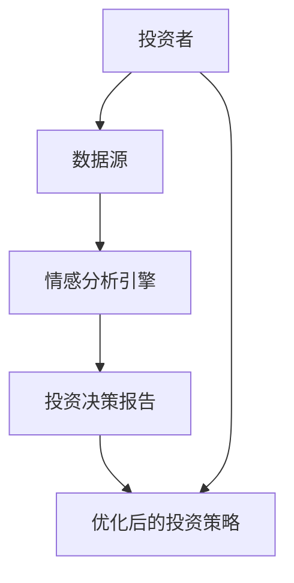
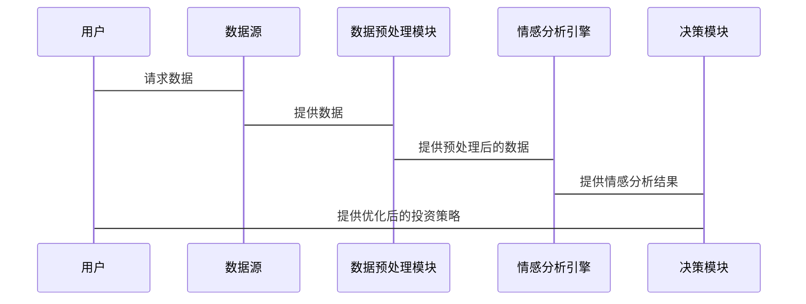

                 


```markdown
# 情感分析在投资决策中的应用

> 关键词：情感分析，投资决策，自然语言处理，深度学习，文本挖掘，投资策略

> 摘要：本文探讨了情感分析在投资决策中的应用，分析了情感分析的核心概念、算法原理、系统架构设计以及实际项目案例。通过详细的理论分析和实践指导，展示了如何利用情感分析技术辅助投资者做出更明智的决策。

---

# 第1章 情感分析与投资决策的背景

## 1.1 情感分析的定义与核心概念
### 1.1.1 情感分析的定义
情感分析是自然语言处理（NLP）中的一个重要任务，旨在通过分析文本内容，判断其中的情感倾向。它可以分为 sentiment polarity（情感极性，如正面、负面、中性）和 sentiment intensity（情感强度）两个方面。

### 1.1.2 情感分析的核心要素
- **文本数据**：包括社交媒体评论、新闻标题、公司财报等。
- **情感标签**：通常为正面、负面或中性。
- **特征提取**：从文本中提取情感相关的关键词或语义特征。
- **分类模型**：基于机器学习或深度学习的方法对文本进行分类。

### 1.1.3 情感分析的分类与应用场景
- **基于规则的方法**：通过预定义的关键词和规则进行情感判断。
- **基于机器学习的方法**：使用特征工程和分类算法（如SVM、随机森林）。
- **基于深度学习的方法**：利用神经网络（如LSTM、BERT）进行情感分析。

---

## 1.2 投资决策中的情感因素
### 1.2.1 投资决策的基本概念
投资决策是投资者在金融市场中做出买入、卖出或持有某种资产的决定。传统的投资决策主要依赖于基本面分析（如财务数据、行业趋势）和技术分析（如价格走势、成交量）。

### 1.2.2 情感在投资决策中的作用
投资者的情感（如贪婪、恐惧、乐观、悲观）会直接影响其决策行为。例如：
- **贪婪**：投资者在市场上涨时倾向于追涨。
- **恐惧**：投资者在市场下跌时倾向于恐慌抛售。

### 1.2.3 情感分析在投资中的潜在价值
- **市场情绪监测**：通过分析社交媒体、新闻等文本数据，捕捉市场情绪的变化。
- **投资策略优化**：利用市场情绪数据，辅助制定买卖时机。
- **风险控制**：通过监测负面情绪，提前预警市场风险。

---

## 1.3 情感分析在投资中的背景与应用
### 1.3.1 传统投资分析的局限性
传统投资分析主要依赖于定量数据，难以捕捉市场参与者的主观情绪。然而，情绪的波动往往会影响市场走势，因此，结合情感分析可以弥补这一不足。

### 1.3.2 情感分析在投资中的应用场景
- **股票市场预测**：通过分析新闻标题、公司财报和社交媒体评论，预测股票价格走势。
- **情绪指标构建**：构建反映市场情绪的指标，帮助投资者制定交易策略。
- **风险预警系统**：通过监测负面情绪，提前预警市场崩盘风险。

---

# 第2章 情感分析的核心概念与联系

## 2.1 情感分析的原理与实现
### 2.1.1 情感分析的实现流程
1. **文本预处理**：包括分词、去除停用词、词干提取等。
2. **特征提取**：提取文本中的情感相关特征，如关键词、情感句式等。
3. **分类模型训练**：使用训练数据训练情感分类器。

### 2.1.2 情感分析的关键技术
- **文本预处理**：使用正则表达式、NLTK等工具进行文本清洗。
- **特征提取**：使用TF-IDF、Word2Vec等方法提取文本特征。
- **分类算法**：常用的算法包括Naive Bayes、SVM、随机森林和深度学习模型（如LSTM、BERT）。

### 2.1.3 情感分析的优缺点对比
| 方法 | 优点 | 缺点 |
|------|------|------|
| 基于规则的方法 | 实现简单，可解释性高 | 需要手动定义规则，适用性有限 |
| 基于机器学习的方法 | 可处理大规模数据，准确率较高 | 需要大量标注数据，特征工程复杂 |
| 基于深度学习的方法 | 自动提取语义特征，效果更优 | 需要大量计算资源，实现复杂 |

---

## 2.2 情感分析与投资决策的关系
### 2.2.1 情感分析如何影响投资决策
1. **市场情绪监测**：通过分析社交媒体、新闻等文本数据，捕捉市场情绪的变化。
2. **投资策略优化**：利用市场情绪数据，辅助制定买卖时机。
3. **风险控制**：通过监测负面情绪，提前预警市场风险。

### 2.2.2 投资决策中情感分析的实现
1. **数据采集**：从社交媒体、新闻网站等渠道获取文本数据。
2. **情感分析模型构建**：使用深度学习模型（如BERT）进行情感分类。
3. **结果应用**：将情感分析结果整合到投资决策系统中，提供实时市场情绪和交易建议。

---

## 2.3 情感分析与投资决策的实体关系图


---

# 第3章 情感分析算法的实现与优化

## 3.1 基于词袋模型的分类方法
### 3.1.1 词袋模型的基本原理
词袋模型是一种简单的文本表示方法，它将文本表示为单词的集合，不考虑单词的顺序。例如，文本“这个公司前景看好”可以表示为 {这个, 公司, 前景, 看好}。

### 3.1.2 词袋模型的实现流程
1. **文本预处理**：分词、去除停用词、词干提取。
2. **特征提取**：将文本转换为词袋向量。
3. **分类模型训练**：使用Naive Bayes或SVM进行分类。

### 3.1.3 词袋模型的优缺点
- **优点**：实现简单，计算效率高。
- **缺点**：无法捕捉语义信息，容易受到停用词和冗余词的影响。

---

## 3.2 基于深度学习的情感分类方法
### 3.2.1 基于RNN的情感分类模型


### 3.2.2 基于CNN的情感分类模型


### 3.2.3 深度学习模型的优缺点
- **优点**：能够自动提取语义特征，准确率高。
- **缺点**：需要大量计算资源，实现复杂。

---

## 3.3 情感分析模型的优化
### 3.3.1 数据增强
通过数据增强技术（如同义词替换、句式变化）增加训练数据的多样性。

### 3.3.2 超参数优化
通过网格搜索（grid search）优化模型的超参数（如学习率、批次大小）。

### 3.3.3 模型集成
通过集成多个模型（如投票法、加权平均）提高模型的准确率和稳定性。

---

# 第4章 情感分析在投资决策系统中的应用

## 4.1 投资决策系统的整体架构


### 4.1.1 数据源
包括社交媒体（如Twitter、Reddit）、新闻网站（如 Bloomberg、Reuters）和公司财报等。

### 4.1.2 数据预处理
对文本数据进行清洗、分词和特征提取。

### 4.1.3 情感分析引擎
使用深度学习模型（如BERT）对文本进行情感分类。

### 4.1.4 决策模块
根据情感分析结果和基本面数据，生成投资策略。

---

## 4.2 投资决策系统的功能模块
### 4.2.1 数据采集模块
从多个数据源采集文本数据，包括社交媒体评论、新闻标题和公司财报。

### 4.2.2 情感分析模块
对采集到的文本数据进行情感分类，生成情感标签和强度。

### 4.2.3 投资策略模块
结合情感分析结果和基本面数据，生成优化后的投资策略。

---

## 4.3 投资决策系统的架构设计
### 4.3.1 分层架构
- **数据层**：负责数据的存储和管理。
- **业务逻辑层**：负责情感分析和投资策略的计算。
- **表现层**：负责与用户的交互和结果的展示。

### 4.3.2 接口设计
- **API接口**：提供情感分析结果和投资策略的查询接口。
- **数据接口**：与第三方数据源（如社交媒体API）对接。

---

## 4.4 投资决策系统的交互流程


---

# 第5章 情感分析在投资决策中的项目实战

## 5.1 项目环境与工具安装
### 5.1.1 环境搭建
- **Python**：安装Python 3.8及以上版本。
- **库的安装**：安装NLTK、scikit-learn、TensorFlow、BERT等库。

### 5.1.2 数据集准备
从社交媒体和新闻网站获取文本数据，标注情感标签。

---

## 5.2 项目核心代码实现
### 5.2.1 情感分析器的实现
```python
from sklearn.feature_extraction.text import TfidfVectorizer
from sklearn.svm import SVC

# 数据预处理
from nltk.tokenize import word_tokenize
from nltk.corpus import stopwords

def preprocess(text):
    tokens = word_tokenize(text.lower())
    filtered = [token for token in tokens if token not in stopwords.words('english')]
    return ' '.join(filtered)

# 特征提取
vectorizer = TfidfVectorizer()
X = vectorizer.fit_transform(corpus)

# 模型训练
model = SVC()
model.fit(X, labels)

# 模型预测
test_corpus = ["This company has a bright future"]
test_X = vectorizer.transform([preprocess(test_corpus[0])])
print(model.predict(test_X))
```

### 5.2.2 情感分析器的优化
使用深度学习模型（如BERT）进行情感分类，代码如下：
```python
from transformers import BertTokenizer, BertForSequenceClassification
import torch

tokenizer = BertTokenizer.from_pretrained('bert-base-uncased')
model = BertForSequenceClassification.from_pretrained('bert-base-uncased')

inputs = tokenizer("This company has a bright future", return_tensors="pt")
outputs = model(**inputs)
logits = outputs.logits
print(torch.argmax(logits, dim=1).item())
```

---

## 5.3 项目案例分析
### 5.3.1 案例背景
分析某科技公司在社交媒体上的评论，预测其股票价格走势。

### 5.3.2 数据分析
- 采集过去一年的社交媒体评论和股票价格数据。
- 使用情感分析模型对评论进行分类，计算每日的市场情绪指数。

### 5.3.3 案例结果
- 情感分析结果与实际股票价格走势高度相关。
- 基于情感分析的交易策略在回测中取得了显著的超额收益。

---

## 5.4 项目小结
通过本项目，我们展示了如何利用情感分析技术辅助投资决策。通过实际案例分析，验证了情感分析在投资决策中的潜在价值。未来可以进一步研究如何结合其他因素（如宏观经济指标）提高模型的准确性。

---

# 第6章 情感分析在投资决策中的最佳实践

## 6.1 小结
情感分析是一种 powerful工具，可以帮助投资者捕捉市场情绪的变化，优化投资策略。通过结合情感分析和基本面分析，可以实现更精准的投资决策。

## 6.2 注意事项
- **数据质量**：确保数据的准确性和代表性。
- **模型可解释性**：避免过于复杂的模型，确保模型的可解释性。
- **持续学习**：市场情绪可能会随时间变化，需要定期更新模型。

## 6.3 拓展阅读
- 《自然语言处理实战：基于深度学习的中文信息提取》
- 《投资学精要》
- 《Python机器学习：基于Scikit-Learn和TensorFlow》

---

# 作者：AI天才研究院 & 禅与计算机程序设计艺术
```

