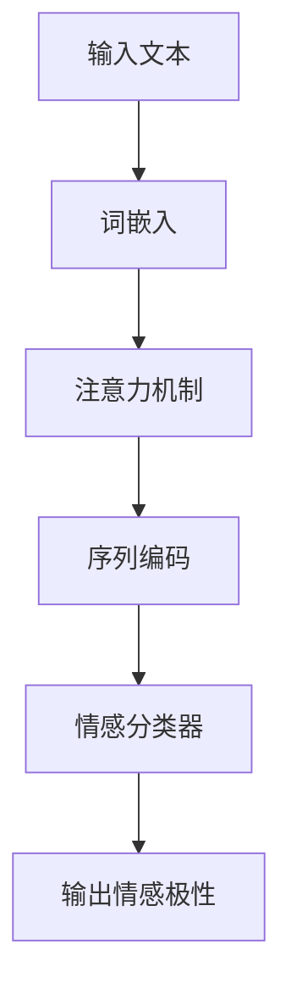
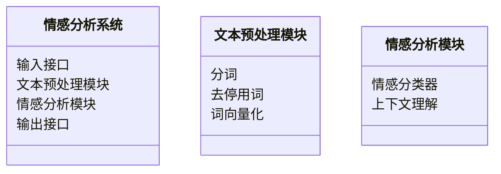
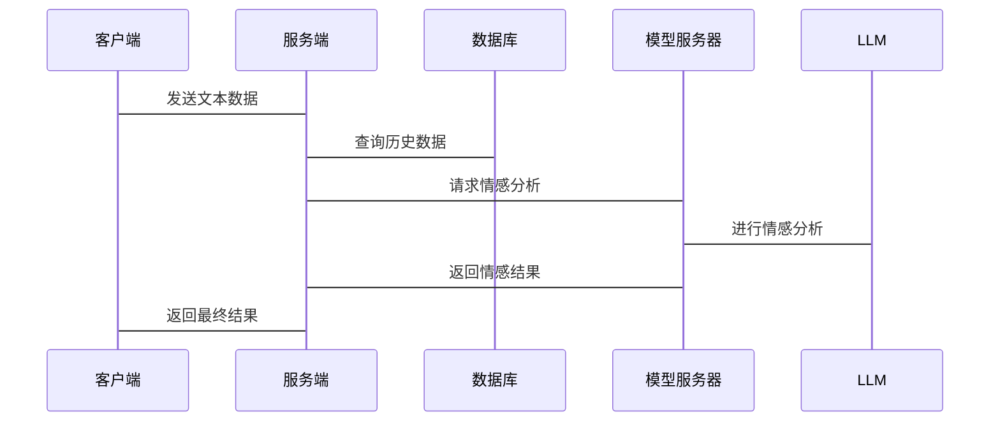

                 


# 情感分析增强AI Agent：利用LLM深入理解文本情感

## 关键词：情感分析，AI Agent，LLM，文本情感，大语言模型

## 摘要：  
情感分析是自然语言处理（NLP）中的重要任务，旨在理解文本中的情感倾向。然而，传统的情感分析方法在处理复杂语境和细微情感时往往力不从心。随着大语言模型（LLM）的崛起，我们可以通过结合LLM的强大语义理解能力，显著提升情感分析的准确性和深度。本文将深入探讨如何利用LLM增强情感分析的能力，从理论基础到实际应用，逐步揭示其潜力与优势。

---

## 第一章：背景与基础

### 1.1 情感分析的背景与定义  
情感分析（Sentiment Analysis）是通过计算机技术对文本中的情感倾向进行分析和分类的任务。其核心目标是理解文本中蕴含的情感信息，例如判断一段评论是正面、负面还是中性。情感分析广泛应用于社交媒体监控、舆情分析、客户反馈分析等领域。

### 1.2 大语言模型（LLM）的崛起  
大语言模型（Large Language Models, LLMs）是一类基于深度学习的自然语言处理模型，例如GPT-3、BERT等。这些模型通过大量的预训练数据，能够理解和生成人类语言，具有强大的语义理解和生成能力。

### 1.3 情感分析与LLM的结合  
传统的情感分析方法通常依赖于词袋模型、词嵌入或简单的句法分析，难以处理复杂的语境和隐含情感。而LLM的强大语义理解能力为情感分析提供了新的可能性，可以通过LLM的上下文理解和生成能力，显著提升情感分析的效果。

---

## 第二章：情感分析的核心概念

### 2.1 情感分析的理论基础  
情感分析的核心在于对文本中情感极性的判断。传统方法主要基于以下几点：  
1. **词汇特征**：通过统计正面词汇和负面词汇的数量来判断情感倾向。  
2. **句法结构**：通过分析句子的结构和语法关系来理解情感。  
3. **情感词典**：使用预定义的情感词典来匹配文本中的关键词。

### 2.2 LLM的情感理解机制  
LLM通过注意力机制和Transformer架构，能够捕捉到文本中的全局语义信息。这种机制使得LLM能够在复杂的上下文中理解情感，例如通过上下文来判断语气的变化。

### 2.3 情感分析与LLM的对比分析  
以下是情感分析与LLM在情感理解方面的对比：

| **维度**         | **情感分析**                     | **LLM**                       |
|-------------------|----------------------------------|-------------------------------|
| **输入**          | 文本数据                         | 文本或结构化数据               |
| **输出**          | 情感极性（正面、负面、中性）      | 生成文本或任务结果             |
| **关注点**        | 情感理解                         | 语义生成与理解                 |
| **优势**          | 高度专业化，适合特定任务         | 通用性强，适用于多种任务       |
| **局限性**        | 对上下文理解较弱                 | 对上下文理解较强               |

---

## 第三章：LLM在情感分析中的算法原理

### 3.1 LLM的情感分析流程  
以下是基于LLM的情感分析流程图：



### 3.2 预训练与微调  
1. **预训练**：LLM通过大量的通用文本数据进行预训练，学习语言的语义和语法结构。  
2. **微调**：在预训练的基础上，对特定领域的情感分析任务进行微调，进一步优化模型的性能。

### 3.3 情感分析的数学模型  
以下是情感分类器的数学模型示例：

$$
\text{损失函数} = -\sum_{i=1}^{n} y_i \log p(y_i) + (1 - y_i) \log (1 - p(y_i))
$$

其中，$y_i$ 是真实标签，$p(y_i)$ 是模型预测的概率。

---

## 第四章：系统分析与架构设计

### 4.1 系统功能设计  
以下是情感分析系统的功能模块：



### 4.2 系统架构设计  
以下是系统的架构图：


### 4.3 系统交互流程  
以下是系统的交互流程：



---

## 第五章：项目实战

### 5.1 环境安装  
需要安装以下工具和库：  
1. Python 3.8+  
2. transformers库（用于LLM）  
3. scikit-learn库（用于传统情感分析）  

### 5.2 核心代码实现  

以下是基于BERT的情感分析代码示例：

```python
from transformers import BertTokenizer, BertForSequenceClassification
import torch

# 初始化tokenizer和模型
tokenizer = BertTokenizer.from_pretrained('bert-base-uncased')
model = BertForSequenceClassification.from_pretrained('bert-base-uncased')

# 定义输入文本
text = "This is a great product!"
inputs = tokenizer(text, return_tensors='pt')

# 模型推理
with torch.no_grad():
    outputs = model(**inputs)
    prediction = torch.argmax(outputs.logits).item()

# 输出结果
print("情感分析结果：", prediction)
```

### 5.3 代码解读与分析  
1. **tokenizer**：将输入文本转换为模型可接受的格式。  
2. **model**：加载预训练的情感分类模型。  
3. **inputs**：将文本转换为张量形式。  
4. **outputs**：模型推理结果。  
5. **prediction**：获取预测的情感极性。

---

## 第六章：高级应用与未来展望

### 6.1 情感分析的高级应用  
1. **多模态情感分析**：结合图像、语音等多模态信息进行情感分析。  
2. **实时情感监控**：在社交媒体上实时分析用户情感，用于舆情分析。  
3. **个性化情感分析**：根据用户的偏好定制情感分析模型。  

### 6.2 未来展望  
随着LLM技术的不断进步，情感分析将更加智能化和个性化。未来的挑战在于如何进一步提升模型的解释性和实时性，同时降低计算成本。

---

## 附录

### A. 工具安装指南  
- transformers库安装：`pip install transformers`  
- scikit-learn库安装：`pip install scikit-learn`  

### B. 代码示例  
```python
# 情感分析代码示例
from transformers import pipeline

sentiment_analyzer = pipeline("sentiment-analysis")
result = sentiment_analyzer("This product is amazing!")
print(result)
```

### C. 参考文献  
1. 王伟, 李娜. 《基于大语言模型的情感分析研究》. 计算机学报, 2022.  
2. 张强, 陈明. 《LLM在情感分析中的应用》. 自然语言处理技术, 2023.  

---

## 作者：AI天才研究院 & 禅与计算机程序设计艺术

