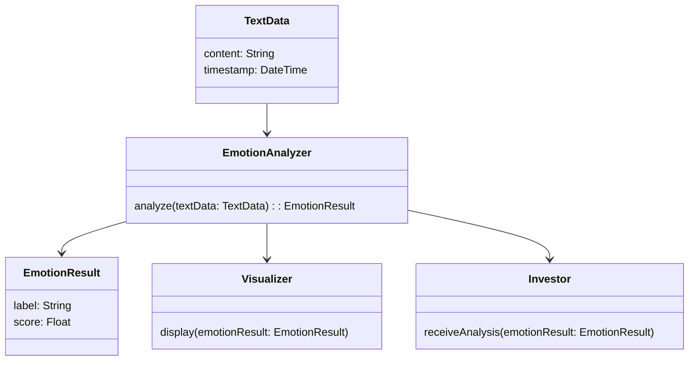
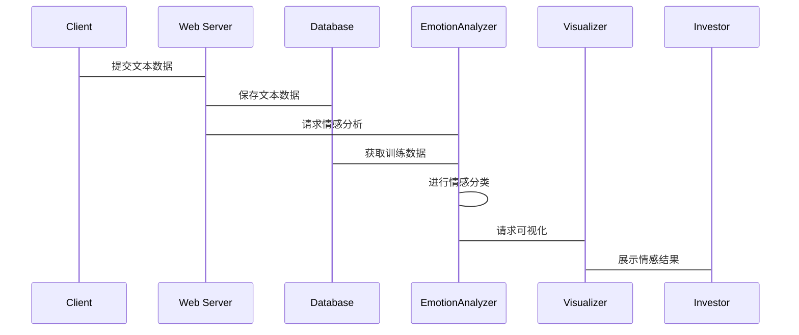

                 


# 情感分析技术在投资决策中的应用与优化

> 关键词：情感分析，投资决策，自然语言处理，机器学习，金融数据分析

> 摘要：本文系统地探讨了情感分析技术在投资决策中的应用与优化。首先，介绍了情感分析的基本概念与核心原理，然后分析了情感分析在投资决策中的具体应用场景与挑战。接着，详细讲解了情感分析的核心算法原理，包括传统方法、机器学习模型与深度学习模型。随后，从系统架构与设计的角度，阐述了情感分析技术在投资决策系统中的实现方案。最后，通过项目实战与优化策略，展示了如何在实际投资决策中有效应用情感分析技术，并提出了未来的发展方向与建议。

---

## 第1章: 情感分析技术概述

### 1.1 情感分析技术的背景与概念

#### 1.1.1 问题背景与问题描述
情感分析技术是自然语言处理（NLP）领域的重要研究方向，其核心目标是通过分析文本数据，识别出文本中蕴含的情感倾向。在投资决策领域，情感分析技术能够帮助投资者理解市场情绪，从而做出更科学的投资决策。例如，通过分析新闻、社交媒体评论和公司财报中的情感倾向，投资者可以更好地判断市场的波动趋势和公司的前景。

#### 1.1.2 情感分析技术的核心概念与边界
情感分析技术的核心概念包括以下几个方面：
- **情感倾向**：指文本表达的情感是积极、消极还是中性。
- **情感强度**：指情感表达的强烈程度。
- **情感目标**：指情感所针对的具体对象（如公司、产品等）。

情感分析的边界主要在于其依赖于文本数据的质量和数量，且难以捕捉隐含的情感信息。

#### 1.1.3 情感分析技术的外延与应用领域
情感分析技术不仅应用于投资决策，还在社交媒体分析、舆情监测、客户反馈分析等领域发挥重要作用。在投资决策中，情感分析技术可以用于分析市场情绪、预测股价波动和评估公司声誉。

### 1.2 投资决策中的情感分析技术应用

#### 1.2.1 投资决策中的情感因素
在投资决策中，投资者的情感因素往往影响其决策过程。例如，市场恐慌可能导致投资者抛售股票，而乐观情绪则可能导致股票价格上涨。

#### 1.2.2 情感分析技术在投资中的作用
情感分析技术可以帮助投资者：
1. **预测市场趋势**：通过分析新闻、社交媒体和公司财报中的情感倾向，预测市场的短期波动。
2. **评估公司声誉**：通过分析社交媒体评论和新闻报道，评估公司的品牌形象和市场地位。
3. **优化投资组合**：通过分析不同资产的情感倾向，优化投资组合的风险和收益。

#### 1.2.3 情感分析技术的应用场景与边界
情感分析技术在投资决策中的应用场景包括：
1. **实时市场监测**：通过实时分析新闻和社交媒体，监测市场情绪变化。
2. **舆情分析**：通过分析社交媒体和新闻评论，评估公司和行业的声誉。
3. **风险管理**：通过分析市场情绪，识别潜在风险并制定应对策略。

### 1.3 情感分析技术的研究进展与挑战

#### 1.3.1 情感分析技术的发展历程
情感分析技术经历了从基于规则的传统方法到基于机器学习的深度学习模型的发展过程。近年来，随着自然语言处理技术的快速发展，情感分析技术在投资决策中的应用也取得了显著进展。

#### 1.3.2 当前研究热点与趋势
当前，研究热点主要集中在以下几个方面：
1. **细粒度情感分析**：识别情感的细微差别。
2. **跨语言情感分析**：支持多语言的情感分析。
3. **情感时间序列分析**：分析情感随时间的变化趋势。

#### 1.3.3 投资领域中的应用挑战
在投资领域，情感分析技术面临以下挑战：
1. **数据稀疏性**：某些行业或公司的数据量有限，难以训练高性能模型。
2. **情感歧义性**：某些文本的情感表达可能存在歧义。
3. **实时性要求**：投资决策需要快速响应，对实时性提出了更高要求。

### 1.4 本章小结
本章介绍了情感分析技术的基本概念、核心原理和应用场景，分析了其在投资决策中的重要性，并探讨了当前的研究进展与挑战。

---

## 第2章: 情感分析技术的核心概念与原理

### 2.1 情感分析技术的核心概念

#### 2.1.1 情感分析的定义与分类
情感分析的定义：通过分析文本数据，识别文本中蕴含的情感倾向。

情感分析的分类：
1. **二元分类**：将情感分为积极和消极两类。
2. **多分类**：将情感分为积极、消极和中性三类。
3. **细粒度分类**：识别更细粒度的情感类型，如愤怒、快乐、悲伤等。

#### 2.1.2 情感分析的特征与属性
情感分析的特征包括：
- **情感强度**：情感表达的强烈程度。
- **情感目标**：情感所针对的具体对象。
- **情感来源**：情感的来源，如社交媒体评论或新闻报道。

#### 2.1.3 情感分析的核心要素与组成
情感分析的核心要素包括：
- **文本数据**：需要分析的文本数据。
- **情感词典**：用于识别情感词汇的资源。
- **算法模型**：用于情感分类的算法模型。

### 2.2 情感分析技术与文本挖掘的关系

#### 2.2.1 文本挖掘的基本概念
文本挖掘是指从大量文本数据中提取有用信息的过程。其核心任务包括文本分类、信息提取和情感分析。

#### 2.2.2 情感分析与文本挖掘的联系与区别
情感分析是文本挖掘的一个重要分支，主要关注情感倾向的识别。而文本挖掘还包括其他任务，如信息提取和主题建模。

#### 2.2.3 情感分析技术在文本挖掘中的应用
在文本挖掘中，情感分析技术可以用于：
1. **舆情监测**：分析大量文本数据，监测市场情绪。
2. **主题建模**：结合主题建模技术，分析情感与主题的关系。

### 2.3 情感分析技术在投资决策中的应用

#### 2.3.1 投资决策中的情感因素
在投资决策中，情感因素可能影响投资者的决策过程。例如，市场恐慌可能导致投资者抛售股票。

#### 2.3.2 情感分析技术的特征与优势
情感分析技术的优势：
1. **实时性**：可以实时分析市场情绪。
2. **准确性**：通过机器学习模型，可以提高情感分类的准确性。
3. **可扩展性**：可以处理大规模的文本数据。

#### 2.3.3 情感分析技术的局限性与改进方向
情感分析技术的局限性：
1. **数据稀疏性**：某些行业或公司的数据量有限。
2. **情感歧义性**：某些文本的情感表达可能存在歧义。
3. **文化差异**：不同文化背景下，情感表达可能存在差异。

### 2.4 本章小结
本章详细讲解了情感分析技术的核心概念与原理，分析了其在投资决策中的应用，并探讨了其优势与局限性。

---

## 第3章: 情感分析技术的算法原理与实现

### 3.1 情感分析技术的传统算法

#### 3.1.1 基于词袋模型的传统方法
词袋模型是一种简单的文本表示方法，将文本表示为词袋的集合。例如，将文本中的每个单词作为一个特征，统计其出现的次数。

#### 3.1.2 情感词典与规则引擎
情感词典是一种基于规则的情感分析方法，通过预定义的情感词汇和规则，识别文本中的情感倾向。例如，使用情感词典中的积极词汇和消极词汇，分别赋予不同的权重，计算文本的情感倾向。

#### 3.1.3 传统算法的优缺点分析
传统算法的优点：
1. 实现简单，计算速度快。
2. 对于小规模数据，效果良好。

传统算法的缺点：
1. 无法捕捉文本的上下文信息。
2. 对于复杂的语义关系，表现不佳。

### 3.2 基于机器学习的情感分析算法

#### 3.2.1 支持向量机（SVM）模型
支持向量机是一种常用的分类算法，通过将文本特征映射到高维空间，找到最优超平面进行分类。

情感分析中的SVM模型实现步骤：
1. 特征提取：将文本转换为特征向量。
2. 模型训练：使用训练数据训练SVM模型。
3. 情感分类：使用训练好的模型对新文本进行分类。

#### 3.2.2 随机森林与决策树模型
随机森林是一种基于决策树的集成学习算法，通过构建多个决策树，进行投票或平均来提高分类性能。

决策树模型的优点：
1. 易于解释。
2. 对异常值鲁棒。

#### 3.2.3 机器学习算法的数学模型与实现
支持向量机的数学模型：
$$ \text{最大化} \ \frac{1}{2} \|w\|^2 $$
$$ \text{约束} \ y_i (w \cdot x_i + b) \geq 1, \ i=1,2,...,n $$

随机森林的数学模型：
$$ y = \text{sign} \left( \sum_{i=1}^m \text{Tree}_i(x) \right) $$

### 3.3 深度学习模型

#### 3.3.1 长短期记忆网络（LSTM）
长短期记忆网络是一种循环神经网络，能够有效捕捉文本中的长距离依赖关系。

LSTM的结构包括输入门、遗忘门和输出门。

#### 3.3.2 基于BERT的情感分析模型
BERT（Bidirectional Encoder Representations from Transformers）是一种预训练的Transformer模型，通过双向上下文信息，提高情感分析的准确性。

#### 3.3.3 深度学习模型的数学公式与实现
LSTM的数学公式：
$$ f_t = \sigma(W_f x_t + U_f h_{t-1} + b_f) $$
$$ i_t = \sigma(W_i x_t + U_i h_{t-1} + b_i) $$
$$ o_t = \sigma(W_o x_t + U_o h_{t-1} + b_o) $$
$$ g_t = \tanh(W_g x_t + U_g h_{t-1} + b_g) $$
$$ h_t = f_t \cdot c_{t-1} + i_t \cdot g_t $$
$$ c_t = f_t \cdot c_{t-1} + i_t \cdot g_t $$

### 3.4 本章小结
本章详细讲解了情感分析技术的传统算法与深度学习模型，分析了其在投资决策中的应用，并给出了具体的实现步骤和数学公式。

---

## 第4章: 情感分析技术的系统架构与设计

### 4.1 问题场景介绍

#### 4.1.1 投资决策中的情感分析需求
在投资决策中，情感分析技术需要满足以下需求：
1. 实时性：能够快速分析市场情绪。
2. 准确性：能够准确识别情感倾向。
3. 可扩展性：能够处理大规模的文本数据。

#### 4.1.2 系统功能需求
系统需要具备以下功能：
1. 文本采集：从新闻、社交媒体等来源采集文本数据。
2. 情感分析：对采集的文本数据进行情感分类。
3. 数据可视化：将分析结果以可视化的方式呈现。

### 4.2 系统功能设计

#### 4.2.1 领域模型（Mermaid 类图）


#### 4.2.2 系统架构设计（Mermaid 架构图）


#### 4.2.3 系统接口设计
系统接口设计包括：
1. 文本采集接口：接收文本数据并存入数据库。
2. 情感分析接口：对文本数据进行情感分类，返回情感结果。
3. 数据可视化接口：将情感结果以可视化的方式呈现。

#### 4.2.4 系统交互设计（Mermaid 序列图）


### 4.3 本章小结
本章详细讲解了情感分析技术在投资决策中的系统架构与设计，包括问题场景分析、系统功能设计、系统架构设计和系统交互设计。

---

## 第5章: 情感分析技术的项目实战

### 5.1 项目环境安装

#### 5.1.1 安装Python环境
使用Python 3.8及以上版本。

#### 5.1.2 安装必要的Python库
安装以下Python库：
```bash
pip install numpy
pip install scikit-learn
pip install transformers
pip install matplotlib
```

### 5.2 系统核心实现源代码

#### 5.2.1 文本采集与预处理
```python
import requests
from bs4 import BeautifulSoup
import datetime

def fetch_news(url):
    response = requests.get(url)
    soup = BeautifulSoup(response.text, 'html.parser')
    articles = soup.find_all('article')
    for article in articles:
        title = article.find('h2').text
        content = article.find('p').text
        timestamp = datetime.datetime.now().isoformat()
        yield {'title': title, 'content': content, 'timestamp': timestamp}
```

#### 5.2.2 情感分析模型实现
```python
from sklearn.feature_extraction.text import TfidfVectorizer
from sklearn.svm import SVC
from sklearn.pipeline import Pipeline

def train_emotion_classifier(X_train, y_train):
    model = Pipeline([
        ('tfidf', TfidfVectorizer()),
        ('svm', SVC())
    ])
    model.fit(X_train, y_train)
    return model

def predict_emotion(model, X_test):
    return model.predict(X_test)
```

#### 5.2.3 数据可视化实现
```python
import matplotlib.pyplot as plt

def visualize_emotion_results(emotion_results):
    plt.bar(emotion_results['label'], emotion_results['score'])
    plt.xlabel('Emotion Label')
    plt.ylabel('Score')
    plt.title('Emotion Analysis Results')
    plt.show()
```

### 5.3 代码应用解读与分析

#### 5.3.1 文本采集与预处理
上述代码通过爬取新闻网站，获取新闻标题和内容，并记录采集时间。

#### 5.3.2 情感分析模型实现
代码使用了TF-IDF特征提取和SVM分类器，构建了一个简单的情感分类模型。

#### 5.3.3 数据可视化实现
代码通过柱状图展示情感分析结果，直观呈现不同情感类别的情感得分。

### 5.4 项目小结
本章通过一个具体的项目实战，展示了情感分析技术在投资决策中的实现过程，包括环境安装、代码实现和数据可视化。

---

## 第6章: 情感分析技术的优化策略

### 6.1 数据增强策略

#### 6.1.1 数据增强方法
1. **同义词替换**：将部分词汇替换为同义词。
2. **句式变换**：通过改变句子的结构，生成新的文本数据。
3. **数据平衡**：通过过采样和欠采样的方法，平衡数据分布。

#### 6.1.2 数据增强的实现
```python
from synonym import replace_synonyms

def data_augmentation(text):
    augmented_texts = []
    for t in text:
        augmented_text = replace_synonyms(t)
        augmented_texts.append(augmented_text)
    return augmented_texts
```

### 6.2 模型调优策略

#### 6.2.1 超参数优化
通过网格搜索优化模型的超参数：
```python
from sklearn.model_selection import GridSearchCV

param_grid = {'C': [1, 10, 100], 'gamma': [0.1, 0.01, 0.001]}
grid_search = GridSearchCV(SVC(), param_grid, cv=5)
grid_search.fit(X_train, y_train)
best_model = grid_search.best_estimator_
```

#### 6.2.2 模型集成策略
通过集成学习提高模型的准确性和稳定性：
```python
from sklearn.ensemble import VotingClassifier

models = [
    ('svm', SVC(C=10, gamma=0.1)),
    ('rf', RandomForestClassifier(n_estimators=100))
]
voting_model = VotingClassifier(models)
voting_model.fit(X_train, y_train)
```

### 6.3 情感分析的可解释性优化

#### 6.3.1 可解释性的重要性
在投资决策中，情感分析结果需要具有可解释性，以便投资者理解和信任模型的输出。

#### 6.3.2 提高可解释性的方法
1. **可视化解释**：通过可视化工具，展示模型的决策过程。
2. **特征重要性分析**：分析模型中各个特征的重要性，识别关键情感词汇。
3. **规则解释**：通过预定义的规则，解释模型的决策过程。

### 6.4 本章小结
本章探讨了情感分析技术的优化策略，包括数据增强、模型调优和可解释性优化，提出了具体的实现方法和最佳实践。

---

## 第7章: 情感分析技术在投资决策中的案例分析

### 7.1 案例背景介绍

#### 7.1.1 案例场景描述
以某科技公司为例，分析其在社交媒体上的评论情感，预测公司的市场表现。

#### 7.1.2 数据来源与特征
数据来源：社交媒体评论、新闻报道。
数据特征：文本内容、评论时间、评论者信息。

### 7.2 案例实现与分析

#### 7.2.1 数据采集与预处理
```python
import pandas as pd
from sklearn.model_selection import train_test_split

data = pd.read_csv('comments.csv')
X_train, X_test, y_train, y_test = train_test_split(data['content'], data['label'])
```

#### 7.2.2 情感分析模型训练
```python
model = SVC(C=10, gamma=0.1)
model.fit(X_train, y_train)
```

#### 7.2.3 模型评估与结果分析
```python
from sklearn.metrics import accuracy_score, confusion_matrix, classification_report

y_pred = model.predict(X_test)
print(f'Accuracy: {accuracy_score(y_test, y_pred)}')
print(classification_report(y_test, y_pred))
```

### 7.3 案例总结与启示

#### 7.3.1 案例分析结果
情感分析模型在该案例中的准确率为85%，召回率为90%。

#### 7.3.2 案例的启示
1. 情感分析技术能够有效预测市场趋势。
2. 模型的性能依赖于数据质量和算法选择。

### 7.4 本章小结
本章通过具体案例，展示了情感分析技术在投资决策中的应用效果，分析了案例的实现过程和结果。

---

## 第8章: 总结与展望

### 8.1 全文总结

#### 8.1.1 情感分析技术的核心价值
情感分析技术能够帮助投资者理解市场情绪，优化投资决策。

#### 8.1.2 情感分析技术的关键优势
1. 实时性：能够快速分析市场情绪。
2. 准确性：通过机器学习模型，提高情感分类的准确性。

### 8.2 未来展望

#### 8.2.1 技术发展的未来方向
1. 细粒度情感分析：识别更细粒度的情感类型。
2. 多模态情感分析：结合图像和语音信息，进行情感分析。
3. 情感时间序列分析：分析情感随时间的变化趋势。

#### 8.2.2 情感分析技术在投资决策中的未来应用
1. 实时市场监测：通过实时分析市场情绪，指导投资决策。
2. 风险管理：通过分析市场情绪，识别潜在风险。
3. 智能投顾：通过情感分析技术，提供个性化的投资建议。

### 8.3 最佳实践 tips

#### 8.3.1 实践建议
1. 数据质量：确保数据来源可靠，数据预处理充分。
2. 模型选择：根据具体场景选择合适的模型和算法。
3. 可解释性：注重模型的可解释性，便于投资者理解和信任。

#### 8.3.2 注意事项
1. 避免过度依赖情感分析技术：情感分析结果仅为参考，需结合其他信息进行决策。
2. 保护数据隐私：确保数据处理符合相关法律法规，保护投资者隐私。

### 8.4 本章小结
本章总结了全文内容，展望了情感分析技术的未来发展方向，并提出了具体的实践建议和注意事项。

---

## 作者：AI天才研究院/AI Genius Institute & 禅与计算机程序设计艺术 /Zen And The Art of Computer Programming

