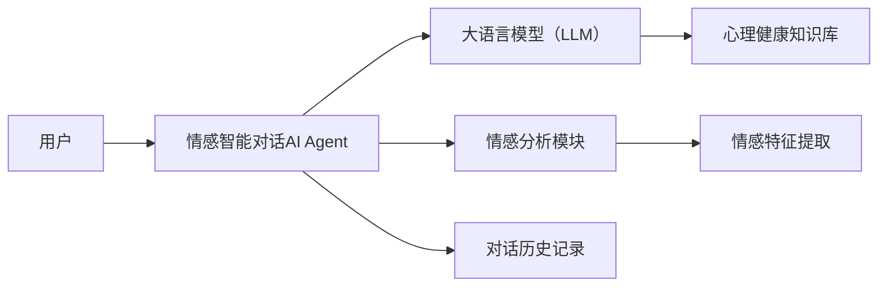
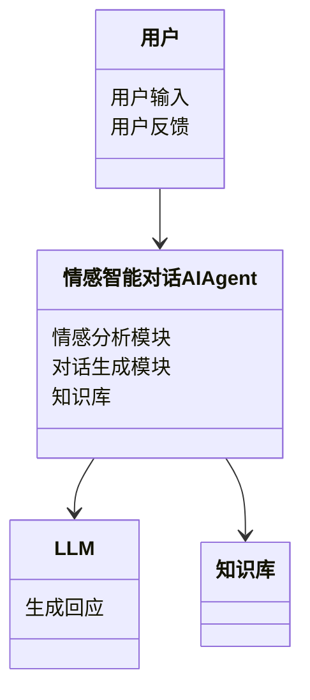
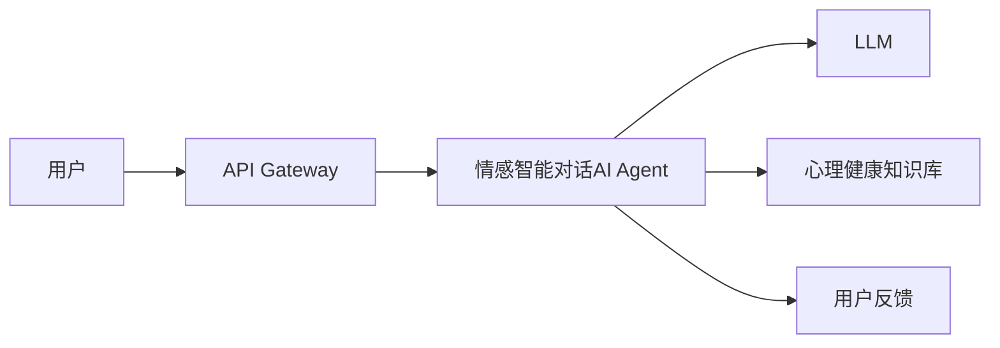
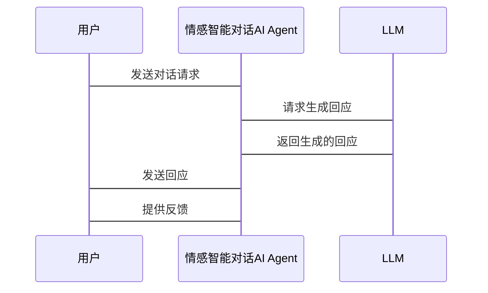

                 


# 情感智能对话AI Agent：LLM驱动的心理健康助手

## 关键词：
情感智能对话、LLM、心理健康助手、大语言模型、AI Agent、情感分析

## 摘要：
本文深入探讨了如何利用大语言模型（LLM）构建情感智能对话AI Agent，以支持心理健康。文章首先分析了情感智能对话的背景、问题背景及核心概念，详细讲解了LLM在情感对话中的算法原理。接着，通过系统分析与架构设计，展示了如何将理论应用于实际系统。最后，通过项目实战和最佳实践，帮助读者掌握情感智能对话AI Agent的设计与实现。

---

## 第一部分: 情感智能对话AI Agent的背景与核心概念

### 第1章: 情感智能对话的背景与问题背景

#### 1.1 情感智能对话的背景
- **1.1.1 从传统对话系统到情感智能对话的演进**  
  传统对话系统依赖于规则和关键词匹配，难以理解用户的情感状态。随着大语言模型（LLM）的发展，情感智能对话逐渐成为可能，能够通过自然语言处理技术识别和回应用户的情感需求。

- **1.1.2 大语言模型（LLM）的崛起与情感智能对话的结合**  
  LLM如GPT-3、GPT-4等具有强大的语言理解和生成能力，可以处理复杂的情感对话，为情感智能对话AI Agent提供了技术基础。

- **1.1.3 心理健康领域对智能对话助手的需求**  
  心理健康问题日益普遍，但专业心理医生资源有限。情感智能对话AI Agent可以提供初步的心理支持，帮助用户缓解情绪压力，为专业治疗提供辅助。

#### 1.2 问题背景与问题描述
- **1.2.1 当前心理健康支持的痛点**  
  - 专业心理医生数量有限，难以满足广泛需求。  
  - 用户可能对心理健康问题缺乏认知，无法及时寻求帮助。  
  - 传统心理咨询方式耗时长、成本高。

- **1.2.2 情感智能对话AI Agent的目标与意义**  
  情感智能对话AI Agent的目标是通过自然语言处理技术，理解用户情感状态，提供情感支持和建议，缓解用户心理压力，降低心理健康问题的发生率。

- **1.2.3 边界与外延：情感智能对话的适用范围与限制**  
  情感智能对话适用于初步心理支持、情绪安抚和信息提供，但不能替代专业心理治疗。其适用范围包括情绪困扰、压力缓解和心理知识普及，而复杂心理问题仍需专业医生处理。

#### 1.3 问题解决与核心要素
- **1.3.1 情感智能对话的核心目标**  
  - 理解用户情感状态。  
  - 提供情感支持和建议。  
  - 帮助用户缓解情绪压力。

- **1.3.2 心理健康助手的功能与价值**  
  - 提供24/7的心理支持。  
  - 帮助用户识别潜在的心理健康问题。  
  - 提供心理知识普及和资源推荐。

- **1.3.3 核心要素与概念结构**  
  情感智能对话AI Agent的核心要素包括：  
  - **情感分析模块**：识别用户情感状态。  
  - **对话生成模块**：根据情感状态生成合适回应。  
  - **知识库**：包含心理健康知识和对话策略。  
  - **用户反馈机制**：优化对话体验。

---

## 第2章: 情感智能对话的核心概念与联系

### 2.1 核心概念原理
- **2.1.1 情感智能对话的定义与特征**  
  情感智能对话是指AI系统通过理解用户的情感状态，生成符合情感需求的对话内容。其特征包括：情感敏感性、对话连贯性和个性化支持。

- **2.1.2 大语言模型（LLM）在情感对话中的作用**  
  LLM通过大规模数据训练，掌握了丰富的语言模式和情感表达，能够生成自然、连贯的对话内容。

- **2.1.3 心理健康支持的智能化实现**  
  情感智能对话AI Agent通过整合LLM和心理健康知识库，为用户提供智能化的心理支持。

### 2.2 核心概念属性对比
| 对比项 | 情感智能对话 | 传统对话系统 |
|-------|--------------|---------------|
| 对话目标 | 情感支持与心理辅导 | 信息查询与任务处理 |
| 技术基础 | 大语言模型（LLM） | 规则引擎与关键词匹配 |
| 适用场景 | 心理健康支持、情绪安抚 | 信息检索、任务执行 |

### 2.3 实体关系图


---

## 第3章: 大语言模型（LLM）驱动情感对话的算法原理

### 3.1 大语言模型的工作原理
- **3.1.1 转换器架构：从输入到输出的流程**  
  LLM通常采用转换器架构（如BERT、GPT），通过多层Transformer结构处理输入文本，生成概率分布的输出。

- **3.1.2 注意力机制：如何理解上下文**  
  注意力机制帮助模型聚焦于重要的上下文信息，提升对话的相关性。

- **3.1.3 情感分析与生成的结合**  
  情感分析模块对用户输入进行情感分类，生成模块根据情感类别生成相应回应。

### 3.2 情感对话生成算法
- **3.2.1 基于LLM的情感对话生成流程**  
  1. 输入文本经过分词和编码。  
  2. 模型生成多个候选回应。  
  3. 根据情感评分选择最优回应。

- **3.2.2 情感评分与对话优化**  
  根据用户反馈优化对话模型，提升情感支持的准确性。

- **3.2.3 情感特征提取与生成**  
  使用情感词典和情感分析模型提取用户情感特征，生成符合情感需求的对话内容。

### 3.3 情感对话生成流程图


---

## 第4章: 数学模型与公式

### 4.1 转换器架构的数学模型
- **编码器部分**  
  $$ \text{编码器} = \text{多层Transformer} $$  
  编码器将输入文本转化为嵌入表示。

- **解码器部分**  
  $$ \text{解码器} = \text{多层Transformer} $$  
  解码器根据编码器输出生成对话回应。

### 4.2 注意力机制的公式
- **注意力计算**  
  $$ \text{注意力权重} = \text{softmax}(\frac{QK^T}{\sqrt{d_k}}) $$  
  其中，Q是查询向量，K是键向量，$d_k$是向量维度。

- **注意力输出**  
  $$ \text{注意力输出} = \sum_{i=1}^{n} \alpha_i v_i $$  
  其中，$\alpha_i$是注意力权重，$v_i$是值向量。

### 4.3 情感分析的损失函数
- **交叉熵损失**  
  $$ \text{损失} = -\sum_{i=1}^{n} y_i \log(p_i) $$  
  其中，$y_i$是真实标签，$p_i$是预测概率。

---

## 第5章: 系统分析与架构设计

### 5.1 系统功能设计


### 5.2 系统架构设计


### 5.3 接口设计与交互流程


---

## 第6章: 项目实战

### 6.1 环境安装
- 安装Python和相关库：  
  ```bash
  pip install numpy pandas transformers
  ```

### 6.2 核心功能实现
```python
import torch
from transformers import GPT2LMHeadModel, GPT2Tokenizer

# 初始化模型和分词器
model = GPT2LMHeadModel.from_pretrained('gpt2')
tokenizer = GPT2Tokenizer.from_pretrained('gpt2')

# 情感分析模块
def get_emotion(text):
    # 示例情感分析逻辑
    if 'sad' in text.lower():
        return 'sad'
    elif 'happy' in text.lower():
        return 'happy'
    else:
        return 'neutral'

# 对话生成模块
def generate_response(text):
    inputs = tokenizer(text, return_tensors='pt')
    outputs = model.generate(inputs.input_ids, max_length=50)
    return tokenizer.decode(outputs[0], skip_special_tokens=True)
```

### 6.3 案例分析与详细解读
- **案例1：用户输入“我感到非常焦虑”**  
  情感分析模块识别出“焦虑”情绪，生成回应：“我能理解你的感受，试着和我聊聊你最近的压力源，看看能不能找到一些解决办法。”

---

## 第7章: 最佳实践与总结

### 7.1 小结
情感智能对话AI Agent通过结合大语言模型和心理健康知识库，为用户提供智能化的心理支持，具有重要的社会价值。

### 7.2 注意事项
- 数据隐私保护。  
- 对复杂心理问题的处理需谨慎。  
- 定期更新知识库和对话策略。

### 7.3 拓展阅读
- 《Large Language Models for Mental Health Support》  
- 《对话系统中的情感分析与生成》

---

## 作者：AI天才研究院/AI Genius Institute & 禅与计算机程序设计艺术 /Zen And The Art of Computer Programming

---

这篇文章系统地探讨了情感智能对话AI Agent的设计与实现，结合了理论与实践，为读者提供了全面的技术指导。

