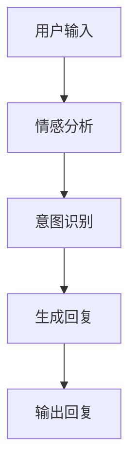
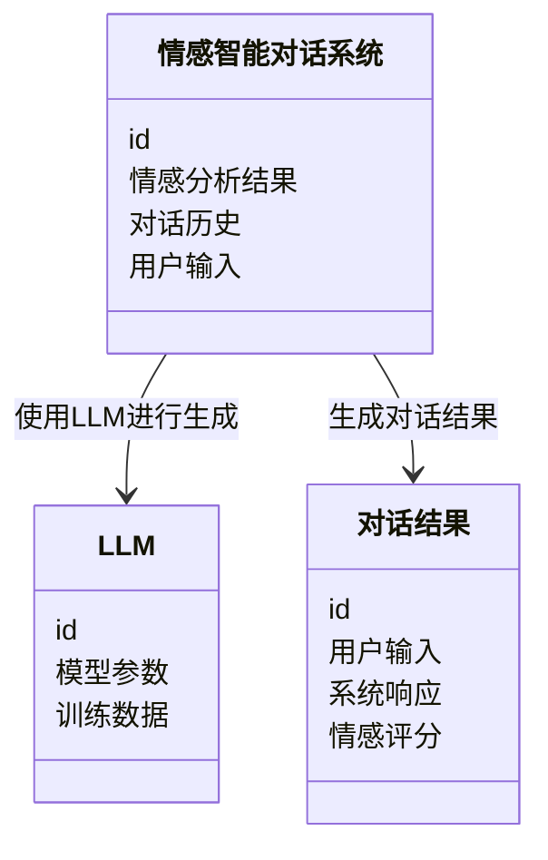
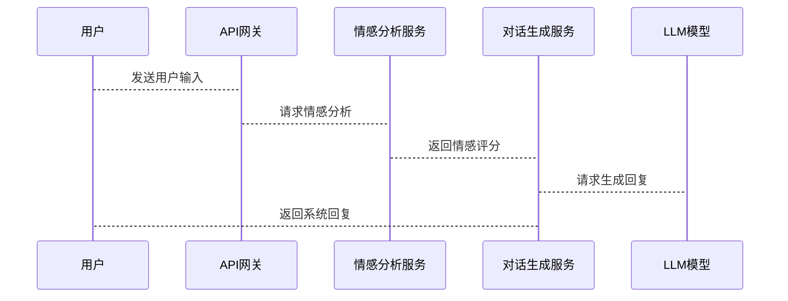

                 


# 情感智能对话系统AI Agent：LLM驱动的深度交互

> 关键词：情感智能对话系统、LLM、深度交互、自然语言处理、对话系统、人工智能

> 摘要：本文探讨了情感智能对话系统AI Agent的构建与实现，重点分析了基于大语言模型（LLM）的深度交互技术。文章从问题背景、核心概念、算法原理、系统设计到项目实战，全面阐述了情感智能对话系统的技术细节与实现方法，为读者提供了一个从理论到实践的完整指南。

---

# 第一部分：情感智能对话系统背景与核心概念

## 第1章：情感智能对话系统的背景与问题背景

### 1.1 情感智能对话系统的定义与特点

#### 1.1.1 情感智能对话系统的定义
情感智能对话系统是一种结合情感分析和自然语言处理技术，能够理解和回应用户情感需求的对话系统。它不仅能够识别用户的情感状态，还能根据情感反馈生成合适的回应。

#### 1.1.2 情感智能对话系统的核心特点
- **情感感知**：能够识别用户输入中的情感倾向（如正面、负面、中性）。
- **深度交互**：基于情感反馈进行上下文关联的对话。
- **个性化回应**：根据用户情感状态生成个性化的回复。

#### 1.1.3 情感智能对话系统的边界与外延
- **边界**：专注于情感交互，不涉及具体任务执行。
- **外延**：可与其他任务结合，如情感支持、心理咨询等。

### 1.2 问题背景与问题描述

#### 1.2.1 当前对话系统的主要挑战
- **情感理解不足**：传统对话系统难以准确识别和回应用户的情感需求。
- **交互深度有限**：对话过程缺乏情感反馈的深度互动。

#### 1.2.2 情感智能对话系统的提出背景
- **用户需求**：用户希望与智能系统进行更自然、更情感化的交流。
- **技术进步**：大语言模型（LLM）的发展为情感智能对话系统的实现提供了技术支撑。

#### 1.2.3 情感智能对话系统的应用场景
- **情感支持**：为用户提供情感支持和安慰。
- **教育辅助**：帮助学生解决学习中的情感问题。
- **商业应用**：提升客户体验，增强用户粘性。

### 1.3 问题解决与核心概念

#### 1.3.1 情感智能对话系统的解决方案
- **情感分析**：识别用户输入中的情感倾向。
- **情感驱动的对话生成**：根据情感反馈生成合适的回复。

#### 1.3.2 情感智能对话系统的核心概念
- **情感分析**：基于文本的情感分类技术。
- **对话生成**：利用LLM生成符合情感需求的回复。

#### 1.3.3 情感智能对话系统与传统对话系统的对比
| 对比维度 | 情感智能对话系统 | 传统对话系统 |
|----------|------------------|---------------|
| 核心目标 | 情感交互          | 信息检索      |
| 技术基础 | LLM             | 基于规则或检索 |
| 交互深度 | 深度情感交互      | 浅层信息交互   |

---

## 第2章：情感智能对话系统的核心概念与联系

### 2.1 情感智能对话系统的核心原理

#### 2.1.1 情感分析的基本原理
- **输入**：用户文本。
- **处理**：通过模型识别情感倾向。
- **输出**：情感评分（如正面、负面、中性）。

#### 2.1.2 对话系统的交互机制
- **输入**：用户文本。
- **处理**：结合情感分析和LLM生成回复。
- **输出**：个性化情感化回复。

#### 2.1.3 情感智能对话系统的整体架构
- **前端**：用户输入和显示。
- **后端**：情感分析和对话生成。
- **模型**：LLM和情感分析模型。

### 2.2 情感智能对话系统与LLM的关系

#### 2.2.1 LLM的基本原理
- **训练数据**：大规模文本数据。
- **模型结构**：基于Transformer的架构。
- **功能**：生成连贯且合理的文本。

#### 2.2.2 情感智能对话系统如何利用LLM
- **情感驱动的生成**：根据情感分析结果，调用LLM生成回复。
- **上下文关联**：利用LLM的上下文理解能力，实现深度对话。

#### 2.2.3 LLM在情感智能对话系统中的作用
- **生成多样性**：提供多样化的回复方式。
- **上下文理解**：理解对话历史，生成连贯的回复。

### 2.3 情感智能对话系统的ER实体关系图

```mermaid
er
    entity 情感智能对话系统 {
        id
        情感分析结果
        对话历史
        用户输入
    }
    entity LLM {
        id
        模型参数
        训练数据
    }
    entity 对话结果 {
        id
        用户输入
        系统响应
        情感评分
    }
    情感智能对话系统 -- LLM: 使用LLM进行生成
    情感智能对话系统 -- 对话结果: 生成对话结果
```

---

## 第3章：情感智能对话系统的算法原理

### 3.1 情感分析算法

#### 3.1.1 基于传统机器学习的情感分析
- **方法**：使用SVM或随机森林等模型。
- **流程**：
  1. 特征提取（如词袋模型）。
  2. 模型训练。
  3. 情感分类。

#### 3.1.2 基于深度学习的情感分析
- **方法**：使用RNN或BERT等模型。
- **流程**：
  1. 词嵌入（如Word2Vec）。
  2. 模型训练。
  3. 情感分类。

#### 3.1.3 基于LLM的情感分析
- **方法**：通过LLM的微调或直接使用API。
- **流程**：
  1. 输入文本到LLM。
  2. 输出情感评分。

### 3.2 对话系统算法

#### 3.2.1 基于规则的对话系统
- **方法**：预设规则生成回复。
- **流程**：
  1. 分析输入。
  2. 匹配规则。
  3. 生成回复。

#### 3.2.2 基于检索的对话系统
- **方法**：从预设库中检索回复。
- **流程**：
  1. 分析输入。
  2. 检索匹配项。
  3. 输出回复。

#### 3.2.3 基于生成的对话系统
- **方法**：利用LLM生成回复。
- **流程**：
  1. 输入文本到LLM。
  2. 生成回复。

### 3.3 情感智能对话系统的算法流程



### 3.4 情感智能对话系统的数学模型

#### 3.4.1 情感分析的数学模型
- **概率分布**：$P(y|x)$，其中$y$是情感类别，$x$是输入文本。
- **损失函数**：交叉熵损失函数：
  $$\mathcal{L} = -\sum_{i=1}^{n} y_i \log p(y_i)$$

#### 3.4.2 对话系统的数学模型
- **生成模型**：基于Transformer的生成模型：
  $$P(y|x) = \prod_{t=1}^{T} P(y_t|y_{<t}, x)$$
- **损失函数**：交叉熵损失：
  $$\mathcal{L} = -\sum_{t=1}^{T} \log P(y_t|y_{<t}, x)$$

---

## 第4章：情感智能对话系统的系统分析与架构设计

### 4.1 系统应用场景

#### 4.1.1 情感智能对话系统的典型应用场景
- **情感支持**：为用户提供情感支持和安慰。
- **教育辅助**：帮助学生解决学习中的情感问题。
- **商业应用**：提升客户体验，增强用户粘性。

### 4.2 系统功能设计

#### 4.2.1 系统功能模块
- **情感分析模块**：识别用户情感倾向。
- **对话生成模块**：根据情感反馈生成回复。
- **用户管理模块**：记录用户信息和对话历史。

#### 4.2.2 领域模型设计



### 4.3 系统架构设计

#### 4.3.1 系统架构图


### 4.4 系统接口设计

#### 4.4.1 API接口
- **输入接口**：用户输入文本。
- **输出接口**：系统生成的回复。

#### 4.4.2 接口交互流程



---

## 第5章：情感智能对话系统的项目实战

### 5.1 环境安装与配置

#### 5.1.1 安装依赖
```bash
pip install transformers
pip install torch
pip install matplotlib
```

### 5.2 系统核心实现

#### 5.2.1 情感分析模块实现

```python
from transformers import pipeline

sentiment_analyzer = pipeline("sentiment-analysis")
def analyze_sentiment(text):
    return sentiment_analyzer(text)[0]['label']
```

#### 5.2.2 对话生成模块实现

```python
from transformers import AutoModelForCausalLM, AutoTokenizer

tokenizer = AutoTokenizer.from_pretrained('gpt2')
model = AutoModelForCausalLM.from_pretrained('gpt2')

def generate_response(text):
    inputs = tokenizer.encode(text, return_tensors='pt')
    outputs = model.generate(inputs, max_length=50)
    return tokenizer.decode(outputs[0], skip_special_tokens=True)
```

### 5.3 代码应用解读与分析

#### 5.3.1 情感分析模块
- **功能**：识别用户输入的情感倾向。
- **实现**：使用Hugging Face的`sentiment-analysis`管道。

#### 5.3.2 对话生成模块
- **功能**：根据情感反馈生成回复。
- **实现**：基于GPT-2模型的文本生成。

### 5.4 实际案例分析

#### 5.4.1 案例1：正面情感对话

**输入**：我今天很高兴！
**输出**：我也为你感到高兴！有什么我可以帮助你的吗？

#### 5.4.2 案例2：负面情感对话

**输入**：我感到很沮丧。
**输出**：我很抱歉你现在感到沮丧。如果你愿意，可以和我聊聊你的感受。

### 5.5 项目小结

- **项目目标**：实现情感智能对话系统的核心功能。
- **项目成果**：完成了情感分析和对话生成模块的实现。
- **项目意义**：为用户提供更智能、更情感化的对话体验。

---

## 第6章：总结与展望

### 6.1 最佳实践 tips
- **数据质量**：确保训练数据的多样性和代表性。
- **模型调优**：根据具体需求调整模型参数。
- **用户反馈**：持续收集用户反馈，优化系统性能。

### 6.2 小结
情感智能对话系统通过结合情感分析和大语言模型，实现了更深度、更情感化的对话交互。本文从理论到实践，全面阐述了情感智能对话系统的构建与实现。

### 6.3 注意事项
- **数据隐私**：确保用户数据的安全性和隐私性。
- **模型性能**：优化模型以提高响应速度和生成质量。

### 6.4 拓展阅读
- **推荐书籍**：《Deep Learning》、《Natural Language Processing with PyTorch》
- **推荐论文**：《Attention Is All You Need》、《BERT: Pre-training of Deep Bidirectional Transformers for NLP》

---

## 附录

### 附录A：工具安装指南
```bash
pip install transformers
pip install torch
pip install matplotlib
```

### 附录B：参考文献
1. Vaswani, A., et al. "Attention Is All You Need." arXiv, 2017.
2. Devlin, J., et al. "BERT: Pre-training of Deep Bidirectional Transformers for NLP." arXiv, 2018.

---

作者：AI天才研究院/AI Genius Institute & 禅与计算机程序设计艺术 /Zen And The Art of Computer Programming

