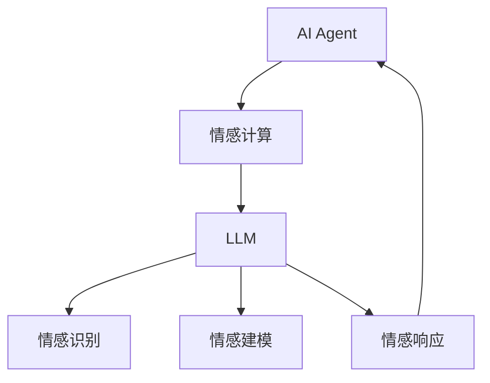
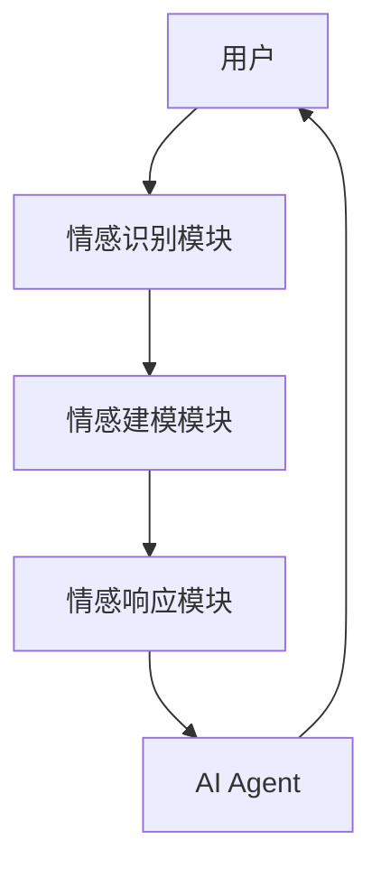
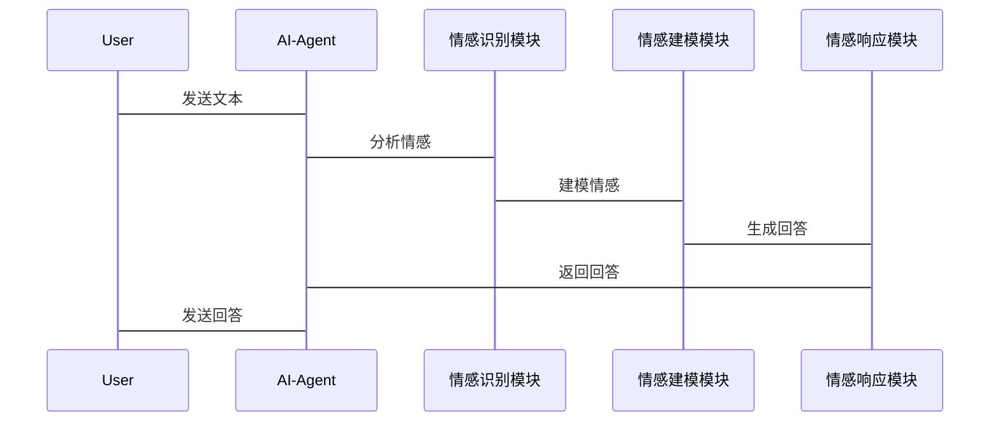

                 


# 情感计算在AI Agent中的应用：增强LLM的EQ

**关键词：** 情感计算、AI Agent、LLM、EQ、人机交互、机器学习、自然语言处理

**摘要：** 情感计算（Affective Computing）是指计算机系统理解和处理人类情感的能力，而AI Agent（人工智能代理）是能够在特定环境中感知并自主行动以实现目标的智能体。本文将探讨情感计算在AI Agent中的应用，特别是如何通过情感计算增强大型语言模型（LLM）的情感商数（EQ），从而提升人机交互的自然性和用户体验。文章从背景介绍、核心概念、算法原理、系统架构、项目实战到最佳实践等方面展开，深入分析情感计算与AI Agent的结合，帮助读者全面理解并掌握相关技术。

---

## 第一部分：背景与基础

### 第1章：情感计算与AI Agent概述

#### 1.1 情感计算的基本概念
情感计算是一种新兴的计算范式，旨在使计算机能够理解和回应人类情感。它涉及从面部表情、语音语调、文字表达中提取情感信息，并通过算法进行分析和建模。

- **1.1.1 情感计算的定义**
  - 情感计算关注人类情感的识别、理解和响应，旨在增强计算机与人类的交互体验。
  - 与传统计算不同，情感计算不仅处理数据，还关注数据背后的情感含义。

- **1.1.2 情感计算的核心要素**
  - 情感识别：通过自然语言处理（NLP）、语音分析和计算机视觉技术，识别用户的情感状态。
  - 情感建模：将情感状态转化为可计算的数学模型，例如情感强度、情感类型（如快乐、愤怒、悲伤）。
  - 情感响应：根据情感状态生成相应的反馈，例如调整语气、提供情感支持。

- **1.1.3 情感计算的应用领域**
  - 健康医疗：用于情绪监测和心理健康支持。
  - 教育：用于个性化教学和学生情绪管理。
  - 娱乐：用于情感化的人机交互设计。
  - 电子商务：用于用户体验优化和情感驱动的推荐系统。

#### 1.2 AI Agent的基本概念
AI Agent是一种能够感知环境、自主决策并执行任务的智能体。它可以存在于各种形式，如虚拟助手、聊天机器人、自动驾驶系统等。

- **1.2.1 AI Agent的定义**
  - AI Agent是一个智能实体，能够在动态和不确定的环境中感知、推理、规划和行动，以实现特定目标。
  - AI Agent可以分为简单反射型、基于模型的反应型、基于目标的规划型和基于效用的推理型。

- **1.2.2 AI Agent的分类**
  - **反应型AI Agent**：基于当前感知做出反应，没有内部状态。
  - **目标驱动型AI Agent**：具有明确的目标，并通过规划实现目标。
  - **效用驱动型AI Agent**：通过最大化效用函数来做出决策。
  - **学习型AI Agent**：通过机器学习不断优化自身行为。

- **1.2.3 AI Agent的核心功能**
  - 感知环境：通过传感器或数据输入感知外部环境。
  - 决策与推理：基于感知信息和内部状态做出决策。
  - 行动执行：通过执行器或输出模块完成任务。
  - 学习与适应：通过反馈和经验优化自身行为。

#### 1.3 情感计算在AI Agent中的应用价值
将情感计算应用于AI Agent中，可以显著提升人机交互的自然性和用户体验。

- **1.3.1 提高人机交互的自然性**
  - 通过情感计算，AI Agent能够理解用户的情感状态，并以更自然的方式进行交互。
  - 例如，在对话中，AI Agent可以根据用户的语气和情感调整回答的语气和内容。

- **1.3.2 增强AI Agent的情境理解能力**
  - 情感计算使AI Agent能够理解用户的情感需求，从而更好地适应情境。
  - 例如，在医疗领域，AI Agent可以通过情感计算帮助医生更好地理解患者的情绪状态，提供更个性化的医疗建议。

- **1.3.3 提升用户体验**
  - 通过情感计算，AI Agent能够提供更贴心和个性化的服务，增强用户的满意度和忠诚度。

#### 1.4 情感计算与LLM的结合
大型语言模型（LLM）是情感计算与AI Agent结合的重要工具。

- **1.4.1 LLM的基本原理**
  - LLM通过深度学习技术（如Transformer架构）训练大规模语料库，能够生成自然语言文本。
  - LLM的核心能力包括文本生成、问答、摘要、情感分析等。

- **1.4.2 LLM在情感计算中的优势**
  - LLM具有强大的自然语言处理能力，能够理解和生成复杂的情感表达。
  - LLM可以通过微调（fine-tuning）任务特定的情感数据，进一步提升情感计算的准确性。

- **1.4.3 情感计算如何增强LLM的EQ**
  - EQ（情感商数）是指个体识别、理解和管理自己及他人情感的能力。
  - 通过情感计算，LLM可以增强其EQ，从而更好地理解用户的情感需求，并生成更贴切的情感化回答。

#### 1.5 本章小结
本章介绍了情感计算和AI Agent的基本概念，并探讨了情感计算在AI Agent中的应用价值，特别是如何通过情感计算增强LLM的EQ。下一章将深入分析情感计算与AI Agent的核心原理和它们之间的联系。

---

## 第二部分：核心概念与联系

### 第2章：情感计算与AI Agent的核心原理

#### 2.1 情感计算的核心原理
情感计算的核心是通过多模态数据（文本、语音、图像）识别和建模人类情感。

- **2.1.1 情感识别**
  - 文本情感识别：通过NLP技术分析文本中的情感倾向。
  - 语音情感识别：通过语音特征（如语调、音量、语速）识别情感。
  - 面部表情识别：通过计算机视觉技术分析面部表情。

- **2.1.2 情感建模**
  - 情感强度：量化情感的强烈程度。
  - 情感类型：分类情感类别，如快乐、愤怒、悲伤、惊讶等。
  - 情感状态序列：分析情感随时间的变化趋势。

- **2.1.3 情感响应**
  - 基于情感状态生成相应的反馈，例如调整语气、提供情感支持。

#### 2.2 AI Agent的核心原理
AI Agent通过感知、推理和行动实现目标。

- **2.2.1 感知环境**
  - 通过传感器或数据输入感知环境。
  - 例如，在自然语言处理任务中，AI Agent通过输入文本感知用户的需求。

- **2.2.2 决策与推理**
  - 基于感知信息和内部状态做出决策。
  - 例如，AI Agent可以根据用户的情感状态和对话历史，选择合适的回复策略。

- **2.2.3 行动执行**
  - 通过执行器或输出模块完成任务。
  - 例如，AI Agent可以通过生成文本或执行外部命令来实现目标。

#### 2.3 情感计算与AI Agent的关系
情感计算为AI Agent提供了情感理解能力，使其能够更自然地与人类交互。

- **2.3.1 情感计算为AI Agent提供情感理解能力**
  - 情感计算使AI Agent能够识别和理解用户的情感状态。
  - 例如，在对话中，AI Agent可以通过情感计算调整回答的语气和内容，以匹配用户的情感需求。

- **2.3.2 AI Agent为情感计算提供应用场景**
  - AI Agent为情感计算提供了丰富的应用场景，例如智能客服、情感支持机器人等。
  - 例如，在智能客服中，AI Agent可以通过情感计算理解用户的不满情绪，并提供更贴心的解决方案。

#### 2.4 情感计算与AI Agent的核心要素对比
以下是情感计算与AI Agent的核心要素对比表：

| **核心要素** | **情感计算** | **AI Agent** |
|--------------|--------------|--------------|
| 输入数据     | 文本、语音、图像 | 多模态数据、环境信息 |
| 输出结果     | 情感状态、情感强度 | 动作、决策 |
| 核心能力     | 情感识别、建模 | 感知、推理、决策 |
| 应用场景     | 情感支持、情感分析 | 人机交互、智能决策 |

#### 2.5 情感计算与AI Agent的实体关系图



#### 2.6 本章小结
本章分析了情感计算与AI Agent的核心原理，并通过对比和实体关系图展示了它们之间的关系。下一章将深入探讨情感计算与AI Agent的算法原理，包括数学模型和公式。

---

## 第三部分：算法原理讲解

### 第3章：情感计算与AI Agent的算法原理

#### 3.1 情感计算的算法原理
情感计算涉及多模态数据的处理和情感建模。

- **3.1.1 文本情感识别算法**
  - 基于词袋模型（Bag-of-Words）或词嵌入（Word Embedding）的文本表示。
  - 使用机器学习模型（如SVM、随机森林、深度学习模型）进行情感分类。

- **3.1.2 情感建模算法**
  - 情感强度预测：使用回归模型（如线性回归、神经网络）预测情感强度。
  - 情感类型分类：使用分类模型（如朴素贝叶斯、SVM、神经网络）分类情感类型。

- **3.1.3 情感响应算法**
  - 基于情感状态生成相应的反馈，例如调整语气、提供情感支持。

#### 3.2 AI Agent的算法原理
AI Agent的核心算法包括感知、推理和行动。

- **3.2.1 感知算法**
  - 数据采集与预处理：从多模态数据中提取有用信息。
  - 数据融合：将文本、语音、图像等多种数据进行融合，提高感知精度。

- **3.2.2 推理算法**
  - 知识表示：使用知识图谱或符号逻辑表示知识。
  - 推理方法：基于逻辑推理、概率推理或深度学习进行推理。

- **3.2.3 决策算法**
  - 基于Q-learning、DQN等强化学习算法进行决策优化。
  - 基于效用函数的决策：通过最大化效用函数选择最优行动。

#### 3.3 情感计算与AI Agent的联合算法
将情感计算与AI Agent结合，可以实现情感驱动的智能交互。

- **3.3.1 情感驱动的决策算法**
  - 将情感状态作为决策的重要因素，例如在对话中根据用户的情感状态选择合适的回复策略。

- **3.3.2 情感增强的推理算法**
  - 在推理过程中考虑情感因素，例如在医疗领域，AI Agent可以根据患者的情感状态调整医疗建议。

#### 3.4 算法实现的Python代码示例
以下是一个基于情感计算的AI Agent实现示例：

```python
import numpy as np
from sklearn.svm import SVC
from sklearn.feature_extraction.text import TfidfVectorizer

# 情感计算部分
def text_preprocessing(text):
    # 文本预处理：分词、去除停用词等
    pass

def get_emotion(text):
    # 使用SVM进行情感分类
    vectorizer = TfidfVectorizer()
    X = vectorizer.fit_transform([text])
    clf = SVC()
    clf.fit(X, ['positive', 'negative', 'neutral'])
    return clf.predict(X)[0]

# AI Agent部分
class AI-Agent:
    def __init__(self):
        self.emotion_detector = get_emotion()

    def perceive(self, input):
        # 感知环境
        return self.emotion_detector(input)

    def decide(self, emotion):
        # 根据情感状态做出决策
        if emotion == 'positive':
            return '回应积极'
        elif emotion == 'negative':
            return '提供支持'
        else:
            return '保持中立'

    def act(self, decision):
        # 执行行动
        return f'根据决策{decision}采取行动'

# 示例应用
agent = AI-Agent()
emotion = agent.perceive("我今天心情不好")
decision = agent.decide(emotion)
action = agent.act(decision)
print(action)
```

#### 3.5 本章小结
本章详细讲解了情感计算和AI Agent的算法原理，并通过代码示例展示了情感计算与AI Agent的结合实现。下一章将从系统架构的角度分析情感计算与AI Agent的结合设计。

---

## 第四部分：系统分析与架构设计方案

### 第4章：情感计算与AI Agent的系统架构

#### 4.1 问题场景介绍
本章将分析一个具体的场景，例如一个基于情感计算的智能对话系统。

- **4.1.1 问题描述**
  - 用户与AI Agent进行对话交互。
  - 用户可能表达情感需求，例如愤怒、快乐、悲伤等。

- **4.1.2 问题解决**
  - AI Agent需要通过情感计算识别用户情感，并根据情感状态生成合适的回答。

- **4.1.3 边界与外延**
  - 系统边界：仅考虑文本交互，不涉及语音或图像。
  - 外延：情感计算与AI Agent的结合可以扩展到其他模态，例如语音和图像。

#### 4.2 系统功能设计

- **4.2.1 领域模型设计**
  - 用户：输入文本，表达情感需求。
  - AI Agent：感知用户情感，生成情感化回答。

- **4.2.2 系统功能模块**
  - 情感识别模块：识别用户情感状态。
  - 情感建模模块：建模情感状态。
  - 情感响应模块：生成情感化回答。

#### 4.3 系统架构设计



#### 4.4 系统接口设计
- **输入接口**：文本输入。
- **输出接口**：文本输出。

#### 4.5 系统交互设计



#### 4.6 本章小结
本章从系统架构的角度分析了情感计算与AI Agent的结合设计，展示了如何通过模块化设计实现情感驱动的智能交互。

---

## 第五部分：项目实战

### 第5章：情感计算与AI Agent的项目实战

#### 5.1 项目介绍
本章将通过一个具体的项目案例，展示如何将情感计算应用于AI Agent的设计和实现。

- **5.1.1 项目目标**
  - 实现一个基于情感计算的智能对话系统。
  - 使AI Agent能够识别用户情感，并生成情感化回答。

- **5.1.2 项目需求**
  - 支持文本输入和输出。
  - 实现情感识别和情感建模。
  - 生成情感化回答。

#### 5.2 系统核心实现
以下是系统的核心代码实现：

```python
class EmotionDetector:
    def __init__(self):
        self.vectorizer = TfidfVectorizer()
        self.classifier = SVC()

    def train(self, texts, labels):
        X = self.vectorizer.fit_transform(texts)
        self.classifier.fit(X, labels)

    def predict(self, text):
        X = self.vectorizer.transform([text])
        return self.classifier.predict(X)[0]

class AI-Agent:
    def __init__(self):
        self.emotion_detector = EmotionDetector()

    def train_emotion_detector(self, texts, labels):
        self.emotion_detector.train(texts, labels)

    def perceive(self, text):
        return self.emotion_detector.predict(text)

    def decide(self, emotion):
        if emotion == 'positive':
            return '回应积极'
        elif emotion == 'negative':
            return '提供支持'
        else:
            return '保持中立'

    def act(self, decision):
        return f'根据决策{decision}采取行动'

# 示例训练数据
texts = ["我今天很高兴", "我感到很愤怒", "我有点悲伤"]
labels = ['positive', 'negative', 'neutral']
agent = AI-Agent()
agent.train_emotion_detector(texts, labels)

# 示例对话
user_input = "我今天心情不好"
emotion = agent.perceive(user_input)
decision = agent.decide(emotion)
action = agent.act(decision)
print(action)
```

#### 5.3 代码应用解读与分析
- **EmotionDetector类**：实现情感识别功能，使用TfidfVectorizer进行文本特征提取，使用SVM进行情感分类。
- **AI-Agent类**：实现AI Agent的核心功能，包括情感感知、决策和行动。

#### 5.4 案例分析
以下是一个具体的案例分析：

- **用户输入**：我今天心情不好
- **情感识别**：用户情感为“negative”
- **决策**：提供支持
- **行动**：生成情感支持的回复，例如“我很理解你的感受，有什么我可以帮助你的吗？”

#### 5.5 本章小结
本章通过一个具体的项目案例，展示了如何将情感计算应用于AI Agent的设计和实现。通过代码实现和案例分析，帮助读者更好地理解情感计算与AI Agent的结合。

---

## 第六部分：最佳实践

### 第6章：情感计算与AI Agent的最佳实践

#### 6.1 实践总结
- **情感计算与AI Agent的结合可以显著提升人机交互的自然性和用户体验。**
- **在实际应用中，需要根据具体场景选择合适的情感计算技术。**

#### 6.2 实践中的注意事项
- **数据质量**：情感计算依赖于高质量的训练数据，建议使用标注数据进行模型训练。
- **模型可解释性**：情感计算模型的可解释性对于用户体验至关重要，建议选择可解释性较高的模型。
- **隐私与伦理**：情感计算涉及个人情感数据的处理，需注意隐私保护和伦理问题。

#### 6.3 拓展阅读
- 建议读者阅读以下资料，以进一步深入了解情感计算和AI Agent的相关技术：
  - 知识图谱与智能问答
  - 强化学习与智能决策
  - 多模态数据处理与情感计算

#### 6.4 本章小结
本章总结了情感计算与AI Agent结合的最佳实践，并提出了实际应用中的注意事项和进一步学习的方向。

---

## 第七部分：小结

### 第7章：总结与展望

#### 7.1 全文总结
本文详细探讨了情感计算在AI Agent中的应用，特别是如何通过情感计算增强大型语言模型（LLM）的情感商数（EQ）。文章从背景介绍、核心概念、算法原理、系统架构、项目实战到最佳实践等方面展开，全面分析了情感计算与AI Agent的结合。

#### 7.2 未来展望
随着人工智能技术的不断发展，情感计算与AI Agent的结合将更加紧密。未来的研究方向包括：

- **多模态情感计算**：结合文本、语音、图像等多种模态数据，提升情感识别的准确性。
- **情感增强的对话系统**：通过情感计算实现更自然、更智能的对话交互。
- **情感驱动的智能决策**：将情感计算应用于复杂决策场景，例如医疗、金融等领域。

---

## 作者信息

**作者：** AI天才研究院/AI Genius Institute & 禅与计算机程序设计艺术/Zen And The Art of Computer Programming

---

**感谢您的阅读！**

