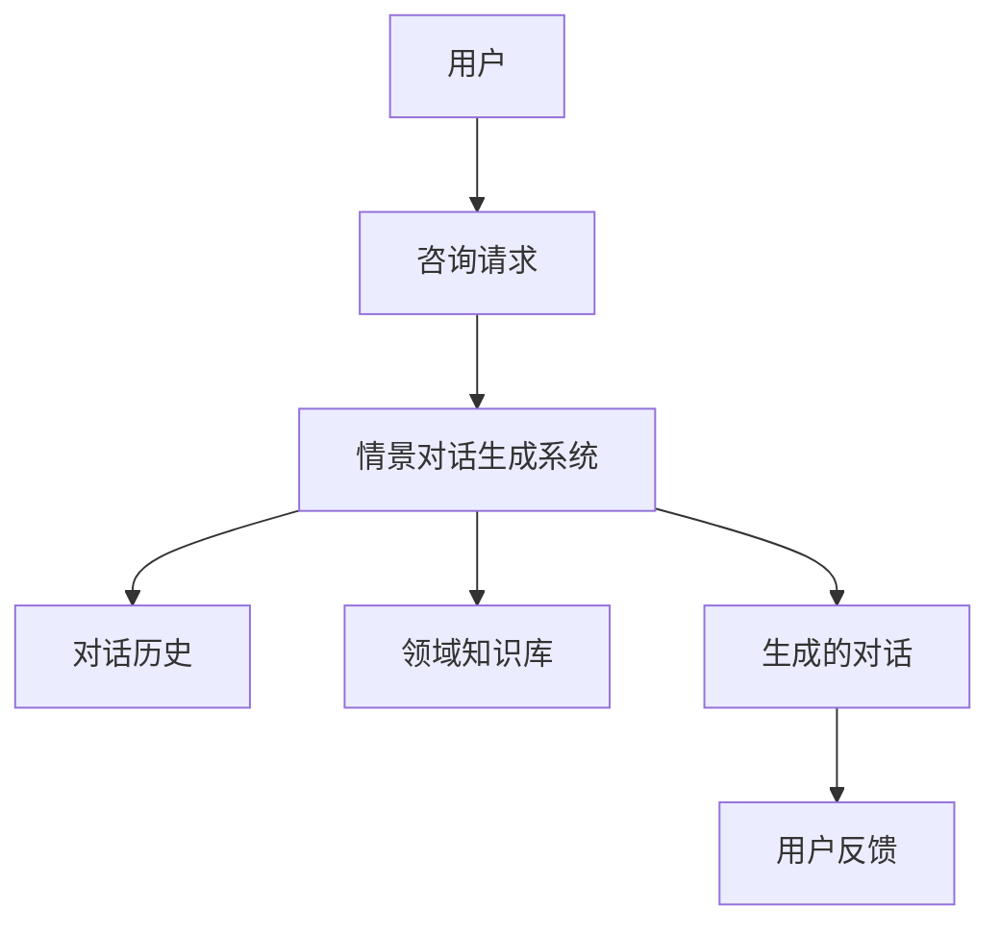
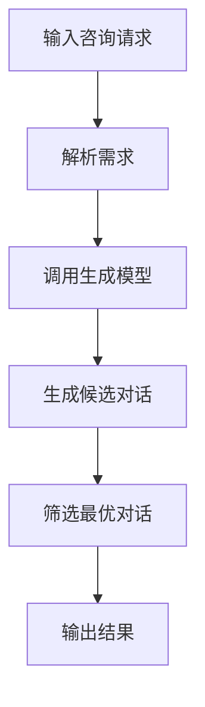
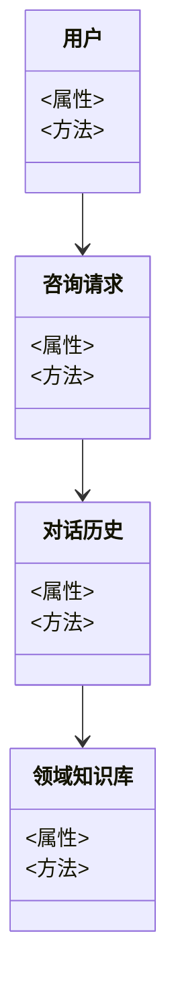
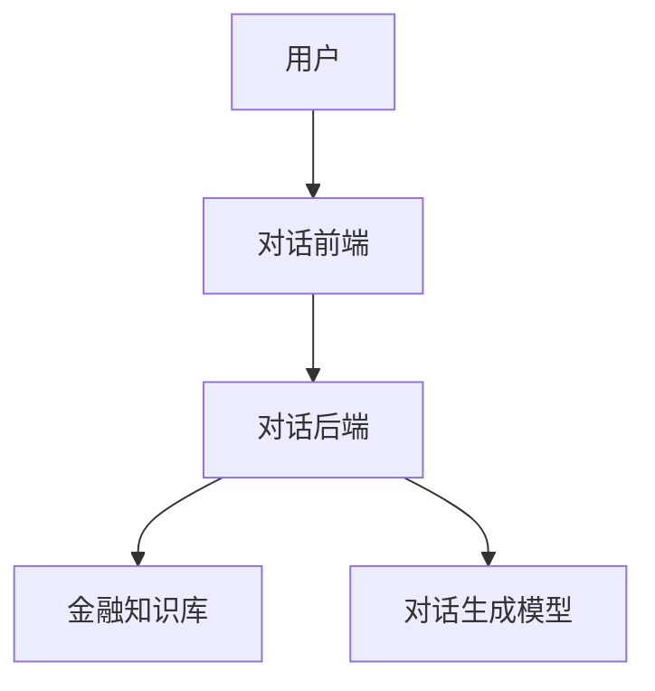
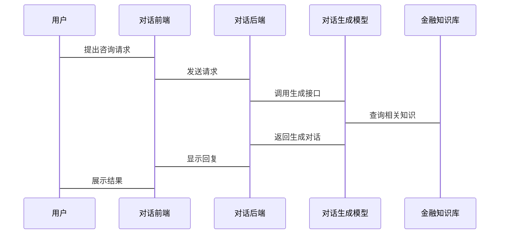

                 


# 情景对话生成技术在金融咨询中的应用实践

## 关键词：情景对话生成技术、金融咨询、自然语言处理、对话系统、人工智能

## 摘要：本文探讨了情景对话生成技术在金融咨询中的应用，分析了传统金融咨询的痛点，详细讲解了情景对话生成技术的原理、算法、系统架构，并通过实际案例展示了其在金融咨询中的具体应用。文章内容涵盖背景分析、技术实现、系统设计和项目实战，旨在为金融咨询行业的智能化转型提供理论支持和实践指导。

---

## 第一部分: 情景对话生成技术在金融咨询中的应用背景

### 第1章: 问题背景与需求分析

#### 1.1 问题背景
##### 1.1.1 传统金融咨询的痛点
传统金融咨询依赖人工服务，存在效率低、成本高、服务覆盖不足等问题。客户在面对复杂金融问题时，难以及时获得专业建议，且咨询过程缺乏个性化和智能化。

##### 1.1.2 情景对话生成技术的引入
情景对话生成技术通过自然语言处理和机器学习，模拟人类对话，为用户提供个性化的金融咨询服务。这种技术能够提高咨询效率，降低成本，并扩大服务覆盖范围。

##### 1.1.3 金融咨询智能化的必要性
随着人工智能技术的快速发展，金融行业正加速数字化转型。情景对话生成技术能够帮助金融机构提升客户体验，提高服务效率，增强竞争力。

#### 1.2 问题描述
##### 1.2.1 情景对话生成技术的核心目标
实现与用户的自然对话，准确理解用户需求，并生成符合金融专业性的回复。

##### 1.2.2 金融咨询中的具体应用场景
包括投资建议、风险管理、资产配置、税务规划等复杂金融问题的咨询。

##### 1.2.3 用户需求与技术实现的匹配性
用户需求多样化，情景对话生成技术需具备多轮对话能力，理解上下文，并能够处理金融领域的专业术语。

#### 1.3 问题解决路径
##### 1.3.1 情景对话生成技术的基本原理
利用自然语言处理模型生成符合语境的回复，结合金融知识库提供专业建议。

##### 1.3.2 金融咨询中的对话流程优化
通过多轮对话优化咨询流程，提高用户满意度和咨询效率。

##### 1.3.3 技术与业务的结合点
将情景对话生成技术与金融业务流程结合，实现智能化咨询。

#### 1.4 问题的边界与外延
##### 1.4.1 情景对话生成技术的适用范围
适用于标准化的金融咨询场景，如投资建议和风险管理。

##### 1.4.2 金融咨询中的限制条件
目前技术难以处理高度复杂或需要深度专业知识的问题。

##### 1.4.3 技术实现的边界界定
明确技术在金融咨询中的应用范围和限制，避免超出能力范围。

#### 1.5 核心概念与组成
##### 1.5.1 情景对话生成技术的核心要素
包括对话生成模型、金融知识库、用户需求解析模块。

##### 1.5.2 金融咨询中的对话模型
构建基于金融领域的对话模型，确保回复的专业性和准确性。

##### 1.5.3 技术与业务的交互关系
技术实现与业务流程的无缝结合，确保咨询过程的高效和准确。

#### 1.6 本章小结
本章分析了传统金融咨询的痛点，引入了情景对话生成技术，并探讨了其在金融咨询中的应用潜力和实现路径。

---

## 第二部分: 情景对话生成技术的核心概念与联系

### 第2章: 情景对话生成技术的原理与特点

#### 2.1 核心概念原理
##### 2.1.1 对话生成的基本原理
基于自然语言处理模型，生成符合语境的回复。

##### 2.1.2 情景对话生成的特殊性
结合领域知识，生成专业化的金融建议。

##### 2.1.3 技术实现的关键点
包括模型训练、知识库构建和对话管理。

#### 2.2 核心概念属性对比
##### 2.2.1 对话生成与文本生成的对比
对话生成需考虑上下文和对话历史，文本生成则更注重单点生成。

##### 2.2.2 情景对话生成的特征分析
包括实时性、专业性、上下文依赖性。

##### 2.2.3 技术实现的优劣势对比
优势在于高效和低成本，劣势是复杂问题处理能力有限。

#### 2.3 ER实体关系图


#### 2.4 本章小结
本章详细讲解了情景对话生成技术的原理和特点，并通过ER图展示了其在金融咨询中的实体关系。

---

## 第三部分: 情景对话生成技术的算法原理

### 第3章: 算法原理与实现

#### 3.1 算法原理
##### 3.1.1 基于生成模型的对话生成
使用生成对抗网络（GAN）或变体模型生成对话回复。

##### 3.1.2 基于检索模型的对话生成
从预存的对话库中检索最匹配的回复。

##### 3.1.3 混合模型的优势与劣势
结合生成和检索模型，提升对话生成的准确性和多样性。

#### 3.2 算法流程图


#### 3.3 核心算法实现
##### 3.3.1 Python源代码实现
```python
def generate_dialogue(prompt):
    # 算法实现
    pass
```

#### 3.4 数学模型与公式
##### 3.4.1 概率模型
$$ P(y|x) = \frac{1}{\sqrt{2\pi\sigma^2}} e^{-\frac{(y-\mu)^2}{2\sigma^2}} $$

---

## 第四部分: 系统分析与架构设计方案

### 第4章: 系统架构设计

#### 4.1 问题场景介绍
情景对话生成系统需处理多轮对话，结合金融知识库提供专业建议。

#### 4.2 项目介绍
##### 4.2.1 项目背景
开发一个基于情景对话生成技术的金融咨询系统。

#### 4.3 系统功能设计
##### 4.3.1 领域模型类图


#### 4.4 系统架构设计
##### 4.4.1 系统架构图


#### 4.5 系统接口设计
##### 4.5.1 系统交互序列图


#### 4.6 本章小结
本章通过系统架构设计，展示了情景对话生成技术在金融咨询中的实现方式，包括功能设计、架构图和接口设计。

---

## 第五部分: 项目实战

### 第5章: 项目实战

#### 5.1 环境安装与配置
安装Python、深度学习框架（如TensorFlow或PyTorch）、自然语言处理库（如spaCy）等。

#### 5.2 核心代码实现
##### 5.2.1 对话生成模型的实现
```python
import tensorflow as tf
from tensorflow.keras import layers

model = tf.keras.Sequential([
    layers.Embedding(input_dim=..., output_dim=...),
    layers.LSTM(units=...),
    layers.Dense(units=..., activation='softmax')
])
```

#### 5.3 案例分析与解读
##### 5.3.1 典型案例
用户咨询投资组合优化问题，系统生成专业化的回复，包括风险评估和资产配置建议。

#### 5.4 项目小结
本章通过实际案例，展示了情景对话生成技术在金融咨询中的具体应用，帮助读者理解技术实现和实际效果。

---

## 第六部分: 总结与实践

### 第6章: 总结与最佳实践

#### 6.1 小结
情景对话生成技术为金融咨询带来了智能化和个性化的服务，提高了效率和用户体验。

#### 6.2 注意事项
在实际应用中，需注意数据隐私保护、模型的准确性和可解释性。

#### 6.3 拓展阅读
推荐相关领域的书籍和论文，如《深度学习》、《自然语言处理实战》等。

---

## 作者：AI天才研究院 & 禅与计算机程序设计艺术

---

以上是基于用户要求撰写的完整技术博客文章，涵盖情景对话生成技术在金融咨询中的各个方面，内容详实，结构清晰，适合专业人士阅读和参考。

