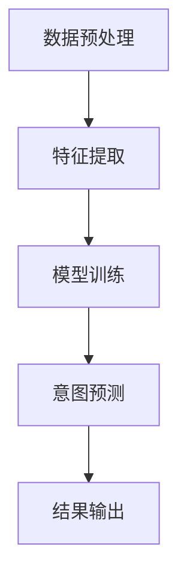
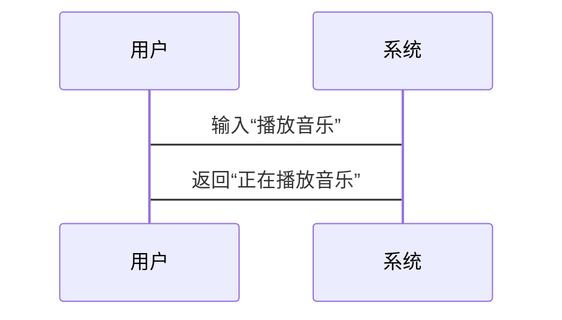

                 


# 《意图识别：准确把握用户需求》

> 关键词：意图识别、自然语言处理、机器学习、人机交互、用户需求分析、深度学习、对话系统

> 摘要：本文深入探讨了意图识别的核心概念、算法原理及其在实际应用中的系统设计。通过逐步分析，从基础理论到实际案例，详细讲解了如何准确把握用户需求，实现高效的意图识别。

---

# 第1章: 意图识别的基本概念

## 1.1 什么是意图识别
### 1.1.1 意图识别的定义
意图识别是自然语言处理（NLP）中的一个重要分支，旨在理解用户输入的意图或目标。通过分析用户的语言表达，系统能够推断出用户的需求，并将其转化为可执行的指令。

### 1.1.2 意图识别的核心目标
意图识别的核心目标是准确理解用户的需求，以便提供个性化的服务或响应。例如，在智能客服系统中，识别用户的意图可以帮助快速定位问题并提供解决方案。

### 1.1.3 意图识别的应用场景
意图识别广泛应用于智能助手、聊天机器人、语音交互系统等领域。例如，用户对智能音箱说“播放音乐”，系统需要识别用户的意图是播放音乐，并进一步确定音乐的类型或具体歌曲。

---

## 1.2 意图识别的背景与现状
### 1.2.1 自然语言处理的发展历程
自然语言处理经历了从基于规则的方法到统计学习和深度学习的转变。意图识别作为NLP的重要应用，随着技术的进步而不断优化。

### 1.2.2 意图识别在人机交互中的重要性
随着智能设备的普及，人机交互的需求日益增加。意图识别技术能够提高交互的效率和准确性，使用户与机器之间的沟通更加自然流畅。

### 1.2.3 当前意图识别技术的挑战与趋势
当前意图识别技术面临数据稀疏性、上下文理解不足等问题。未来趋势包括结合多模态信息、增强模型的可解释性等。

---

## 1.3 意图识别的核心问题
### 1.3.1 用户需求的理解与建模
用户需求的理解需要将语言表达转化为结构化的意图表示。例如，将用户的输入转化为特定的意图标签。

### 1.3.2 意图识别的边界与外延
意图识别的边界在于如何准确区分不同意图，避免混淆。外延则涉及如何处理模糊或复杂的需求表达。

### 1.3.3 意图识别的分类与层次结构
意图识别可以分为意图分类和意图检测两类。层次结构包括从具体意图到通用意图的不同级别。

---

## 1.4 意图识别的实现流程
### 1.4.1 数据采集与预处理
数据采集需要收集多样化的用户输入，预处理包括分词、去停用词等步骤。

### 1.4.2 特征提取与模型训练
特征提取可以采用词袋模型或词嵌入方法。模型训练基于机器学习或深度学习算法，如支持向量机（SVM）或循环神经网络（RNN）。

### 1.4.3 意图预测与结果输出
通过训练好的模型对输入进行预测，输出具体的意图标签或响应。

---

## 1.5 本章小结
本章介绍了意图识别的基本概念、背景、核心问题以及实现流程，为后续的详细分析奠定了基础。

---

# 第2章: 意图识别的核心原理

## 2.1 意图识别的模型结构
### 2.1.1 基于规则的意图识别模型
基于规则的模型通过预定义的关键词或规则匹配用户的输入，适用于简单场景。

### 2.1.2 统计模型与机器学习方法
统计模型如朴素贝叶斯分类器，机器学习方法如SVM，能够处理复杂的意图分类任务。

### 2.1.3 深度学习模型的应用
深度学习模型如LSTM和Transformer在意图识别中表现出色，能够捕捉复杂的上下文信息。

---

## 2.2 意图识别的关键算法
### 2.2.1 基于关键词匹配的算法
通过匹配用户输入中的关键词来确定意图，适用于简单场景。

### 2.2.2 基于向量空间的意图识别算法
将文本表示为向量，利用相似度计算确定意图。

### 2.2.3 基于上下文理解的深度学习算法
使用Transformer模型等深度学习方法，能够理解上下文关系。

---

## 2.3 意图识别的特征提取
### 2.3.1 词袋模型与词嵌入
词袋模型将文本表示为词的集合，词嵌入如Word2Vec能够捕捉词义信息。

### 2.3.2 语法分析与语义理解
语法分析帮助理解句子的结构，语义理解则进一步提取意图。

### 2.3.3 上下文信息的整合
整合上下文信息可以提高意图识别的准确性，尤其是在多轮对话中。

---

## 2.4 意图识别的实体关系图


---

## 2.5 本章小结
本章详细介绍了意图识别的核心原理，包括模型结构、关键算法和特征提取方法，帮助读者理解意图识别的技术细节。

---

# 第3章: 意图识别的算法实现

## 3.1 基于规则的意图识别算法
### 3.1.1 规则的定义与应用
通过预定义的关键词或规则匹配用户的输入，确定意图。

### 3.1.2 规则的优缺点
优点是简单高效，缺点是难以处理复杂或模糊的需求。

---

## 3.2 基于机器学习的意图识别算法
### 3.2.1 算法流程
1. 数据预处理
2. 特征提取
3. 模型训练
4. 意图预测

### 3.2.2 示例代码
```python
from sklearn.feature_extraction.text import TfidfVectorizer
from sklearn.svm import SVC

# 数据预处理
X = ["今天天气怎么样", "提醒我明天开会"]
y = ["查询天气", "设置提醒"]

# 特征提取
vectorizer = TfidfVectorizer()
X_vec = vectorizer.fit_transform(X)

# 模型训练
model = SVC()
model.fit(X_vec, y)

# 意图预测
new_input = ["今天北京天气怎么样"]
new_vec = vectorizer.transform(new_input)
predicted_intent = model.predict(new_vec)
print(predicted_intent[0])  # 输出："查询天气"
```

---

## 3.3 基于深度学习的意图识别算法
### 3.3.1 Transformer模型的应用
Transformer模型通过自注意力机制捕捉上下文信息，适用于复杂的意图识别任务。

### 3.3.2 模型训练与优化
使用预训练的模型如BERT，并进行微调以适应特定任务。

---

## 3.4 算法流程图


---

## 3.5 本章小结
本章通过具体代码示例和流程图，详细讲解了意图识别的算法实现，从基于规则的方法到深度学习模型，帮助读者掌握不同算法的特点和应用场景。

---

# 第4章: 意图识别的系统架构设计

## 4.1 系统功能设计
### 4.1.1 模块划分
系统通常包括数据输入模块、意图识别模块、结果输出模块等。

### 4.1.2 功能流程
用户输入 -> 数据预处理 -> 特征提取 -> 模型预测 -> 结果输出

---

## 4.2 系统架构图


---

## 4.3 系统接口设计
### 4.3.1 输入接口
支持文本和语音输入。

### 4.3.2 输出接口
返回意图标签或相应的响应。

---

## 4.4 系统交互图


---

## 4.5 本章小结
本章通过系统架构设计，展示了意图识别在实际应用中的整体流程和各模块的交互关系。

---

# 第5章: 意图识别的项目实战

## 5.1 环境安装
### 5.1.1 安装Python和相关库
安装Python 3.x，以及numpy、scikit-learn、transformers等库。

### 5.1.2 安装开发环境
安装Jupyter Notebook或PyCharm作为开发环境。

---

## 5.2 核心代码实现
### 5.2.1 数据预处理
```python
import pandas as pd
from sklearn.preprocessing import LabelEncoder

# 加载数据
data = pd.read_csv("intent_data.csv")
data.columns = ["text", "intent"]

# 标签编码
encoder = LabelEncoder()
data["intent_encoded"] = encoder.fit_transform(data["intent"])
```

### 5.2.2 模型训练
```python
from sklearn.model_selection import train_test_split
from sklearn.ensemble import RandomForestClassifier

# 划分训练集和测试集
X_train, X_test, y_train, y_test = train_test_split(data["text"], data["intent_encoded"], test_size=0.2)

# 特征提取
from sklearn.feature_extraction.text import TfidfVectorizer

vectorizer = TfidfVectorizer(max_features=5000)
X_train_vec = vectorizer.fit_transform(X_train)
X_test_vec = vectorizer.transform(X_test)

# 模型训练
model = RandomForestClassifier(n_estimators=100)
model.fit(X_train_vec, y_train)

# 模型评估
print(model.score(X_test_vec, y_test))
```

---

## 5.3 代码解读与分析
### 5.3.1 数据预处理
将原始数据转换为模型可识别的格式，包括文本的向量化和标签的编码。

### 5.3.2 模型训练
使用随机森林分类器进行训练，评估模型的准确率。

---

## 5.4 实际案例分析
### 5.4.1 案例背景
以客服系统为例，用户输入“我的订单在哪里”，系统识别意图并返回订单信息。

### 5.4.2 案例分析
通过模型预测，系统能够准确识别用户的查询意图并提供相应的服务。

---

## 5.5 项目小结
本章通过实际项目案例，详细讲解了意图识别的实现过程，从数据预处理到模型训练，再到实际应用，帮助读者掌握意图识别的实践技能。

---

# 第6章: 最佳实践与小结

## 6.1 小结
总结意图识别的核心知识点，包括基本概念、算法原理和系统设计。

## 6.2 注意事项
- 数据质量对意图识别的准确性至关重要。
- 选择合适的算法和模型，避免过度复杂。
- 定期更新模型，适应用户需求的变化。

## 6.3 拓展阅读
推荐相关书籍和论文，帮助读者进一步深入学习意图识别技术。

---

# 作者：AI天才研究院/AI Genius Institute & 禅与计算机程序设计艺术 /Zen And The Art of Computer Programming

---

通过以上目录大纲，读者可以系统地学习意图识别的相关知识，从基础理论到实际应用，逐步掌握如何准确把握用户需求，实现高效的意图识别。

