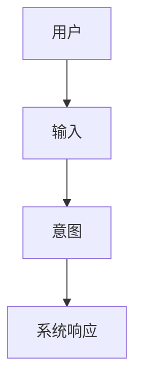
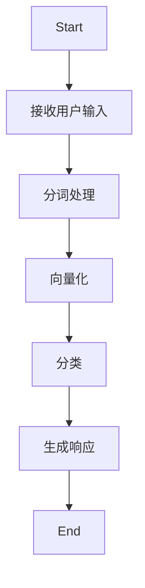
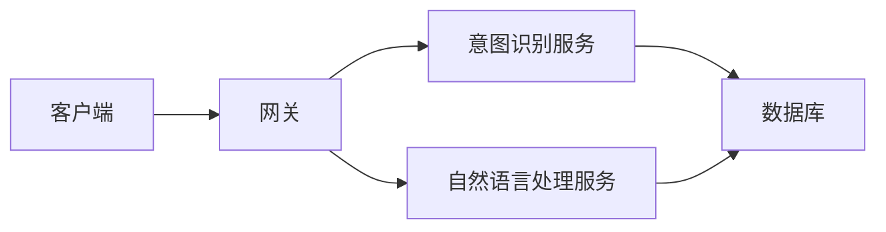

                 


# 意图识别：准确把握用户需求的关键

## 关键词：意图识别，自然语言处理，用户需求，机器学习，数学模型

## 摘要：  
意图识别是自然语言处理领域的重要分支，旨在准确理解用户的意图。本文从意图识别的基本概念出发，详细分析其核心概念、算法原理、系统设计及实际应用，结合案例分析，帮助读者掌握意图识别的关键技术。

---

## 目录大纲：

1. 意图识别的背景与核心概念
   1.1 意图识别的定义与目的
   1.2 意图识别的核心要素
   1.3 意图识别的应用场景

2. 意图识别的核心概念与联系
   2.1 意图的分类与特征
   2.2 意图识别的属性特征对比
   2.3 意图识别的ER实体关系图

3. 意图识别的算法原理
   3.1 常见的意图识别算法
   3.2 意图识别的流程图

4. 意图识别的数学模型与公式
   4.1 概率论基础
   4.2 意图识别中的分类模型

5. 系统分析与架构设计
   5.1 系统功能设计
   5.2 系统架构设计
   5.3 系统接口设计

6. 项目实战与案例分析
   6.1 项目背景与目标
   6.2 核心功能实现
   6.3 代码实现
   6.4 实际案例分析

7. 总结与展望
   7.1 最佳实践
   7.2 未来发展方向
   7.3 注意事项
   7.4 小结

---

## 正文

### 第1章：意图识别的背景与核心概念

#### 1.1 意图识别的定义与目的
意图识别是自然语言处理（NLP）中的一个重要任务，旨在理解用户输入（如文本或语音）背后的目标或意图。其目的是将用户的输入转化为可执行的行动或信息检索请求，帮助系统准确回应用户需求。

- **定义**：意图识别是通过分析用户的输入，确定其背后的意图或目标。
- **目的**：准确理解用户需求，提供个性化的服务或响应。

#### 1.2 意图识别的核心要素
意图识别的核心要素包括用户输入、意图分类和上下文信息。

- **用户输入**：用户提供的文本或语音输入。
- **意图分类**：将用户输入归类到特定的意图类别中。
- **上下文信息**：用户输入的历史信息，帮助更准确地理解当前意图。

#### 1.3 意图识别的应用场景
意图识别广泛应用于多个领域：

- **语音助手**：如Siri、Alexa，通过识别用户的语音指令执行操作。
- **智能客服**：自动解析用户的问题，提供相应的解决方案。
- **智能搜索**：根据用户的搜索历史和关键词，提供更精准的结果。

---

### 第2章：意图识别的核心概念与联系

#### 2.1 意图的分类与特征
意图可以分为显式意图和隐式意图。

- **显式意图**：用户明确表达的需求，如“订机票”。
- **隐式意图**：用户未明确表达的需求，需要通过上下文推断，如“寻找附近的餐厅”。

特征对比表格：

| 特征维度   | 显式意图                 | 隐式意图                 |
|------------|--------------------------|--------------------------|
| 明确性     | 高                       | 低                       |
| 上下文依赖 | 低                       | 高                       |
| 示例       | “请帮我订一张去北京的机票” | “附近有哪些好吃的餐厅？” |

#### 2.2 意图识别的属性特征对比
以下是不同意图分类方法的优缺点对比：

| 分类方法         | 基于规则的方法 | 统计学习方法 | 深度学习方法 |
|------------------|-----------------|--------------|--------------|
| 优点             | 实现简单，易于解释 | 高准确性 | 强大学习能力 |
| 缺点             | 需手动维护规则 | 需大量数据 | 计算资源需求高 |
| 适用场景         | 简单场景         | 中等复杂场景 | 复杂场景       |

#### 2.3 意图识别的ER实体关系图
以下是意图识别的实体关系图：



---

### 第3章：意图识别的算法原理

#### 3.1 常见的意图识别算法
常用的意图识别算法包括基于规则的算法、统计学习算法和深度学习算法。

- **基于规则的算法**：通过预定义的规则匹配用户输入，判断意图。例如，关键词匹配。
- **统计学习算法**：利用机器学习模型（如SVM、朴素贝叶斯）进行分类。
- **深度学习算法**：使用神经网络（如LSTM、BERT）进行意图分类。

#### 3.2 意图识别的流程图
以下是意图识别的流程图：



---

### 第4章：意图识别的数学模型与公式

#### 4.1 概率论基础
概率论是意图识别的重要基础。

- **条件概率公式**：$$P(A|B) = \frac{P(A \cap B)}{P(B)}$$
- **全概率公式**：$$P(A) = \sum_{i} P(A|B_i)P(B_i)$$

#### 4.2 意图识别中的分类模型
常用的分类模型包括贝叶斯分类器和最大熵模型。

- **贝叶斯定理**：$$P(y|x) = \frac{P(x|y)P(y)}{P(x)}$$
- **最大熵模型**：$$P(y|x) = \frac{exp(f(x,y))}{\sum_{y'} exp(f(x,y'))}$$

---

### 第5章：系统分析与架构设计

#### 5.1 系统功能设计
以下是系统功能设计的类图：


#### 5.2 系统架构设计
以下是系统架构设计的架构图：



---

### 第6章：项目实战与案例分析

#### 6.1 项目背景与目标
项目目标是开发一个基于意图识别的智能客服系统。

#### 6.2 核心功能实现
- **数据预处理**：对用户输入进行清洗和分词。
- **模型训练**：使用深度学习模型进行意图分类。
- **意图分类**：将用户输入分类到预定义的意图类别中。

#### 6.3 代码实现
以下是Python代码示例：

```python
import tensorflow as tf
from tensorflow.keras import layers

# 数据预处理
def preprocess(text):
    # 分词处理
    words = tokenize(text)
    # 向量化
    vectors = vectorize(words)
    return vectors

# 模型训练
def train_model(train_data, train_labels):
    model = tf.keras.Sequential([
        layers.Dense(64, activation='relu'),
        layers.Dense(1, activation='sigmoid')
    ])
    model.compile(optimizer='adam', loss='binary_crossentropy', metrics=['accuracy'])
    model.fit(train_data, train_labels, epochs=10, batch_size=32)
    return model

# 意图分类
def predict_intention(test_data, model):
    predictions = model.predict(test_data)
    return np.argmax(predictions, axis=1)
```

#### 6.4 实际案例分析
通过分析实际案例，验证模型的准确性和鲁棒性。例如，客服系统中用户输入“我的订单在哪里”，模型应识别出“查询订单”意图并返回相关信息。

---

### 第7章：总结与展望

#### 7.1 最佳实践
- 数据质量对意图识别至关重要。
- 模型调优可以提高准确率。

#### 7.2 未来发展方向
- 结合边缘计算，提升意图识别的实时性。
- 增强模型的可解释性，使其更透明。

#### 7.3 注意事项
- 在实际应用中，需考虑数据隐私和模型性能。
- 避免过度依赖单一算法，结合多种方法提高鲁棒性。

#### 7.4 小结
意图识别是自然语言处理中的关键任务，通过理解用户意图，系统可以提供更智能化的服务。未来，随着技术的发展，意图识别将更加精准和多样化。

---

## 作者：AI天才研究院 & 禅与计算机程序设计艺术

