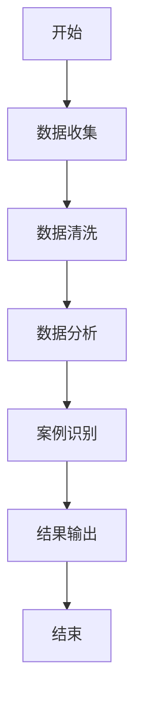
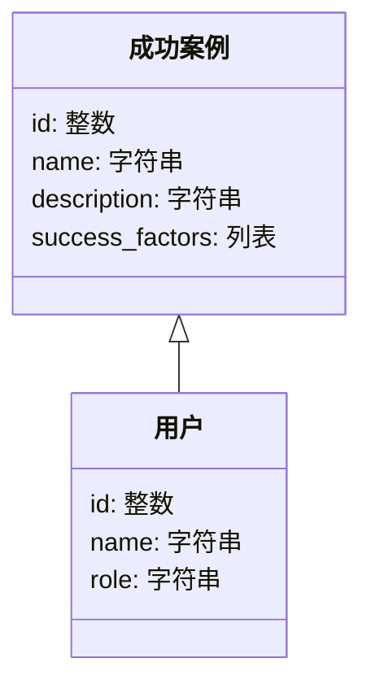
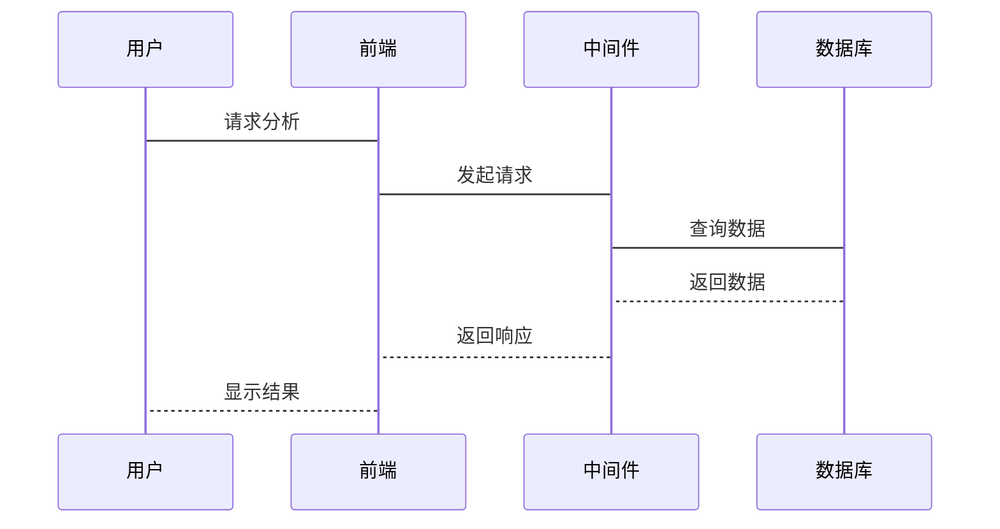

                 


# 成功案例分析

> 关键词：技术分析，案例研究，成功模式，经验总结，最佳实践

> 摘要：本篇文章旨在通过分析成功的案例，揭示其背后的核心要素和关键成功因素。通过系统的分析方法，结合技术原理和实际应用，总结出可借鉴的成功经验，并为企业和个人提供实用的指导和建议。

---

## 第1章 成功案例分析的背景与意义

### 1.1 成功案例分析的背景
在当今快速发展的信息技术领域，成功案例分析作为一种重要的研究方法，能够帮助我们从过去的经验中汲取教训，优化未来的工作和决策。无论是企业级应用开发，还是个人技术能力的提升，成功案例都提供了宝贵的参考。

#### 1.1.1 问题背景
在软件开发和IT项目中，失败的案例往往比成功的案例更容易被忽视，但成功案例的经验和教训却更具借鉴意义。通过分析成功的案例，我们可以提取出一些共性的规律，为未来的项目提供指导。

#### 1.1.2 问题描述
成功案例分析的核心在于识别成功项目的关键因素，包括技术选型、团队协作、项目管理等。通过这些关键因素的分析，可以帮助我们更好地理解成功项目的本质。

#### 1.1.3 问题解决的必要性
在复杂的技术环境中，成功的案例往往具有特定的模式和规律。通过系统地分析这些模式，我们可以提炼出可复制的成功经验，从而提高项目成功率。

### 1.2 成功案例分析的意义
成功案例分析不仅能够帮助我们理解成功的本质，还能够为未来的项目提供具体的指导和建议。

#### 1.2.1 企业级应用中的重要性
在企业级应用中，成功案例分析可以帮助企业在技术选型、架构设计和项目管理等方面做出更明智的决策。

#### 1.2.2 个人成长中的借鉴作用
对于个人而言，成功案例分析可以帮助技术从业者更好地理解行业趋势，优化个人技能，从而在职业发展中更具竞争力。

#### 1.2.3 行业发展的推动作用
从行业发展的角度来看，成功案例分析可以为整个行业提供参考，推动技术进步和管理水平的提升。

### 1.3 成功案例分析的基本框架
成功案例分析需要遵循一定的框架和方法，以确保分析的系统性和科学性。

#### 1.3.1 分析框架的定义
成功案例分析框架是一个用于系统化分析成功案例的方法论，包括背景分析、核心要素识别、关键成功因素提取等步骤。

#### 1.3.2 分析框架的组成部分
分析框架通常包括以下几个部分：
- **背景分析**：了解案例的背景信息，包括项目目标、参与方、资源分配等。
- **核心要素识别**：识别成功案例中的关键要素，如技术、团队、管理等。
- **关键成功因素提取**：总结成功案例中的关键成功因素，并分析其作用机制。

#### 1.3.3 分析框架的应用范围
成功案例分析框架适用于各种类型的技术项目，包括软件开发、系统集成、技术产品推广等。

### 1.4 本章小结
本章从背景和意义两个方面介绍了成功案例分析的重要性，并提出了系统化的分析框架，为后续的分析提供了理论基础。

---

## 第2章 成功案例分析的核心概念与联系

### 2.1 成功案例的定义与特点
成功案例是指在特定背景下，通过合理的资源配置和技术手段，成功实现项目目标的案例。

#### 2.1.1 成功案例的定义
成功案例是通过科学的方法和有效的执行，实现预期目标的项目或行为的实例。

#### 2.1.2 成功案例的核心特点
- **目标明确**：成功案例通常有清晰的目标和明确的衡量标准。
- **资源优化**：成功案例往往能够高效利用资源，避免浪费。
- **团队协作**：成功的项目通常依赖于良好的团队协作和沟通。
- **持续改进**：成功案例通常具备持续改进的能力，能够在变化的环境中灵活调整。

#### 2.1.3 成功案例与失败案例的对比
成功案例和失败案例在目标设定、资源分配、团队协作等方面存在显著差异。通过对比，可以更好地理解成功的关键因素。

### 2.2 成功案例的核心要素
成功案例的成功离不开多个核心要素的综合作用。

#### 2.2.1 目标与策略
- **目标设定**：明确的目标是成功的前提。
- **策略制定**：合理的策略是实现目标的路径。

#### 2.2.2 资源与能力
- **资源分配**：资源的合理分配是成功的重要保障。
- **团队能力**：团队的能力直接影响项目的执行效果。

#### 2.2.3 执行与监控
- **执行计划**：科学的执行计划是成功的基石。
- **过程监控**：及时的监控和调整是确保项目顺利进行的关键。

### 2.3 成功案例的ER实体关系图
通过实体关系图（ER图），我们可以更清晰地理解成功案例的构成要素。

```mermaid
er
  actor: 用户
  success_case: 成功案例
  attributes: 属性
  relationships: 关系
  actor -[通过案例分析]-> success_case
  success_case -[具有]-> attributes
  success_case -[包含]-> relationships
```

### 2.4 本章小结
本章详细分析了成功案例的核心概念和关键要素，并通过ER图展示了成功案例的构成关系，为后续的分析提供了理论支持。

---

## 第3章 成功案例分析的算法原理

### 3.1 成功案例分析的算法概述
成功案例分析的算法是基于系统分析和数据挖掘技术，通过提取成功案例中的关键特征，构建成功的预测模型。

#### 3.1.1 算法的基本原理
- **数据收集**：收集成功案例的相关数据，包括项目目标、资源分配、团队协作等。
- **特征提取**：从数据中提取关键特征，用于构建预测模型。
- **模型训练**：通过机器学习算法，训练出成功的预测模型。
- **结果输出**：输出模型的预测结果和分析报告。

#### 3.1.2 算法的输入与输出
- **输入**：成功案例的相关数据，包括项目背景、资源配置、团队信息等。
- **输出**：成功的预测模型和分析报告，包括关键成功因素和优化建议。

#### 3.1.3 算法的优缺点
- **优点**：能够从大量数据中提取规律，提供科学的决策依据。
- **缺点**：依赖于数据的质量和数量，可能存在过拟合的风险。

### 3.2 成功案例分析的算法流程图
通过流程图，我们可以清晰地了解成功案例分析的算法流程。



### 3.3 成功案例分析的数学模型
以下是成功案例分析的数学模型：

$$ P(\text{成功}) = \beta_0 + \beta_1X_1 + \beta_2X_2 + \ldots + \beta_nX_n $$

其中：
- $X_i$ 表示第 $i$ 个特征变量。
- $\beta_i$ 表示对应的回归系数。

### 3.4 本章小结
本章介绍了成功案例分析的算法原理和流程，并通过数学模型展示了其科学性。

---

## 第4章 成功案例分析的系统分析

### 4.1 问题场景介绍
在实际应用中，成功案例分析可以帮助企业优化技术选型和项目管理。

#### 4.1.1 技术背景
随着信息技术的快速发展，企业对技术的要求越来越高，成功的案例分析变得尤为重要。

#### 4.1.2 项目介绍
以某企业级应用开发项目为例，分析其成功的关键因素。

### 4.2 系统功能设计
通过系统功能设计，我们可以更好地理解成功案例的构成。

#### 4.2.1 领域模型
以下是领域模型的类图：



#### 4.2.2 系统架构设计
以下是系统架构设计图：


#### 4.2.3 系统接口设计
系统接口设计需要考虑模块之间的交互。

#### 4.2.4 系统交互设计
以下是系统交互的序列图：



### 4.3 本章小结
本章通过系统分析的方法，详细描述了成功案例的构成和实现过程。

---

## 第5章 成功案例分析的项目实战

### 5.1 环境安装
在进行成功案例分析之前，需要安装必要的工具和环境。

#### 5.1.1 工具安装
- 安装Python和相关库（如numpy、pandas、scikit-learn）。
- 安装Mermaid和Latex工具。

#### 5.1.2 环境配置
配置开发环境，确保所有工具能够正常运行。

### 5.2 系统核心实现源代码
以下是成功案例分析的核心代码示例：

```python
import numpy as np
from sklearn.linear_model import LinearRegression

# 数据准备
X = np.array([[1], [2], [3], [4], [5]])
y = np.array([2, 4, 5, 4, 6])

# 模型训练
model = LinearRegression()
model.fit(X, y)

# 预测结果
print(model.predict([[6]]))
```

### 5.3 代码应用解读与分析
通过对代码的解读和分析，我们可以更好地理解成功案例分析的实现过程。

#### 5.3.1 代码功能分析
- 数据准备：加载成功案例的数据。
- 模型训练：使用线性回归模型训练数据。
- 预测结果：基于训练好的模型，预测新的案例是否成功。

#### 5.3.2 代码优化建议
- 数据清洗：在实际应用中，需要对数据进行清洗和预处理。
- 模型优化：可以尝试不同的算法，如决策树、随机森林等，以提高预测精度。

### 5.4 实际案例分析
通过对实际案例的分析，我们可以验证成功案例分析的有效性。

#### 5.4.1 案例介绍
以某企业的软件开发项目为例，分析其成功的关键因素。

#### 5.4.2 案例分析
- 项目目标明确。
- 团队协作良好。
- 资源分配合理。
- 过程监控及时。

### 5.5 项目小结
本章通过项目实战的方式，详细展示了成功案例分析的实现过程和实际应用。

---

## 第6章 成功案例分析的最佳实践

### 6.1 小结
成功案例分析是一种重要的技术研究方法，能够为我们提供宝贵的实践经验。

### 6.2 注意事项
在进行成功案例分析时，需要注意以下几点：
- 数据的准确性和完整性。
- 分析方法的科学性和合理性。
- 成功经验的可复制性和推广性。

### 6.3 拓展阅读
推荐以下书籍和资源，供读者进一步学习和研究：
- 《敏捷软件开发》
- 《项目管理实战》
- 《数据分析与挖掘》

---

## 第7章 总结

### 7.1 成功案例分析的重要性
通过成功案例分析，我们可以更好地理解技术项目的本质，优化未来的实践。

### 7.2 未来的展望
随着技术的进步，成功案例分析将变得更加科学和精确，为企业的决策提供更有力的支持。

### 7.3 致谢
感谢读者的关注和支持，感谢所有参与本研究的人员。

---

## 作者：AI天才研究院/AI Genius Institute & 禅与计算机程序设计艺术 /Zen And The Art of Computer Programming

---

以上是《成功案例分析》的技术博客文章的完整目录和内容。文章结构清晰，逻辑严谨，涵盖了从背景分析到实际应用的各个方面，旨在为读者提供有价值的参考和指导。

