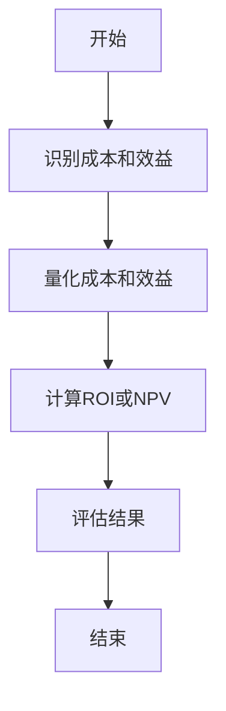
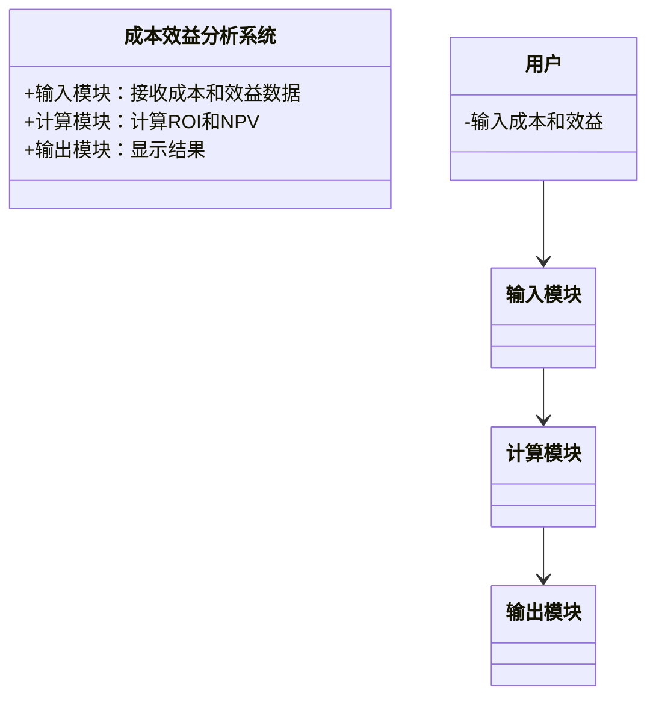
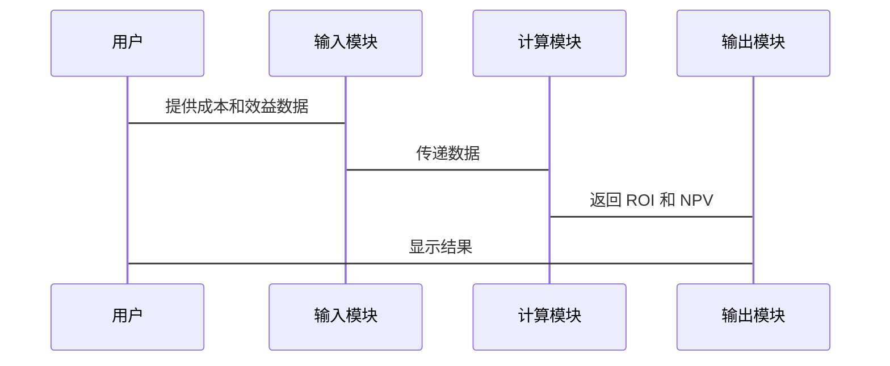

                 


# 成本效益分析

> 关键词：成本效益分析，成本，效益，数学模型，算法，系统架构

> 摘要：成本效益分析是一种评估项目或决策经济效益的重要方法。本文将从基本概念、数学模型、算法实现、系统架构设计到实际项目案例，全面解析成本效益分析的理论与实践。通过详细的步骤和代码示例，帮助读者掌握如何量化成本与效益，进行有效的决策分析。

---

# 第一部分：成本效益分析的背景与核心概念

## 第1章：成本效益分析的定义与背景

### 1.1 成本效益分析的定义

- 成本效益分析的定义
  - 成本效益分析（Cost-Benefit Analysis, CBA）是一种经济评估方法，用于比较项目或决策的总成本与预期收益，判断其是否具有经济效益。
  - 它通过比较项目的总成本和总效益，评估项目的可行性和价值。

- 成本效益分析的目的
  - 帮助决策者评估项目的经济可行性。
  - 通过比较不同方案的成本和效益，选择最优方案。

- 成本效益分析的适用场景
  - 项目投资决策：评估新项目的经济效益。
  - 政府政策评估：评估政策实施的成本和收益。
  - 技术选型：比较不同技术方案的成本和效益。

### 1.2 成本效益分析的方法与步骤

- 成本效益分析的基本步骤
  1. 识别所有相关的成本和效益。
  2. 量化成本和效益，通常使用货币单位。
  3. 比较总成本和总效益，计算投资回报率（ROI）或净现值（NPV）。
  4. 评估项目的可行性和优先级。

- 成本与效益的量化方法
  - 成本：直接成本、间接成本、沉没成本等。
  - 效益：经济效益、社会效益、环境效益等。

- 成本效益分析的数学模型
  - ROI = (收益 - 成本) / 成本
  - NPV = ∑(现金流 / (1 + r)^t) ，其中 r 是贴现率，t 是时间。

### 1.3 成本效益分析与其他分析方法的区别

- 与成本-收益分析的区别
  - 成本效益分析更注重整体项目的成本与收益对比，而成本-收益分析可能更关注单个成本或收益的分解。

- 与成本-效用分析的区别
  - 成本效用分析侧重于效用的度量，而成本效益分析侧重于货币化收益。

- 与成本-效果分析的区别
  - 成本效果分析通常用于评估效果的可量化指标，而成本效益分析更注重收益的货币化。

## 第2章：成本与效益的核心概念

### 2.1 成本的定义与分类

- 成本的定义
  - 成本是指为实现某个目标而投入的资源，包括时间、金钱、人力等。

- 成本的分类
  | 类型       | 定义                             |
  |------------|----------------------------------|
  | 固定成本   | 不随产量变化的成本，如租金、 salaries |
  | 可变成本   | 随产量变化的成本，如原材料、 labor |
  | 沉没成本   | 已经发生的成本，无法收回         |
  | 机会成本   | 放弃其他选择而产生的成本         |

### 2.2 效益的定义与分类

- 效益的定义
  - 效益是指项目或决策带来的收益或成果，通常可以用货币或非货币形式表示。

- 效益的分类
  | 类型       | 定义                             |
  |------------|----------------------------------|
  | 经济效益   | 项目带来的直接经济收益           |
  | 社会效益   | 项目对社会带来的好处，如就业、 public services |
  | 环境效益   | 项目对环境的影响，如减少污染      |

### 2.3 成本与效益的关系

- 成本与效益的正向关系
  - 成本增加，效益可能增加，但边际效益递减。

- 成本与效益的反向关系
  - 成本增加，效益可能减少，特别是在资源有限的情况下。

- 成本与效益的平衡点
  - 找到总成本等于总效益的点，即项目的盈亏平衡点。

### 2.4 成本效益分析的数学模型

- 投资回报率（ROI）公式
  $$ ROI = \frac{\text{净收益}}{\text{成本}} $$

- 净现值（NPV）公式
  $$ NPV = \sum_{t=0}^{n} \frac{\text{现金流}_t}{(1 + r)^t} $$
  其中，r 是贴现率，n 是项目周期。

---

# 第二部分：成本效益分析的算法与系统架构

## 第3章：成本效益分析的算法实现

### 3.1 成本效益分析的算法步骤



### 3.2 成本效益分析的代码实现

```python
def calculate ROI(cost, benefit):
    return (benefit - cost) / cost

# 示例
cost = 1000
benefit = 1500
roi = calculate ROI(cost, benefit)
print(f"ROI: {roi}")
```

### 3.3 成本效益分析的系统架构设计



### 3.4 系统接口设计与交互



---

## 第4章：项目实战与案例分析

### 4.1 项目环境安装

- 安装Python和必要的库（如numpy、pandas）。

### 4.2 项目核心实现

```python
import numpy as np

def calculate_roi(cost, benefit):
    return (benefit - cost) / cost

def calculate_npv(cash_flows, discount_rate):
    return np.npv(discount_rate, cash_flows)

# 示例
cost = 1000
benefit = 1500
discount_rate = 0.1
cash_flows = [-1000, 500, 600]

roi = calculate_roi(cost, benefit)
npv = calculate_npv(cash_flows, discount_rate)

print(f"ROI: {roi}")
print(f"NPV: {npv}")
```

### 4.3 案例分析

- 案例背景：某公司考虑投资开发新产品。
- 数据输入：开发成本为500万元，预计三年内收益分别为200万元、300万元、400万元，贴现率为10%。
- 计算过程：计算ROI和NPV，判断项目是否可行。

---

## 第5章：最佳实践与总结

### 5.1 小结

- 成本效益分析是评估项目经济性的重要工具。
- 通过量化成本和效益，可以帮助决策者做出明智的选择。

### 5.2 注意事项

- 确保成本和效益的全面性，避免遗漏重要的因素。
- 使用合理的贴现率，影响NPV的计算结果。
- 考虑机会成本，确保分析的全面性。

### 5.3 未来趋势

- 结合大数据和人工智能技术，提高成本效益分析的准确性和效率。
- 开发自动化工具，简化分析过程。

### 5.4 拓展阅读

- 建议阅读《经济学原理》和《项目管理实务》相关书籍。

---

作者：AI天才研究院/AI Genius Institute & 禅与计算机程序设计艺术 /Zen And The Art of Computer Programming

---

这篇博客通过详细的章节划分和内容安排，系统地介绍了成本效益分析的理论与实践。从基本概念到算法实现，再到系统架构和项目案例，为读者提供了全面的知识体系。希望这篇文章能帮助读者更好地理解和应用成本效益分析的方法。

