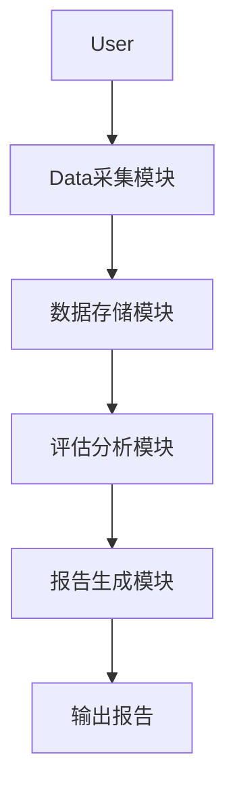

                 


# 《戴维·多德的护城河评估体系》

## 关键词：护城河评估体系、戴维·多德、竞争优势、企业战略、多维分析法

## 摘要：  
戴维·多德的护城河评估体系是一种系统化的企业竞争优势评估方法，通过多维分析法、层次分析法和因子分析法等技术手段，帮助企业识别和评估核心竞争力，构建可持续的竞争优势。本文将从背景、核心概念、算法原理、系统架构、项目实战和最佳实践等角度，详细阐述戴维·多德的护城河评估体系，并通过具体案例分析，展示其实际应用和效果。

---

## 第一部分: 护城河评估体系的背景与核心概念

### 第1章: 护城河评估体系的背景介绍

#### 1.1 护城河的基本概念  
护城河是企业在市场竞争中形成的独特优势，能够有效防止竞争对手侵蚀市场份额。戴维·多德的护城河评估体系将护城河划分为四种类型：品牌优势、成本优势、网络效应和技术创新优势。这些要素共同构成了企业的核心竞争力。

#### 1.2 戴维·多德的护城河评估体系的起源  
戴维·多德的护城河评估体系起源于对企业竞争优势的深入研究。该体系通过量化分析，帮助企业识别和评估核心竞争优势，从而制定有效的战略规划。多德体系的演变经历了多个阶段，逐步形成了一个多维分析框架。

#### 1.3 护城河评估体系的核心要素  
护城河评估体系的核心要素包括品牌影响力、成本结构、客户网络和技术创新能力。这些要素相互作用，共同构成了企业的竞争优势。戴维·多德提出的多维分析法，通过权重分配，将这些要素转化为可量化的指标。

---

### 第2章: 护城河评估体系的核心概念

#### 2.1 护城河的类型  
戴维·多德将护城河分为四种类型：  
- **品牌优势**：强大的品牌影响力能够吸引客户，形成市场壁垒。  
- **成本优势**：通过规模化生产或优化流程降低成本，形成价格优势。  
- **网络效应**：用户数量的增加会增强产品的价值，形成正反馈循环。  
- **技术创新**：通过持续创新，保持产品差异化和技术领先。

#### 2.2 护城河评估的核心指标  
护城河评估的核心指标包括：  
- 市场占有率：反映企业在市场中的地位。  
- 产品差异化：衡量产品与竞争对手的独特性。  
- 成本优势：通过成本数据分析，评估企业的盈利能力。  
- 品牌影响力：通过品牌价值评估，量化品牌资产。

#### 2.3 护城河评估的核心方法  
戴维·多德的护城河评估体系采用多维分析法，通过层次分析法（AHP）和因子分析法，量化各要素的权重和影响程度。具体步骤如下：  
1. 确定评估维度和指标。  
2. 构建评估模型，分配各指标的权重。  
3. 收集数据，进行计算和分析。  
4. 输出评估结果，提出优化建议。

---

## 第二部分: 护城河评估体系的核心概念与联系

### 第3章: 护城河评估体系的核心要素关系

#### 3.1 护城河核心要素的属性对比  
以下是一个护城河核心要素的属性对比表：

| 核心要素 | 属性 | 描述 |
|----------|------|------|
| 品牌影响力 | 强度 | 品牌知名度和美誉度 |
| 成本优势 | 经济性 | 成本控制能力 |
| 网络效应 | 用户粘性 | 用户数量对产品价值的影响 |
| 技术创新 | 技术领先性 | 技术研发能力 |

#### 3.2 护城河核心要素的ER实体关系图  
以下是使用 Mermaid 绘制的 ER 实体关系图：

```mermaid
erDiagram
    customer[客户] {
        +int id
        +string name
        +string email
    }
    product[产品] {
        +int id
        +string name
        +float price
    }
    brand[品牌] {
        +int id
        +string name
        +int market_share
    }
    relationship(客户)-[购买]->产品
    relationship(品牌)-[拥有]->产品
```

---

## 第三部分: 护城河评估体系的算法原理

### 第4章: 护城河评估体系的算法原理

#### 4.1 层次分析法（AHP）在护城河评估中的应用  
层次分析法是一种常用的决策分析方法，适用于多指标评估问题。以下是层次分析法的步骤：  

1. **构建层次结构**：将护城河评估体系分为目标层、准则层和方案层。  
2. **构造判断矩阵**：根据专家意见，构造各准则的权重判断矩阵。  
3. **计算权重**：通过特征值法或几何平均法，计算各准则的权重。  
4. **一致性检验**：检查判断矩阵的一致性，确保评估结果的有效性。  

例如，假设护城河评估的目标是选择最佳的企业战略，准则层包括品牌、成本、网络和创新四个维度。判断矩阵如下：  

$$
A = \begin{bmatrix}
1 & 1/3 & 1/2 & 1/4 \\
3 & 1 & 2 & 1/2 \\
2 & 1/2 & 1 & 1/3 \\
4 & 2 & 3 & 1 \\
\end{bmatrix}
$$  

通过计算特征值和特征向量，可以得到各准则的权重。

#### 4.2 因子分析法在护城河评估中的应用  
因子分析法适用于降维和变量间的相关性分析。以下是因子分析法的步骤：  

1. **数据标准化**：对各指标进行标准化处理。  
2. **计算相关系数矩阵**：分析各指标之间的相关性。  
3. **提取公因子**：通过主成分分析或最大似然法提取公因子。  
4. **因子旋转**：优化因子结构，便于解释。  
5. **计算因子得分**：根据因子载荷矩阵，计算各样本的因子得分。  

例如，假设我们有四个指标：品牌影响力（X1）、成本优势（X2）、网络效应（X3）和技术创新（X4）。通过因子分析，可以提取出两个公因子，分别代表市场和技术创新能力。

---

## 第四部分: 护城河评估体系的系统分析与架构设计

### 第5章: 护城河评估体系的系统架构设计

#### 5.1 系统功能设计  
以下是护城河评估系统的功能模块：  
- 数据采集模块：收集企业相关数据。  
- 评估分析模块：基于多维分析法和层次分析法，计算各维度的权重和得分。  
- 报告生成模块：输出评估报告，提出优化建议。  

#### 5.2 系统架构设计  
以下是使用 Mermaid 绘制的系统架构图：



#### 5.3 系统接口设计  
系统接口采用 RESTful API 设计，具体如下：  
- GET /api/data：获取企业数据。  
- POST /api/analyze：提交评估请求。  
- GET /api/report：下载评估报告。  

---

## 第五部分: 护城河评估体系的项目实战

### 第6章: 护城河评估体系的项目实战

#### 6.1 项目背景  
假设我们是一家电商平台，希望通过戴维·多德的护城河评估体系，评估自身的竞争优势。  

#### 6.2 核心代码实现  
以下是 Python 实现的层次分析法代码示例：

```python
import numpy as np

def calculate_weights(matrix):
    # 计算特征向量
    eigenvalues, eigenvectors = np.linalg.eig(matrix)
    # 提取最大的特征向量
    max_eigen = eigenvalues.max()
    eigenvector = eigenvectors[:, np.argmax(eigenvalues)]
    # 计算权重
    weights = eigenvector / eigenvector.sum()
    return weights

# 示例判断矩阵
A = np.array([[1, 1/3, 1/2, 1/4],
              [3, 1, 2, 1/2],
              [2, 1/2, 1, 1/3],
              [4, 2, 3, 1]])

weights = calculate_weights(A)
print(weights)
```

#### 6.3 代码解读与分析  
上述代码通过numpy库计算判断矩阵的特征向量，提取最大的特征向量作为权重。输出结果即为各准则的权重，可用于护城河评估。

#### 6.4 案例分析  
通过评估分析模块，我们发现品牌影响力和技术创新是平台的核心竞争优势。基于此，我们可以制定相应的战略，进一步巩固品牌地位，加大研发投入。

---

## 第六部分: 护城河评估体系的最佳实践

### 第7章: 护城河评估体系的最佳实践

#### 7.1 小结  
戴维·多德的护城河评估体系为企业提供了系统化的竞争优势评估方法。通过多维分析和层次分析法，帮助企业识别和优化核心竞争力。

#### 7.2 注意事项  
在实际应用中，需要注意数据的准确性和评估模型的适用性。建议结合企业实际情况，灵活调整评估指标和权重。

#### 7.3 拓展阅读  
推荐阅读《竞争优势：企业战略的核心》和《战略管理：理论与实践》，深入理解护城河评估体系的理论基础。

---

## 作者：AI天才研究院 & 禅与计算机程序设计艺术

---

通过以上目录大纲和内容，我们系统地介绍了戴维·多德的护城河评估体系，从理论到实践，为读者提供了全面的技术指导和实践案例。

