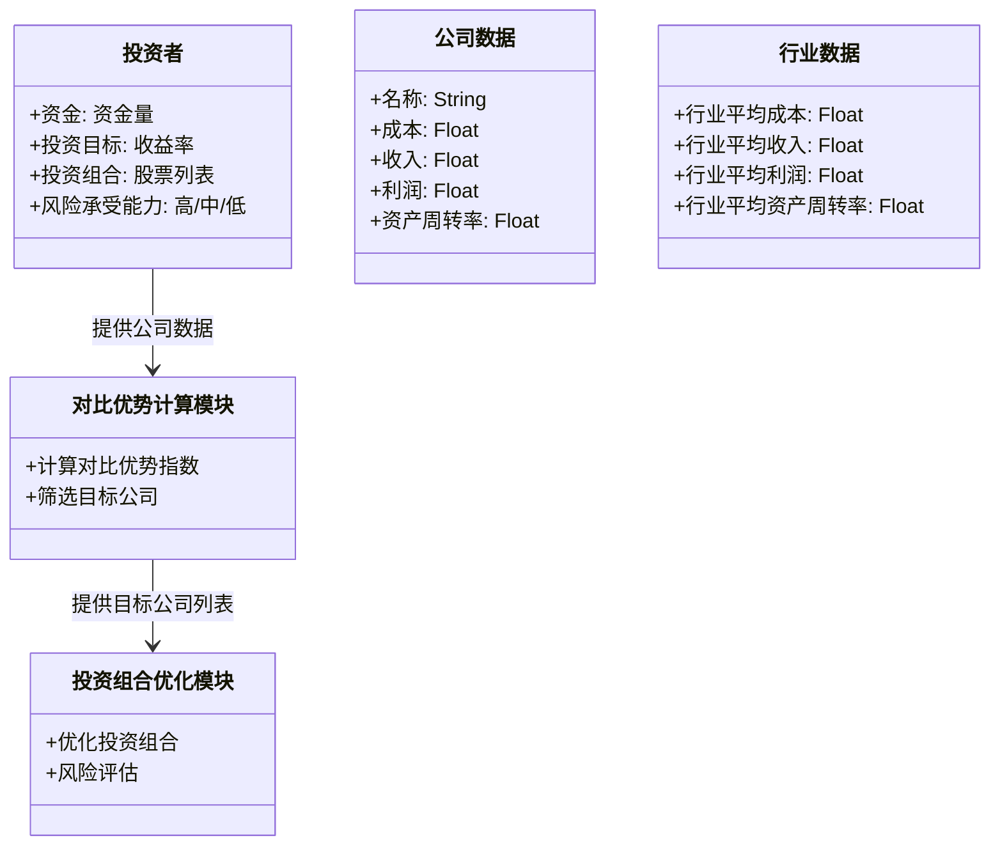
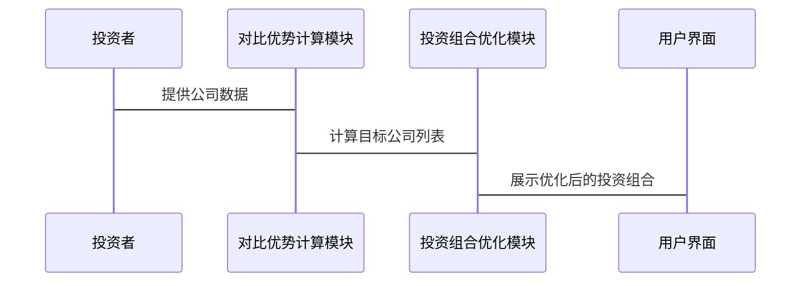

                 


# 《戴维·德雷曼的对比优势投资法》

## 关键词：对比优势投资法, 投资策略, 竞争优势, 投资分析, 企业估值

## 摘要：
本文系统地介绍戴维·德雷曼提出的对比优势投资法，分析其核心概念、数学模型和实际应用。通过详细讲解对比优势的定义、特征及计算方法，结合Python代码实现和系统架构设计，展示如何在投资决策中应用对比优势。文章还提供实际案例分析和最佳实践建议，帮助投资者掌握这一有效的方法。

---

# 正文

## 第1章：对比优势投资法的背景与基础

### 1.1 投资的基本概念与市场分析

#### 1.1.1 投资的定义与分类
- **定义**：投资是指将资金投入某个项目或资产，以期获得未来收益的行为。
- **分类**：包括股票、债券、房地产、基金等多种形式。

#### 1.1.2 金融市场的基本结构
- **市场类型**：包括一级市场和二级市场。
- **主要参与者**：投资者、发行人、经纪商、交易所等。

#### 1.1.3 投资者类型与目标
- **类型**：机构投资者和个人投资者。
- **目标**：包括短期收益、长期资本增值等。

### 1.2 对比优势投资法的起源

#### 1.2.1 投资理论的发展历程
- 从现代投资组合理论到行为金融学的发展。

#### 1.2.2 德雷曼的学术背景与贡献
- 德雷曼作为投资理论的重要贡献者，提出对比优势概念。

#### 1.2.3 对比优势概念的提出
- 通过对比分析企业竞争优势，寻找具有可持续优势的企业。

## 第2章：对比优势的定义与特征

### 2.1 对比优势的定义

#### 2.1.1 什么是对比优势
- **定义**：通过比较同一行业内的企业，识别出具有显著竞争优势的公司。

#### 2.1.2 对比优势与竞争优势的区别
- 竞争优势是公司的内部优势，对比优势是相对于同行的优势。

#### 2.1.3 对比优势的三个核心要素
- 成本优势、资源分配效率、行业结构。

### 2.2 对比优势的分析框架

#### 2.2.1 公司分析：成本优势、资源分配效率
- 成本优势：单位产品成本低于行业平均水平。
- 资源分配效率：资源利用效率高，资产周转率高。

#### 2.2.2 行业分析：行业结构、竞争态势
- 行业集中度、进入壁垒、市场增长潜力。

#### 2.2.3 宏观分析：宏观经济环境、政策影响
- 经济周期、政府政策对行业的影响。

## 第3章：对比优势与投资决策的关系

### 3.1 对比优势如何影响投资决策

#### 3.1.1 对比优势是投资决策的核心依据
- 通过对比优势识别出具有持续盈利能力的企业。

#### 3.1.2 对比优势与资产定价的关系
- 公司的对比优势决定了其市场价格和内在价值。

#### 3.1.3 对比优势在风险管理中的作用
- 通过识别潜在风险，降低投资组合的波动性。

---

## 第4章：对比优势指数的计算方法

### 4.1 对比优势指数的定义

#### 4.1.1 指数的构成要素
- 包括成本优势指数、资源分配效率指数等。

#### 4.1.2 指数的计算公式
$$ \text{对比优势指数} = \frac{\text{公司某项指标}}{\text{行业平均指标}} $$

#### 4.1.3 指数的权重分配
- 根据指标的重要性分配权重，例如成本占40%，资源分配占30%。

### 4.2 对比优势指数的计算步骤

#### 4.2.1 数据收集与处理
- 收集目标行业内的企业数据，包括成本、收入、利润等。

#### 4.2.2 各要素的评分与加权
- 对每个要素进行评分，然后乘以相应的权重求和。

#### 4.2.3 指数的计算与排名
- 计算各公司的对比优势指数，进行排序，识别出具有对比优势的公司。

---

## 第5章：对比优势投资法的算法与数学模型

### 5.1 对比优势算法的原理

#### 5.1.1 基于对比优势的投资策略
- 筛选出对比优势指数高于行业平均水平的公司。

#### 5.1.2 算法步骤
1. 数据收集与清洗。
2. 计算各公司的对比优势指数。
3. 根据指数筛选出目标公司。
4. 进行投资组合配置。

### 5.2 对比优势算法的数学模型

#### 5.2.1 成本优势模型
$$ \text{成本优势} = \frac{\text{公司成本}}{\text{行业平均成本}} $$

#### 5.2.2 资源分配效率模型
$$ \text{资源分配效率} = \frac{\text{资产周转率}}{\text{行业平均资产周转率}} $$

#### 5.2.3 综合对比优势指数
$$ \text{对比优势指数} = \alpha \times \text{成本优势} + \beta \times \text{资源分配效率} $$

其中，$\alpha$ 和 $\beta$ 是权重系数，通常根据行业特点确定。

---

## 第6章：系统分析与架构设计方案

### 6.1 问题场景介绍

#### 6.1.1 投资决策问题
- 投资者需要快速识别具有对比优势的公司，优化投资组合。

### 6.2 系统功能设计

#### 6.2.1 领域模型（mermaid类图）


### 6.3 系统架构设计

#### 6.3.1 系统架构图（mermaid架构图）
```mermaid
archi
    title 对比优势投资系统架构
    rectangle 数据层 {
        数据库: 存储公司数据和行业数据
    }
    rectangle 业务逻辑层 {
        对比优势计算模块: 计算指数
        投资组合优化模块: 优化组合
    }
    rectangle 表现层 {
        用户界面: 展示结果
    }
    数据层 --> 业务逻辑层: 数据访问
    业务逻辑层 --> 表现层: 提供数据
```

### 6.4 接口设计与交互序列图

#### 6.4.1 接口设计
- 数据接口：从数据库获取公司和行业数据。
- 计算接口：调用对比优势计算模块进行指数计算。
- 展示接口：将结果展示给投资者。

#### 6.4.2 交互序列图（mermaid序列图）


---

## 第7章：项目实战

### 7.1 环境安装与配置

#### 7.1.1 安装Python环境
- 使用Anaconda安装Python 3.8及以上版本。

#### 7.1.2 安装必要的库
```bash
pip install pandas numpy matplotlib
```

### 7.2 核心代码实现

#### 7.2.1 数据收集与处理
```python
import pandas as pd

# 假设data是一个包含公司数据的DataFrame
data = pd.read_csv('company_data.csv')
industry_avg = data['行业平均成本'].mean()
```

#### 7.2.2 对比优势指数计算
```python
def calculate_advantage_index(data, industry_avg):
    return data['成本'] / industry_avg

# 示例
cost_advantage = calculate_advantage_index(data, industry_avg)
```

#### 7.2.3 筛选目标公司
```python
threshold = 1.2  # 假设对比优势指数超过1.2为优势
target_companies = data[cost_advantage > threshold]
```

### 7.3 代码应用解读与分析

#### 7.3.1 代码解读
- 使用Pandas进行数据处理，计算对比优势指数。
- 根据指数筛选出具有对比优势的公司。

#### 7.3.2 案例分析
- 以具体行业为例，计算对比优势指数，筛选出具有优势的公司，进行投资组合优化。

### 7.4 项目小结
- 通过实际案例展示对比优势投资法的应用，验证其有效性和实用性。

---

## 第8章：最佳实践、小结与注意事项

### 8.1 最佳实践

#### 8.1.1 数据质量的重要性
- 确保数据的准确性和完整性。

#### 8.1.2 定期更新模型
- 根据市场变化，定期更新对比优势指数。

#### 8.1.3 组合投资
- 分散投资，降低风险。

### 8.2 小结

#### 8.2.1 对比优势投资法的核心
- 通过对比分析，识别具有持续竞争优势的企业。

#### 8.2.2 投资策略的有效性
- 该方法能够有效识别出具有潜力的公司，提高投资回报率。

### 8.3 注意事项

#### 8.3.1 数据偏差
- 注意数据来源的偏差，避免影响分析结果。

#### 8.3.2 市场变化
- 定期评估模型，适应市场变化。

#### 8.3.3 风险管理
- 结合其他投资策略，降低投资风险。

### 8.4 拓展阅读

#### 8.4.1 推荐书籍
- 《投资学》
- 《对比优势投资法》

#### 8.4.2 相关论文
- 德雷曼的对比优势理论研究

---

## 作者：AI天才研究院 & 禅与计算机程序设计艺术

---

**总结**：本文系统地介绍了戴维·德雷曼的对比优势投资法，从理论到实践，详细讲解了其核心概念、算法模型和系统设计。通过实际案例和代码实现，展示了如何在投资决策中应用对比优势，帮助投资者提高投资效率和收益。

