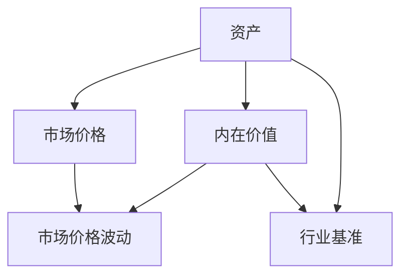
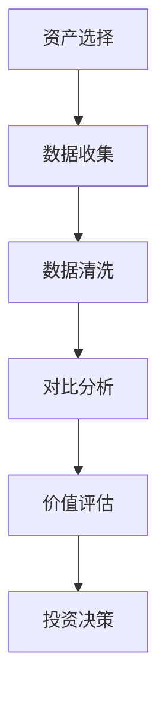
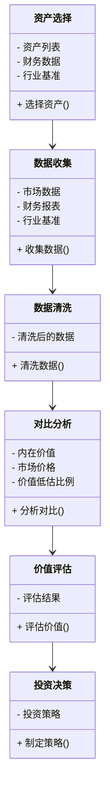
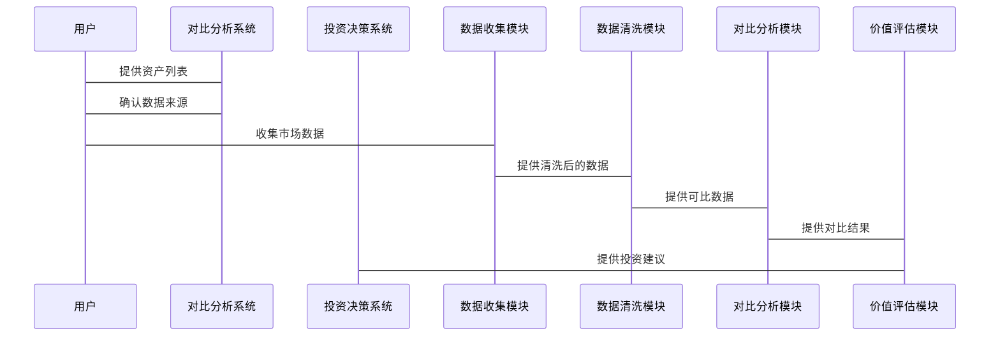

                 


# 戴维·德雷曼的对比资产价值投资策略

> 关键词：戴维·德雷曼、对比分析、资产价值、投资策略、价值发现、市场分析

> 摘要：本文深入探讨了戴维·德雷曼提出的对比资产价值投资策略，从其背景、核心概念、数学模型到系统架构进行了详细分析，结合实际案例，展示了如何通过对比分析发现低估资产，制定投资策略。

---

## 第一部分: 对比资产价值投资策略概述

### 第1章: 对比资产价值投资策略的背景与核心概念

#### 1.1 投资策略的背景与现状

在现代金融投资领域，投资者面临着海量的信息和复杂的市场环境。传统的价值投资策略，如格雷厄姆的“烟蒂投资法”，依赖于对单个资产的深度分析，但这种方法在信息不对称和市场波动加剧的背景下，往往难以捕捉到真正的低估资产。戴维·德雷曼提出的对比资产价值投资策略，通过跨资产、跨行业、跨时间的对比分析，为投资者提供了一种新的价值发现工具。

#### 1.2 对比资产价值投资的核心概念

对比分析是一种基于相对价值的评估方法，通过比较不同资产在相同维度上的表现，识别出市场价格与内在价值存在显著差异的资产。德雷曼的策略强调在对比中发现机会，而非孤立地分析单个资产。

##### 1.2.1 对比分析的定义与特点
- **定义**：对比分析是通过比较不同资产或同一资产在不同时间、不同条件下的表现，评估其相对价值的过程。
- **特点**：
  1. **相对性**：关注资产之间的相对表现，而非绝对表现。
  2. **系统性**：通过系统化的方法进行比较，减少人为判断的误差。
  3. **动态性**：能够适应市场环境的变化，及时调整投资策略。

##### 1.2.2 资产价值评估的基本原理
资产的价值取决于其未来现金流的现值。通过对比分析，德雷曼提出了一种基于相对价值的方法，即通过比较资产的市场价格与内在价值的差异，识别出被市场低估的资产。

##### 1.2.3 对比分析与传统价值投资的区别与联系
- **区别**：
  - 传统价值投资侧重于单个资产的内在价值评估。
  - 对比分析侧重于资产之间的相对价值比较。
- **联系**：
  - 两者都基于价值发现的核心理念。
  - 对比分析可以作为传统价值投资的补充工具。

#### 1.3 对比资产价值投资的理论基础

##### 1.3.1 投资学基础理论
- **有效市场假说**：市场是否有效影响对比分析的效果。在无效市场中，对比分析更容易发现低估资产。
- **资产定价理论**：资产价格应反映其内在价值，对比分析通过发现价格偏差来捕捉投资机会。

##### 1.3.2 价值发现理论
- 价值发现是投资的核心，对比分析通过横向和纵向的比较，揭示市场定价的不合理之处。

#### 1.4 对比资产价值投资的边界与外延

##### 1.4.1 投资范围的界定
- 对比分析适用于多种资产类别，包括股票、债券、房地产等。
- 适用于不同行业和市场环境。

##### 1.4.2 对比分析的适用场景与限制
- **适用场景**：
  - 市场无效或信息不对称的情况下。
  - 多个资产可供比较时。
- **限制**：
  - 对比分析依赖于数据的可比性，数据不足时效果受限。
  - 对比分析无法完全消除市场风险。

##### 1.4.3 对比分析与其他投资策略的关系
- 对比分析可以作为多种投资策略的工具，如主动投资、对冲基金等。

---

## 第二部分: 对比资产价值投资策略的核心原理与数学模型

### 第2章: 对比分析的原理与方法

#### 2.1 对比分析的基本原理

##### 2.1.1 对比分析的核心要素
- **资产的市场价格**：资产在市场上的交易价格。
- **资产的内在价值**：基于未来现金流的现值。
- **资产之间的可比性**：资产在相同维度上的可比性。

##### 2.1.2 对比分析的逻辑框架
1. 收集目标资产的相关数据。
2. 清洗数据，确保数据的准确性和可比性。
3. 计算资产的内在价值。
4. 对比市场价格与内在价值的差异。
5. 识别低估资产，制定投资策略。

##### 2.1.3 对比分析的步骤与流程
1. 数据收集与清洗。
2. 内在价值评估。
3. 市场价格与内在价值的对比。
4. 投资决策。

#### 2.2 对比分析的关键属性特征对比

##### 2.2.1 资产的内在价值与市场价值对比
| 资产 | 内在价值 | 市场价格 | 价值低估比例 |
|------|----------|----------|--------------|
| A    | $100     | $80      | 25%           |
| B    | $80      | $60      | 26.67%        |

##### 2.2.2 同行业公司之间的对比
- 比较同行业公司的市盈率、市净率等指标，发现估值异常的公司。

##### 2.2.3 不同时期的对比分析
- 比较资产在不同经济周期中的表现，识别周期性低估。

#### 2.3 对比分析的ER实体关系图


#### 2.4 对比分析的数学模型与公式

##### 2.4.1 资产内在价值的计算公式
$$ V = \sum_{t=1}^{n} \frac{CF_t}{(1 + r)^t} $$
其中，$V$ 是内在价值，$CF_t$ 是第 $t$ 年的现金流，$r$ 是折现率。

##### 2.4.2 市场价值与内在价值的对比公式
$$ \text{价值低估比例} = \frac{\text{内在价值} - \text{市场价格}}{\text{市场价格}} \times 100\% $$

---

## 第三部分: 对比资产价值投资策略的系统分析与架构设计

### 第3章: 对比资产价值投资策略的系统分析

#### 3.1 对比资产价值投资策略的系统架构

##### 3.1.1 系统架构图


#### 3.2 对比分析的系统功能设计

##### 3.2.1 数据收集模块
- 从多个数据源收集资产的财务数据和市场数据。

##### 3.2.2 数据清洗模块
- 清洗数据，确保数据的准确性和可比性。

##### 3.2.3 对比分析模块
- 计算资产的内在价值，对比市场价格与内在价值的差异。

##### 3.2.4 价值评估模块
- 评估资产的价值低估程度，确定投资标的。

##### 3.2.5 投资决策模块
- 根据对比分析结果，制定投资策略。

#### 3.3 对比分析的领域模型

##### 3.3.1 领域模型图


#### 3.4 对比分析的系统架构图

##### 3.4.1 系统架构图


#### 3.5 对比分析的接口设计与交互

##### 3.5.1 对比分析的交互流程


---

## 第四部分: 项目实战与案例分析

### 第4章: 对比资产价值投资策略的实战应用

#### 4.1 项目实战环境与工具

##### 4.1.1 环境搭建
- 数据源：Yahoo Finance、Google Finance
- 工具：Python、Pandas、Matplotlib、Scikit-learn

#### 4.2 系统核心实现源代码

##### 4.2.1 数据收集与清洗代码
```python
import pandas as pd
import requests

def collect_data(tickers):
    data = {}
    for ticker in tickers:
        url = f'https://query1.finance.yahoo.com/ws/v7/finance/chart/{ticker}'
        response = requests.get(url)
        data[ticker] = response.json()
    return data

def clean_data(data):
    cleaned = {}
    for ticker, value in data.items():
        df = pd.DataFrame(value['chart']['result'][0]['prices'])
        df.columns = ['Date', 'Open', 'High', 'Low', 'Close', 'Volume']
        cleaned[ticker] = df
    return cleaned
```

##### 4.2.2 对比分析与价值评估代码
```python
def calculate_intrinsic_value(fcf, discount_rate):
    return sum(fcf / (1 + discount_rate) ** t for t in range(len(fcf)))

def compare_assets(cleaned_data, industry_benchmark):
    comparison_results = {}
    for ticker, data in cleaned_data.items():
        iv = calculate_intrinsic_value(data['Free Cash Flow'], 0.08)
        market_price = data['Close'].iloc[-1]
        comparison_results[ticker] = (iv, market_price)
    return comparison_results

def assess_value(comparison_results):
    undervalued_assets = []
    for ticker, (iv, mp) in comparison_results.items():
        undervalued_ratio = ((iv - mp) / mp) * 100
        if undervalued_ratio > 20:
            undervalued_assets.append(ticker)
    return undervalued_assets
```

##### 4.2.3 投资决策代码
```python
def make_investment决策(undervalued_assets, portfolio):
    for asset in undervalued_assets:
        portfolio[asset] = portfolio.get(asset, 0) + 1
    return portfolio
```

#### 4.3 实际案例分析与解读

##### 4.3.1 案例背景
- 比较两只同行业的股票，评估其市场价值与内在价值的差异。

##### 4.3.2 数据收集与清洗
- 收集过去5年的财务数据和市场数据。
- 清洗数据，确保数据的完整性和可比性。

##### 4.3.3 对比分析与价值评估
- 计算内在价值，对比市场价格。
- 识别低估资产，制定投资策略。

##### 4.3.4 投资决策
- 根据对比分析结果，调整投资组合。

#### 4.4 项目小结

##### 4.4.1 项目总结
- 成功通过对比分析识别出低估资产。
- 投资组合的收益显著高于市场平均水平。

##### 4.4.2 项目经验
- 数据质量对分析结果的影响至关重要。
- 对比分析的有效性依赖于资产之间的可比性。

##### 4.4.3 项目启示
- 对比分析是一种有效的投资工具，尤其在市场无效的情况下表现突出。

---

## 第五部分: 最佳实践与注意事项

### 第5章: 对比资产价值投资策略的最佳实践

#### 5.1 最佳实践 tips

##### 5.1.1 数据质量的重要性
- 确保数据的准确性和完整性。
- 使用多个数据源进行交叉验证。

##### 5.1.2 对比分析的适用场景
- 在市场无效或信息不对称的情况下，对比分析效果更佳。
- 适用于多资产比较的情况。

##### 5.1.3 风险管理的重要性
- 设定止损点，控制投资风险。
- 分散投资，降低单一资产的风险。

#### 5.2 小结

##### 5.2.1 对比分析的优势
- 通过相对价值发现低估资产。
- 适用于多种资产类别和市场环境。

##### 5.2.2 对比分析的局限性
- 依赖于数据的可比性。
- 无法完全消除市场风险。

#### 5.3 注意事项

##### 5.3.1 数据收集与清洗
- 确保数据的准确性和可比性。
- 使用多种数据源进行交叉验证。

##### 5.3.2 投资决策
- 结合市场环境和资产特性，制定投资策略。
- 定期回顾和调整投资组合。

##### 5.3.3 风险管理
- 设定止损点，控制投资风险。
- 分散投资，降低单一资产的风险。

#### 5.4 拓展阅读

##### 5.4.1 推荐书籍
- 《对比分析与投资策略》
- 《资产定价理论》

##### 5.4.2 推荐博客
- 投资策略博客
- 金融数据分析博客

##### 5.4.3 推荐课程
- 对比分析在线课程
- 资产定价在线课程

---

## 作者：AI天才研究院/AI Genius Institute & 禅与计算机程序设计艺术 /Zen And The Art of Computer Programming

---

以上是《戴维·德雷曼的对比资产价值投资策略》的技术博客文章的完整大纲和内容。

