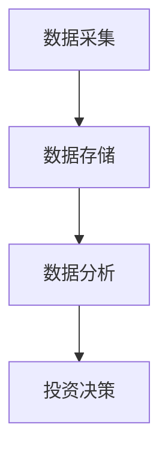
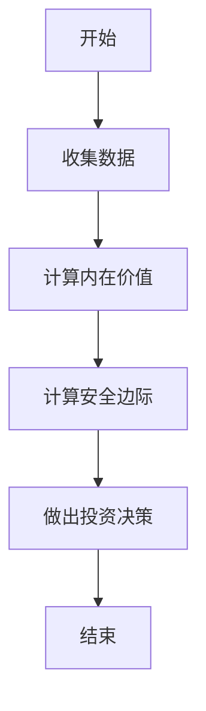
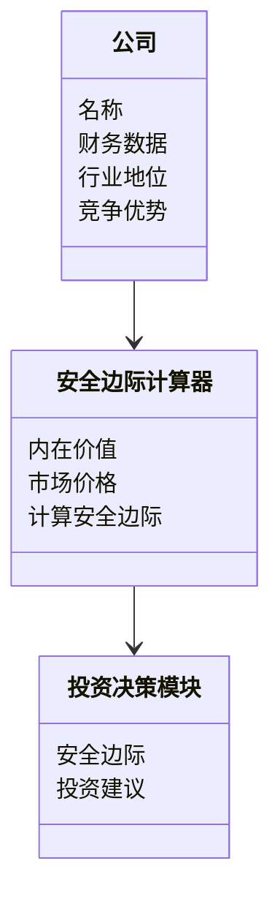
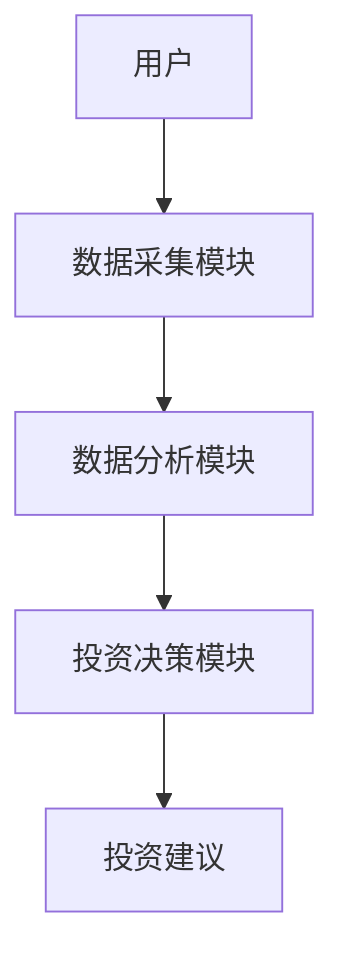
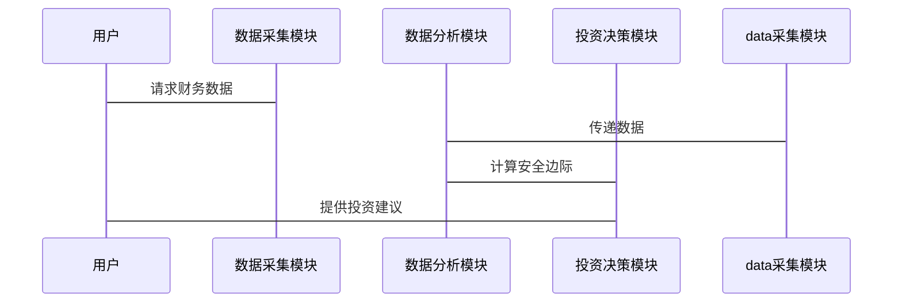

                 


```markdown
# 戴维德雷曼的价值投资方法

## 关键词：价值投资，戴维德雷曼，安全边际，内在价值，基本面分析，长期投资

## 摘要： 
本文系统地介绍了戴维德雷曼的价值投资方法，从其核心概念到算法实现，再到系统架构设计，最后通过项目实战和最佳实践，全面解析了这一投资策略。文章深入探讨了安全边际、内在价值等关键概念，并结合实际案例，展示了如何将这些理论应用于实践。

---

# 第1章 价值投资的背景与核心概念

## 1.1 价值投资的起源与发展

### 1.1.1 价值投资的起源
- 价值投资的起源可以追溯到20世纪初，由本杰明·格雷厄姆和戴维德雷曼共同提出。
- 格雷厄姆的学生戴维德雷曼进一步发展了这一理论，并将其系统化。

### 1.1.2 价值投资的核心理念
- 价值投资的核心理念是寻找市场价格低于内在价值的股票进行投资。
- 强调安全边际的重要性，即市场价格与内在价值之间的差距。

### 1.1.3 戴维德雷曼的贡献与影响
- 戴维德雷曼通过《股票投资价值分析》一书，系统地阐述了价值投资的方法论。
- 他的方法被广泛应用于机构投资和个人投资中。

## 1.2 价值投资的核心概念

### 1.2.1 安全边际的定义与作用
- 安全边际是指市场价格与内在价值之间的差额，用于降低投资风险。
- 通过安全边际，投资者可以在市场价格波动时，依然保持投资的稳定性。

### 1.2.2 内在价值的计算方法
- 内在价值是基于公司基本面分析得出的公司股票的合理价格。
- 主要包括对公司财务状况、盈利能力、成长能力等多方面的分析。

### 1.2.3 市场先生与投资者的关系
- 市场先生是戴维德雷曼提出的比喻，指市场情绪的波动性。
- 投资者应避免被市场情绪左右，而是应基于基本面进行理性决策。

## 1.3 戴维德雷曼投资方法的框架

### 1.3.1 基本面分析的重要性
- 基本面分析是价值投资的核心，包括对公司的财务状况、行业地位、竞争优势等的分析。

### 1.3.2 安全边际的应用原则
- 在投资时，应选择市场价格远低于内在价值的股票，以确保足够的安全边际。

### 1.3.3 长期投资的策略选择
- 价值投资强调长期持有，避免频繁交易，以减少交易成本和情绪影响。

## 1.4 价值投资与成长投资的对比

### 1.4.1 价值投资的特点
- 低市盈率、低市净率，市场价格低于内在价值。

### 1.4.2 成长投资的特点
- 高成长性，愿意为未来增长支付较高的溢价。

### 1.4.3 两种投资策略的优缺点
- 价值投资的风险较低，但可能错过快速增长的机会。
- 成长投资的潜在回报高，但风险也更大。

## 1.5 本章小结
- 本章介绍了价值投资的背景、核心概念以及戴维德雷曼的贡献，同时对比了价值投资与成长投资的区别。

---

# 第2章 价值投资的核心原理

## 2.1 安全边际的数学模型

### 2.1.1 安全边际的定义公式
$$ 安全边际 = 内在价值 - 市场价格 $$

### 2.1.2 安全边际与内在价值的关系
- 安全边际越大，投资风险越小。
- 安全边际是衡量投资安全性的关键指标。

### 2.1.3 安全边际的计算方法
1. 计算内在价值。
2. 比较市场价格与内在价值的差距。
3. 确保安全边际在合理范围内。

## 2.2 内在价值的计算方法

### 2.2.1 内在价值的定义
- 内在价值是基于公司未来现金流的现值。

### 2.2.2 内在价值的计算公式
$$ 内在价值 = \sum_{t=1}^{n} \frac{CF_t}{(1+r)^t} $$
其中，CF_t是第t年的现金流，r是折现率。

### 2.2.3 内在价值与市场价格的对比
- 当市场价格 < 内在价值时，股票被低估，适合投资。

## 2.3 市场情绪与投资决策

### 2.3.1 市场情绪的波动性
- 市场情绪受投资者心理影响，波动剧烈。
- 投资者应避免被短期市场波动影响决策。

### 2.3.2 市场情绪对投资决策的影响
- 当市场恐慌时，可能出现投资机会。
- 当市场狂热时，可能引发泡沫。

### 2.3.3 如何避免情绪化决策
- 坚持基本面分析，避免被市场情绪左右。

## 2.4 价值投资的风险控制

### 2.4.1 风险控制的重要性
- 风险控制是价值投资的重要组成部分。

### 2.4.2 如何通过分散投资降低风险
- 将资金分散投资于多个股票，降低单一股票的风险。

### 2.4.3 安全边际在风险控制中的作用
- 通过确保足够的安全边际，降低投资的本金损失风险。

## 2.5 本章小结
- 本章详细讲解了安全边际的数学模型、内在价值的计算方法，以及如何通过风险控制和分散投资来降低投资风险。

---

# 第3章 戴维德雷曼投资方法的系统分析

## 3.1 投资系统的核心模块

### 3.1.1 基本面分析模块
- 包括对公司的财务状况、行业地位、竞争优势等的分析。

### 3.1.2 安全边际计算模块
- 计算内在价值与市场价格的差额，确定安全边际。

### 3.1.3 投资决策模块
- 基于安全边际和内在价值，做出投资决策。

## 3.2 系统架构设计

### 3.2.1 系统功能模块划分
- 数据采集模块：收集公司财务数据。
- 数据分析模块：计算内在价值和安全边际。
- 投资决策模块：基于分析结果做出投资决策。

### 3.2.2 系统流程图设计


### 3.2.3 系统接口设计
- 数据接口：与财务数据源对接。
- 用户接口：供投资者查询分析结果。

## 3.3 系统的实现与优化

### 3.3.1 系统实现的关键步骤
1. 数据采集：收集目标公司的财务报表。
2. 数据分析：计算内在价值和安全边际。
3. 投资决策：基于分析结果，决定是否投资。

### 3.3.2 系统优化的策略
- 提高数据分析的效率。
- 定期更新财务数据，确保分析结果的准确性。

### 3.3.3 系统维护与更新
- 定期检查系统运行状态。
- 根据市场变化，更新分析模型。

## 3.4 本章小结
- 本章从系统架构的角度，详细分析了戴维德雷曼投资方法的实现过程，并提出了优化和维护的策略。

---

# 第4章 价值投资的算法实现

## 4.1 安全边际计算算法

### 4.1.1 算法的数学模型
$$ 安全边际 = 内在价值 - 市场价格 $$

### 4.1.2 算法的实现步骤
1. 收集目标公司的财务数据。
2. 计算公司的内在价值。
3. 比较市场价格与内在价值，计算安全边际。

### 4.1.3 算法的优化建议
- 使用更精确的财务指标，提高计算的准确性。
- 考虑宏观经济因素，调整折现率。

## 4.2 内在价值计算算法

### 4.2.1 算法的数学公式
$$ 内在价值 = \sum_{t=1}^{n} \frac{CF_t}{(1+r)^t} $$

### 4.2.2 算法的实现流程
1. 确定公司未来现金流。
2. 选择合适的折现率。
3. 计算现金流的现值，得到内在价值。

### 4.2.3 算法的验证方法
- 对比历史数据，验证计算结果的准确性。

## 4.3 投资决策算法

### 4.3.1 算法的逻辑流程


### 4.3.2 算法的实现代码
```python
def calculate_intrinsic_value(cash_flows, discount_rate):
    return sum(cash_flow / (1 + discount_rate) ** t for t, cash_flow in enumerate(cash_flows))

def calculate_margin_of_safety(intrinsic_value, market_price):
    return intrinsic_value - market_price

# 示例
cash_flows = [100, 120, 150, 200]  # 每年的现金流
discount_rate = 0.10  # 折现率
market_price = 500  # 市场价格

intrinsic_value = calculate_intrinsic_value(cash_flows, discount_rate)
margin_of_safety = calculate_margin_of_safety(intrinsic_value, market_price)

print(f"内在价值: {intrinsic_value}")
print(f"安全边际: {margin_of_safety}")
```

## 4.4 本章小结
- 本章详细讲解了安全边际和内在价值的计算方法，并通过Python代码展示了算法的实现过程。

---

# 第5章 价值投资的系统分析与架构设计

## 5.1 系统功能设计

### 5.1.1 领域模型mermaid类图


### 5.1.2 系统架构设计mermaid架构图


## 5.2 系统接口设计

### 5.2.1 系统接口
- 数据接口：与财务数据源对接。
- 用户接口：供投资者查询分析结果。

## 5.3 系统交互mermaid序列图



## 5.4 本章小结
- 本章从系统架构的角度，详细分析了戴维德雷曼投资方法的实现过程，并提出了优化和维护的策略。

---

# 第6章 价值投资的项目实战

## 6.1 环境安装

### 6.1.1 安装Python
- 安装Python 3.8或更高版本。

### 6.1.2 安装必要的库
- 安装`pandas`、`numpy`、`scipy`等库。

## 6.2 系统核心实现源代码

### 6.2.1 基本面分析模块
```python
import pandas as pd
import numpy as np

def analyze_financials(finance_data):
    # 计算盈利能力
    ROE = finance_data['净利润'] / finance_data['股东权益']
    # 计算成长能力
    revenue_growth = finance_data['营业收入'].pct_change()
    return {'ROE': ROE, 'revenue_growth': revenue_growth}
```

### 6.2.2 安全边际计算模块
```python
def calculate_margin_of_safety(intrinsic_value, market_price):
    return intrinsic_value - market_price
```

### 6.2.3 投资决策模块
```python
def make_investment_decision(margin_of_safety, threshold):
    if margin_of_safety > threshold:
        return "买入"
    else:
        return "观望"
```

## 6.3 代码应用解读与分析

### 6.3.1 基本面分析模块的实现
- 该模块用于分析公司的财务状况，计算ROE和收入增长率等指标。

### 6.3.2 安全边际计算模块的实现
- 该模块基于基本面分析的结果，计算安全边际，判断投资的安全性。

### 6.3.3 投资决策模块的实现
- 该模块基于安全边际和预设的阈值，做出买入或观望的投资决策。

## 6.4 实际案例分析

### 6.4.1 案例背景
- 公司名称：XYZ公司。
- 市场价格：$50。
- 内在价值：$60。

### 6.4.2 安全边际计算
$$ 安全边际 = 60 - 50 = 10 $$

### 6.4.3 投资决策
- 安全边际为10，高于预设阈值，建议买入。

## 6.5 本章小结
- 本章通过实际案例，展示了如何将戴维德雷曼的价值投资方法应用于实际投资决策中。

---

# 第7章 价值投资的最佳实践

## 7.1 小结

### 7.1.1 核心要点回顾
- 价值投资的核心是寻找市场价格低于内在价值的股票。
- 安全边际是降低投资风险的关键因素。

### 7.1.2 投资策略总结
- 长期持有，避免频繁交易。
- 分散投资，降低单一投资的风险。

## 7.2 最佳实践 Tips

### 7.2.1 长期投资的重要性
- 长期投资能够降低交易成本，避免短期波动的影响。

### 7.2.2 分散投资的风险控制
- 将资金分散投资于多个股票，降低单一股票的风险。

### 7.2.3 持续学习与更新
- 市场环境不断变化，投资者需要持续学习，更新投资策略。

## 7.3 注意事项

### 7.3.1 避免情绪化决策
- 投资者应避免被市场情绪左右，坚持基本面分析。

### 7.3.2 定期复核投资组合
- 定期检查投资组合，确保安全边际仍在合理范围内。

### 7.3.3 保持耐心和纪律性
- 长期投资需要耐心和纪律性，避免盲目跟风。

## 7.4 拓展阅读

### 7.4.1 推荐书籍
- 《股票投资价值分析》——戴维德雷曼。
- 《投资之道》——约翰·特雷纳。

### 7.4.2 推荐博客和网站
- [Value Investing Blog](https://www.valueinvesting.com)
- [投资与投机](https://investors.com)

## 7.5 本章小结
- 本章总结了价值投资的最佳实践，提供了投资策略的建议，并推荐了进一步阅读的资料。

---

# 作者：AI天才研究院/AI Genius Institute & 禅与计算机程序设计艺术/Zen And The Art of Computer Programming
```

