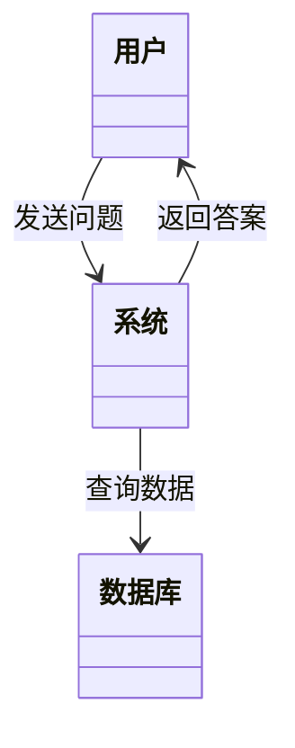
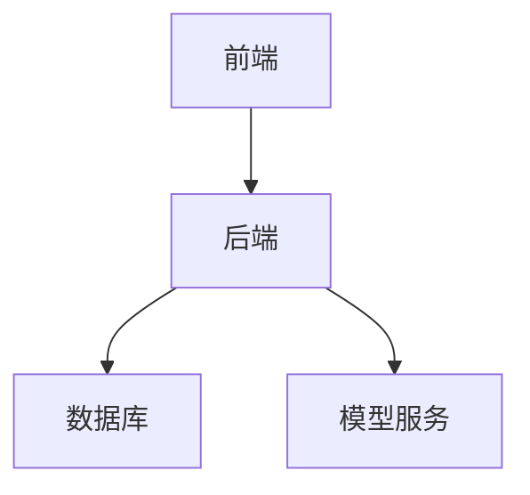
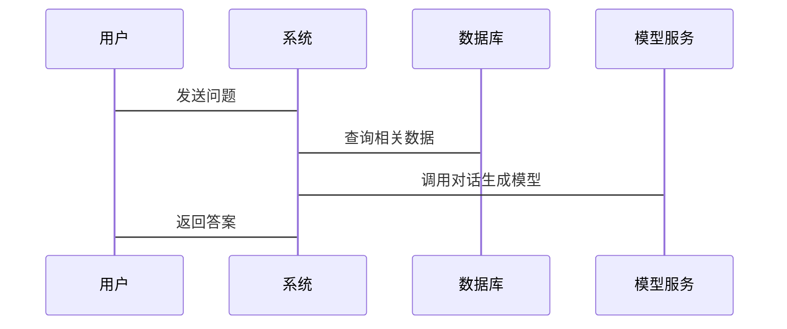

                 


# 打造智能化金融咨询聊天机器人

---

## 关键词

智能化金融咨询，聊天机器人，自然语言处理，机器学习，金融知识图谱

---

## 摘要

随着人工智能技术的快速发展，金融咨询领域正逐步向智能化方向转型。本文将详细探讨如何打造一个智能化的金融咨询聊天机器人，涵盖从背景分析到系统设计、算法实现的全过程。文章首先介绍智能化金融咨询的背景和需求，然后深入分析聊天机器人的核心技术和其在金融领域的应用潜力。接着，从系统架构、算法原理、数学模型等多维度展开，详细讲解金融咨询聊天机器人的实现过程。最后，通过项目实战和最佳实践，总结经验并展望未来发展方向。

---

## 第一部分: 智能化金融咨询的背景与需求

### 第1章: 背景介绍

#### 1.1 智能化金融咨询的背景

##### 1.1.1 传统金融咨询的局限性
传统金融咨询依赖人工服务，存在效率低、成本高、覆盖范围有限等问题。随着客户数量的增加，人工咨询难以满足大规模需求，且容易出现人为错误。

##### 1.1.2 人工智能技术的发展与应用
近年来，自然语言处理（NLP）、机器学习和深度学习等技术的快速发展，为金融咨询的智能化提供了技术支撑。例如，基于预训练语言模型（如GPT、BERT）的对话生成技术，显著提升了聊天机器人的交互能力。

##### 1.1.3 金融咨询智能化的必要性
智能化金融咨询能够提高服务效率、降低成本、扩大服务范围，并为客户提供个性化的投资建议。特别是在疫情期间，远程咨询需求激增，智能化咨询的重要性更加凸显。

#### 1.2 聊天机器人的概念与特点

##### 1.2.1 聊天机器人的定义与分类
聊天机器人是一种能够理解并生成自然语言的自动化系统，分为基于规则的聊天机器人和基于模型的聊天机器人。前者依赖预设的规则，适用于简单的任务；后者基于深度学习模型，能够处理复杂的对话场景。

##### 1.2.2 聊天机器人的核心功能
- 多轮对话能力
- 情境理解与记忆
- 自然语言生成
- 多模态交互（文本、语音、图像等）

##### 1.2.3 聊天机器人在金融领域的应用潜力
在金融领域，聊天机器人可以用于客户咨询、投资建议、金融产品推荐、市场分析等领域。通过实时数据分析，聊天机器人能够为客户提供精准的金融服务。

#### 1.3 金融咨询与聊天机器人的结合

##### 1.3.1 金融咨询的核心问题与挑战
- 客户需求多样且复杂
- 数据隐私与安全问题
- 模型的可解释性与准确性

##### 1.3.2 聊天机器人在金融咨询中的优势
- 7x24小时服务，提高客户满意度
- 大规模数据分析能力，提供个性化建议
- 成本低，覆盖更广泛客户群体

##### 1.3.3 金融咨询聊天机器人的目标与边界
目标是通过智能化技术，为客户提供高效、准确、个性化的金融咨询服务。边界包括不处理复杂金融交易，不涉及法律咨询等非金融领域问题。

---

### 第2章: 核心概念与联系

#### 2.1 自然语言处理（NLP）原理

##### 2.1.1 NLP的基本概念与技术
NLP是人工智能的核心技术之一，旨在让计算机能够理解、处理和生成人类语言。常用技术包括词袋模型、词嵌入（如Word2Vec）、句嵌入（如BERT）等。

##### 2.1.2 NLP在金融咨询中的应用
- 金融文本分类（如新闻 sentiment 分析）
- 金融实体识别（如公司名称、日期、金额等）
- 金融对话生成（如回答客户问题）

##### 2.1.3 常见的NLP模型与工具
- 预训练模型：BERT、GPT、ALBERT
- 工具：spaCy、NLTK、HanLP

#### 2.2 机器学习与深度学习

##### 2.2.1 机器学习的基本原理
机器学习通过数据训练模型，使其能够从数据中学习规律并进行预测或分类。常用算法包括线性回归、支持向量机（SVM）、随机森林等。

##### 2.2.2 深度学习的核心技术
深度学习通过多层神经网络提取数据特征，常见模型包括卷积神经网络（CNN）、循环神经网络（RNN）、 transformers（如BERT）。

##### 2.2.3 机器学习在金融咨询中的应用案例
- 客户意图识别
- 金融风险评估
- 投资组合优化

#### 2.3 金融知识图谱

##### 2.3.1 知识图谱的定义与构建
知识图谱是一种结构化数据，用于表示实体及其关系。在金融领域，知识图谱可以表示公司、行业、市场等信息。

##### 2.3.2 金融知识图谱的应用场景
- 实体关系推理
- 金融事件抽取
- 知识推理问答

##### 2.3.3 知识图谱与聊天机器人的结合
通过知识图谱，聊天机器人可以更好地理解金融领域的专业知识，提供更准确的咨询服务。

---

## 第3章: 金融咨询聊天机器人的系统架构

### 3.1 系统架构设计

#### 3.1.1 模块化设计原则
系统分为前端和后端，前端负责用户交互，后端负责数据处理和模型调用。

#### 3.1.2 系统的分层架构
- 用户界面层
- 对话管理层
- 数据处理层
- 模型服务层

#### 3.1.3 各模块之间的交互关系
用户通过前端发送问题，对话管理层解析意图，调用数据处理层进行数据检索或模型推理，最终返回结果。

---

### 3.2 数据流与信息处理

#### 3.2.1 数据输入与预处理
- 数据清洗：去除噪声数据
- 数据标注：标注实体和意图
- 数据增强：增加训练数据多样性

#### 3.2.2 模型训练与优化
- 预训练模型微调：在金融领域数据上进行微调
- 模型优化：通过交叉验证选择最优参数

#### 3.2.3 结果输出与反馈
- 对话生成：基于模型预测生成回答
- 用户反馈：收集用户反馈优化模型

---

### 3.3 系统性能与优化

#### 3.3.1 系统性能的评估指标
- 响应时间：系统处理每个请求的时间
- 对话准确率：回答的正确性
- 用户满意度：用户的反馈评价

#### 3.3.2 系统优化的策略与方法
- 并行计算：提升模型推理速度
- 增量学习：动态更新模型
- 负载均衡：分散请求流量

#### 3.3.3 系统可扩展性与维护性
- 模块化设计：便于功能扩展
- 容错设计：确保系统稳定性
- 日志记录：便于问题排查

---

## 第4章: 金融咨询聊天机器人的算法原理

### 4.1 预训练语言模型

#### 4.1.1 BERT模型的原理与特点
BERT通过双向训练和自注意力机制，能够捕捉文本中的上下文信息。

#### 4.1.2 GPT模型的原理与特点
GPT通过生成式的语言模型，能够生成连贯的对话内容。

#### 4.1.3 其他主流预训练模型的比较
比较BERT、GPT、ALBERT等模型的优缺点，分析其在金融咨询中的适用场景。

---

### 4.2 金融领域微调

#### 4.2.1 微调的定义与作用
微调是将预训练模型在特定领域数据上进行进一步训练，以提升模型在该领域的性能。

#### 4.2.2 微调的具体步骤与方法
- 数据收集：收集金融领域的文本数据
- 数据预处理：清洗和标注数据
- 模型微调：使用微调数据训练模型

#### 4.2.3 微调对模型性能的影响
微调可以显著提高模型在特定领域的准确性和流畅性。

---

### 4.3 对话生成算法

#### 4.3.1 基于生成对抗网络（GAN）的对话生成
GAN通过生成器和判别器的对抗训练，生成更自然的对话内容。

#### 4.3.2 基于强化学习的对话生成
强化学习通过奖励机制，优化对话生成的质量。

#### 4.3.3 对话生成的评估指标与优化方法
常用指标包括BLEU、ROUGE、METEOR等，通过这些指标优化生成内容的质量。

---

## 第5章: 金融咨询聊天机器人的数学模型与公式

### 5.1 概率论基础

#### 5.1.1 概率分布的定义与类型
概率分布描述随机变量取值的概率，常见类型包括均匀分布、正态分布、二项分布等。

#### 5.1.2 条件概率与贝叶斯定理
条件概率公式：
$$ P(A|B) = \frac{P(B|A)P(A)}{P(B)} $$
贝叶斯定理是条件概率的基础，广泛应用于分类问题。

#### 5.1.3 概率论在NLP中的应用
- 语言模型的概率表示
- 隐马尔可夫模型（HMM）的应用

### 5.2 深度学习中的损失函数

#### 5.2.1 损失函数的定义与作用
损失函数衡量模型预测值与真实值的差异，是模型优化的核心。

#### 5.2.2 常见的损失函数及其公式
- 均方误差（MSE）：
$$ \text{MSE} = \frac{1}{n}\sum_{i=1}^{n}(y_i - \hat{y}_i)^2 $$
- 交叉熵损失：
$$ \text{CrossEntropy} = -\frac{1}{n}\sum_{i=1}^{n} y_i \log(\hat{y}_i) $$

#### 5.2.3 损失函数在模型训练中的应用
通过最小化损失函数，优化模型参数，提升模型性能。

### 5.3 模型评估与优化

#### 5.3.1 评估指标的定义与计算公式
- 准确率：
$$ \text{Accuracy} = \frac{\text{正确预测数}}{\text{总预测数}} $$
- 召回率：
$$ \text{Recall} = \frac{\text{正确预测的正例数}}{\text{实际正例数}} $$
- F1分数：
$$ F1 = 2 \times \frac{\text{Precision} \times \text{Recall}}{\text{Precision} + \text{Recall}} $$

#### 5.3.2 模型优化的数学原理
通过梯度下降优化模型参数，常用算法包括随机梯度下降（SGD）和Adam优化器。

#### 5.3.3 正则化技术的数学表达
- L2正则化：
$$ \text{L2} = \lambda \sum_{i=1}^{n} \theta_i^2 $$
- L1正则化：
$$ \text{L1} = \lambda \sum_{i=1}^{n} |\theta_i| $$

---

## 第6章: 金融咨询聊天机器人的系统分析与架构设计

### 6.1 项目背景与目标

#### 6.1.1 项目背景
随着金融行业的数字化转型，客户对智能化金融服务的需求日益增长。本项目旨在开发一款智能化金融咨询聊天机器人，为客户提供高效、个性化的咨询服务。

#### 6.1.2 项目目标
- 实现多轮对话功能
- 提供个性化投资建议
- 支持多种金融场景（如股票、基金、保险等）

---

### 6.2 系统功能设计

#### 6.2.1 领域模型
通过Mermaid绘制领域模型图，展示系统的各个功能模块及其交互关系。



---

#### 6.2.2 系统架构设计
通过Mermaid绘制系统架构图，展示系统的各个组件及其交互关系。



---

#### 6.2.3 接口设计
定义系统的API接口，包括用户输入接口、模型调用接口、数据存储接口等。

---

#### 6.2.4 交互设计
通过Mermaid绘制交互序列图，展示用户与系统之间的对话流程。



---

## 第7章: 项目实战

### 7.1 环境安装

#### 7.1.1 安装Python与相关库
安装Python 3.8以上版本，安装库包括：
- `transformers`
- `torch`
- `scikit-learn`

#### 7.1.2 安装NLP工具
安装`spaCy`和中文分词工具`jieba`。

---

### 7.2 核心代码实现

#### 7.2.1 数据预处理代码
```python
import pandas as pd
from transformers import BertTokenizer, BertForQuestionAnswering
import torch

# 加载数据
data = pd.read_csv('financial_qa.csv')

# 初始化分词器
tokenizer = BertTokenizer.from_pretrained('bert-base-chinese')

# 数据预处理
def preprocess(data):
    input_text = data['question']
    label = data['answer']
    # 分词
    input_ids = tokenizer.encode(input_text, add_special_tokens=True)
    return input_ids, label

# 调用预处理函数
input_ids, label = preprocess(data)
```

---

#### 7.2.2 对话生成模型代码
```python
from transformers import GPT2LMHeadModel, GPT2Tokenizer

# 加载模型
model = GPT2LMHeadModel.from_pretrained('gpt2')
tokenizer = GPT2Tokenizer.from_pretrained('gpt2')

# 生成对话
def generate_response(prompt):
    inputs = tokenizer.encode(prompt, return_tensors='pt')
    outputs = model.generate(inputs, max_length=100, do_sample=True)
    response = tokenizer.decode(outputs[0], skip_special_tokens=True)
    return response

# 示例
prompt = "请问如何投资股票？"
response = generate_response(prompt)
print(response)
```

---

#### 7.2.3 系统功能实现
实现用户界面、对话管理、数据存储等功能。

---

### 7.3 实际案例分析

#### 7.3.1 案例背景
某客户询问：“近期股市波动大，如何配置资产？”

#### 7.3.2 系统处理流程
1. 用户输入问题
2. 系统解析意图
3. 调用模型生成回答
4. 返回结果

---

#### 7.3.3 案例分析与总结
通过案例分析，验证系统的功能和性能，总结经验教训，优化系统设计。

---

## 第8章: 最佳实践与总结

### 8.1 最佳实践

#### 8.1.1 数据质量的重要性
确保数据准确、完整，避免噪声干扰。

#### 8.1.2 模型选择与优化
根据具体场景选择合适的模型，并通过微调和优化提升性能。

#### 8.1.3 系统安全与隐私保护
加强数据加密和用户隐私保护，确保系统安全。

---

### 8.2 小结

本文详细探讨了打造智能化金融咨询聊天机器人的全过程，从背景分析到系统设计、算法实现，再到项目实战，全面覆盖了相关技术和实践。通过本文的学习，读者可以掌握智能化金融咨询的核心技术，并将其应用到实际项目中。

---

### 8.3 注意事项

- 确保模型的可解释性，避免“黑箱”操作
- 定期更新模型和数据，保持系统的先进性
- 处理金融数据时，严格遵守相关法律法规

---

### 8.4 拓展阅读

推荐阅读以下书籍和论文，深入了解相关技术：
- 《深度学习》（Deep Learning）—— Ian Goodfellow
- 《自然语言处理实战：基于深度学习》—— 宗成庆
- 《大话数据结构》—— 程杰

---

## 作者

作者：AI天才研究院/AI Genius Institute & 禅与计算机程序设计艺术/Zen And The Art of Computer Programming

---

**注意：本文是一个高度简化的示例，实际撰写时需要根据具体需求扩展每个部分的内容，确保文章的完整性和深度。**

