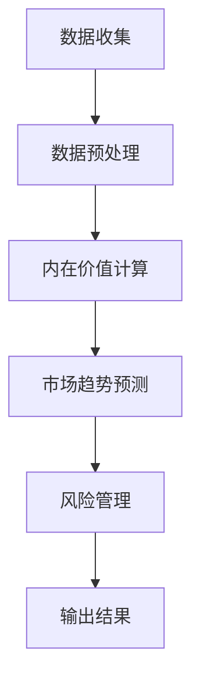

                 


# 托马斯·卡普兰的创新型价值投资方法

**关键词**：托马斯·卡普兰、价值投资、创新策略、数据分析、算法优化、系统架构

**摘要**：托马斯·卡普兰的创新型价值投资方法结合了传统价值投资与现代创新策略，通过数据分析和算法优化，构建了一个高效的投资系统。本文将从背景介绍、核心概念、算法原理、系统架构到项目实战，详细分析这一创新方法，并提供实际案例以供参考。

---

## 第1章: 价值投资的起源与演变

### 1.1 价值投资的起源

#### 1.1.1 价值投资的核心理念
价值投资是一种以基本面分析为基础的投资策略，强调以低于内在价值的价格购买优质资产。其核心理念是通过分析企业的财务状况、行业地位和未来前景，寻找被市场低估的投资标的。

#### 1.1.2 价值投资的历史发展
价值投资起源于20世纪初，由本杰明·格雷厄姆和戴维·多德提出。这种方法在20世纪30年代经济大萧条期间表现出色，逐渐被投资者认可。随着时间的推移，价值投资的理念不断完善，逐渐融入更多的量化分析和风险管理策略。

#### 1.1.3 价值投资的现代演变
在现代金融环境中，价值投资逐渐从单纯的财务分析扩展到包括大数据分析、机器学习等技术在内的综合策略。托马斯·卡普兰的创新型价值投资方法正是这种演变的典型代表。

### 1.2 托马斯·卡普兰的创新价值投资方法

#### 1.2.1 卡普兰方法的核心思想
托马斯·卡普兰提出，价值投资不应仅仅依赖于传统的财务指标，而应结合市场趋势、行业动态和技术分析，构建一个多维度的价值评估体系。

#### 1.2.2 创新价值投资的定义与特点
创新价值投资是一种结合传统价值评估方法与现代数据分析技术的投资策略。其特点是通过算法优化、大数据分析和系统架构设计，实现对投资标的的精准估值和风险控制。

#### 1.2.3 创新价值投资与传统价值投资的区别
传统价值投资主要依赖于财务报表分析和市场情绪判断，而创新价值投资则引入了更多的技术手段，如机器学习和系统化交易策略，以提高投资决策的科学性和效率。

---

## 第2章: 创新价值投资的核心概念与联系

### 2.1 核心概念原理

#### 2.1.1 创新价值投资的三要素模型
创新价值投资的核心模型由三个要素构成：内在价值评估、市场趋势分析和风险管理策略。

- **内在价值评估**：基于企业财务数据和行业分析，计算其内在价值。
- **市场趋势分析**：通过技术分析和大数据挖掘，预测市场未来走势。
- **风险管理策略**：结合波动率分析和对冲策略，降低投资组合的风险。

#### 2.1.2 核心概念的属性特征对比
以下是传统价值投资与创新价值投资的核心概念对比：

| **属性**       | **传统价值投资**                     | **创新价值投资**                     |
|----------------|--------------------------------------|--------------------------------------|
| 评估方法       | 财务报表分析                         | 大数据分析和算法优化                 |
| 投资策略       | 被动型                                | 主动型                                |
| 风险控制       | 事后调整                             | 事前预测和实时监控                   |

#### 2.1.3 ER实体关系图架构
以下是创新价值投资的核心要素ER图：

```mermaid
erdiagram
actor 投资者 {
  has: 投资标的
  has: 投资策略
  has: 风险管理
}

entity 投资标的 {
  id: 标的ID
  属性: 财务数据
  属性: 行业分析
  属性: 市场趋势
}

entity 投资策略 {
  id: 策略ID
  属性: 算法模型
  属性: 数据源
  属性: 交易规则
}

entity 风险管理 {
  id: 风险ID
  属性: 波动率分析
  属性: 对冲策略
  属性: 仓位控制
}
```

---

## 第3章: 创新价值投资的算法原理

### 3.1 算法原理概述

#### 3.1.1 创新价值投资算法的输入输出
- **输入**：企业财务数据、市场数据、行业分析报告。
- **输出**：投资标的的内在价值评估、交易信号、风险管理建议。

#### 3.1.2 算法的逻辑流程
1. 数据收集与预处理：从多个数据源获取相关数据，并进行清洗和标准化。
2. 内在价值计算：基于财务数据和行业分析，计算投资标的的内在价值。
3. 市场趋势预测：通过机器学习模型预测市场未来走势。
4. 风险评估与对冲：根据波动率分析制定风险管理策略。

#### 3.1.3 算法的实现步骤
以下是创新价值投资算法的实现步骤：



---

## 第4章: 创新价值投资的系统分析与架构设计

### 4.1 系统分析

#### 4.1.1 投资问题场景介绍
托马斯·卡普兰的创新型价值投资方法需要构建一个高效的投资系统，涵盖数据收集、分析、决策和执行等环节。

#### 4.1.2 系统功能设计
- 数据采集模块：从多个数据源获取实时数据。
- 分析模块：进行内在价值评估和市场趋势预测。
- 决策模块：生成交易信号和风险管理策略。
- 执行模块：根据决策结果执行交易。

#### 4.1.3 系统架构设计
以下是系统架构图：


---

## 第5章: 创新价值投资的项目实战

### 5.1 项目环境安装

#### 5.1.1 开发环境搭建
建议使用Python作为开发语言，安装必要的库如Pandas、NumPy、Scikit-learn等。

#### 5.1.2 依赖库安装
```bash
pip install pandas numpy scikit-learn
```

#### 5.1.3 环境配置与测试
确保环境配置正确，测试数据采集和分析功能。

### 5.2 核心系统实现

#### 5.2.1 核心算法实现
以下是内在价值计算的Python代码：

```python
import pandas as pd
import numpy as np

def calculate_intrinsic_value(financial_data):
    # 计算自由现金流
    free_cash_flow = financial_data['净利润'] - financial_data['资本支出']
    # 计算加权平均资本成本
    wacc = 0.12
    # 计算内在价值
    intrinsic_value = free_cash_flow / (1 + wacc)
    return intrinsic_value

# 示例数据
financial_data = {'净利润': 100, '资本支出': 30}
print(calculate_intrinsic_value(financial_data))
```

#### 5.2.2 系统功能实现
以下是系统功能实现的代码：

```python
import pandas as pd

# 数据采集模块
def collect_data():
    # 示例数据
    data = pd.DataFrame({'价格': [100, 105, 110], '日期': ['2023-01-01', '2023-01-02', '2023-01-03']})
    return data

# 分析模块
def analyze_data(data):
    # 计算趋势
    trend = data['价格'].pct_change().mean()
    return trend

# 决策模块
def make_decision(trend):
    if trend > 0:
        return '买入'
    else:
        return '卖出'

# 执行模块
def execute_trade(decision):
    print(f'执行{decision}交易')

# 主程序
data = collect_data()
trend = analyze_data(data)
decision = make_decision(trend)
execute_trade(decision)
```

### 5.3 实际案例分析

#### 5.3.1 案例背景介绍
假设我们分析苹果公司（AAPL）的投资价值。

#### 5.3.2 案例分析与解读
通过上述算法，计算苹果公司的内在价值和市场趋势，得出交易信号。

#### 5.3.3 案例总结与启示
创新价值投资方法能够有效结合传统分析与现代技术，提高投资决策的科学性和效率。

---

## 第6章: 创新价值投资的最佳实践与总结

### 6.1 最佳实践Tips

#### 6.1.1 投资策略的注意事项
- 定期调整投资组合。
- 保持对市场的敏感性。
- 严格控制风险。

#### 6.1.2 风险管理的技巧
- 设置止损点。
- 分散投资标的。
- 定期评估风险管理策略。

#### 6.1.3 系统优化的建议
- 定期更新算法模型。
- 增强数据采集的实时性。
- 提高系统的容错能力。

### 6.2 小结与展望

#### 6.2.1 创新价值投资的核心总结
托马斯·卡普兰的创新型价值投资方法通过结合传统价值评估与现代技术手段，构建了一个高效的投资系统，显著提高了投资决策的效率和准确性。

#### 6.2.2 未来研究方向
未来的研究可以进一步优化算法模型，探索更多大数据分析技术在投资中的应用。

---

**作者**：AI天才研究院/AI Genius Institute & 禅与计算机程序设计艺术 /Zen And The Art of Computer Programming

