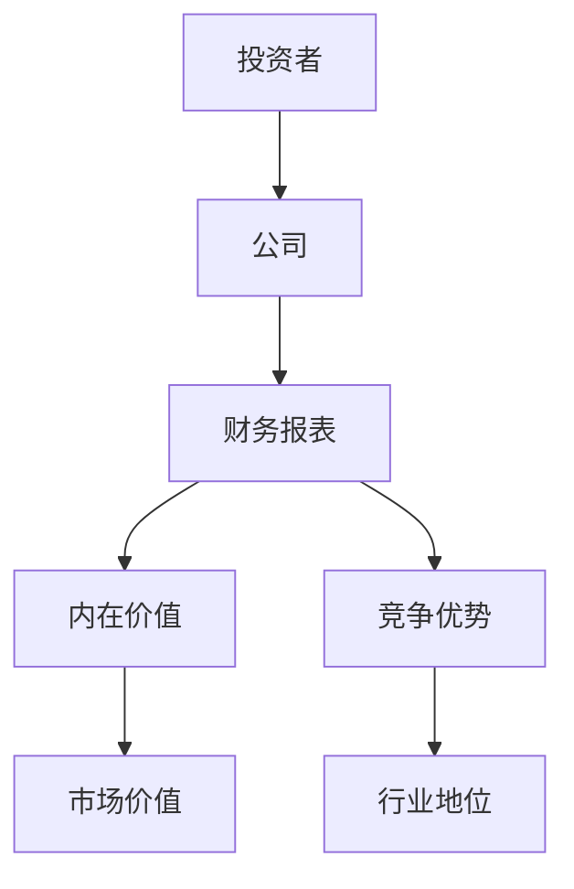

                 

# 托马斯·罗尼的价值投资审计：全面评估公司价值

## 关键词：价值投资审计, 内在价值, 安全边际, 财务报表分析, 投资组合构建, 风险管理

## 摘要：托马斯·罗尼的价值投资审计方法通过分析公司的财务状况、行业地位和竞争优势，结合安全边际和内在价值评估，帮助投资者做出明智的投资决策。本文系统地介绍了价值投资审计的核心概念、分析方法和实际应用，为投资者提供了全面的指导。

---

## 第一部分: 价值投资审计的背景与核心概念

### 第1章: 价值投资审计的背景与定义

#### 1.1 价值投资的基本概念
##### 1.1.1 价值投资的定义与核心理念
价值投资是一种以基本面分析为基础的投资策略，强调以低于内在价值的价格购买优质资产。其核心理念是通过深入研究公司的财务状况、行业地位和竞争优势，识别被市场低估的投资机会。

##### 1.1.2 价值投资与其它投资方法的对比
- **基本面分析 vs. 技术分析**：价值投资关注公司的内在价值，而技术分析关注价格走势和市场情绪。
- **长期投资 vs. 短期交易**：价值投资强调长期持有，而短期交易关注短期价格波动。
- **安全边际**：价值投资通过安全边际降低风险，而其他方法可能忽略风险因素。

##### 1.1.3 托马斯·罗尼的价值投资审计方法
托马斯·罗尼的价值投资审计方法结合了传统价值投资理念与现代数据分析技术，通过系统化的方法评估公司的内在价值和财务健康状况。

#### 1.2 价值投资审计的必要性
##### 1.2.1 投资者面临的常见问题
- 市场波动导致的投资决策失误。
- 信息不对称导致的选股困难。
- 财务造假和管理层欺诈的风险。

##### 1.2.2 价值投资审计如何解决这些问题
- 提供系统化的分析框架，降低信息不对称风险。
- 通过安全边际和内在价值评估，避免过度投机。
- 结合财务报表分析和行业研究，识别优质投资标的。

##### 1.2.3 价值投资审计的边界与外延
- **边界**：仅限于公司基本面分析，不涉及宏观经济预测。
- **外延**：结合行业分析和竞争优势评估，提供更全面的投资决策支持。

#### 1.3 价值投资审计的核心要素
##### 1.3.1 内在价值与市场价值的对比
- **内在价值**：公司未来现金流的现值，反映其真实价值。
- **市场价值**：市场价格，受市场情绪和外部因素影响。

##### 1.3.2 安全边际的概念与重要性
- 安全边际 = 内在价值 - 市场价格。
- 通过建立安全边际，降低投资风险，提高投资收益的稳定性。

##### 1.3.3 财务健康状况与竞争优势的评估
- 财务健康：通过财务报表分析评估公司的盈利能力、偿债能力和成长能力。
- 竞争优势：分析公司在行业中的地位、核心竞争力和未来发展前景。

### 第2章: 价值投资审计的核心概念与联系

#### 2.1 核心概念原理
##### 2.1.1 内在价值的计算方法
内在价值的计算通常采用现金流折现法（DCF模型）。公式如下：
$$
\text{内在价值} = \sum_{t=1}^{n} \frac{\text{现金流}_t}{(1 + r)^t} + \frac{\text{残值}}{(1 + r)^n}
$$
其中，$r$为折现率，$n$为永续期数。

##### 2.1.2 安全边际的确定策略
安全边际的确定需要考虑市场环境、行业周期和公司具体情况。一般情况下，建议的安全边际为内在价值的20%-30%。

##### 2.1.3 财务健康状况的评估标准
- 财务健康状况的评估包括盈利能力（ROE、ROA）、偿债能力（负债率、速动比率）和成长能力（收入增长率、净利润增长率）。

#### 2.2 核心概念属性特征对比表格
##### 表2-1: 内在价值与市场价值对比
| 属性 | 内在价值 | 市场价值 |
|------|----------|----------|
| 定义 | 公司未来现金流的现值 | 市场交易价格 |
| 影响因素 | 财务状况、行业地位、竞争优势 | 市场情绪、宏观经济、行业周期 |
| 变化规律 | 缓慢变化，受公司基本面影响 | 波动较大，受外部因素影响 |

##### 表2-2: 安全边际与投资风险对比
| 属性 | 安全边际 | 投资风险 |
|------|----------|----------|
| 定义 | 内在价值与市场价格的差额 | 投资可能面临的损失 |
| 影响因素 | 内在价值、市场价格 | 市场波动、公司风险、行业风险 |
| 变化规律 | 随市场价格波动而变化 | 随公司和市场变化而变化 |

##### 表2-3: 财务健康与竞争优势对比
| 属性 | 财务健康 | 竞争优势 |
|------|----------|----------|
| 定义 | 公司财务状况的健康程度 | 公司在行业中的竞争优势 |
| 影响因素 | 财务指标（ROE、负债率等） | 核心竞争力、市场地位、创新能力 |
| 变化规律 | 随公司经营状况变化 | 随行业竞争格局变化 |

#### 2.3 ER实体关系图架构

---

## 第二部分: 财务报表分析与价值评估

### 第3章: 财务报表分析的基本方法

#### 3.1 利润表分析
利润表反映了公司在一定时期内的收入和利润情况。主要指标包括：
- 营业收入：公司主营业务收入。
- 净利润：公司税后利润。
- 毛利率：（营业收入 - 营业成本）/ 营业收入。

#### 3.2 资产负债表分析
资产负债表反映了公司在某一特定时点的资产、负债和所有者权益情况。主要指标包括：
- 资产总额：公司拥有的全部资产。
- 负债总额：公司欠款的总金额。
- 净资产：资产总额减去负债总额。

#### 3.3 现金流量表分析
现金流量表反映了公司在一定时期内的现金流入和流出情况。主要指标包括：
- 经营活动现金流：公司经营活动产生的现金流量。
- 投资活动现金流：公司投资活动产生的现金流量。
- 筹资活动现金流：公司筹资活动产生的现金流量。

### 第4章: 财务指标的计算与解读

#### 4.1 常见财务指标公式
##### 4.1.1 净利润率
$$
\text{净利润率} = \frac{\text{净利润}}{\text{营业收入}} \times 100\%
$$

##### 4.1.2 负债率
$$
\text{负债率} = \frac{\text{负债总额}}{\text{资产总额}} \times 100\%
$$

##### 4.1.3 速动比率
$$
\text{速动比率} = \frac{\text{流动资产 - 存货}}{\text{流动负债}}
$$

#### 4.2 财务指标与价值评估的关系
- 净利润率高且稳定的公司具有较高的投资价值。
- 负债率低且可控的公司财务风险较小。
- 速动比率高的公司短期偿债能力较强。

#### 4.3 财务造假的识别方法
- 关注收入与利润的匹配性。
- 分析现金流是否真实。
- 警惕异常的关联交易。

---

## 第三部分: 行业分析与竞争优势

### 第5章: 行业分析与竞争优势

#### 5.1 行业分析的基本方法
- 行业生命周期分析：判断行业所处的阶段（幼稚期、成长期、成熟期、衰退期）。
- 行业集中度分析：分析行业内主要企业的市场份额。

#### 5.2 竞争优势的评估
- 核心竞争力：公司的技术优势、成本优势、品牌优势。
- 市场地位：公司在行业中的排名和影响力。

#### 5.3 行业案例分析
以科技行业为例，分析苹果公司的竞争优势：
- 技术创新能力强。
- 品牌影响力大。
- 全球市场份额高。

---

## 第四部分: 估值方法与投资组合构建

### 第6章: 估值方法

#### 6.1 现金流折现法（DCF模型）
##### 6.1.1 基本公式
$$
\text{企业价值} = \sum_{t=1}^{n} \frac{\text{自由现金流}_t}{(1 + r)^t} + \frac{\text{终值}}{(1 + r)^n}
$$

##### 6.1.2 折现率的确定
- 无风险利率 + 风险溢价。

#### 6.2 市盈率法
##### 6.2.1 市盈率公式
$$
\text{市盈率} = \frac{\text{股价}}{\text{每股收益}}
$$

##### 6.2.2 市盈率的应用
- 用于评估股票的估值是否合理。

#### 6.3 市净率法
##### 6.3.1 市净率公式
$$
\text{市净率} = \frac{\text{股价}}{\text{每股净资产}}
$$

##### 6.3.2 市净率的应用
- 适用于金融、房地产等资产驱动型行业。

### 第7章: 投资组合构建

#### 7.1 投资组合的目标与策略
- 资本增值。
- 风险分散。

#### 7.2 资产配置
- 根据风险承受能力和收益目标，确定股票、债券、现金等资产的比例。

#### 7.3 风险管理
- 定期调整投资组合，控制风险敞口。

---

## 第五部分: 风险管理与总结

### 第8章: 风险管理

#### 8.1 风险的种类
- 市场风险。
- 利率风险。
- 汇率风险。

#### 8.2 风险的度量与管理
- 使用波动率和VaR模型度量风险。
- 通过分散投资降低非系统性风险。

### 第9章: 总结与展望

#### 9.1 内容总结
- 价值投资审计的核心是内在价值评估和安全边际建立。
- 财务报表分析和行业研究是价值评估的重要工具。
- 投资组合构建和风险管理是实现长期收益的关键。

#### 9.2 未来展望
- 结合人工智能和大数据技术，提高价值投资审计的效率和准确性。
- 进一步完善估值模型，适应市场变化。

---

## 附录

### 附录A: 术语表
- 内在价值：公司未来现金流的现值。
- 安全边际：内在价值与市场价格的差额。
- 财务健康：公司财务状况的健康程度。

### 附录B: 案例分析
- 案例1：苹果公司的价值评估。
- 案例2：特斯拉的估值分析。

### 附录C: 工具与模板
- 财务报表分析模板。
- 估值模型计算工具。

---

## 作者：AI天才研究院/AI Genius Institute & 禅与计算机程序设计艺术 /Zen And The Art of Computer Programming

