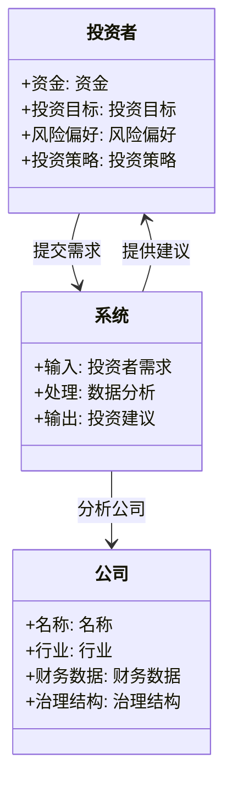
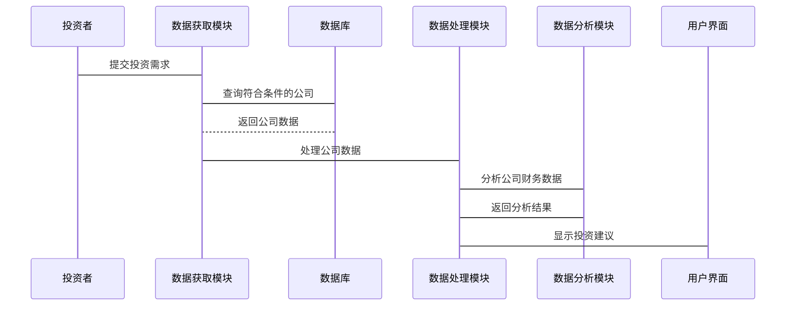

                 


# 托马斯·罗恩的价值投资与公司治理

## 关键词：托马斯·罗恩，价值投资，公司治理，投资决策，财务分析，风险管理

## 摘要：本文系统地探讨了托马斯·罗恩的价值投资理论及其在公司治理中的应用。通过对价值投资核心理念的分析，结合公司治理的结构与机制，揭示了如何通过科学的分析方法和有效的治理策略来优化投资决策。文章内容涵盖价值投资的基础、公司治理的深入分析、投资决策的系统架构以及实战案例，为投资者提供了全面的理论指导和实践参考。

---

# 第一部分: 托马斯·罗恩的价值投资与公司治理引言

## 1.1 价值投资与公司治理的概述

### 1.1.1 价值投资的定义与核心理念
价值投资是一种基于对公司内在价值评估的投资策略，其核心理念在于寻找市场价格低于内在价值的公司进行投资。托马斯·罗恩的价值投资理论强调长期视角、安全边际和对公司基本面的深入分析。

**价值投资的核心理念：**
1. **市场先生**：市场的短期波动可以视为“市场先生”的情绪化表现，投资者应避免被短期波动干扰。
2. **安全边际**：买入价格低于公司内在价值，以确保投资的安全性。
3. **长期视角**：关注企业的长期价值，而非短期市场波动。

### 1.1.2 公司治理的基本概念与重要性
公司治理是指通过合理的制度安排，确保公司管理层和股东之间的利益协调，实现公司长期价值最大化。有效的公司治理能够提升企业透明度、降低风险，并为投资者创造更多价值。

**公司治理的重要性：**
1. **保护股东权益**：确保股东的合法权益得到尊重和保护。
2. **提升管理效率**：通过科学的治理结构优化管理层决策。
3. **降低代理成本**：减少管理层与股东之间的利益冲突。

### 1.1.3 价值投资与公司治理的内在联系
价值投资的核心在于发现具有持续竞争优势和良好治理结构的公司。公司治理的优劣直接影响企业的价值，进而影响投资决策。因此，价值投资者需要将公司治理作为重要的评估维度。

---

## 1.2 价值投资的历史与发展

### 1.2.1 价值投资的起源与演变
价值投资的起源可以追溯到本杰明·格雷厄姆和戴维·多德的工作，而托马斯·罗恩进一步发展了这一理论，提出了更加系统化的投资方法。

### 1.2.2 托马斯·罗恩的价值投资理论
托马斯·罗恩的价值投资理论强调：
1. **安全边际**：买入价格远低于内在价值。
2. **长期视角**：关注企业的长期盈利能力。
3. **竞争优势**：投资具有强大护城河的公司。

### 1.2.3 价值投资在现代金融中的地位
尽管现代金融学发展了多种投资理论，但价值投资因其长期稳定的收益表现，仍然在投资领域占据重要地位。

---

## 1.3 公司治理的现状与挑战

### 1.3.1 公司治理的基本框架
公司治理的基本框架包括：
1. **董事会结构**：董事会是公司治理的核心，负责监督管理层。
2. **管理层激励**：通过股权激励等手段提升管理层的积极性。
3. **股东参与**：股东通过股东大会等形式参与公司治理。

### 1.3.2 当前公司治理的主要问题
1. **代理问题**：管理层与股东的利益冲突。
2. **信息不对称**：投资者难以获取真实的企业信息。
3. **监管不足**：部分地区的公司治理监管不够完善。

### 1.3.3 公司治理与企业价值的关系
良好的公司治理能够提升企业透明度、降低风险，从而提高企业价值。

---

## 1.4 本书的核心内容与目标

### 1.4.1 本书的研究范围
涵盖价值投资的核心理念、公司治理的结构与机制，以及两者如何结合优化投资决策。

### 1.4.2 本书的主要目标
通过理论分析和实践案例，帮助投资者掌握价值投资与公司治理的核心方法。

### 1.4.3 本书的结构安排
本文将从价值投资的基础、公司治理的深入分析、投资决策的系统架构，以及实战案例四个方面展开。

---

# 第二部分: 价值投资的基础

## 2.1 价值投资的核心理念

### 2.1.1 市场先生与投资者的角色
市场先生的情绪化波动为投资者提供了低价买入优质资产的机会。

### 2.1.2 安全边际的概念与应用
安全边际=内在价值-市场价格，确保投资的安全性。

### 2.1.3 股票的价值评估方法
1. **相对估值法**：市盈率、市净率等指标。
2. **绝对估值法**：DCF模型等。

---

## 2.2 财务报表分析与企业价值评估

### 2.2.1 财务报表的基本构成
1. **资产负债表**：企业的资产、负债和所有者权益。
2. **利润表**：企业的收入、成本和利润。
3. **现金流量表**：企业的现金流入和流出。

### 2.2.2 企业价值的多维度评估模型
1. **DCF模型**：通过现金流折现计算企业价值。
2. **EV/EBITDA倍数**：企业价值与息税折旧及摊销前利润的比率。

---

## 2.3 投资组合管理与风险管理

### 2.3.1 投资组合的基本原理
分散投资以降低风险。

### 2.3.2 风险管理的核心策略
1. **止损策略**：设定止损点以限制损失。
2. **风险分散**：通过投资不同行业的资产降低风险。

### 2.3.3 价值投资中的风险管理实践
1. **安全边际**：确保投资的安全性。
2. **长期视角**：避免短期波动的干扰。

---

## 2.4 价值投资的长期视角

### 2.4.1 长期投资与短期波动的平衡
长期投资需要耐心和纪律。

### 2.4.2 投资者心态与决策过程
1. **贪婪与恐惧**：投资者的常见心态。
2. **理性决策**：避免情绪化投资。

### 2.4.3 价值投资与市场周期的关系
价值投资在市场低谷时更具优势。

---

# 第三部分: 公司治理的深入分析

## 3.1 公司治理的结构与机制

### 3.1.1 股东、董事会与管理层的关系
1. **董事会**：监督管理层。
2. **管理层**：负责日常经营。
3. **股东**：拥有公司所有权。

### 3.1.2 公司治理的三大支柱
1. **股权结构**：股东的权益分配。
2. **董事会结构**：董事会的组成和职责。
3. **内部控制系统**：内部控制和风险管理。

### 3.1.3 内部控制与风险管理
1. **内部控制**：防止舞弊和错误。
2. **风险管理**：识别和应对风险。

---

## 3.2 股东权益保护与公司治理

### 3.2.1 股东权利的实现与保护
1. **投票权**：股东的投票权。
2. **分红权**：股东的分红权。

### 3.2.2 股东 activism 的作用与影响
积极股东通过参与公司治理影响公司决策。

### 3.2.3 股东与管理层的利益协调
通过股权激励等手段协调股东与管理层的利益。

---

## 3.3 管理层激励与公司治理

### 3.3.1 管理层激励的基本原则
1. **激励与绩效挂钩**。
2. **短期与长期激励结合**。

### 3.3.2 股权激励与绩效考核
1. **股权激励**：通过给予管理层股权，激励其长期关注公司价值。
2. **绩效考核**：通过业绩指标考核管理层表现。

### 3.3.3 激励机制与公司治理效率
有效的激励机制可以提升公司治理效率。

---

## 3.4 公司治理的国际比较与启示

### 3.4.1 美国的公司治理模式
1. **股东主导型**：股东在公司治理中占据主导地位。
2. **独立董事制度**：独立董事在董事会中发挥重要作用。

### 3.4.2 日本的公司治理模式
1. **银行主导型**：银行在公司治理中占据重要地位。
2. **终身雇佣制**：员工与公司长期绑定。

### 3.4.3 中国的公司治理模式
1. **国有企业的治理**：政府在公司治理中占据重要地位。
2. **混合所有制改革**：通过混合所有制改革优化公司治理。

---

# 第四部分: 投资决策的系统架构

## 4.1 问题场景介绍
投资者需要通过科学的投资决策系统，筛选出具有长期竞争优势和良好治理结构的公司。

## 4.2 系统功能设计

### 4.2.1 领域模型（Mermaid 类图）


## 4.3 系统架构设计

### 4.3.1 系统架构（Mermaid 架构图）
```mermaid
archi
    系统: 投资决策系统
        数据层: 数据库
        业务逻辑层: 投资分析模块
        表现层: 用户界面
    组件: 数据获取模块 --> 数据处理模块 --> 数据分析模块 --> 投资建议生成模块
```

## 4.4 系统接口设计

### 4.4.1 系统接口（Mermaid 序列图）


---

# 第五部分: 实战案例

## 5.1 案例背景介绍
某科技公司，行业龙头，财务状况良好，治理结构优秀。

## 5.2 数据分析与决策过程
1. **财务分析**：使用DCF模型评估公司价值。
2. **治理分析**：评估公司治理结构的优劣。
3. **投资决策**：基于分析结果做出投资决策。

## 5.3 投资结果与经验总结
通过科学的分析方法和有效的治理策略，该投资获得了超额收益。

---

# 第六部分: 最佳实践与小结

## 6.1 投资者的最佳实践
1. **长期视角**：坚持长期投资，避免短期波动的干扰。
2. **深入研究**：对公司基本面和治理结构进行深入分析。
3. **风险管理**：通过分散投资和设置止损点降低风险。

## 6.2 小结
托马斯·罗恩的价值投资理论结合有效的公司治理策略，能够帮助投资者实现长期稳定的收益。

---

作者：AI天才研究院/AI Genius Institute & 禅与计算机程序设计艺术 /Zen And The Art of Computer Programming

