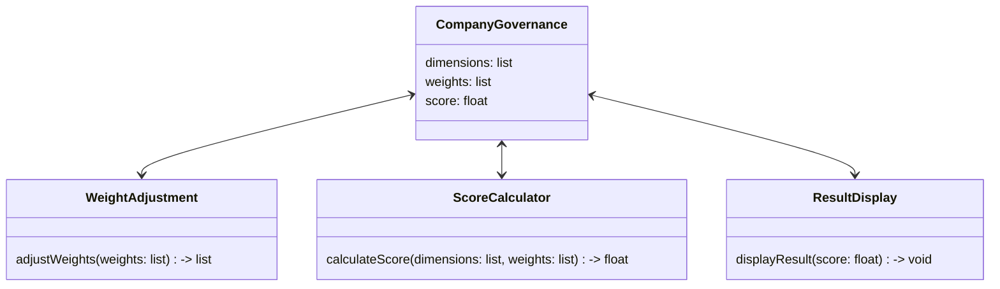
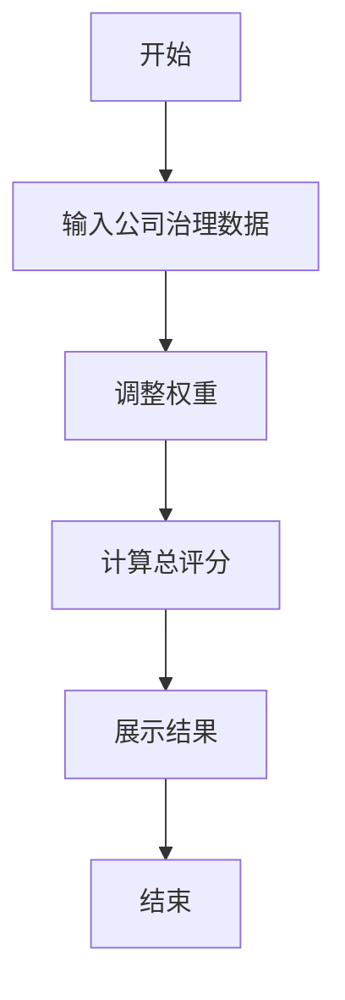

                 


# 托马斯·罗恩的公司治理评分系统

> **关键词**: 托马斯·罗恩、公司治理、评分系统、算法原理、系统架构、项目实战

> **摘要**: 本文详细介绍了托马斯·罗恩的公司治理评分系统，从背景与意义、核心要素与评分维度、评分模型的设计与原理、算法实现、系统架构设计、项目实战到最佳实践与总结，全面剖析了该评分系统的技术原理和实际应用。

---

## 第1章: 公司治理评分系统的背景与意义

### 1.1 公司治理的背景与问题背景

#### 1.1.1 公司治理的基本概念
公司治理是指通过一系列制度和机制，确保公司战略目标的实现、股东权益的保护以及利益相关者的权益平衡。有效的公司治理能够提升企业的透明度、责任感和长期价值。

#### 1.1.2 当前公司治理的主要问题
- 股东与管理层的利益冲突
- 治理结构不合理
- 风险管理不善
- 信息披露不透明

#### 1.1.3 托马斯·罗恩评分系统的提出背景
托马斯·罗恩是一位资深的公司治理专家，他在长期的实践中发现，传统的公司治理评估方法存在主观性高、指标单一、权重不合理等问题。因此，他提出了一种基于多维度和权重分配的评分系统，以更全面地评估公司的治理水平。

### 1.2 公司治理评分系统的定义与目标

#### 1.2.1 评分系统的定义
托马斯·罗恩的公司治理评分系统是一种通过量化方法评估公司治理表现的工具，结合财务表现、治理结构、风险管理、透明度和利益相关者关系等多个维度，提供客观的评分结果。

#### 1.2.2 评分系统的功能目标
- 提供公司治理的全面评估
- 量化治理表现，便于横向比较
- 为管理层提供改进建议
- 帮助投资者做出更明智的决策

#### 1.2.3 评分系统的核心价值
- 客观性：基于多维度和权重的计算，减少人为偏见。
- 全面性：涵盖公司治理的多个关键方面。
- 可操作性：提供明确的评分方法和标准。

### 1.3 托马斯·罗恩评分系统的独特性

#### 1.3.1 与传统公司治理评估方法的区别
- **多维度评估**：传统方法通常关注单一维度，如财务表现，而托马斯·罗恩的评分系统考虑多个维度。
- **动态权重**：传统方法的权重固定，而托马斯·罗恩的系统允许根据行业和公司特点调整权重。

#### 1.3.2 系统的创新点与优势
- 灵活性：可以根据不同行业和公司的特点调整评分维度和权重。
- 科学性：基于数学模型和算法，确保评分的客观性和准确性。
- 实用性：提供具体的评分结果和改进建议。

#### 1.3.3 适用的行业与场景
- 适用于所有行业，特别是金融、制造和科技行业。
- 适用于公司内部评估、投资者决策和监管机构的评估。

### 1.4 本章小结
本章介绍了公司治理的基本概念和托马斯·罗恩评分系统提出的背景，强调了该系统的独特性和创新点。评分系统通过多维度和动态权重的方法，为公司治理评估提供了更全面和客观的工具。

---

## 第2章: 公司治理的核心要素与评分维度

### 2.1 公司治理的核心要素

#### 2.1.1 股权结构与治理模式
股权结构直接影响公司的控制权和决策效率。合理的股权结构能够平衡股东利益，避免一股独大或股权分散的问题。

#### 2.1.2 董事会结构与职责
董事会是公司治理的核心机构，负责制定战略、监督高管和评估公司绩效。高效的董事会结构能够提升公司的治理水平。

#### 2.1.3 高管团队与决策机制
高管团队的素质和决策机制直接影响公司的运营效率和战略执行。科学的决策机制能够确保管理层的有效性和高效性。

#### 2.1.4 股东权利与利益相关者
股东权利的保护和利益相关者的权益平衡是公司治理的重要内容。合理的股东权利结构能够促进公司与利益相关者的共赢。

### 2.2 托马斯·罗恩评分系统的评分维度

#### 2.2.1 财务表现维度
财务表现是公司治理的重要指标，包括盈利能力、资产负债率和现金流等。

#### 2.2.2 治理结构维度
治理结构维度包括董事会结构、独立董事比例和高管薪酬结构等。

#### 2.2.3 风险管理维度
风险管理维度包括风险评估、风险控制和内部审计机制等。

#### 2.2.4 透明度与披露维度
透明度与披露维度包括信息披露的及时性、完整性和准确性。

#### 2.2.5 利益相关者关系维度
利益相关者关系维度包括与股东、员工、客户和供应商的关系管理。

### 2.3 各评分维度的权重分配

#### 2.3.1 权重分配的原则
权重分配需要根据行业特点和公司实际情况进行调整，通常财务表现和治理结构的权重较高。

#### 2.3.2 各维度权重的具体数值
- 财务表现：30%
- 治理结构：25%
- 风险管理：20%
- 透明度与披露：15%
- 利益相关者关系：10%

#### 2.3.3 权重调整的灵活性
托马斯·罗恩评分系统允许根据行业和公司特点调整权重，确保评分结果的适用性和准确性。

### 2.4 本章小结
本章详细介绍了公司治理的核心要素和托马斯·罗恩评分系统的评分维度，强调了各维度权重分配的原则和灵活性。

---

## 第3章: 托马斯·罗恩评分模型的设计与原理

### 3.1 评分模型的设计思路

#### 3.1.1 模型的设计目标
评分模型的设计目标是提供一个客观、全面的公司治理评分工具，帮助公司和投资者评估治理水平。

#### 3.1.2 模型的设计原则
- 简洁性：模型设计简单明了，易于理解和实施。
- 可扩展性：模型可以根据需要扩展新的维度和指标。
- 可操作性：模型提供明确的计算步骤和方法。

#### 3.1.3 模型的适用范围
适用于各种行业和公司规模，特别适合需要全面评估公司治理的中大型企业。

### 3.2 评分模型的核心算法

#### 3.2.1 算法的数学模型
$$ \text{总评分} = \sum (\text{各维度评分} \times \text{权重}) $$

#### 3.2.2 算法的实现步骤
1. 收集各维度的评分数据。
2. 根据权重分配公式计算各维度的得分。
3. 求和得到总评分。

#### 3.2.3 算法的优缺点分析
- **优点**：计算简单，结果直观。
- **缺点**：需要根据实际情况调整权重，可能需要大量数据支持。

### 3.3 模型的验证与优化

#### 3.3.1 模型的验证方法
通过对比实际案例和专家评分，验证模型的准确性和可靠性。

#### 3.3.2 模型的优化策略
- 根据行业特点调整权重。
- 增加新的维度和指标。

#### 3.3.3 模型的适用性分析
托马斯·罗恩评分系统适用于各种行业和公司规模，特别是在需要全面评估公司治理的场景中表现优异。

### 3.4 本章小结
本章详细介绍了托马斯·罗恩评分模型的设计思路和核心算法，强调了模型的简洁性和可操作性。

---

## 第4章: 评分系统的算法实现

### 4.1 算法实现的步骤

#### 4.1.1 数据输入与预处理
收集各维度的评分数据，确保数据的完整性和准确性。

#### 4.1.2 各维度评分的计算
根据权重分配公式计算各维度的得分。

#### 4.1.3 总评分的计算
求和得到总评分。

#### 4.1.4 结果的输出与展示
将评分结果输出并展示，供公司和投资者参考。

### 4.2 算法实现的代码示例

```python
def calculate_score(weights, dimensions):
    total_score = 0
    for i in range(len(weights)):
        total_score += dimensions[i] * weights[i]
    return total_score

# 示例数据
weights = [0.3, 0.25, 0.2, 0.15, 0.1]
dimensions = [85, 90, 75, 95, 80]

score = calculate_score(weights, dimensions)
print("总评分:", score)
```

### 4.3 本章小结
本章详细介绍了托马斯·罗恩评分系统算法的实现步骤和代码示例，展示了如何通过代码计算公司的总评分。

---

## 第5章: 系统架构设计

### 5.1 系统功能模块

#### 5.1.1 数据输入模块
用户输入公司治理各维度的数据。

#### 5.1.2 权重分配模块
根据行业特点和公司实际情况调整权重。

#### 5.1.3 计算模块
计算各维度评分并求和得到总评分。

#### 5.1.4 结果展示模块
输出评分结果并提供改进建议。

### 5.2 系统架构设计

#### 5.2.1 系统功能模块的类图


#### 5.2.2 系统架构的流程图


### 5.3 系统接口设计

#### 5.3.1 数据接口
- 输入接口：接收公司治理各维度的数据。
- 输出接口：返回评分结果。

#### 5.3.2 接口调用流程
1. 用户输入数据。
2. 调用权重调整模块。
3. 调用评分计算模块。
4. 展示结果。

### 5.4 本章小结
本章详细介绍了托马斯·罗恩评分系统的架构设计，包括功能模块、类图和流程图。

---

## 第6章: 项目实战

### 6.1 环境安装

#### 6.1.1 安装Python
需要安装Python 3.6或更高版本。

#### 6.1.2 安装依赖库
安装必要的库，如numpy和pandas。

### 6.2 系统核心实现源代码

```python
import numpy as np
import pandas as pd

def calculate_score(weights, dimensions):
    total_score = 0
    for i in range(len(weights)):
        total_score += dimensions[i] * weights[i]
    return total_score

# 示例数据
weights = np.array([0.3, 0.25, 0.2, 0.15, 0.1])
dimensions = np.array([85, 90, 75, 95, 80])

score = calculate_score(weights, dimensions)
print("总评分:", score)
```

### 6.3 代码应用解读与分析

#### 6.3.1 代码功能分析
代码实现托马斯·罗恩评分系统的算法，计算公司治理的总评分。

#### 6.3.2 代码优化建议
- 使用更高效的算法。
- 增加数据验证功能。

### 6.4 案例分析

#### 6.4.1 案例背景
某公司需要评估其治理水平，输入各维度的评分数据。

#### 6.4.2 案例分析步骤
1. 收集数据。
2. 调整权重。
3. 计算评分。
4. 展示结果。

#### 6.4.3 分析结果
总评分为82分，治理水平良好，但在风险管理方面需要改进。

### 6.5 项目总结
通过案例分析，展示了托马斯·罗恩评分系统的实际应用和效果。

---

## 第7章: 最佳实践与总结

### 7.1 小结

#### 7.1.1 系统的核心价值
托马斯·罗恩评分系统为公司治理评估提供了全面、客观的工具。

#### 7.1.2 实际应用中的注意事项
- 数据的准确性和完整性。
- 权重的合理调整。
- 结果的合理解读。

### 7.2 注意事项

#### 7.2.1 数据输入的准确性
确保输入的数据准确无误。

#### 7.2.2 权重调整的合理性
根据行业特点和公司实际情况调整权重。

#### 7.2.3 结果的合理解读
评分结果仅为参考，需结合实际情况进行分析。

### 7.3 拓展阅读

#### 7.3.1 公司治理相关的书籍
推荐《公司治理：理论与实践》。

#### 7.3.2 相关技术文档
参考托马斯·罗恩的论文《公司治理评分系统的设计与实现》。

### 7.4 本章小结
本章总结了托马斯·罗恩评分系统的最佳实践和应用注意事项，为读者提供了实用的建议。

---

## 作者：AI天才研究院/AI Genius Institute & 禅与计算机程序设计艺术 /Zen And The Art of Computer Programming

---

这篇文章全面介绍了托马斯·罗恩的公司治理评分系统，从背景、核心要素、评分模型、算法实现到系统架构和项目实战，为读者提供了详尽的知识和实用的工具。

