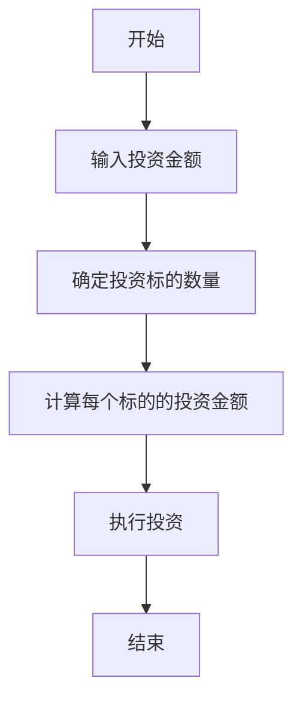
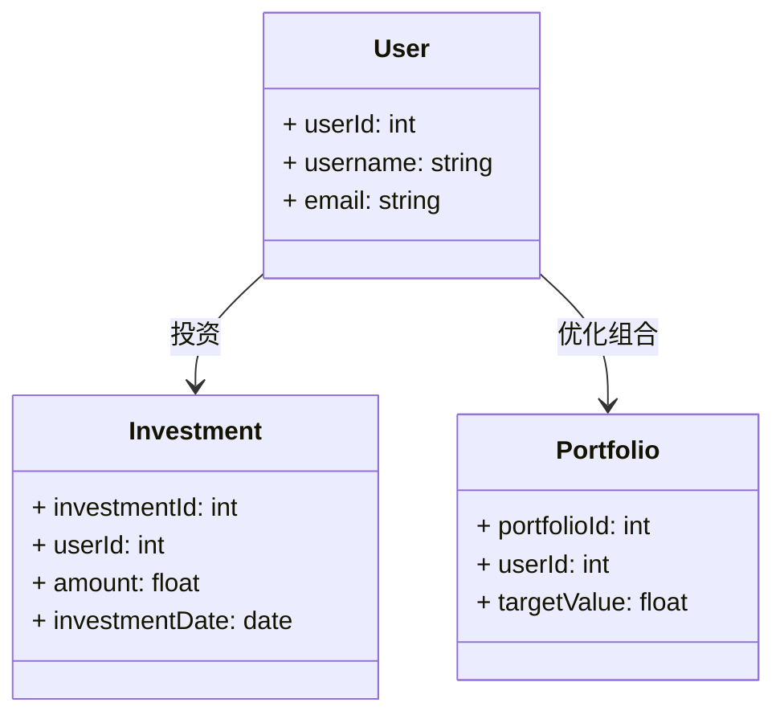
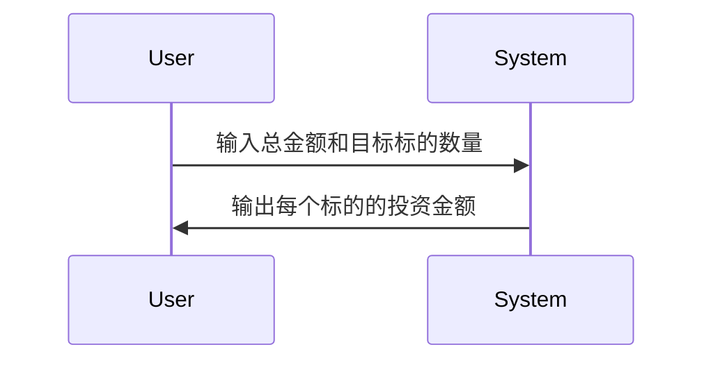

                 


# 托马斯·罗的价值平均策略

## 关键词
价值平均策略, 投资组合优化, 投资策略, 投资回报, 风险控制

## 摘要
托马斯·罗的价值平均策略是一种基于投资组合优化的投资方法，旨在通过平均分配投资金额来降低风险并最大化收益。本文将详细分析该策略的核心概念、算法原理、系统设计、项目实现以及最佳实践，帮助读者全面理解和应用这一策略。

---

# 第一部分: 价值平均策略的背景与核心概念

## 第1章: 价值平均策略的背景介绍

### 1.1 价值平均策略的定义与问题背景
#### 1.1.1 价值平均策略的核心概念
- **价值平均策略**：通过将资金平均分配到多个不同的投资标的中，以降低单一投资的风险，同时平衡整体投资的收益。
- **问题背景**：传统投资策略往往依赖于单一高回报资产，但其风险较高。价值平均策略通过分散投资来平衡风险与收益。

#### 1.1.2 价值平均策略的核心目标
- **风险分散**：通过平均分配资金，降低单一投资标的波动对整体投资组合的影响。
- **收益平衡**：在风险可控的前提下，追求投资组合的整体收益最大化。

#### 1.1.3 价值平均策略的适用场景
- **适合中长期投资者**：该策略适合那些希望长期稳定增长的投资者。
- **适合风险中性的投资者**：对于无法承受高风险但又希望获得一定收益的投资者而言，价值平均策略是一个不错的选择。

## 第2章: 价值平均策略的核心概念与联系

### 2.1 核心概念的原理分析
#### 2.1.1 价值平均策略的数学模型
- **数学模型**：$$\text{投资比例} = \frac{\text{投资金额}}{\text{投资标的总数}}$$
- **风险与收益的关系**：通过平均分配，投资组合的波动性显著降低，但同时也能确保在市场波动中获得较为稳定的收益。

#### 2.1.2 核心概念的属性特征对比
| 属性 | 价值平均策略 | 其他投资策略 |
|------|---------------|-------------|
| 投资方式 | 平均分配 | 集中投资 |
| 风险控制 | 较低 | 较高 |
| 收益稳定性 | 稳定 | 波动较大 |

---

# 第二部分: 价值平均策略的算法原理

## 第3章: 价值平均策略的算法实现

### 3.1 算法原理分析
#### 3.1.1 算法流程图


#### 3.1.2 算法实现代码
```python
def value_averaging_strategy(total Investment, number_of_assets):
    investment_per_asset = total_investment / number_of_assets
    return investment_per_asset
```

### 3.2 算法数学模型与公式推导
- **数学模型**：
  $$\text{每个标的的投资金额} = \frac{\text{总投资金额}}{\text{投资标的数量}}$$
- **公式推导**：
  - 假设总投资金额为$T$，投资标的数量为$n$，则每个标的的投资金额为$$\frac{T}{n}$$

---

# 第三部分: 价值平均策略的系统分析

## 第4章: 系统设计与架构

### 4.1 系统功能设计
#### 4.1.1 系统功能模块


### 4.2 系统架构设计
#### 4.2.1 系统架构图


### 4.3 系统接口设计
#### 4.3.1 接口设计
- **输入接口**：用户输入投资金额和目标投资标的数量。
- **输出接口**：系统输出每个标的的投资金额。

#### 4.3.2 交互流程图


---

# 第四部分: 价值平均策略的项目实战

## 第5章: 项目实现与案例分析

### 5.1 环境安装与配置
- **工具安装**：安装Python和必要的数据处理库（如Pandas、NumPy）。
- **环境配置**：配置开发环境，确保代码可以运行。

### 5.2 核心代码实现
#### 5.2.1 核心代码
```python
def calculate_investment_distribution(total_investment, number_of_assets):
    investment_per_asset = total_investment / number_of_assets
    return investment_per_asset

# 示例代码
total_investment = 10000  # 总投资金额
number_of_assets = 5      # 投资标的数量
result = calculate_investment_distribution(total_investment, number_of_assets)
print(f"每个标的的投资金额为: {result}")
```

#### 5.2.2 代码解读
- **函数定义**：`calculate_investment_distribution`函数接收总金额和标的数量，计算每个标的的投资金额。
- **示例代码**：输入总金额10000，标的数量5，输出每个标的的投资金额为2000。

### 5.3 案例分析与详细讲解
#### 5.3.1 案例分析
- **案例背景**：假设用户有10000元，希望投资5个不同的股票。
- **应用价值平均策略**：每个股票投资2000元。
- **收益分析**：假设每个股票平均上涨10%，总收益为1000元，总金额为11000元。

#### 5.3.2 详细讲解
- **风险控制**：通过平均分配，每个股票的波动对整体投资的影响被降低。
- **收益稳定性**：在市场波动中，价值平均策略能提供相对稳定的收益。

### 5.4 项目小结
- **经验总结**：价值平均策略简单有效，适合中长期投资。
- **问题与改进**：在实际操作中，需考虑不同标的的流动性风险和市场波动性。

---

# 第五部分: 价值平均策略的最佳实践

## 第6章: 最佳实践与注意事项

### 6.1 最佳实践技巧
- **定期调整投资组合**：根据市场变化和投资目标，定期调整投资比例。
- **选择优质标的**：在选择投资标的时，应优先考虑流动性好、风险可控的资产。

### 6.2 小结与反思
- **核心要点**：价值平均策略的核心在于分散投资，降低风险。
- **长期视角**：投资者应从长期视角出发，避免短期市场波动的干扰。

### 6.3 注意事项
- **避免过度分散**：过分散投资可能导致单个标的影响力过小，难以获得超额收益。
- **关注市场环境**：在市场低迷时，价值平均策略的优势更为明显。

### 6.4 拓展阅读
- **相关书籍**：《投资学》、《投资组合管理》
- **专业期刊**：查阅相关金融期刊，了解更多投资策略。

---

# 作者：AI天才研究院/AI Genius Institute & 禅与计算机程序设计艺术 /Zen And The Art of Computer Programming

