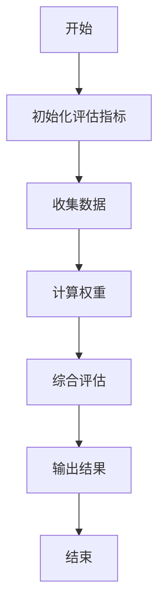
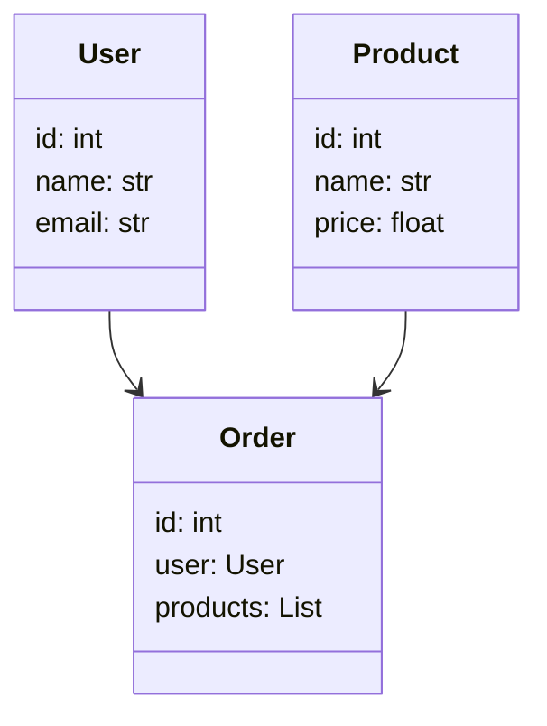
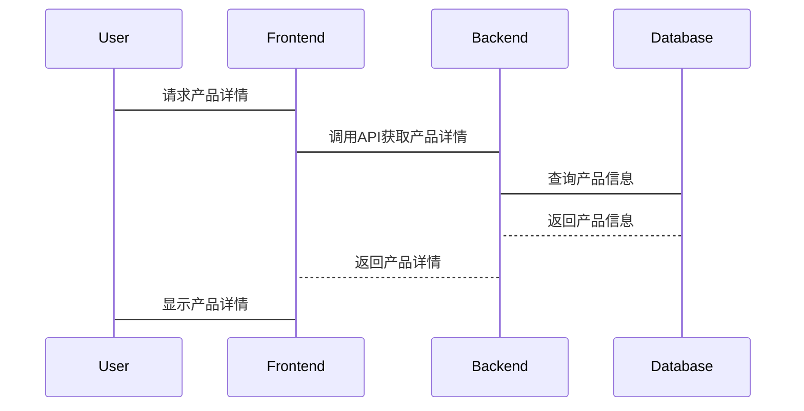

                 


# 《技术栈选择与评估》

## 关键词：技术栈选择、技术评估、系统架构、软件开发、技术选型

## 摘要：在现代软件开发中，选择合适的技术栈是项目成功的关键。本文详细探讨技术栈的核心概念、评估方法、系统架构设计及项目实战，帮助读者系统地选择和评估技术栈。

---

# 第一部分：技术栈选择的核心概念

## 第1章：技术栈的定义与背景

### 1.1 技术栈的定义与组成

#### 1.1.1 技术栈的核心概念

技术栈（Technology Stack）是指在软件开发过程中，用于实现特定功能所需的一系列技术、框架和工具的组合。它包括前端、后端、数据库、部署等多个方面的技术选型。

#### 1.1.2 技术栈的组成要素

- **前端技术**：如React、Vue.js、Angular等框架。
- **后端技术**：如Node.js、Python（Django/Flask）、Java（Spring）等。
- **数据库技术**：如MySQL、MongoDB、Redis等。
- **部署与运维**：如Docker、Kubernetes、云服务（AWS、阿里云）等。

#### 1.1.3 技术栈的分类与特点

技术栈可以根据不同的维度进行分类：
- **按开发阶段**：前端、后端、全栈。
- **按技术类型**：Web开发、移动开发、桌面开发等。

### 1.2 技术栈选择的背景与意义

#### 1.2.1 当前技术发展现状

- 开源技术的兴起，使得技术栈选择更加多样化。
- 云计算和容器化技术的普及，推动了微服务架构的广泛应用。

#### 1.2.2 技术栈选择的重要性

- 影响项目的开发效率和系统性能。
- 决定系统的可扩展性和可维护性。

#### 1.2.3 技术栈选择的挑战与机遇

- **挑战**：技术更新快，选择过多，难以找到最优解。
- **机遇**：新兴技术（如AI、大数据）为技术栈选择提供了更多可能性。

---

## 第2章：技术栈评估的核心要素

### 2.1 技术栈评估的维度

#### 2.1.1 技术成熟度

- 技术是否经过广泛验证，是否有稳定的社区支持。
- 示例：React社区活跃，成熟度高。

#### 2.1.2 社区支持与生态

- 技术的生态系统是否完善，是否有丰富的文档和工具支持。
- 示例：Python的生态系统非常完善，适合快速开发。

#### 2.1.3 性能与扩展性

- 技术是否能够应对高并发、大数据量的场景。
- 示例：MongoDB适合处理非结构化数据，扩展性强。

#### 2.1.4 安全性与合规性

- 技术是否符合行业安全标准，是否有良好的安全记录。
- 示例：使用SSL/TLS协议确保数据传输安全。

### 2.2 技术栈评估的流程与方法

#### 2.2.1 评估目标的确定

- 明确项目需求和目标，确定关键评估指标。

#### 2.2.2 数据收集与分析

- 收集技术的优缺点、性能指标、社区支持等数据。
- 使用表格形式对比不同技术栈的特点。

#### 2.2.3 评估结果的呈现

- 使用加权评分法，根据项目需求对各技术栈进行评分和排序。

### 2.3 核心概念对比分析

#### 2.3.1 技术栈与工具链的关系

技术栈是一个整体架构，工具链是实现技术栈的工具集合。

#### 2.3.2 技术栈与架构模式的区别

技术栈是技术选型，架构模式是系统设计的指导原则。

#### 2.3.3 技术栈与开发效率的平衡

选择高效的技术栈可以提升开发效率，但需要权衡性能和扩展性。

---

## 第3章：技术栈评估的数学模型与方法

### 3.1 技术栈评估的数学模型

#### 3.1.1 评估指标的权重分配

- 使用层次分析法（AHP）确定各指标的权重。
- 示例：性能（40%）、安全性（30%）、易用性（30%）。

#### 3.1.2 多因素决策模型（AHP）

- 层次分析法通过构建判断矩阵，计算各指标的权重。

#### 3.1.3 模糊综合评价模型

- 使用模糊数学方法对技术栈进行综合评价。

### 3.2 技术栈评估的算法原理

#### 3.2.1 算法流程图（Mermaid）



#### 3.2.2 核心算法代码

```python
import numpy as np

def calculate_weights(criteria_matrix):
    # 计算一致性检验
    pass

# 示例判断矩阵
criteria_matrix = np.array([[1, 3, 2],
                              [2, 1, 4],
                              [3, 4, 1]])

# 计算权重
weights = calculate_weights(criteria_matrix)
print(weights)
```

### 3.3 数学公式与模型

- **层次分析法公式**：
  $$ A = \frac{w_i}{\sum w_i} $$
  其中，\( w_i \) 是各指标的权重。

---

## 第4章：系统架构设计

### 4.1 系统功能设计

#### 4.1.1 领域模型（Mermaid 类图）



#### 4.1.2 系统架构图（Mermaid 架构图）


#### 4.1.3 系统交互图（Mermaid 序列图）



---

## 第5章：项目实战

### 5.1 环境安装与配置

- **前端**：安装Node.js和npm。
- **后端**：安装Python和Django框架。
- **数据库**：安装MySQL或MongoDB。

### 5.2 系统核心实现

#### 5.2.1 前端代码示例

```javascript
// package.json
{
  "name": "frontend-app",
  "version": "1.0.0",
  "dependencies": {
    "react": "^18.2.0",
    "react-dom": "^18.2.0"
  }
}
```

#### 5.2.2 后端代码示例

```python
from django.urls import path
from .views import ProductView

urlpatterns = [
    path('products/', ProductView.as_view(), name='product-list'),
]
```

### 5.3 案例分析与总结

- **案例分析**：选择React、Django和PostgreSQL的技术栈，实现一个在线购物系统。
- **总结**：根据项目需求和技术特点，选择合适的技术栈。

---

## 第6章：最佳实践与总结

### 6.1 最佳实践

- **保持简洁**：避免过度复杂的技术栈。
- **定期评估**：随着项目发展，及时调整技术栈。

### 6.2 总结

技术栈的选择是一个复杂而重要的决策过程，需要综合考虑技术成熟度、团队能力、项目需求等多方面因素。通过系统地评估和选择技术栈，可以显著提升项目的开发效率和系统性能。

---

## 附录：工具与资源

- **技术评估工具**：如TechStackAnalyzer、StackShare。
- **参考资料**：技术博客、官方文档、技术论坛。

---

## 作者信息

作者：AI天才研究院  
简介：专注于人工智能与软件工程的研究与实践，致力于分享技术栈选择与评估的深度见解。

---

**感谢您的阅读！** 如果您对技术栈选择有更多疑问或需要进一步探讨，请随时留言。

