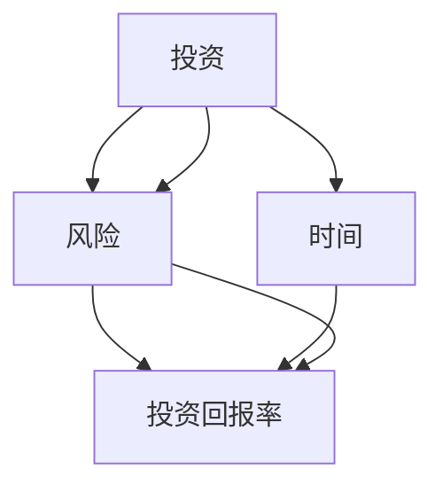
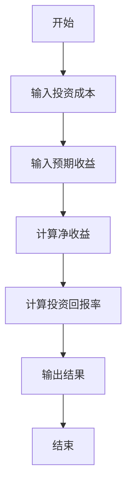
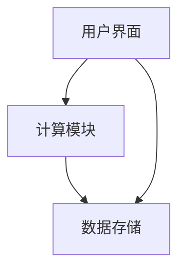
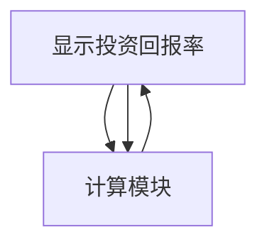

                 


# 投资回报率分析工具

## 关键词：投资回报率, 投资分析, 项目管理, 财务分析, 软件工具, 数据分析

## 摘要：  
投资回报率（ROI）是评估投资项目经济效益的重要指标，本文系统地介绍了投资回报率分析工具的设计与实现，从核心概念、算法原理、系统架构到项目实战，全面解析了如何构建一个高效的投资回报率分析工具。通过本文的学习，读者能够掌握投资回报率分析的基本原理，并能够基于代码实现一个功能完善的分析工具。

---

# 第1章: 投资回报率分析工具的背景与概念

## 1.1 投资回报率分析的基本概念

### 1.1.1 投资回报率的定义  
投资回报率（Return on Investment，ROI）是衡量投资项目或资产收益能力的指标，通常以百分比形式表示。其计算公式为：  
$$ ROI = \frac{净收益}{投资成本} \times 100\% $$  
其中，净收益等于收益减去投资成本。

### 1.1.2 投资回报率分析的必要性  
在企业决策中，ROI分析是评估投资项目可行性的重要工具。它可以帮助企业在有限资源中选择最优的投资方案，确保资源的合理分配和最大化收益。

### 1.1.3 投资回报率分析的应用场景  
ROI分析广泛应用于企业战略决策、项目评估、资产配置等领域。例如：  
- 企业投资新项目的可行性分析  
- 股票、基金等金融资产的投资评估  
- 房地产开发项目的收益预测  

---

## 1.2 投资回报率分析的核心要素

### 1.2.1 投资的投入与产出  
投资回报率分析的核心是将投入与产出进行对比。投入包括资金、时间、资源等，产出则是项目的收益。  
- 投入：初始投资成本  
- 产出：未来产生的收益  

### 1.2.2 时间价值与风险因素  
投资回报率分析需要考虑时间价值和风险因素：  
- 时间价值：货币的时间价值会影响净现值（NPV）的计算。  
- 风险因素：高风险项目通常需要更高的预期回报率。  

### 1.2.3 投资回报率的计算公式  
$$ ROI = \frac{净收益}{投资成本} \times 100\% $$  
其中，净收益 = 收益 - 投资成本。

---

## 1.3 投资回报率分析的边界与外延

### 1.3.1 投资回报率的适用范围  
ROI分析适用于以下场景：  
- 评估单项投资的收益能力。  
- 比较不同投资项目的优劣。  
- 企业内部决策支持。  

### 1.3.2 投资回报率分析的局限性  
ROI分析存在以下局限性：  
- 忽略了项目的规模差异。  
- 未考虑货币的时间价值。  
- 无法直接反映项目的风险水平。  

### 1.3.3 其他相关概念的对比  
与ROI相关的概念包括：  
- 净现值（NPV）：考虑了时间价值的收益指标。  
- 内部收益率（IRR）：反映了投资项目的回报率。  

---

## 1.4 本章小结  
本章介绍了投资回报率分析的基本概念、核心要素及其应用场景。通过理解ROI的定义和计算方法，读者可以为后续的工具开发打下理论基础。

---

# 第2章: 投资回报率分析工具的核心概念与联系

## 2.1 投资回报率分析的原理

### 2.1.1 投资回报率的计算公式  
$$ ROI = \frac{净收益}{投资成本} \times 100\% $$  
其中，净收益 = 收益 - 投资成本。

### 2.1.2 投资回报率的数学模型  
投资回报率分析可以转化为以下数学模型：  
$$ ROI = \frac{(收益 - 成本)}{成本} \times 100\% $$  
这表明，投资回报率越高，项目的盈利能力越强。

### 2.1.3 投资回报率与净现值的关系  
净现值（NPV）公式：  
$$ NPV = \sum_{t=1}^{n} \frac{CF_t}{(1 + r)^t} $$  
其中，CF_t为第t期的现金流，r为贴现率。  
ROI与NPV的区别在于，ROI忽略了时间价值，而NPV考虑了货币的时间价值。

---

## 2.2 投资回报率分析的核心要素对比

### 2.2.1 投资与收益的对比  
投资是成本，收益是回报。通过比较投资与收益的比率，可以衡量项目的盈利能力。

### 2.2.2 时间价值与风险的对比  
时间价值影响NPV计算，而风险影响预期收益的可靠性。

### 2.2.3 投资回报率与内部收益率的对比  
内部收益率（IRR）是使NPV为零的折现率。与ROI相比，IRR考虑了时间价值和规模差异。

---

## 2.3 投资回报率分析的ER实体关系图



---

## 2.4 本章小结  
本章通过对比分析，明确了投资回报率分析的核心要素及其与其他财务指标的关系，为后续工具开发奠定了理论基础。

---

# 第3章: 投资回报率分析工具的算法原理

## 3.1 投资回报率计算的算法流程



---

## 3.2 投资回报率计算的数学模型

### 3.2.1 投资回报率公式  
$$ ROI = \frac{净收益}{投资成本} \times 100\% $$  

### 3.2.2 净现值公式  
$$ NPV = \sum_{t=1}^{n} \frac{CF_t}{(1 + r)^t} $$  

---

## 3.3 投资回报率分析的算法实现

### 3.3.1 算法实现步骤  
1. 输入投资成本。  
2. 输入预期收益。  
3. 计算净收益。  
4. 计算投资回报率。  
5. 输出结果。

### 3.3.2 算法实现代码  

```python
def calculate_roi(investment_cost, expected_revenue):
    net_profit = expected_revenue - investment_cost
    roi = (net_profit / investment_cost) * 100
    return roi

# 示例使用
investment_cost = 10000
expected_revenue = 15000
roi = calculate_roi(investment_cost, expected_revenue)
print(f"投资回报率为：{roi}%")
```

---

## 3.4 本章小结  
本章通过算法流程图和Python代码，详细讲解了投资回报率的计算方法。读者可以通过代码实现投资回报率的快速计算。

---

# 第4章: 投资回报率分析工具的系统分析与架构设计

## 4.1 系统功能设计

### 4.1.1 用户界面  
- 输入投资成本和预期收益。  
- 显示计算结果。  

### 4.1.2 计算模块  
- 实现ROI计算功能。  
- 提供结果展示。  

### 4.1.3 数据存储  
- 保存输入数据和计算结果。  

---

## 4.2 系统架构设计



---

## 4.3 系统接口设计  
系统接口包括：  
- 用户输入接口。  
- 计算模块调用接口。  
- 结果展示接口。

---

## 4.4 系统交互设计



---

## 4.5 本章小结  
本章通过系统架构图和交互图，展示了投资回报率分析工具的整体结构和功能模块。

---

# 第5章: 投资回报率分析工具的项目实战

## 5.1 环境安装  
需要安装Python和相关开发工具。

## 5.2 核心代码实现  

```python
class ROIAnalyzer:
    def __init__(self):
        self.investment_cost = 0
        self.expected_revenue = 0
        self.roi = 0

    def calculate_roi(self):
        net_profit = self.expected_revenue - self.investment_cost
        self.roi = (net_profit / self.investment_cost) * 100
        return self.roi

    def display_result(self):
        print(f"投资回报率为：{self.roi}%")

# 使用示例
analyzer = ROIAnalyzer()
analyzer.investment_cost = 10000
analyzer.expected_revenue = 15000
analyzer.calculate_roi()
analyzer.display_result()
```

---

## 5.3 项目测试  
测试步骤：  
1. 输入投资成本和预期收益。  
2. 调用计算函数。  
3. 显示结果并验证准确性。

---

## 5.4 项目部署  
将工具部署到服务器，提供在线计算服务。

---

## 5.5 本章小结  
本章通过项目实战，详细讲解了投资回报率分析工具的开发和实现过程。

---

# 第6章: 投资回报率分析工具的最佳实践与注意事项

## 6.1 最佳实践  
- 合理选择贴现率。  
- 结合NPV和IRR进行综合评估。  
- 定期更新数据和模型。

## 6.2 注意事项  
- ROI分析忽略了时间价值和规模差异。  
- 风险因素需要额外考虑。  
- 避免过度简化模型。

---

## 6.3 本章小结  
本章总结了投资回报率分析工具的使用建议，帮助读者更好地应用工具进行决策。

---

# 第7章: 总结与展望

## 7.1 本章小结  
本文系统地介绍了投资回报率分析工具的设计与实现，从理论到实践，全面解析了如何构建一个高效的投资回报率分析工具。

## 7.2 未来展望  
未来可以考虑将工具扩展为多维度分析平台，结合人工智能技术，实现自动化决策支持。

---

# 作者：AI天才研究院/AI Genius Institute & 禅与计算机程序设计艺术 /Zen And The Art of Computer Programming

