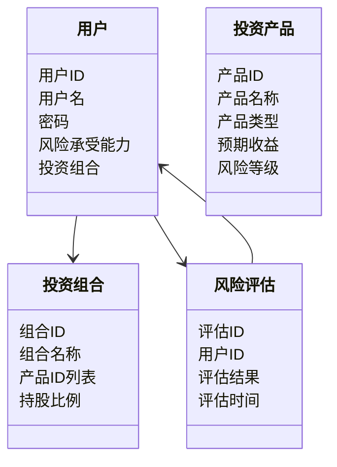
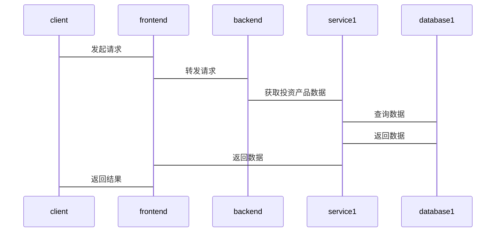

                 


---

# 《投资理财智能助手的前端开发最佳实践》

## 关键词：投资理财，智能助手，前端开发，推荐算法，系统架构，最佳实践

## 摘要：本文系统地探讨了投资理财智能助手的前端开发最佳实践，从背景介绍、核心概念、算法原理到系统架构、项目实战和最佳实践，全面分析了如何高效开发和优化投资理财智能助手，为开发者提供实用的技术指导。

---

## 第三部分: 投资理财智能助手的算法原理

---

### # 第3章: 推荐算法

#### ## 3.1 协同过滤推荐算法

##### ### 3.1.1 协同过滤推荐算法原理

协同过滤推荐算法是一种基于用户行为数据的推荐方法，通过分析用户之间的相似性或物品之间的相似性来推断用户的兴趣。其核心思想是“用户喜欢相似的物品，相似的用户喜欢相同的物品”。

在投资理财智能助手中，协同过滤推荐算法可以用于根据用户的交易历史和投资偏好，推荐相似的投资产品或策略。

##### ### 3.1.2 协同过滤推荐算法实现步骤

1. **收集用户数据**：包括用户的交易记录、投资偏好、风险承受能力等。
2. **计算相似度**：使用余弦相似度或Jaccard相似度等方法计算用户或物品的相似度。
3. **生成推荐列表**：根据相似度排序，为用户推荐最相关的投资产品或策略。

##### ### 3.1.3 协同过滤推荐算法的Python实现代码

```python
def calculate_similarity(user1, user2):
    # 计算用户之间的相似度，使用余弦相似度
    common_items = set(user1.items) & set(user2.items)
    if not common_items:
        return 0.0
    dot_product = sum(user1.ratings[i] * user2.ratings[i] for i in common_items)
    magnitude1 = (sum(user1.ratings[i]**2 for i in common_items))**0.5
    magnitude2 = (sum(user2.ratings[i]**2 for i in common_items))**0.5
    if magnitude1 == 0 or magnitude2 == 0:
        return 0.0
    return dot_product / (magnitude1 * magnitude2)

def get_recommendations(user, users, similarity_fn=calculate_similarity):
    # 根据协同过滤算法生成推荐列表
    user_similarities = [(u, similarity_fn(user, u)) for u in users]
    user_similarities.sort(key=lambda x: x[1], reverse=True)
    # 推荐相似用户的高评分物品
    recommendations = {}
    for u, sim_score in user_similarities:
        if sim_score <= 0:
            break
        for item, rating in u.ratings.items():
            if item not in user.ratings:
                recommendations[item] = recommendations.get(item, 0) + sim_score * rating
    return sorted(recommendations.items(), key=lambda x: x[1], reverse=True)
```

##### ### 3.1.4 协同过滤推荐算法的优缺点

- **优点**：
  - 实现简单，易于理解。
  - 适合数据量较大的场景。
- **缺点**：
  - 对异常值敏感。
  - 计算复杂度较高，不适合实时推荐。

---

#### ## 3.2 基于内容的推荐算法

##### ### 3.2.1 基于内容的推荐算法原理

基于内容的推荐算法通过分析物品的属性特征，生成推荐列表。在投资理财智能助手中，可以用于根据投资产品的属性推荐适合用户的产品。

##### ### 3.2.2 基于内容的推荐算法实现步骤

1. **提取物品特征**：对投资产品的属性进行分析，提取特征向量。
2. **计算相似度**：使用余弦相似度计算物品之间的相似度。
3. **生成推荐列表**：根据相似度排序，为用户推荐最相关的投资产品。

##### ### 3.2.3 基于内容的推荐算法的Python实现代码

```python
from sklearn.feature_extraction.text import TfidfVectorizer
from sklearn.metrics.pairwise import cosine_similarity

def content_based_recommendation(items, item_features):
    # 生成TF-IDF特征向量
    vectorizer = TfidfVectorizer()
    item_vectors = vectorizer.fit_transform(item_features)
    # 计算相似度矩阵
    similarity_matrix = cosine_similarity(item_vectors)
    # 根据相似度生成推荐列表
    recommendations = {}
    for i in range(len(items)):
        for j in range(len(items)):
            if i != j:
                recommendations[items[j]] = similarity_matrix[i][j]
    return sorted(recommendations.items(), key=lambda x: x[1], reverse=True)
```

##### ### 3.2.4 基于内容的推荐算法的优缺点

- **优点**：
  - 对数据稀疏性不敏感。
  - 推荐结果具有解释性。
- **缺点**：
  - 特征提取需要专业知识。
  - 特征向量的维度可能很高，计算复杂。

---

#### ## 3.3 混合推荐算法

##### ### 3.3.1 混合推荐算法原理

混合推荐算法结合了协同过滤推荐算法和基于内容的推荐算法的优点，通过将两种方法的结果进行融合，生成更精准的推荐列表。

##### ### 3.3.2 混合推荐算法实现步骤

1. **协同过滤推荐**：生成基于用户行为的推荐列表。
2. **基于内容的推荐**：生成基于物品属性的推荐列表。
3. **融合推荐结果**：将两种推荐结果进行加权融合，生成最终推荐列表。

##### ### 3.3.3 混合推荐算法的Python实现代码

```python
def hybrid_recommendation(user, items,协同推荐结果, 内容推荐结果):
    # 根据权重融合推荐结果
    recommendations = {}
    for item, score in 协同推荐结果:
        content_score = 内容推荐结果.get(item, 0)
        total_score = score * 0.6 + content_score * 0.4
        recommendations[item] = total_score
    return sorted(recommendations.items(), key=lambda x: x[1], reverse=True)
```

##### ### 3.3.4 混合推荐算法的优缺点

- **优点**：
  - 充分利用用户行为数据和物品属性数据。
  - 推荐结果更精准。
- **缺点**：
  - 实现复杂度较高。
  - 需要平衡两种推荐方法的权重。

---

## 3.4 本章小结

本章详细介绍了投资理财智能助手中的推荐算法，包括协同过滤推荐算法、基于内容的推荐算法和混合推荐算法。通过对比不同算法的优缺点，为实际应用提供了选择和优化的思路。

---

## 第四部分: 投资理财智能助手的系统架构设计

---

### # 第4章: 系统分析与架构设计

#### ## 4.1 问题场景介绍

投资理财智能助手需要处理复杂的用户交互和数据处理，因此需要设计高效的系统架构。系统需要支持用户注册、登录、投资产品推荐、风险评估、投资组合管理等功能。

#### ## 4.2 系统功能设计

##### ### 4.2.1 领域模型设计

以下是一个简化的领域模型类图：



##### ### 4.2.2 系统架构设计

以下是一个基于微服务架构的系统架构图：

```mermaid
client --> frontend: 发起请求
frontend --> backend: 转发请求
backend --> service1: 处理投资组合请求
backend --> service2: 处理风险评估请求
service1 --> database1: 查询投资产品数据
service2 --> database2: 查询用户数据
database1 --> service1: 返回投资产品数据
database2 --> service2: 返回用户数据
service1 --> frontend: 返回投资组合数据
service2 --> frontend: 返回风险评估结果
frontend --> client: 返回最终结果
```

#### ## 4.3 系统接口设计

##### ### 4.3.1 API接口设计

1. **用户注册接口**：`POST /api/users/register`
2. **用户登录接口**：`POST /api/users/login`
3. **获取推荐产品接口**：`GET /api/recommendations`
4. **风险评估接口**：`POST /api/risk-assessment`
5. **投资组合管理接口**：`POST /api/portfolio`

##### ### 4.3.2 接口交互流程图



---

## 第五部分: 投资理财智能助手的项目实战

---

### # 第5章: 项目实战

#### ## 5.1 环境安装与配置

##### ### 5.1.1 安装Python环境

```bash
python --version
pip install requests
pip install flask
pip install pandas
pip install numpy
pip install scikit-learn
pip install matplotlib
```

##### ### 5.1.2 安装前端开发环境

```bash
npm install -g create-react-app
create-react-app investment-helper
cd investment-helper
npm start
```

#### ## 5.2 核心代码实现

##### ### 5.2.1 后端代码实现

1. **用户认证模块**：

```python
from flask import Flask, request, jsonify
from flask_login import LoginManager, UserMixin, login_user, login_required, logout_user

app = Flask(__name__)
app.secret_key = 'your-secret-key'
login_manager = LoginManager()
login_manager.init_app(app)

class User(UserMixin):
    def __init__(self, user_id, username, password):
        self.id = user_id
        self.username = username
        self.password = password

@login_manager.user_loader
def load_user(user_id):
    # 这里需要实现从数据库加载用户的方法
    return User(user_id, 'username', 'password')

@app.route('/api/users/login', methods=['POST'])
def login():
    username = request.json['username']
    password = request.json['password']
    user = User(get_user_id(username), username, password)
    login_user(user)
    return jsonify({'status': 'success'})

@app.route('/api/users/register', methods=['POST'])
def register():
    # 这里需要实现用户注册的逻辑
    return jsonify({'status': 'success'})
```

2. **投资组合推荐模块**：

```python
from sklearn.cluster import KMeans
import pandas as pd

def recommend_portfolio(user_risk_level):
    # 加载投资产品数据
    products = pd.read_csv('products.csv')
    # 根据风险等级推荐投资组合
    if user_risk_level == 'high':
        return products[products['风险等级'] == 'high'].sample(n=5)
    elif user_risk_level == 'medium':
        return products[products['风险等级'] == 'medium'].sample(n=5)
    else:
        return products[products['风险等级'] == 'low'].sample(n=5)
```

##### ### 5.2.2 前端代码实现

1. **React组件实现**：

```javascript
import React, { useState } from 'react';
import axios from 'axios';

function InvestmentHelper() {
    const [推荐产品, set推荐产品] = useState([]);
    const [用户风险等级, set用户风险等级] = useState('');

    const 获取推荐产品 = async () => {
        try {
            const response = await axios.get('/api/recommendations');
            set推荐产品(response.data);
        } catch (error) {
            console.error('获取推荐产品失败:', error);
        }
    };

    const 提交风险评估 = async () => {
        try {
            const response = await axios.post('/api/risk-assessment', {
                风险等级: 用户风险等级
            });
            console.log('风险评估提交成功:', response.data);
        } catch (error) {
            console.error('提交风险评估失败:', error);
        }
    };

    return (
        <div className="investment-helper">
            <h1>投资理财智能助手</h1>
            <button onClick={获取推荐产品}>获取推荐产品</button>
            <button onClick={提交风险评估}>提交风险评估</button>
            <div className="recommendations">
                {推荐产品.map((product, index) => (
                    <div key={index} className="product-item">
                        <h3>{product.产品名称}</h3>
                        <p>风险等级: {product.风险等级}</p>
                        <p>预期收益: {product.预期收益}%</p>
                    </div>
                ))}
            </div>
        </div>
    );
}

export default InvestmentHelper;
```

#### ## 5.3 代码解读与分析

##### ### 5.3.1 后端代码解读

1. **用户认证模块**：
   - 使用Flask框架实现用户认证功能。
   - 使用Flask-Login扩展管理用户会话。

2. **投资组合推荐模块**：
   - 使用K-Means算法对投资产品进行聚类。
   - 根据用户的风

