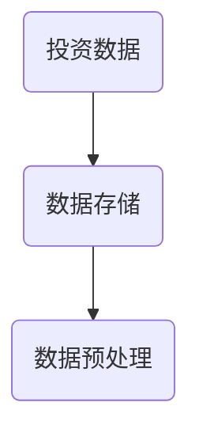
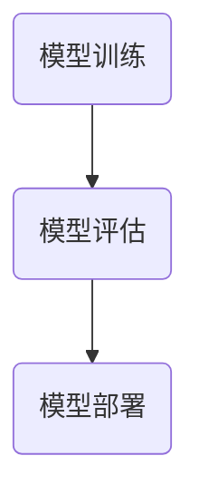
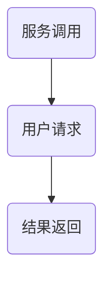
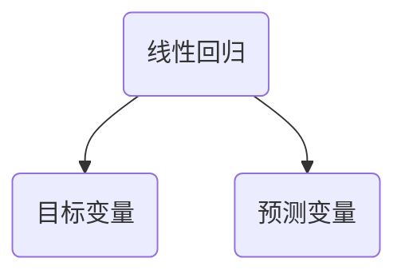
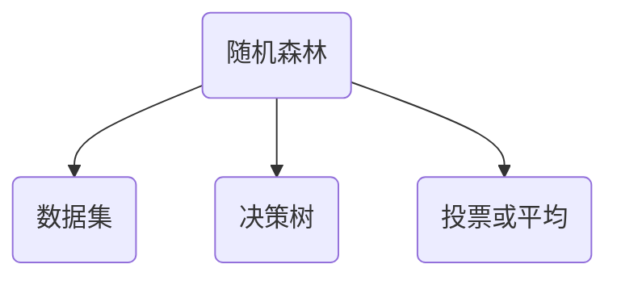
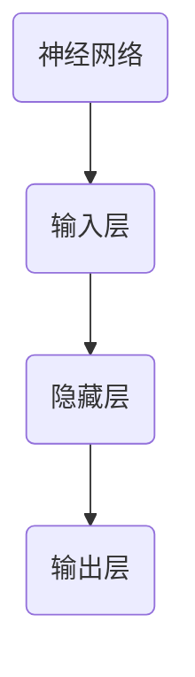
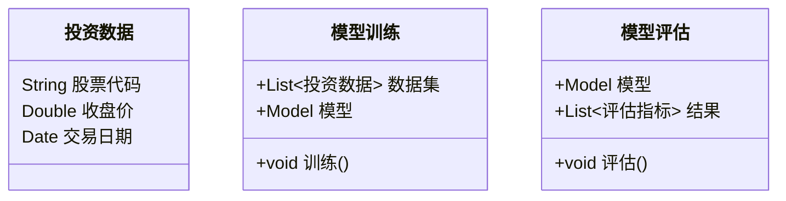
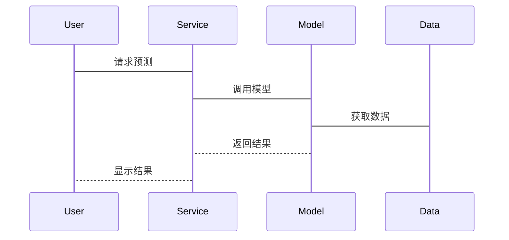

                 


# 投资理财智能助手的机器学习模型管理方法

> 关键词：机器学习模型，投资理财，智能助手，模型管理，算法原理

> 摘要：本文详细探讨了投资理财智能助手的机器学习模型管理方法，包括背景介绍、核心概念、算法原理、系统架构设计、项目实战以及最佳实践。通过结合具体的投资理财场景，分析了机器学习模型管理的关键环节，为投资理财领域的技术实践者提供了系统的指导。

---

## 第1章 机器学习模型管理概述

### 1.1 机器学习模型管理的背景与重要性

#### 1.1.1 问题背景：投资理财中的数据驱动决策
在投资理财领域，数据驱动决策已成为趋势。通过机器学习模型，投资者可以利用历史数据预测市场趋势、优化资产配置，并提高投资回报率。然而，机器学习模型的复杂性和动态性要求我们对模型进行有效的管理，以确保其稳定性和高效性。

#### 1.1.2 问题描述：模型管理的复杂性与挑战
投资理财场景中的数据具有高度的动态性和不确定性，模型需要在实时数据流中不断更新和调整。此外，不同类型的模型（如回归模型、分类模型、神经网络等）在不同场景下的表现差异显著，如何选择和部署合适的模型成为一大挑战。

#### 1.1.3 问题解决：机器学习模型管理的必要性
有效的模型管理可以确保模型的准确性和稳定性，同时提高模型的可解释性和可维护性。通过合理的模型管理，投资者可以在复杂的市场环境中做出更明智的决策。

#### 1.1.4 边界与外延：模型管理的范围界定
模型管理的范围包括模型的训练、评估、部署和监控。本文重点关注模型的训练和部署阶段，以及如何通过系统架构设计实现模型的高效管理。

#### 1.1.5 核心要素：数据、模型、评估、部署与监控
模型管理的核心要素包括数据的质量和多样性、模型的准确性和可解释性、评估指标的选择、部署策略的优化以及实时监控和维护。

### 1.2 投资理财智能助手的核心概念

#### 1.2.1 机器学习模型的基本概念
机器学习模型是通过训练数据学习特征与标签之间的关系，从而实现对新数据的预测或分类。在投资理财中，模型可以用于预测股票价格、评估资产风险等。

#### 1.2.2 投资理财智能助手的功能与目标
投资理财智能助手的功能包括数据收集、模型训练、风险评估、投资建议生成等。其目标是通过智能化的决策支持，帮助投资者实现更高的投资回报。

#### 1.2.3 模型管理的关键环节
模型管理的关键环节包括数据预处理、模型选择、模型训练、模型评估、模型部署和模型监控。

---

## 第2章 机器学习模型管理的核心概念与联系

### 2.1 核心概念原理

#### 2.1.1 机器学习模型的生命周期
机器学习模型的生命周期包括数据准备、模型训练、模型评估、模型部署和模型监控五个阶段。每个阶段都需要特定的工具和技术支持。

#### 2.1.2 投资理财智能助手的系统架构
投资理财智能助手的系统架构包括数据层、模型层、服务层和用户层。数据层负责数据的收集和存储，模型层负责模型的训练和部署，服务层负责与用户的交互，用户层负责展示结果。

### 2.2 概念属性特征对比表格

| 概念       | 属性         | 特征对比       |
|------------|--------------|---------------|
| 数据类型    | 时间序列数据 | 实时更新       |
| 模型类型    | 线性回归模型  | 适合趋势预测   |
| 模型类型    | 随机森林模型  | 适合分类任务   |
| 模型类型    | 神经网络模型  | 适合复杂任务   |

### 2.3 ER实体关系图

#### 2.3.1 数据层实体关系


#### 2.3.2 模型层实体关系


#### 2.3.3 服务层实体关系


---

## 第3章 机器学习模型管理的算法原理

### 3.1 算法原理讲解

#### 3.1.1 线性回归算法
线性回归是一种简单而有效的回归算法，适用于线性关系的数据。其数学模型如下：
$$ y = \beta_0 + \beta_1x + \epsilon $$
其中，$\beta_0$是截距，$\beta_1$是回归系数，$\epsilon$是误差项。

#### 3.1.2 随机森林算法
随机森林是一种基于决策树的集成学习算法，具有高准确性和强健性。其核心思想是通过构建多棵决策树并进行投票或平均来提高模型的泛化能力。

#### 3.1.3 神经网络算法
神经网络是一种模拟人脑结构和功能的深度学习算法，适用于复杂的非线性关系。其基本结构包括输入层、隐藏层和输出层。

### 3.2 算法流程图

#### 3.2.1 线性回归流程图


#### 3.2.2 随机森林流程图


#### 3.2.3 神经网络流程图


### 3.3 算法实现代码

#### 3.3.1 线性回归Python代码
```python
import numpy as np
from sklearn.linear_model import LinearRegression

# 示例数据
X = np.array([1, 2, 3, 4, 5]).reshape(-1, 1)
y = np.array([2, 4, 5, 4, 6])

# 模型训练
model = LinearRegression()
model.fit(X, y)

# 预测
print(model.predict(X))
```

#### 3.3.2 随机森林Python代码
```python
from sklearn.ensemble import RandomForestRegressor

# 示例数据
X = np.array([[1, 2], [3, 4], [5, 6], [7, 8], [9, 10]])
y = np.array([2, 3, 4, 5, 6])

# 模型训练
model = RandomForestRegressor(n_estimators=100)
model.fit(X, y)

# 预测
print(model.predict(X))
```

#### 3.3.3 神经网络Python代码
```python
from sklearn.neural_network import MLPRegressor

# 示例数据
X = np.array([[0.1, 0.2], [0.3, 0.4], [0.5, 0.6], [0.7, 0.8], [0.9, 1.0]])
y = np.array([0.2, 0.4, 0.6, 0.8, 1.0])

# 模型训练
model = MLPRegressor(hidden_layer_sizes=(2,))
model.fit(X, y)

# 预测
print(model.predict(X))
```

---

## 第4章 机器学习模型管理的系统分析与架构设计

### 4.1 系统功能设计

#### 4.1.1 问题场景介绍
投资理财智能助手需要处理大量的金融数据，并实时更新模型以适应市场变化。

#### 4.1.2 系统功能设计（领域模型）



### 4.2 系统架构设计

#### 4.2.1 系统架构图


#### 4.2.2 系统接口设计



---

## 第5章 项目实战

### 5.1 环境安装

#### 5.1.1 系统环境要求
- Python 3.6+
- Jupyter Notebook
- scikit-learn

#### 5.1.2 安装依赖
```bash
pip install numpy scikit-learn mermaid
```

### 5.2 系统核心实现源代码

#### 5.2.1 数据预处理代码
```python
import pandas as pd
from sklearn.model_selection import train_test_split
from sklearn.preprocessing import StandardScaler

# 数据加载
df = pd.read_csv('投资数据.csv')
X = df.drop('目标变量', axis=1)
y = df['目标变量']

# 数据分割
X_train, X_test, y_train, y_test = train_test_split(X, y, test_size=0.2, random_state=42)

# 特征缩放
scaler = StandardScaler()
X_train_scaled = scaler.fit_transform(X_train)
X_test_scaled = scaler.transform(X_test)
```

#### 5.2.2 模型训练代码
```python
from sklearn.linear_model import LinearRegression
from sklearn.ensemble import RandomForestRegressor
from sklearn.neural_network import MLPRegressor

# 线性回归模型训练
lr_model = LinearRegression()
lr_model.fit(X_train_scaled, y_train)

# 随机森林模型训练
rf_model = RandomForestRegressor(n_estimators=100)
rf_model.fit(X_train, y_train)

# 神经网络模型训练
mlp_model = MLPRegressor(hidden_layer_sizes=(2,))
mlp_model.fit(X_train_scaled, y_train)
```

#### 5.2.3 模型评估代码
```python
from sklearn.metrics import mean_squared_error, mean_absolute_error

# 线性回归评估
y_lr_pred = lr_model.predict(X_test_scaled)
mse_lr = mean_squared_error(y_test, y_lr_pred)
mae_lr = mean_absolute_error(y_test, y_lr_pred)
print(f'线性回归 MSE: {mse_lr}, MAE: {mae_lr}')

# 随机森林评估
y_rf_pred = rf_model.predict(X_test)
mse_rf = mean_squared_error(y_test, y_rf_pred)
mae_rf = mean_absolute_error(y_test, y_rf_pred)
print(f'随机森林 MSE: {mse_rf}, MAE: {mae_rf}')

# 神经网络评估
y_mlp_pred = mlp_model.predict(X_test_scaled)
mse_mlp = mean_squared_error(y_test, y_mlp_pred)
mae_mlp = mean_absolute_error(y_test, y_mlp_pred)
print(f'神经网络 MSE: {mse_mlp}, MAE: {mae_mlp}')
```

### 5.3 实际案例分析与详细解读

#### 5.3.1 数据准备
假设我们有一个包含股票历史价格、交易量、市场指数等特征的数据集。目标是预测股票的收盘价。

#### 5.3.2 模型训练与评估
通过上述代码，我们分别训练了线性回归、随机森林和神经网络模型，并计算了每个模型的均方误差（MSE）和平均绝对误差（MAE）。

#### 5.3.3 模型选择
根据评估结果，选择表现最佳的模型进行部署。例如，假设随机森林模型表现最好，我们可以将其部署到生产环境中。

### 5.4 项目小结
在本项目中，我们通过数据预处理、模型训练和评估，选择了一个合适的机器学习模型，并将其部署到投资理财智能助手中，实现了对股票价格的预测。

---

## 第6章 最佳实践

### 6.1 小结
机器学习模型管理是投资理财智能助手的核心部分。通过合理的模型管理，可以提高模型的准确性和稳定性，从而帮助投资者做出更明智的决策。

### 6.2 注意事项
- 数据的质量和多样性对模型性能影响重大，需谨慎处理数据。
- 模型的可解释性是投资理财领域的重要需求，需选择适合的模型。
- 模型的实时更新和监控是确保模型性能的关键。

### 6.3 未来趋势
随着深度学习和强化学习的不断发展，未来的投资理财智能助手将更加智能化和自动化。

### 6.4 拓展阅读
- 《机器学习实战》
- 《Python机器学习》
- 《投资学原理》

---

## 作者

作者：AI天才研究院/AI Genius Institute & 禅与计算机程序设计艺术/Zen And The Art of Computer Programming

---

以上就是《投资理财智能助手的机器学习模型管理方法》的完整内容，希望对您有所帮助！

