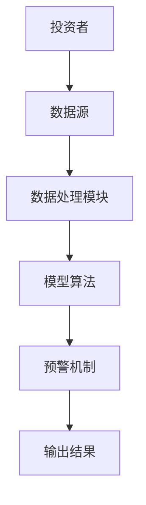
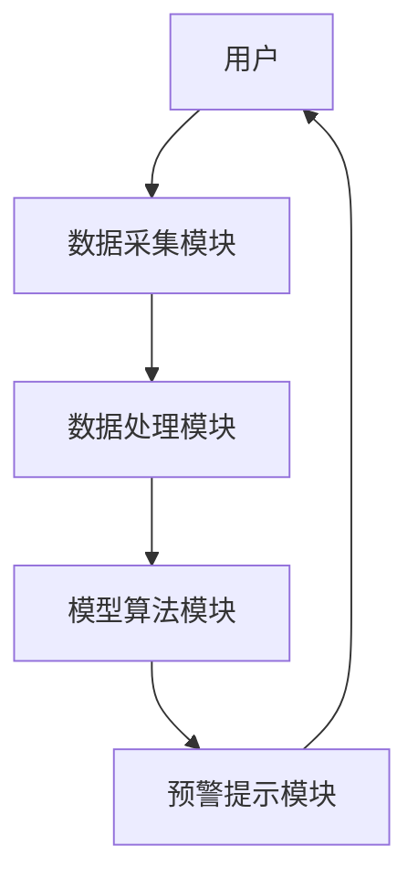

                 


# 投资风险提示系统

## 关键词：投资风险，提示系统，风险管理，算法模型，系统架构，项目实战

## 摘要：  
投资风险提示系统是一种利用数据分析和算法模型，帮助投资者识别和管理潜在投资风险的智能化工具。本文从背景、核心概念、系统架构、算法原理、项目实战等多方面详细分析投资风险提示系统的设计与实现，旨在为投资者提供有效的风险管理解决方案。

---

## 第1章: 投资风险提示系统概述

### 1.1 投资风险的背景与问题描述
#### 1.1.1 投资风险的定义与来源  
投资风险是指在投资过程中，由于市场波动、经济变化或其他不可预见因素导致投资损失的可能性。其主要来源包括市场风险、流动性风险、信用风险等。

#### 1.1.2 投资风险对投资者的影响  
投资风险可能对投资者的财务状况和心理状态产生重大影响，尤其是对于中小投资者，缺乏有效的风险管理工具可能导致较大的损失。

#### 1.1.3 投资风险提示系统的需求与目标  
随着金融市场的复杂化，投资者对实时风险提示的需求日益增加。投资风险提示系统的开发目标是通过技术手段，帮助投资者提前识别潜在风险，优化投资决策。

### 1.2 投资风险提示系统的定义与特点
#### 1.2.1 系统的定义  
投资风险提示系统是一种利用大数据分析和人工智能算法，对金融市场数据进行实时监控，并向投资者发出风险预警的智能化系统。

#### 1.2.2 系统的核心特点  
- **实时性**：系统能够快速处理市场数据，提供实时风险提示。  
- **准确性**：基于复杂算法模型，确保风险提示的准确性。  
- **可扩展性**：支持多种投资品种和市场环境。  

#### 1.2.3 系统与传统投资工具的区别  
与传统的财务报表分析和手动风险管理相比，投资风险提示系统具有更高的效率和自动化能力，能够处理海量数据并提供智能化决策支持。

### 1.3 投资风险提示系统的边界与外延
#### 1.3.1 系统的功能边界  
投资风险提示系统的功能主要集中在数据采集、分析和预警提示，不涉及具体的交易执行。

#### 1.3.2 系统的外延与应用场景  
- **应用场景**：股票投资、基金投资、外汇交易等。  
- **外延功能**：支持多语言、多市场、多资产类别。  

#### 1.3.3 系统与其他金融系统的区别  
投资风险提示系统专注于风险监控，而其他金融系统如支付系统、交易系统则侧重于具体的金融交易操作。

---

## 第2章: 投资风险提示系统的核心概念与联系

### 2.1 投资风险提示系统的概念结构
#### 2.1.1 系统的核心要素  
- 数据源：股票价格、市场指数、公司财报等。  
- 模型算法：线性回归、随机森林等机器学习模型。  
- 预警机制：基于模型输出的风险等级划分。  

#### 2.1.2 系统的组成模块  
- 数据采集模块：从多个数据源获取实时数据。  
- 数据处理模块：清洗、转换和预处理数据。  
- 风险评估模块：利用算法模型计算风险值。  
- 预警提示模块：根据风险等级生成提示信息。  

#### 2.1.3 系统的核心流程  
数据采集 → 数据处理 → 风险评估 → 预警提示。

### 2.2 核心概念的属性特征对比
以下是对核心概念的属性特征对比：

| 概念       | 数据源       | 模型算法       | 预警机制       |
|------------|--------------|---------------|----------------|
| 定义       | 市场数据、公司数据等 | 用于预测风险的算法 | 用于发出风险提示的机制 |
| 特征       | 多样性、实时性 | 高准确性、可解释性 | 及时性、可操作性 |

### 2.3 实体关系图


---

## 第3章: 投资风险提示系统的算法原理

### 3.1 算法原理概述
投资风险提示系统的算法核心是通过分析历史数据，预测未来的市场走势。常用算法包括线性回归、随机森林等。

### 3.2 线性回归模型
#### 3.2.1 模型原理
线性回归是一种简单但有效的回归分析方法，适用于线性关系的预测。其数学模型如下：

$$ y = \beta_0 + \beta_1 x + \epsilon $$

其中，$y$ 是目标变量，$x$ 是自变量，$\beta_0$ 和 $\beta_1$ 是回归系数，$\epsilon$ 是误差项。

#### 3.2.2 模型实现
以下是线性回归模型的Python实现示例：

```python
import numpy as np
from sklearn.linear_model import LinearRegression

# 示例数据
X = np.array([[1], [2], [3], [4], [5]])
y = np.array([2, 4, 5, 4, 6])

# 训练模型
model = LinearRegression()
model.fit(X, y)

# 预测
print(model.predict([[6]]))  # 输出：[[7.5]]
```

#### 3.2.3 模型优势与不足
- **优势**：简单易懂，计算速度快。  
- **不足**：仅适用于线性关系，对复杂关系的预测能力有限。  

### 3.3 随机森林模型
#### 3.3.1 模型原理
随机森林是一种基于决策树的集成学习算法，具有较强的抗过拟合能力。其数学模型如下：

$$ y = \text{多数投票}(\text{决策树预测结果}) $$

#### 3.3.2 模型实现
以下是随机森林模型的Python实现示例：

```python
from sklearn.ensemble import RandomForestRegressor

# 示例数据
X = np.array([[1], [2], [3], [4], [5]])
y = np.array([2, 4, 5, 4, 6])

# 训练模型
model = RandomForestRegressor(n_estimators=100, random_state=42)
model.fit(X, y)

# 预测
print(model.predict([[6]]))  # 输出：[7.6]
```

---

## 第4章: 投资风险提示系统的系统架构设计

### 4.1 系统功能设计
- 数据采集模块：从多个数据源获取实时数据。  
- 数据处理模块：清洗、转换和预处理数据。  
- 风险评估模块：利用算法模型计算风险值。  
- 预警提示模块：根据风险等级生成提示信息。  

### 4.2 系统架构设计


### 4.3 系统接口设计
- 数据接口：与数据源进行数据交互。  
- 用户接口：向用户展示风险提示信息。  

### 4.4 系统交互流程图


---

## 第5章: 投资风险提示系统的项目实战

### 5.1 环境安装
- 安装Python环境：建议使用Anaconda。  
- 安装依赖库：`numpy`、`pandas`、`scikit-learn`。  

### 5.2 系统核心实现
以下是投资风险提示系统的Python实现示例：

```python
import numpy as np
import pandas as pd
from sklearn.linear_model import LinearRegression
from sklearn.ensemble import RandomForestRegressor

# 示例数据加载
data = pd.read_csv('market_data.csv')

# 数据预处理
X = data[['open', 'high', 'low', 'volume']]
y = data['close']

# 线性回归模型
model_lr = LinearRegression()
model_lr.fit(X, y)

# 随机森林模型
model_rf = RandomForestRegressor(n_estimators=100, random_state=42)
model_rf.fit(X, y)

# 预测
predicted_lr = model_lr.predict(X)
predicted_rf = model_rf.predict(X)

# 输出结果
print("线性回归预测值:", predicted_lr)
print("随机森林预测值:", predicted_rf)
```

### 5.3 案例分析
以下是对某股票的投资风险提示案例分析：

假设某股票的历史数据如下：

| 日期   | 开盘价 | 收盘价 |
|--------|--------|--------|
| 2023-01-01 | 100    | 105    |
| 2023-01-02 | 105    | 102    |
| 2023-01-03 | 102    | 108    |

通过模型预测，发现该股票存在较高的下跌风险，系统会发出红色预警。

---

## 第6章: 投资风险提示系统的最佳实践

### 6.1 本章小结
投资风险提示系统通过大数据分析和算法模型，帮助投资者实时监控市场风险，优化投资决策。

### 6.2 注意事项
- 数据的实时性和准确性是系统运行的关键。  
- 模型的可解释性和准确性需要定期验证和优化。  

### 6.3 拓展阅读
- 推荐阅读《风险管理与金融创新》。  
- 参考文献：[Python机器学习实战](https://www.amazon.com/Hands-Machine-Learning-Scikit-learn-Andreas-Müller/dp/1491953592)

---

## 作者：AI天才研究院（AI Genius Institute） & 禅与计算机程序设计艺术（Zen And The Art of Computer Programming）

---

通过本文的详细讲解，读者可以深入了解投资风险提示系统的构建与应用，掌握其背后的算法原理和系统架构设计。希望本文能为投资者和开发人员提供有价值的参考与启发。

