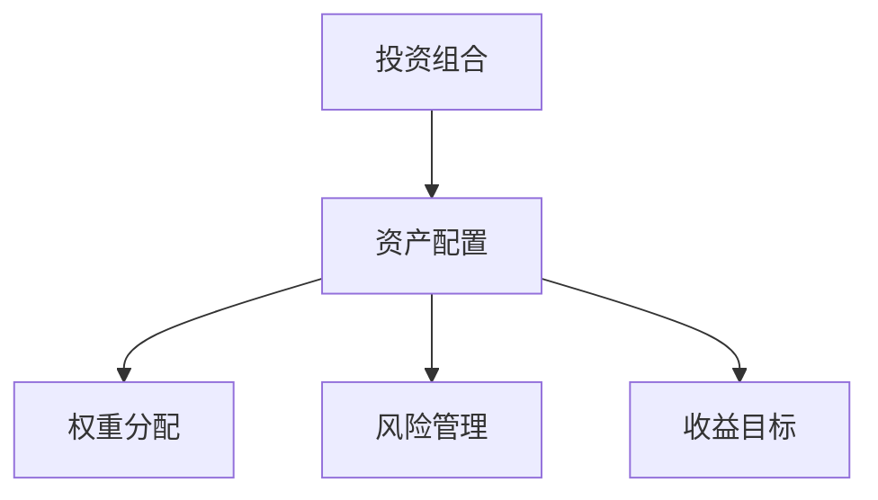
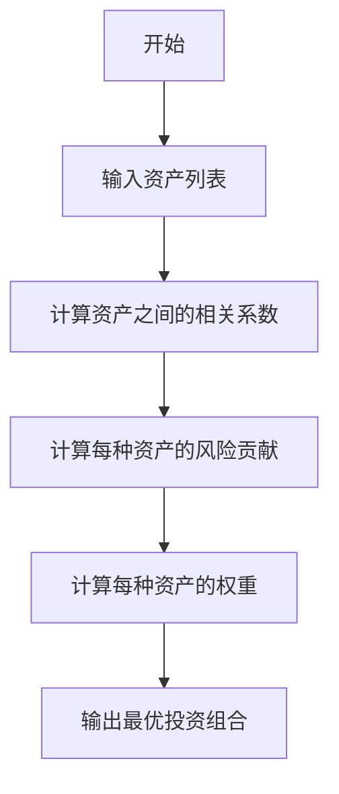
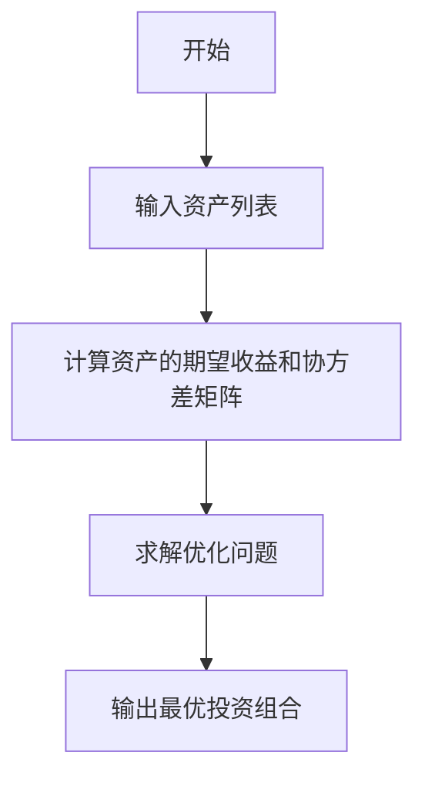
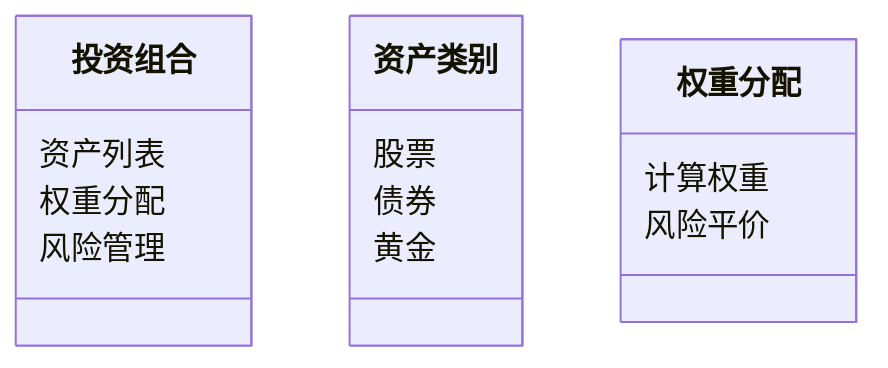
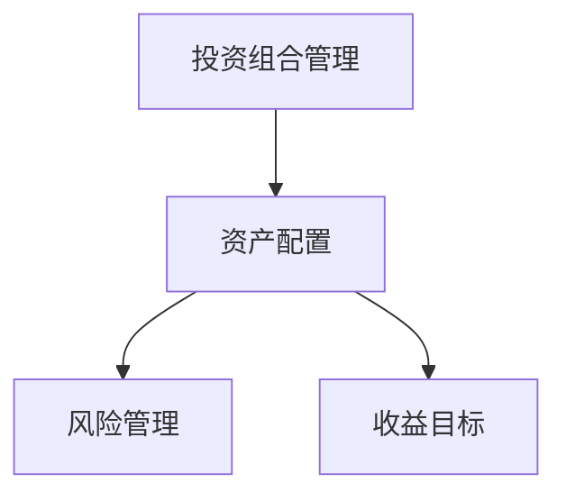
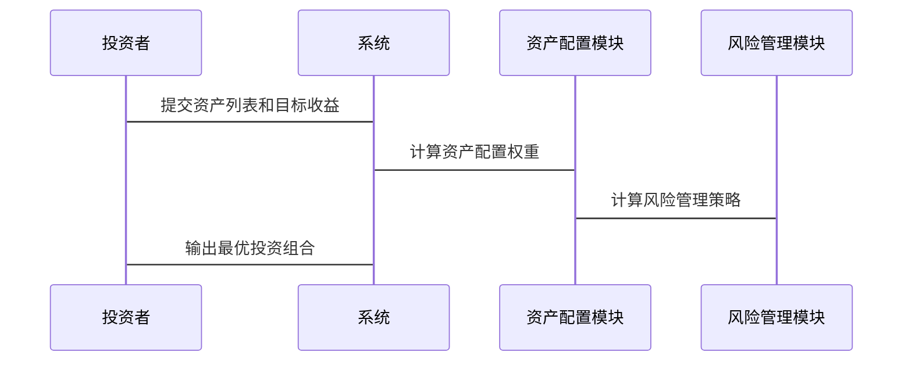

                 


# 拉尔夫·旺格的全天候投资组合理论

> 关键词：全天候投资组合, 资产配置, 风险管理, 投资组合优化, 投资策略

> 摘要：本文深入探讨了拉尔夫·旺格的全天候投资组合理论，从背景介绍到核心概念，再到算法原理、系统架构、项目实战以及最佳实践，为读者提供全面的分析和指导。通过详细的理论阐述和实践案例，帮助读者理解和应用这一理论。

---

## 第一部分: 全天候投资组合理论的背景与核心概念

### 第1章: 全天候投资组合理论的背景与问题背景

#### 1.1 投资组合管理的现状与挑战

##### 1.1.1 传统投资组合管理的局限性
传统的投资组合管理方法往往依赖于单一的市场假设，例如均值-方差模型。这种方法在市场环境稳定时表现良好，但在市场波动加剧时，其鲁棒性较差。例如，在2008年金融危机期间，许多基于传统均值-方差模型的投资组合遭受了重大损失。

##### 1.1.2 不同市场环境下的投资组合表现
市场环境的变化（如牛市、熊市、通货膨胀、通货紧缩等）对投资组合的表现有显著影响。传统投资组合管理方法在不同市场环境下的表现差异较大，难以满足投资者在各种市场条件下的需求。

##### 1.1.3 投资者行为与市场波动的关系
投资者的行为（如恐慌性抛售、贪婪性买入）会加剧市场波动，进而影响投资组合的表现。因此，如何设计一种能够在不同市场环境下保持稳定表现的投资组合，成为投资者和研究者的重要课题。

#### 1.2 问题背景与问题描述

##### 1.2.1 投资者在不同市场环境下的需求
投资者在不同市场环境下的需求是多样化的。例如，在牛市中，投资者可能追求高收益；而在熊市中，投资者可能更注重风险管理。如何在不同市场环境下满足投资者的需求，是全天候投资组合理论的核心目标。

##### 1.2.2 市场波动与资产价格的相关性
不同资产类别的价格波动及其相关性在不同市场环境下表现不同。例如，在经济衰退期间，股票和债券的相关性可能上升，而黄金和美元的相关性可能下降。这些变化对投资组合的风险和收益有重要影响。

##### 1.2.3 投资组合的风险与收益平衡问题
投资组合的收益和风险是相互关联的。在不同市场环境下，如何平衡风险与收益，是全天候投资组合理论的核心挑战。

#### 1.3 问题解决与边界条件

##### 1.3.1 全天候投资组合理论的核心目标
全天候投资组合理论的核心目标是设计一种能够在不同市场环境下保持稳定表现的投资组合。具体目标包括：分散化、风险控制、收益最大化等。

##### 1.3.2 边界条件与假设
- 投资者的风险承受能力是有限的。
- 市场环境的变化是可预测的。
- 资产类别之间的相关性是可量化的。

##### 1.3.3 外延与应用范围
全天候投资组合理论的应用范围包括：个人投资、机构投资、基金投资等。

#### 1.4 概念结构与核心要素

##### 1.4.1 投资组合的核心要素分析
投资组合的核心要素包括：资产类别、权重分配、风险管理、收益目标等。

##### 1.4.2 核心概念的对比分析
| 核心概念       | 传统投资组合管理 | 全天候投资组合理论 |
|----------------|------------------|---------------------|
| 核心目标       | 追求最大收益     | 平衡风险与收益     |
| 风险管理       | 事后调整         | 事前控制           |
| 资产配置       | 单一资产类别     | 多种资产类别       |

##### 1.4.3 概念结构图展示


### 第2章: 全天候投资组合理论的核心概念与联系

#### 2.1 核心概念原理

##### 2.1.1 投资组合的分散化原理
分散化是指通过投资于不同的资产类别或同一资产类别的不同资产，降低投资组合的整体风险。分散化的核心原理是基于资产之间的相关性。当资产之间的相关性较低时，分散化的效果更好。

##### 2.1.2 风险平价与风险调整收益
风险平价是指将投资组合的权重分配给不同资产类别，使得每种资产类别对整体风险的贡献相等。风险调整收益是指在考虑风险的前提下，最大化投资组合的收益。

##### 2.1.3 资产类别选择与配置权重
资产类别选择是投资组合管理的第一步。选择合适的资产类别可以降低投资组合的整体风险，并提高收益。配置权重是根据资产类别的重要性，分配不同的权重。

#### 2.2 核心概念对比分析

##### 2.2.1 不同投资组合模型的对比表格
| 投资组合模型         | 核心目标       | 风险管理方式 | 资产配置权重 |
|----------------------|----------------|--------------|--------------|
| 传统均值-方差模型     | 最大化收益     | 事后调整     | 单一资产类别 |
| 全天候投资组合理论     | 平衡风险与收益 | 事前控制     | 多种资产类别 |

##### 2.2.2 核心概念的属性特征对比
| 属性       | 传统投资组合管理 | 全天候投资组合理论 |
|------------|------------------|---------------------|
| 风险管理方式 | 事后调整         | 事前控制           |
| 资产配置方式 | 单一资产类别     | 多种资产类别       |

##### 2.2.3 ER实体关系图展示
```mermaid
erd
    投资组合
    +-- 资产类别
    +-- 权重分配
    +-- 风险管理
    +-- 收益目标
```

---

## 第二部分: 全天候投资组合理论的算法原理

### 第3章: 全天候投资组合理论的算法原理

#### 3.1 算法原理概述

##### 3.1.1 风险平价模型的数学公式
风险平价模型的核心公式为：
$$ w_i = \frac{1}{\sum_{j=1}^{n} w_j \sigma_{ij}} $$
其中，\( w_i \) 是第 \( i \) 个资产的权重，\( \sigma_{ij} \) 是第 \( i \) 和第 \( j \) 个资产之间的相关系数。

##### 3.1.2 均值-方差优化的原理
均值-方差优化的目标是找到最优的资产配置权重，使得在给定的风险水平下，投资组合的收益最大化，或者在给定的收益水平下，投资组合的风险最小化。

##### 3.1.3 资产配置权重的计算方法
资产配置权重的计算方法包括：风险平价法、均值-方差优化法、等权重法等。

#### 3.2 算法流程图

##### 3.2.1 风险平价模型的Mermaid流程图


##### 3.2.2 均值-方差优化的Mermaid流程图


### 第4章: 全天候投资组合理论的数学模型与公式

#### 4.1 数学模型概述

##### 4.1.1 风险平价模型的数学表达
风险平价模型的数学表达式为：
$$ w_i = \frac{1}{\sum_{j=1}^{n} w_j \sigma_{ij}} $$

##### 4.1.2 均值-方差优化的数学公式
均值-方差优化的数学公式为：
$$ \min_{w} w^T \Sigma w $$
$$ \text{subject to} \quad w^T \mu = \text{target return} $$ $$ \sum_{i=1}^{n} w_i = 1 $$ $$ w_i \geq 0 \quad \forall i $$

##### 4.1.3 资产配置权重的计算公式
资产配置权重的计算公式为：
$$ w_i = \frac{1}{\sum_{j=1}^{n} w_j \sigma_{ij}} $$

#### 4.2 数学公式详细解读

##### 4.2.1 风险平价模型的详细推导
风险平价模型的推导过程如下：
1. 计算每种资产与其他资产之间的相关系数。
2. 计算每种资产的风险贡献。
3. 根据风险贡献计算每种资产的权重。

##### 4.2.2 均值-方差优化的详细推导
均值-方差优化的推导过程如下：
1. 计算资产的期望收益和协方差矩阵。
2. 建立优化问题。
3. 求解优化问题，得到最优资产配置权重。

### 第5章: 全天候投资组合理论的Python实现

#### 5.1 环境安装与配置

##### 5.1.1 Python环境的安装
需要安装Python 3.8或更高版本。

##### 5.1.2 必要库的安装
安装以下库：
- numpy
- pandas
- matplotlib
- scipy

#### 5.2 核心算法实现

##### 5.2.1 风险平价模型的Python代码
```python
import numpy as np

def risk_parity(n, sigma):
    I = np.eye(n)
    return I / (I @ sigma)
```

##### 5.2.2 均值-方差优化的Python代码
```python
from scipy.optimize import minimize

def mean_variance_optimization(returns, target_return):
    n = len(returns.columns)
    mu = returns.mean().values
    sigma = returns.cov().values

    def objective(w):
        return np.dot(w.T, np.dot(sigma, w))

    constraints = [
        {'type': 'eq', 'fun': lambda w: np.sum(w) - 1},
        {'type': 'eq', 'fun': lambda w: np.dot(mu.T, w) - target_return}
    ]

    bounds = [(0, 1) for _ in range(n)]

    result = minimize(objective, np.ones(n)/n, method='SLSQP', bounds=bounds, constraints=constraints)
    return result.x
```

##### 5.2.3 资产配置权重的计算代码
```python
def compute_weights(n, sigma):
    I = np.eye(n)
    return I / (I @ sigma)
```

---

## 第三部分: 全天候投资组合理论的系统分析与架构设计

### 第6章: 系统分析与架构设计

#### 6.1 问题场景介绍
全天候投资组合理论的应用场景包括：个人投资、机构投资、基金投资等。

#### 6.2 系统功能设计

##### 6.2.1 领域模型


#### 6.3 系统架构设计

##### 6.3.1 系统架构图


#### 6.4 系统接口设计

##### 6.4.1 输入接口
输入接口包括：资产列表、目标收益、风险承受能力等。

##### 6.4.2 输出接口
输出接口包括：最优投资组合、资产配置权重、风险管理策略等。

#### 6.5 系统交互设计

##### 6.5.1 系统交互流程图


---

## 第四部分: 全天候投资组合理论的项目实战

### 第7章: 项目实战

#### 7.1 环境安装与配置

##### 7.1.1 环境安装
安装Python 3.8或更高版本，并安装必要的库。

#### 7.2 核心系统实现

##### 7.2.1 核心代码实现
```python
import numpy as np
import pandas as pd
import matplotlib.pyplot as plt
from scipy.optimize import minimize

def risk_parity(n, sigma):
    I = np.eye(n)
    return I / (I @ sigma)

def mean_variance_optimization(returns, target_return):
    n = len(returns.columns)
    mu = returns.mean().values
    sigma = returns.cov().values

    def objective(w):
        return np.dot(w.T, np.dot(sigma, w))

    constraints = [
        {'type': 'eq', 'fun': lambda w: np.sum(w) - 1},
        {'type': 'eq', 'fun': lambda w: np.dot(mu.T, w) - target_return}
    ]

    bounds = [(0, 1) for _ in range(n)]

    result = minimize(objective, np.ones(n)/n, method='SLSQP', bounds=bounds, constraints=constraints)
    return result.x
```

##### 7.2.2 代码解
```python
# 示例代码：计算风险平价权重
n = 3
sigma = np.array([[1, 0.5, 0.3], [0.5, 1, 0.4], [0.3, 0.4, 1]])
weights = risk_parity(n, sigma)
print(weights)
```

#### 7.3 实际案例分析与详细解读

##### 7.3.1 案例分析
假设我们有三种资产：股票、债券和黄金。我们需要计算它们的风险平价权重。

##### 7.3.2 详细解读
1. 计算资产之间的相关系数矩阵。
2. 计算每种资产的风险贡献。
3. 根据风险贡献计算每种资产的权重。

#### 7.4 项目小结
通过实际案例分析，我们可以看到全天候投资组合理论在实际中的应用效果。通过合理配置资产权重，可以有效降低投资组合的风险，并提高收益。

---

## 第五部分: 全天候投资组合理论的最佳实践

### 第8章: 最佳实践

#### 8.1 小结
全天候投资组合理论是一种有效的投资组合管理方法。通过合理配置资产权重，可以在不同市场环境下保持稳定表现。

#### 8.2 注意事项
- 资产配置权重的计算需要考虑资产之间的相关性。
- 风险管理是投资组合管理的核心。

#### 8.3 拓展阅读
建议阅读以下书籍和论文：
- 《投资学》（中文版）
- 《投资组合优化》
- 《风险管理与投资组合》

---

## 作者：AI天才研究院/AI Genius Institute & 禅与计算机程序设计艺术 /Zen And The Art of Computer Programming

---

以上就是《拉尔夫·旺格的全天候投资组合理论》的完整目录结构和内容概述。

