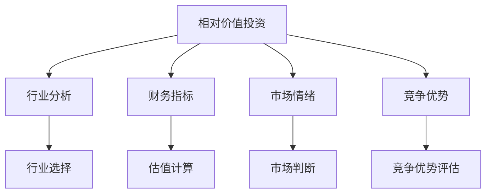
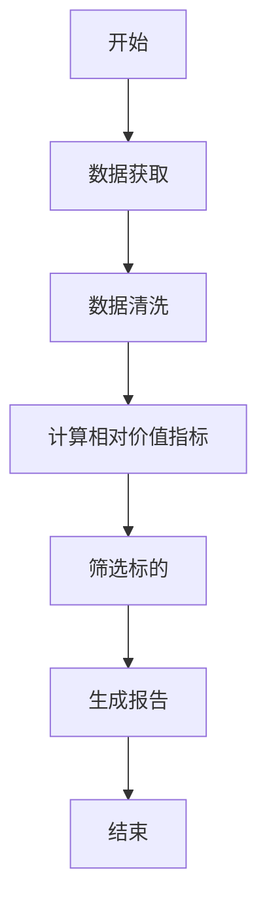
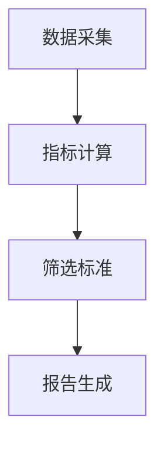

                 


```markdown
# 拉尔夫·旺格的相对价值投资：在同行中寻找最佳标的

> 关键词：相对价值投资，拉尔夫·旺格，投资策略，行业分析，财务指标，投资组合优化

> 摘要：本文深入探讨了拉尔夫·旺格的相对价值投资理论，分析了其核心概念、算法原理及实际应用。通过系统分析和项目实战，展示了如何在同行中寻找最佳投资标的，为投资者提供了实用的指导和建议。

---

## 第一部分：相对价值投资的背景与核心概念

### 第1章：相对价值投资的定义与背景

#### 1.1 相对价值投资的定义
- **1.1.1 投资学中的相对价值概念**  
  相对价值投资是一种基于相对估值的方法，旨在通过比较同一行业内的公司，识别出被市场低估或高估的标的。  
  $$ V = \frac{P}{E} $$
  其中，$V$ 表示估值，$P$ 表示股价，$E$ 表示每股收益。

- **1.1.2 相对价值投资的核心理念**  
  相对价值投资的核心在于通过横向比较同一行业内的公司，寻找具有竞争优势且估值合理的标的。这种方法强调的是“相对”而非“绝对”价值。

- **1.1.3 相对价值投资的市场适用性**  
  相对价值投资适用于成熟且竞争充分的市场，尤其适合分析同质化程度较高的行业，如银行、制造业等。

#### 1.2 相对价值投资的历史演变
- **1.2.1 早期价值投资的起源**  
  早期的价值投资由本杰明·格雷厄姆和戴维·多德提出，强调以低于内在价值的价格购买股票。  
  $$ P < V $$

- **1.2.2 相对价值投资的兴起**  
  在20世纪70年代，相对价值投资逐渐兴起，尤其是在机构投资者中，成为一种重要的投资策略。  
  $$ P/E \text{比率} = \frac{P}{E} $$

- **1.2.3 当代相对价值投资的发展**  
  近年来，随着大数据和人工智能技术的进步，相对价值投资更加注重量化分析和模型构建。

---

### 第2章：相对价值投资的核心概念与联系

#### 2.1 相对价值投资的核心要素
- **行业分析**：选择竞争充分、同质化程度高的行业，如银行、公用事业等。
- **财务指标**：常用的相对价值指标包括市盈率（P/E）、市净率（P/B）、股息率（D/P）等。
  $$ P/E = \frac{P}{E} $$
  $$ P/B = \frac{P}{B} $$
  $$ D/P = \frac{D}{P} $$

- **市场情绪**：通过分析市场情绪，判断标的资产的估值是否合理。
- **竞争优势**：选择具有可持续竞争优势的公司，如成本优势、品牌优势等。

#### 2.2 相对价值投资的概念结构与核心要素


---

## 第二部分：相对价值投资的算法原理

### 第3章：相对价值投资的算法原理

#### 3.1 相对价值投资的评估流程


#### 3.2 相对价值投资的Python实现
```python
import pandas as pd
import numpy as np

# 示例数据：银行行业的公司数据
data = {
    '公司': ['A', 'B', 'C', 'D', 'E'],
    'P': [10, 15, 20, 25, 30],
    'E': [5, 10, 15, 20, 25]
}

df = pd.DataFrame(data)

# 计算相对价值指标（P/E比率）
df['P/E'] = df['P'] / df['E']

# 筛选P/E低于行业平均值的公司
mean_pe = df['P/E'].mean()
selected = df[df['P/E'] < mean_pe]

print(selected)
```

---

### 第4章：相对价值投资的数学模型与公式

#### 4.1 相对价值指标的核心公式
- **市盈率（P/E）**：$$ P/E = \frac{P}{E} $$
- **市净率（P/B）**：$$ P/B = \frac{P}{B} $$
- **股息率（D/P）**：$$ D/P = \frac{D}{P} $$

#### 4.2 相对价值投资的优化模型
$$ \text{最大化} \sum_{i=1}^{n} V_i $$
$$ \text{约束条件}：\sum_{i=1}^{n} w_i = 1, \quad w_i \geq 0 $$

其中，$V_i$ 是第 $i$ 家公司的估值，$w_i$ 是投资权重。

---

## 第三部分：相对价值投资的系统分析与架构设计

### 第5章：相对价值投资的系统架构

#### 5.1 系统功能设计


#### 5.2 系统架构设计


---

### 第6章：相对价值投资的项目实战

#### 6.1 项目环境安装
```bash
pip install pandas numpy matplotlib
```

#### 6.2 核心代码实现
```python
import pandas as pd

# 数据获取
data = pd.read_csv('bank.csv')

# 数据清洗
data.dropna()

# 计算相对价值指标
data['P/E'] = data['P'] / data['E']

# 筛选标的
selected = data[data['P/E'] < data['P/E'].mean()]

print(selected)
```

---

## 第四部分：相对价值投资的最佳实践

### 第7章：最佳实践与小结

#### 7.1 小结
相对价值投资通过横向比较同一行业内的公司，识别出具有竞争优势且估值合理的标的。这种方法在成熟市场中尤其有效。

#### 7.2 注意事项
- 数据来源的可靠性
- 模型的局限性
- 市场变化的动态性

#### 7.3 拓展阅读
- 《投资学》
- 《相对价值投资策略》
- 《价值投资的艺术》

---

## 作者简介

作者：AI天才研究院/AI Genius Institute & 禅与计算机程序设计艺术/Zen And The Art of Computer Programming

---

**本文通过系统分析和实际案例，深入探讨了拉尔夫·旺格的相对价值投资理论，为投资者提供了实用的指导和建议。希望读者能够通过本文，掌握相对价值投资的核心方法，并在实际投资中取得优异成绩。**
```

