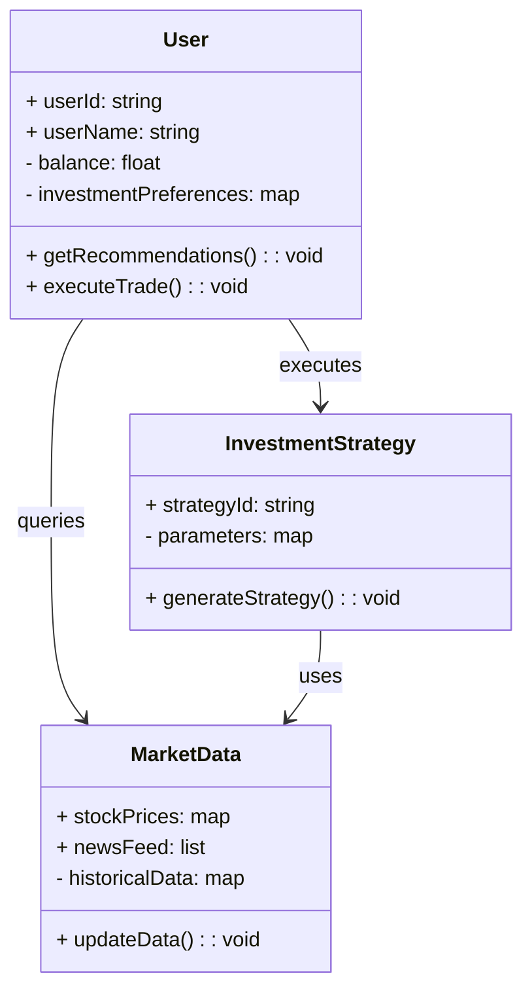
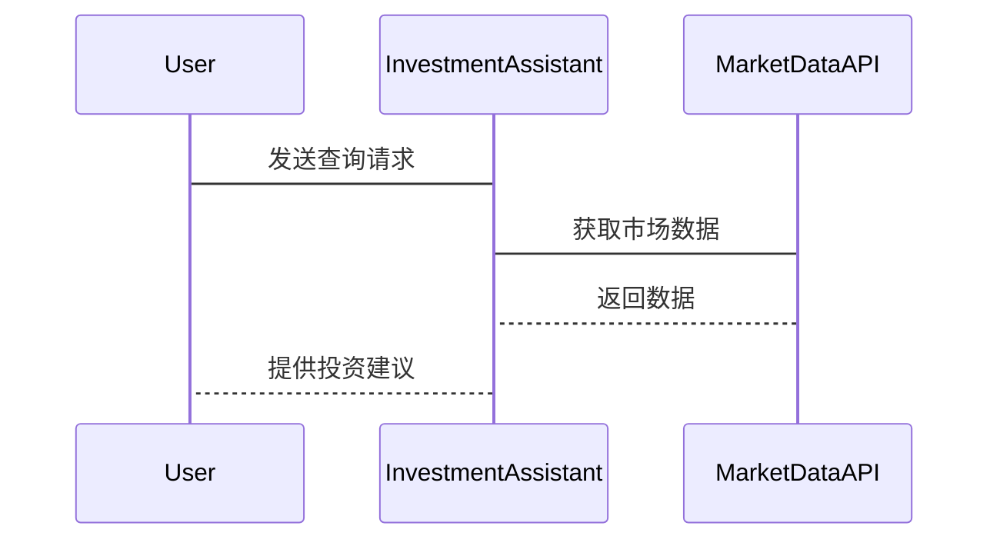

                 


# 探索下一代投资理财智能助手的发展方向

> **关键词**：投资理财、智能助手、人工智能、机器学习、自然语言处理、知识图谱

> **摘要**：  
本文探讨了下一代投资理财智能助手的发展方向，分析了其核心技术和应用场景。文章从背景与现状出发，深入讲解了智能助手的核心技术，包括自然语言处理、机器学习、知识图谱等，并结合实际案例分析了系统的架构设计与实现方法。最后，总结了开发中的经验与未来发展方向。

---

# 第一部分: 投资理财智能助手的背景与现状

## 第1章: 投资理财智能助手的背景介绍

### 1.1 传统投资理财的痛点

传统投资理财过程中，投资者面临以下主要痛点：

- **信息过载**：金融市场信息繁杂，投资者难以快速获取和处理有用信息。
- **决策延迟**：传统分析依赖人工操作，导致决策速度慢，难以应对快速变化的市场。
- **门槛高**：专业投资知识不足的普通投资者难以有效参与。
- **个性化不足**：传统理财产品往往缺乏个性化，难以满足不同投资者的需求。

### 1.2 投资理财智能助手的核心目标

智能助手通过技术手段解决上述痛点，其核心目标包括：

- 提供实时、精准的市场信息分析。
- 自动化生成投资策略并执行交易。
- 提供个性化的投资建议，帮助用户优化资产配置。

### 1.3 市场需求与行业趋势

- **市场需求**：随着金融科技的发展，用户对智能化投资工具的需求日益增长。
- **行业趋势**：AI、大数据等技术推动金融行业向智能化、自动化方向发展。

---

## 第2章: 投资理财智能助手的定义与特点

### 2.1 定义

投资理财智能助手是一种结合人工智能、自然语言处理和大数据分析技术，为用户提供智能化投资建议、风险评估和资产配置的工具。

### 2.2 核心功能

- **信息获取与处理**：实时抓取和分析金融市场数据。
- **智能交互**：通过自然语言处理技术与用户进行交互。
- **投资策略生成**：基于机器学习模型生成个性化投资策略。

### 2.3 技术驱动因素

- **人工智能**：用于数据挖掘、模式识别和智能决策。
- **自然语言处理**：实现与用户的自然交互。
- **大数据分析**：处理海量市场数据，提取有价值的信息。

---

# 第二部分: 投资理财智能助手的核心技术

## 第3章: 核心技术与原理

### 3.1 自然语言处理（NLP）

#### 3.1.1 NLP在智能助手中的应用

- **文本理解**：分析用户输入的自然语言，提取意图和关键词。
- **对话生成**：根据用户需求生成自然流畅的回复。

#### 3.1.2 常用NLP模型

- **BERT**：用于文本理解和语义分析。
- **GPT**：用于生成式的对话模型。

### 3.2 机器学习与深度学习

#### 3.2.1 监督学习、无监督学习与强化学习

- **监督学习**：使用标注数据训练模型，如分类任务。
- **无监督学习**：从无标签数据中发现模式，如聚类分析。
- **强化学习**：通过奖励机制优化投资策略。

#### 3.2.2 神经网络在投资决策中的应用

- **时间序列预测**：使用LSTM预测股票价格。
- **情感分析**：分析市场情绪影响投资决策。

### 3.3 知识图谱与数据挖掘

#### 3.3.1 知识图谱构建

- **实体识别**：识别金融市场中的公司、产品等实体。
- **关系抽取**：构建实体之间的关系网络。

#### 3.3.2 数据挖掘在投资分析中的作用

- **模式发现**：发现投资数据中的潜在模式和趋势。
- **异常检测**：识别市场中的异常行为。

### 3.4 多模态交互技术

#### 3.4.1 文本、语音与图像交互

- **语音交互**：支持语音输入和输出。
- **图像交互**：通过图表直观展示数据。

#### 3.4.2 多模态技术的优势

- **提升用户体验**：多种交互方式满足不同用户需求。
- **提高准确性**：结合多种信息源，提高决策的准确性。

---

# 第三部分: 投资理财智能助手的算法原理

## 第4章: 算法原理与实现

### 4.1 自然语言处理算法

#### 4.1.1 基于BERT的文本理解

**代码示例**：

```python
from transformers import BertTokenizer, BertModel

tokenizer = BertTokenizer.from_pretrained('bert-base-uncased')
model = BertModel.from_pretrained('bert-base-uncased')

text = "What is the market trend today?"
inputs = tokenizer(text, return_tensors='np')
outputs = model(**inputs)
# outputs包含文本的语义表示
```

#### 4.1.2 基于GPT的生成模型

**代码示例**：

```python
from transformers import GPT2Tokenizer, GPT2Model

tokenizer = GPT2Tokenizer.from_pretrained('gpt2')
model = GPT2Model.from_pretrained('gpt2')

input_text = "The stock market is likely to"
inputs = tokenizer(input_text, return_tensors='np')
outputs = model(**inputs)
# 生成与市场相关的文本
```

### 4.2 投资决策算法

#### 4.2.1 基于强化学习的投资策略

**数学模型**：

$$
Q(s, a) = Q(s, a) + \alpha (r + \max Q(s', a') - Q(s, a))
$$

其中，\( Q(s, a) \) 表示在状态 \( s \) 下选择动作 \( a \) 的价值函数，\( \alpha \) 是学习率，\( r \) 是奖励。

---

# 第四部分: 系统分析与架构设计

## 第5章: 系统架构与设计

### 5.1 问题场景介绍

投资理财智能助手需要处理复杂的金融市场数据，并与用户进行实时交互。

### 5.2 系统功能设计

#### 5.2.1 领域模型

**Mermaid 类图**：



### 5.3 系统架构设计

#### 5.3.1 分层架构

**Mermaid 架构图**：

```mermaid
archi
    界面层
    分析层
    数据层
    接口层
```

### 5.4 接口设计

#### 5.4.1 系统接口

**Mermaid 序列图**：



---

# 第五部分: 项目实战

## 第6章: 项目实战与实现

### 6.1 环境搭建

- **工具安装**：安装Python、TensorFlow、Keras、Transformers库。
- **数据获取**：使用Yahoo Finance获取股票数据。

### 6.2 核心代码实现

#### 6.2.1 文本分析

```python
from transformers import pipeline

# 初始化NLP管道
nlp = pipeline("question-answering", model="bert-base")

# 分析用户问题
question = "What is the trend of Tesla stock?"
context = "The stock market shows an upward trend today."
result = nlp(question=question, context=context)
print(result)
```

#### 6.2.2 投资策略生成

```python
import numpy as np
from tensorflow.keras.models import Sequential
from tensorflow.keras.layers import Dense

# 创建简单的神经网络模型
model = Sequential()
model.add(Dense(64, activation='relu', input_dim=10))
model.add(Dense(1, activation='sigmoid'))
model.compile(optimizer='adam', loss='binary_crossentropy', metrics=['accuracy'])
model.fit(X_train, y_train, epochs=10, batch_size=32)
```

### 6.3 实际案例分析

- **案例一**：用户询问某股票的历史表现，系统返回相关数据和分析。
- **案例二**：用户希望制定长期投资计划，系统基于数据生成个性化策略。

---

# 第六部分: 最佳实践与未来展望

## 第7章: 最佳实践与未来方向

### 7.1 开发经验总结

- **数据质量**：确保数据的准确性和及时性。
- **模型调优**：定期更新模型，优化性能。

### 7.2 未来发展方向

- **多模态交互**：进一步提升用户体验。
- **实时分析**：优化实时数据处理能力。

### 7.3 注意事项

- **风险提示**：明确告知用户投资存在风险。
- **合规性**：确保系统符合金融监管要求。

---

**作者：AI天才研究院/AI Genius Institute & 禅与计算机程序设计艺术 /Zen And The Art of Computer Programming**

