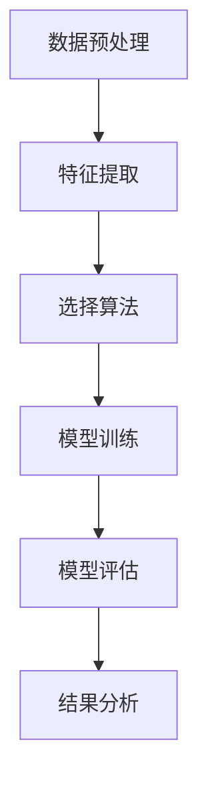
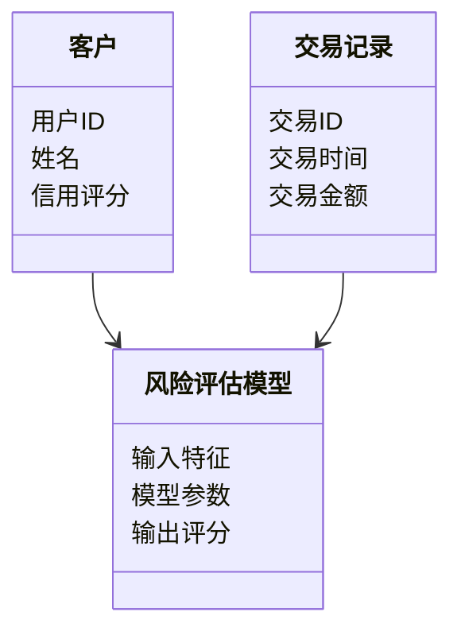

                 


# 探讨人工智能在金融领域的伦理考量

## 关键词
人工智能、金融伦理、数据隐私、算法偏见、可解释性

## 摘要
随着人工智能技术在金融领域的广泛应用，其带来的伦理问题日益凸显。本文从人工智能的基本原理出发，分析其在金融领域的核心应用，探讨数据隐私、算法偏见和决策可解释性等关键伦理问题，并结合实际案例进行深入剖析，最后提出相应的解决方案和最佳实践。

---

## 第一部分：人工智能在金融领域的背景与概述

### 第1章：人工智能与金融的概述

#### 1.1 人工智能的发展历程
- **1.1.1 人工智能的起源与发展**
  - 人工智能的概念起源于20世纪50年代，经历了从符号逻辑推理到机器学习的转变。
  - 近年来，深度学习和神经网络的突破推动了AI的快速发展。
- **1.1.2 人工智能在金融领域的应用现状**
  - 金融领域的AI应用包括智能投顾、风险管理、信用评估和欺诈检测等。
  - AI通过大数据分析和模式识别，显著提升了金融决策的效率和准确性。
- **1.1.3 人工智能与金融结合的必要性**
  - 金融行业的数据密集型特点使其成为AI技术的理想应用场景。
  - AI能够帮助金融机构应对复杂多变的市场环境和风险挑战。

#### 1.2 金融领域的核心问题与挑战
- **1.2.1 金融行业的核心问题**
  - 数据隐私与安全问题：金融数据的敏感性要求严格的隐私保护。
  - 风险控制与预测：金融机构需要准确预测市场波动和客户行为。
  - 决策的透明性与可解释性：复杂的算法决策需要解释给监管机构和客户。
- **1.2.2 人工智能在金融中的优势**
  - 高效的数据处理能力：AI能够快速分析大量金融数据，发现潜在模式。
  - 自动化决策：通过机器学习模型实现自动化交易和风险管理。
  - 实时监控：AI可以实时监控市场动态，及时发现异常交易。
- **1.2.3 人工智能在金融中的局限性**
  - 数据质量依赖性：AI模型的性能高度依赖数据的质量和完整性。
  - 黑箱问题：复杂的深度学习模型往往缺乏可解释性。
  - 过度依赖历史数据：AI可能无法预测新的、未见的市场情况。

#### 1.3 人工智能在金融中的伦理问题
- **1.3.1 数据隐私与安全**
  - 金融数据的敏感性要求严格的隐私保护，但AI模型的训练需要大量数据，可能导致隐私泄露。
  - 数据收集和处理过程中，如何平衡数据利用与隐私保护是一个重要伦理问题。
- **1.3.2 算法偏见与公平性**
  - AI模型可能继承历史数据中的偏见，导致不公平的金融决策。
  - 例如，信用评分模型可能因为数据偏差而对某些群体存在歧视。
- **1.3.3 金融决策的可解释性**
  - 复杂的AI模型往往难以解释其决策过程，导致监管机构和客户对AI决策的不信任。
  - 可解释性是金融领域AI应用的重要伦理要求。

### 第2章：人工智能在金融领域的核心概念与联系

#### 2.1 核心概念原理
- **2.1.1 人工智能的基本原理**
  - 人工智能通过模拟人类认知过程，利用数据和算法进行学习和推理。
  - 金融领域的AI应用主要依赖于机器学习和自然语言处理技术。
- **2.1.2 金融领域的核心概念**
  - 金融伦理：金融行业中的道德规范，包括公平性、透明性和客户保护。
  - 金融风险管理：通过识别和控制风险来确保金融系统的稳定性。
  - 金融决策：基于数据和模型的分析，做出投资、信贷和交易决策。
- **2.1.3 人工智能与金融的联系**
  - AI技术能够增强金融决策的效率和准确性。
  - 但AI的应用也带来了数据隐私、算法偏见和可解释性等伦理挑战。

#### 2.2 核心概念属性特征对比表格
| 特性 | 人工智能 | 金融领域 |
|------|----------|----------|
| 数据驱动 | 是       | 是       |
| 智能决策 | 是       | 是       |
| 风险控制 | 是       | 是       |
| 自适应性 | 是       | 是       |

#### 2.3 ER实体关系图

```mermaid
erd
    entity 金融机构 {
        key 用户ID
        attribute 用户名
        attribute 密码
        attribute 账户余额
    }
    entity 交易记录 {
        key 交易ID
        attribute 交易时间
        attribute 交易金额
        attribute 对方账户
    }
    entity 风险评估 {
        key 风险ID
        attribute 风险等级
        attribute 评估时间
    }
    relationship 用户-交易 {
        用户ID --> 交易ID
        关系：用户进行交易
    }
    relationship 交易-风险 {
        交易ID --> 风险ID
        关系：交易触发风险评估
    }
```

---

## 第三部分：人工智能在金融中的算法原理

### 第3章：人工智能在金融中的算法原理

#### 3.1 算法原理概述
- **3.1.1 机器学习算法**
  - 机器学习通过训练数据，建立模型来进行预测和分类。
  - 常见的机器学习算法包括线性回归、逻辑回归和决策树等。
  - 例如，线性回归模型可以用于预测股票价格。
- **3.1.2 深度学习算法**
  - 深度学习通过多层神经网络进行特征提取和模式识别。
  - 常见的深度学习模型包括卷积神经网络（CNN）和循环神经网络（RNN）。
  - 例如，RNN可以用于时间序列分析，帮助预测汇率走势。

#### 3.2 机器学习算法的数学模型和公式
- **线性回归模型**
  - 模型公式：$$y = \beta_0 + \beta_1x + \epsilon$$
  - 其中，$$y$$ 是目标变量，$$x$$ 是特征变量，$$\beta_0$$ 和 $$\beta_1$$ 是模型参数，$$\epsilon$$ 是误差项。
  - 通过最小二乘法优化目标函数：$$\text{最小化} \sum (y_i - \hat{y}_i)^2$$
- **逻辑回归模型**
  - 模型公式：$$P(y=1|x) = \frac{1}{1 + e^{-(\beta_0 + \beta_1x)}}$$
  - 用于二分类问题，例如判断客户是否违约。

#### 3.3 算法流程图



---

## 第四部分：人工智能在金融中的系统分析与架构设计

### 第4章：系统分析与架构设计方案

#### 4.1 问题场景介绍
- 某银行希望通过AI技术实现客户信用评分的自动化。
- 目标是设计一个基于机器学习的信用评分系统。

#### 4.2 项目介绍
- **项目目标**：构建一个客户信用评分模型，帮助银行自动评估客户的信用风险。
- **项目范围**：涵盖客户数据收集、特征提取、模型训练和结果分析。
- **项目参与者**：数据科学家、软件开发人员和业务分析师。

#### 4.3 系统功能设计
- **领域模型**：



- **系统架构设计**：


- **系统接口设计**
  - API接口：用于接收客户数据和交易记录。
  - 接口协议：RESTful API。
  - 数据格式：JSON。

- **系统交互流程图**

```mermaid
sequenceDiagram
    客户发起请求 --> API网关
    API网关 --> 数据库查询
    数据库返回数据 --> API网关
    API网关 --> 风险评估模型
    风险评估模型 --> 返回评分
    API网关 --> 客户返回结果
```

---

## 第五部分：人工智能在金融中的项目实战

### 第5章：项目实战

#### 5.1 环境安装
- **Python版本**：3.8以上。
- **依赖库**：
  ```bash
  pip install numpy scikit-learn pandas matplotlib
  ```

#### 5.2 系统核心实现源代码
- **数据预处理**：

```python
import pandas as pd
import numpy as np

# 加载数据
data = pd.read_csv('credit_data.csv')

# 数据清洗
data = data.dropna()
data = pd.get_dummies(data)
```

- **特征提取与模型训练**：

```python
from sklearn.model_selection import train_test_split
from sklearn.linear_model import LogisticRegression
from sklearn.metrics import accuracy_score

X = data.drop('credit_score', axis=1)
y = data['credit_score']

X_train, X_test, y_train, y_test = train_test_split(X, y, test_size=0.2, random_state=42)

model = LogisticRegression()
model.fit(X_train, y_train)

y_pred = model.predict(X_test)
print("准确率:", accuracy_score(y_test, y_pred))
```

- **模型解释性分析**：

```python
from sklearn.inspection import SHAP

explainer = SHAP(model.predict, X_test)
explainer.explain()
```

#### 5.3 代码应用解读与分析
- **数据预处理**：加载数据并进行清洗，包括去除缺失值和独热编码。
- **特征提取与模型训练**：使用逻辑回归模型进行训练，并评估模型的准确率。
- **模型解释性分析**：通过SHAP值分析模型的可解释性，了解每个特征对信用评分的影响。

#### 5.4 实际案例分析
- **案例背景**：某客户的历史交易记录和账户信息。
- **模型预测**：模型预测该客户的信用评分为“良好”。
- **结果分析**：通过SHAP值，发现交易频率和信用历史是影响评分的主要因素。

#### 5.5 项目小结
- 通过该项目，我们实现了基于机器学习的信用评分系统。
- 使用SHAP值分析模型的可解释性，确保了金融决策的透明性。

---

## 第六部分：人工智能在金融中的最佳实践

### 第6章：最佳实践

#### 6.1 小结
- 人工智能在金融领域的应用前景广阔，但也面临伦理挑战。
- 数据隐私、算法偏见和决策可解释性是需要重点关注的伦理问题。

#### 6.2 注意事项
- **数据隐私保护**：在AI模型训练中，确保数据的匿名化和加密处理。
- **算法公平性**：定期审查和调整模型，消除历史数据中的偏见。
- **可解释性设计**：选择可解释性较强的算法，确保模型决策的透明性。

#### 6.3 拓展阅读
- 建议读者阅读《机器学习实战》和《金融风险管理》等书籍，深入了解AI在金融中的具体应用。

---

## 作者信息

作者：AI天才研究院/AI Genius Institute & 禅与计算机程序设计艺术 /Zen And The Art of Computer Programming

---

通过以上思考和分析，我们可以看到，人工智能在金融领域的伦理考量是一个复杂而重要的问题。只有在确保数据隐私、算法公平性和决策透明性的前提下，人工智能才能真正为金融行业带来积极的变革。

