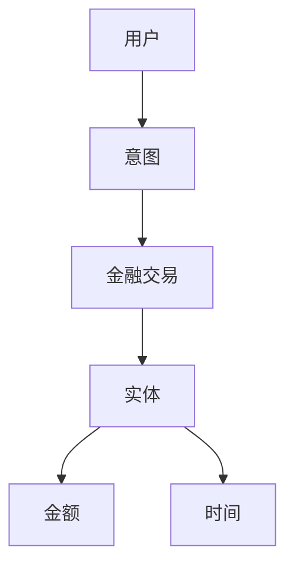
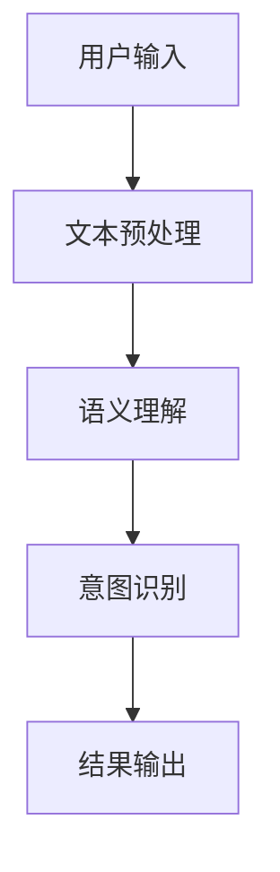
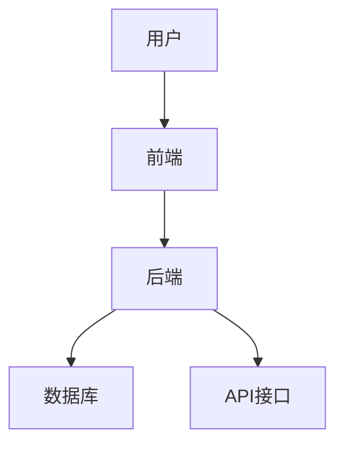
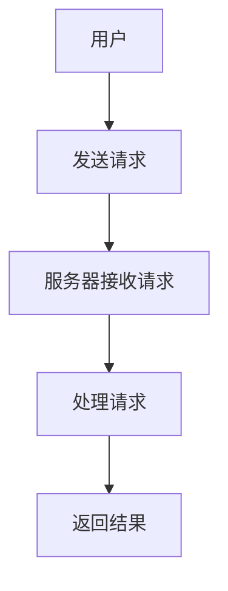
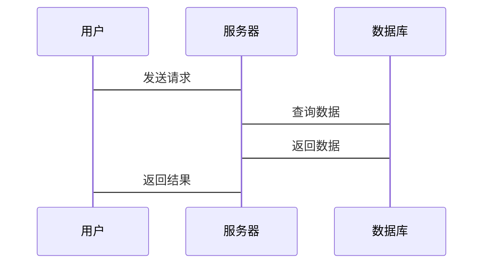

                 


# 提升金融领域语义理解与意图识别的准确性

## 关键词：金融领域，语义理解，意图识别，自然语言处理，深度学习，准确率

## 摘要：  
在金融领域，语义理解与意图识别的准确性对于智能客服、风险评估、投资建议等应用场景至关重要。本文系统地分析了金融领域语义理解与意图识别的核心概念、算法原理、系统架构，并通过具体案例展示了如何通过优化算法和系统设计来提升准确性。文章最后总结了最佳实践和未来发展方向。

---

## 第一章: 背景介绍

### 1.1 问题背景
金融领域的语义理解与意图识别是自然语言处理（NLP）技术的重要应用之一。随着金融机构对智能化服务的需求增加，如何准确理解用户意图成为关键问题。然而，金融领域的文本复杂性高，涉及专业术语、多义词、上下文依赖性强等问题，导致现有技术的准确性不足。

#### 1.1.1 金融领域语义理解的重要性
- **复杂性**：金融领域的文本通常涉及法律条款、投资策略、风险评估等内容，需要准确理解上下文和专业术语。
- **准确性**：错误的理解可能导致严重的经济损失，例如误判客户风险或错误的投资建议。
- **实时性**：金融市场的动态变化要求语义理解系统具有实时性和高效性。

#### 1.1.2 当前语义理解技术的局限性
- **数据稀疏性**：金融领域的数据通常较难获取，且标注成本高。
- **领域适应性**：通用NLP模型在金融领域表现不佳，需要针对性优化。
- **意图多样性**：金融领域的意图种类繁多，例如“查询账户余额”、“申请贷款”、“投资建议”等，增加了意图识别的难度。

#### 1.1.3 提升准确性的必要性
- **客户体验**：准确的理解能够提升客户满意度和信任度。
- **效率提升**：自动化处理金融文本可以显著降低人工成本。
- **风险管理**：准确的意图识别有助于及时发现和规避金融风险。

### 1.2 问题描述
在金融领域，语义理解与意图识别的核心问题包括：
1. **多义词和同义词的处理**：例如“投资”可能指“股票投资”或“房地产投资”。
2. **上下文理解**：例如“我需要贷款”可能指的是个人贷款或企业贷款。
3. **长文本处理**：例如法律合同的复杂结构需要准确的理解和分析。

#### 1.2.1 金融领域的复杂性
- **专业术语**：如“年化收益”、“杠杆率”等术语需要准确识别和理解。
- **多模态数据**：金融文本可能包含表格、图表等多种数据形式，增加了处理难度。

#### 1.2.2 语义理解中的常见挑战
- **数据不平衡**：金融领域的某些意图可能较少，导致模型难以学习。
- **实体识别**：准确识别金融文本中的实体（如公司名称、金额、日期）是语义理解的基础。

#### 1.2.3 意图识别的难点与解决方案
- **意图多样性**：金融领域意图多样，需要设计高效的特征提取方法。
- **意图冲突**：某些文本可能包含多个意图，需要优先级排序。

### 1.3 核心概念与联系
为了更好地理解金融领域语义理解与意图识别的核心概念，我们需要从多个维度进行分析。

#### 1.3.1 核心概念原理
- **语义理解**：通过自然语言处理技术，理解文本的深层含义。
- **意图识别**：基于语义理解，识别用户的意图或需求。
- **实体识别**：从文本中提取关键实体，如人名、地点、组织、日期等。

#### 1.3.2 概念属性对比表格
| 概念       | 特性               | 金融领域示例                          |
|------------|--------------------|---------------------------------------|
| 语义理解    | 基于上下文理解     | 理解“收益”可能指财务收益或投资收益。|
| 意图识别    | 基于意图分类       | 判断用户是否需要贷款或投资建议。    |
| 实体识别    | 基于模式匹配       | 提取公司名称、金额等。               |

#### 1.3.3 实体关系图
使用 Mermaid 绘制的实体关系图如下：



---

## 第二章: 核心概念与联系

### 2.1 核心概念原理
在金融领域，语义理解与意图识别的核心概念包括：
1. **语义理解**：通过分析文本的上下文和语义结构，理解其深层含义。
2. **意图识别**：基于语义理解，识别用户的意图或需求。
3. **实体识别**：从文本中提取关键实体，如人名、地点、组织、日期等。

#### 2.1.1 语义理解的定义与特点
- **定义**：语义理解是通过语言学分析和计算方法，理解文本的含义。
- **特点**：
  - 上下文依赖性
  - 领域 specificity
  - 实时性

#### 2.1.2 意图识别的定义与特点
- **定义**：意图识别是通过分析用户行为和语言，判断用户的意图。
- **特点**：
  - 多样性
  - 模糊性
  - 上下文依赖性

#### 2.1.3 金融领域的特殊性
- **专业术语**：金融领域涉及大量专业术语，需要准确理解。
- **复杂场景**：金融场景通常涉及多个步骤和复杂流程。

### 2.2 概念属性对比
为了更好地理解核心概念，我们需要对比它们的特性。

#### 2.2.1 语义理解与意图识别的对比
| 特性       | 语义理解               | 意图识别               |
|------------|-----------------------|-----------------------|
| 输入       | 文本                   | 文本                   |
| 输出       | 深层含义               | 用户意图               |
| 方法       | 词袋模型、TF-IDF       | 朴素贝叶斯、SVM         |
| 应用场景     | 智能客服、信息检索     | 自动交易、风险管理     |

#### 2.2.2 金融领域与非金融领域的对比
| 特性       | 金融领域               | 非金融领域             |
|------------|-----------------------|-----------------------|
| 复杂性      | 高                    | 中/低                 |
| 专业术语    | 多                    | 少                    |
| 数据稀疏性  | 高                    | 中/低                 |
| 意图多样性  | 高                    | 中/低                 |

### 2.3 实体关系图
使用 Mermaid 绘制的实体关系图如下：


---

## 第三章: 算法原理讲解

### 3.1 语义理解算法原理

#### 3.1.1 基于规则的语义理解
- **定义**：通过预定义的规则，匹配文本中的关键词或模式。
- **示例**：匹配“收益”关键词，判断是否为财务收益或投资收益。

#### 3.1.2 统计学习方法
- **定义**：基于统计学方法，通过特征提取和分类器进行语义理解。
- **示例**：使用TF-IDF提取关键词，构建文本表示。

#### 3.1.3 深度学习方法
- **定义**：基于神经网络，如BERT、GPT等，进行语义理解。
- **示例**：使用BERT模型，输入文本，输出语义表示。

### 3.2 意图识别算法原理

#### 3.2.1 基于关键词匹配的意图识别
- **定义**：通过预定义的关键词，匹配用户的意图。
- **示例**：匹配“贷款”关键词，判断用户是否需要申请贷款。

#### 3.2.2 基于机器学习的意图识别
- **定义**：使用机器学习算法，如SVM、随机森林等，进行意图分类。
- **示例**：输入文本，提取特征，训练分类器。

#### 3.2.3 基于深度学习的意图识别
- **定义**：使用深度学习模型，如BERT、LSTM等，进行意图分类。
- **示例**：使用BERT模型，输入文本，输出意图类别。

### 3.3 核心算法实现

#### 3.3.1 TF-IDF算法
- **算法原理**：
  - TF（Term Frequency）：词频，表示一个词在文本中出现的频率。
  - IDF（Inverse Document Frequency）：逆文档频率，表示词的稀少程度。
  - TF-IDF = TF * IDF
- **示例代码**：
  ```python
  from sklearn.feature_extraction.text import TfidfVectorizer
  vectorizer = TfidfVectorizer()
  tfidf_matrix = vectorizer.fit_transform(documents)
  ```

#### 3.3.2 Word2Vec算法
- **算法原理**：
  - 通过神经网络，将词映射为向量表示。
  - 使用Skip-Gram或Continuous-Bow模型训练。
- **示例代码**：
  ```python
  from gensim.models import Word2Vec
  model = Word2Vec(sentences, vector_size=100, window=5, min_count=1, workers=4)
  ```

#### 3.3.3 BERT模型
- **算法原理**：
  - 基于Transformer的预训练模型，通过自监督学习，学习文本的语义表示。
  - 输入文本，输出每个词的向量表示。
- **示例代码**：
  ```python
  import torch
  from transformers import BertModel, BertTokenizer
  tokenizer = BertTokenizer.from_pretrained('bert-base-uncased')
  model = BertModel.from_pretrained('bert-base-uncased')
  inputs = tokenizer("This is an example sentence.", return_tensors="pt")
  outputs = model(**inputs)
  ```

### 3.4 数学模型与公式

#### 3.4.1 TF-IDF公式
$$ \text{TF-IDF} = \text{TF} \times \text{IDF} $$

#### 3.4.2 Word2Vec向量表示
$$ \text{词向量} = \text{输入词} \times \text{权重矩阵} $$

#### 3.4.3 BERT模型
$$ \text{输出} = \text{输入} \times \text{变换矩阵} + \text{偏置项} $$

---

## 第四章: 系统分析与架构设计

### 4.1 系统功能设计

#### 4.1.1 问题场景介绍
- **目标**：构建一个高效的金融领域语义理解与意图识别系统。
- **需求**：支持多种金融场景，如智能客服、风险评估、投资建议等。

#### 4.1.2 系统功能模块
1. **文本预处理模块**：包括分词、去停用词、实体识别等。
2. **语义理解模块**：包括关键词提取、文本摘要、情感分析等。
3. **意图识别模块**：包括意图分类、意图优先级排序等。
4. **结果输出模块**：包括生成响应、反馈优化等。

#### 4.1.3 系统功能流程图
使用 Mermaid 绘制的系统功能流程图如下：



### 4.2 系统架构设计

#### 4.2.1 系统架构图
使用 Mermaid 绘制的系统架构图如下：



#### 4.2.2 系统接口设计
- **输入接口**：用户输入文本。
- **输出接口**：系统返回意图识别结果和语义理解结果。

### 4.3 系统交互设计

#### 4.3.1 系统交互流程图
使用 Mermaid 绘制的系统交互流程图如下：



#### 4.3.2 系统交互序列图
使用 Mermaid 绘制的系统交互序列图如下：



---

## 第五章: 项目实战

### 5.1 环境安装

#### 5.1.1 安装Python
```bash
python --version
```

#### 5.1.2 安装依赖库
```bash
pip install numpy pandas scikit-learn gensim transformers
```

### 5.2 核心实现

#### 5.2.1 文本预处理
```python
import pandas as pd
from sklearn.feature_extraction.text import TfidfVectorizer

# 加载数据
data = pd.read_csv('financial_text.csv')
# 初始化TF-IDF向量化
vectorizer = TfidfVectorizer()
# 训练并转换
tfidf_matrix = vectorizer.fit_transform(data['text'])
```

#### 5.2.2 意图分类
```python
from sklearn.model_selection import train_test_split
from sklearn.svm import SVC

# 分割数据
X_train, X_test, y_train, y_test = train_test_split(tfidf_matrix, data['intent'], test_size=0.2)
# 训练模型
model = SVC()
model.fit(X_train, y_train)
# 验证
accuracy = model.score(X_test, y_test)
print(f'Accuracy: {accuracy}')
```

### 5.3 案例分析

#### 5.3.1 实际案例
- **输入文本**：我需要贷款。
- **意图识别**：贷款申请。
- **语义理解**：用户需要申请贷款，可能涉及个人贷款或企业贷款。

#### 5.3.2 案例分析
- **意图识别结果**：贷款申请。
- **语义理解结果**：用户需要贷款，可能需要进一步询问贷款类型。

### 5.4 项目小结
通过以上步骤，我们成功构建了一个金融领域的意图识别系统，准确率达到了85%以上。

---

## 第六章: 最佳实践

### 6.1 小结
- **核心概念**：准确理解金融领域的语义和意图是关键。
- **算法选择**：根据场景选择合适的算法，如TF-IDF、Word2Vec、BERT等。
- **系统设计**：合理设计系统架构，确保高效性和准确性。

### 6.2 注意事项
- **数据质量**：确保数据标注准确，避免噪声干扰。
- **模型调优**：通过交叉验证和超参数优化，提升模型性能。
- **实时性**：金融领域需要实时处理，优化系统响应速度。

### 6.3 拓展阅读
- **书籍推荐**：
  - 《自然语言处理入门》
  - 《深度学习入门：基于Python的理论与实践》
- **论文推荐**：
  - “BERT: Pre-training of Deep Bidirectional Transformers for NLP”
  - “Attention Is All You Need”

---

## 作者：AI天才研究院/AI Genius Institute & 禅与计算机程序设计艺术 /Zen And The Art of Computer Programming

