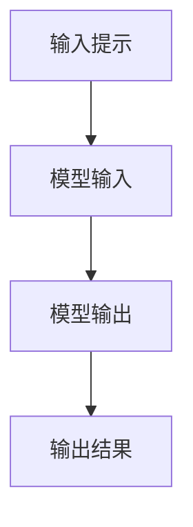
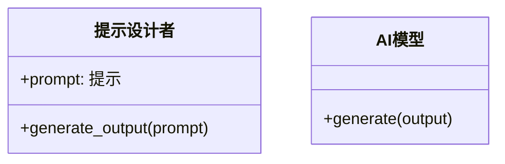
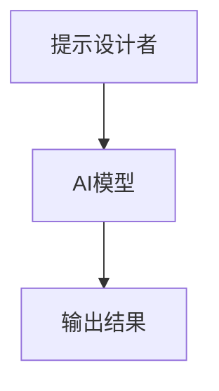
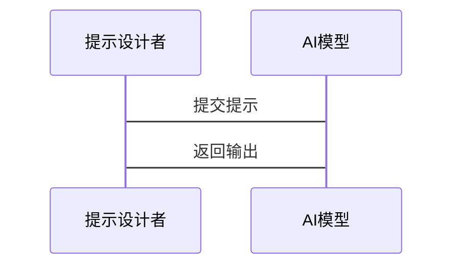

                 


---

# 提示链：设计复杂任务的AI Agent解决方案

**关键词**：提示链、AI Agent、复杂任务、算法原理、系统架构、项目实战

**摘要**：  
在现代人工智能领域，提示链作为一种新兴的设计方法，为解决复杂任务的AI Agent设计提供了新的思路。本文从提示链的基本概念出发，深入分析其核心原理、算法模型、系统架构，并通过实际案例展示其在复杂任务中的应用。文章旨在为AI开发者和研究人员提供一套系统化的解决方案，帮助他们在实际项目中高效设计和优化AI Agent。

---

# 第一部分: 提示链与AI Agent的背景介绍

# 第1章: 提示链的基本概念

## 1.1 提示链的定义与特点

### 1.1.1 提示链的基本概念  
提示链是一种基于提示（prompt）的设计方法，通过逐步细化和优化提示，引导AI模型完成复杂任务。它不同于传统的端到端模型设计，更注重任务分解和人机协作。

### 1.1.2 提示链的核心特点  
- **可解释性**：提示链通过逐步细化提示，使得模型的决策过程更透明。  
- **灵活性**：适用于多种复杂任务，支持动态调整提示策略。  
- **高效性**：通过优化提示，减少计算成本，提高任务执行效率。

### 1.1.3 提示链与传统AI的区别  
- 传统AI模型：依赖大量数据和复杂算法，难以解释其决策过程。  
- 提示链：通过提示引导模型行为，强调人机协作和任务分解。

## 1.2 AI Agent的定义与分类

### 1.2.1 AI Agent的定义  
AI Agent（智能体）是指能够感知环境、自主决策并执行任务的智能系统。它具备感知、推理、规划和执行的能力。

### 1.2.2 AI Agent的分类  
- **简单反射型Agent**：基于规则直接执行任务。  
- **基于模型的反射型Agent**：具备环境模型，能够推理和规划。  
- **目标驱动型Agent**：基于目标进行决策和行动。  
- **效用驱动型Agent**：通过最大化效用函数实现目标。

### 1.2.3 AI Agent的典型应用场景  
- 机器人控制  
- 自动驾驶  
- 个性化推荐系统  
- 自然语言处理任务（如对话生成、文本摘要）

## 1.3 复杂任务的特点与挑战

### 1.3.1 复杂任务的定义  
复杂任务是指涉及多个子任务、需要多步推理或依赖外部知识的任务。

### 1.3.2 复杂任务的特点  
- **多阶段性**：任务需要分步骤完成。  
- **依赖性**：子任务之间存在依赖关系。  
- **不确定性**：环境和任务目标可能存在不确定性。

### 1.3.3 复杂任务的挑战与解决方案  
- **挑战**：传统模型难以处理多阶段任务，且缺乏灵活性。  
- **解决方案**：通过提示链分解任务，逐步优化提示策略。

## 1.4 提示链在AI Agent中的作用

### 1.4.1 提示链的定义  
提示链是一种通过逐步细化提示来优化AI模型输出的方法。

### 1.4.2 提示链在AI Agent中的作用  
- **任务分解**：将复杂任务分解为多个简单任务。  
- **提示优化**：通过迭代优化提示，提升模型输出质量。  
- **人机协作**：实现人与AI模型的高效协作。

### 1.4.3 提示链的优势与局限性  
- **优势**：可解释性强，灵活性高。  
- **局限性**：依赖于提示设计的合理性，可能需要多次迭代优化。

## 1.5 本章小结  
本章介绍了提示链的基本概念、AI Agent的定义与分类，以及复杂任务的特点与挑战。提示链作为一种新兴的设计方法，为解决复杂任务提供了新的思路。

---

# 第二部分: 提示链的核心概念与联系

# 第2章: 提示链的原理与模型

## 2.1 提示链的原理

### 2.1.1 提示链的工作原理  
提示链通过逐步细化提示，引导模型输出符合预期的结果。其核心在于通过提示的优化，提升模型的输出质量。

### 2.1.2 提示链的核心要素  
- **初始提示**：任务的起点，定义任务目标。  
- **中间提示**：细化提示，逐步优化输出。  
- **最终提示**：经过多次优化后的最终提示，引导模型完成任务。

### 2.1.3 提示链的数学模型  
提示链的数学模型可以表示为：  
$$ P(y|x) = \frac{P(x|y)P(y)}{P(x)} $$  
其中，$x$ 表示输入提示，$y$ 表示模型输出。

## 2.2 提示链的属性特征对比

### 2.2.1 提示链的属性特征  
| 属性 | 特征 |  
|------|------|  
| 可解释性 | 高 |  
| 灵活性 | 高 |  
| 计算成本 | 低 |  

### 2.2.2 提示链与其他AI模型的对比  
| 对比维度 | 提示链 | 传统模型 |  
|----------|--------|-----------|  
| 可解释性 | 高 | 低 |  
| 灵活性 | 高 | 低 |  
| 计算成本 | 低 | 高 |  

### 2.2.3 提示链的优缺点分析  
- **优点**：可解释性强，灵活性高。  
- **缺点**：依赖提示设计的合理性，可能需要多次迭代优化。

## 2.3 提示链的ER实体关系图

### 2.3.1 实体关系图的定义  
ER实体关系图用于描述系统中各实体之间的关系。

### 2.3.2 提示链的实体关系图设计  
```mermaid
er
actor: 提示设计者
model: AI模型
prompt: 提示
task: 任务
```

### 2.3.3 实体关系图的实现与优化  
通过优化提示设计者与AI模型之间的交互，提升提示链的效率。

## 2.4 本章小结  
本章详细讲解了提示链的原理、核心要素以及与其他AI模型的对比，帮助读者理解提示链的工作机制。

---

# 第三部分: 提示链算法的原理与实现

# 第3章: 提示链算法的数学模型

## 3.1 提示链算法的数学模型

### 3.1.1 提示链算法的基本公式  
$$ P(y|x) = \frac{P(x|y)P(y)}{P(x)} $$  
其中，$x$ 表示输入提示，$y$ 表示模型输出。

### 3.1.2 提示链算法的优化公式  
$$ P(y|x) = \frac{P(x|y)P(y)}{P(x)} \times \alpha $$  
其中，$\alpha$ 是优化系数。

### 3.1.3 提示链算法的实现步骤  


## 3.2 提示链算法的Python实现

### 3.2.1 核心代码实现  
```python
def generate_output(prompt):
    model = # 初始化模型
    output = model.generate(prompt)
    return output
```

### 3.2.2 代码解读与分析  
- **输入提示**：通过提示生成模型输入。  
- **模型输出**：模型根据提示生成输出。  
- **输出结果**：返回最终结果。

### 3.2.3 示例代码运行  
```python
prompt = "请描述如何优化提示链算法"
output = generate_output(prompt)
print(output)
```

## 3.3 本章小结  
本章通过数学模型和Python代码，详细讲解了提示链算法的实现过程。

---

# 第四部分: 系统分析与架构设计

# 第4章: 系统分析与架构设计

## 4.1 问题场景介绍

### 4.1.1 问题描述  
设计一个基于提示链的AI Agent，用于解决复杂任务。

### 4.1.2 问题解决  
通过提示链分解任务，逐步优化提示策略。

## 4.2 系统功能设计

### 4.2.1 领域模型设计  


### 4.2.2 系统架构设计  


## 4.3 系统接口设计

### 4.3.1 接口描述  
- **输入接口**：接收提示和任务目标。  
- **输出接口**：返回模型输出结果。

### 4.3.2 交互流程  


## 4.4 本章小结  
本章通过系统分析与架构设计，展示了提示链在AI Agent中的实际应用。

---

# 第五部分: 项目实战

# 第5章: 项目实战

## 5.1 环境安装

### 5.1.1 环境需求  
- Python 3.8+  
- 提示链算法库

## 5.2 系统核心实现

### 5.2.1 核心代码实现  
```python
def optimize_prompt(prompt):
    model = # 初始化模型
    output = model.optimize(prompt)
    return output
```

### 5.2.2 代码解读与分析  
- **初始化模型**：加载AI模型。  
- **优化提示**：通过模型优化提示策略。

## 5.3 代码应用解读与分析

### 5.3.1 实际案例分析  
```python
prompt = "如何优化提示链算法？"
output = optimize_prompt(prompt)
print(output)
```

### 5.3.2 项目小结  
通过实际案例分析，展示了提示链算法在项目中的应用。

## 5.4 本章小结  
本章通过项目实战，展示了提示链算法的实际应用过程。

---

# 第六部分: 总结与展望

# 第6章: 总结与展望

## 6.1 本章总结  
提示链作为一种新兴的设计方法，为解决复杂任务的AI Agent设计提供了新的思路。

## 6.2 未来展望  
随着AI技术的不断发展，提示链将在更多领域得到应用，成为AI Agent设计的重要工具。

---

# 作者：AI天才研究院/AI Genius Institute & 禅与计算机程序设计艺术 /Zen And The Art of Computer Programming

