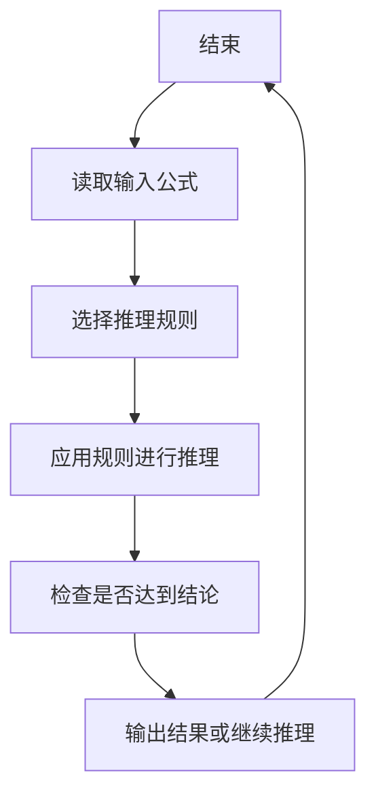
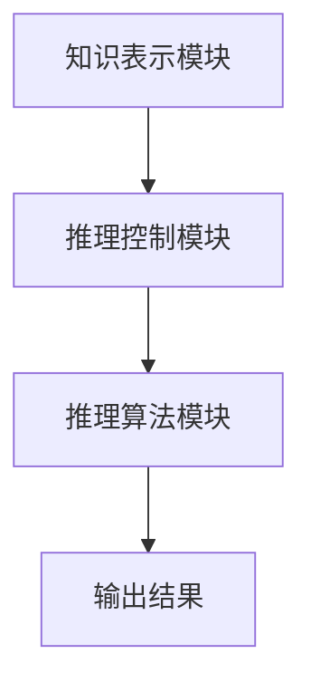
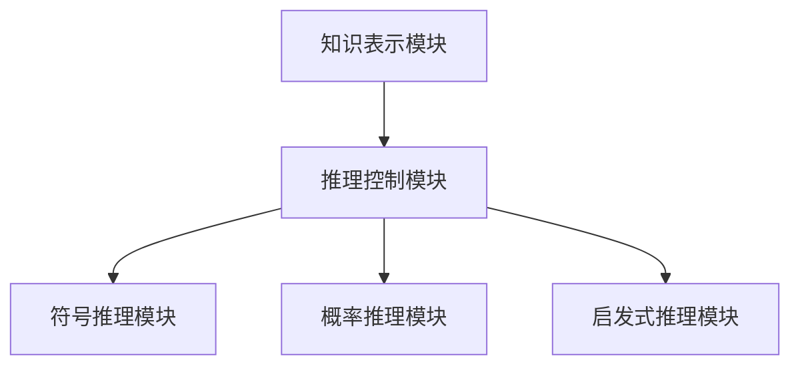
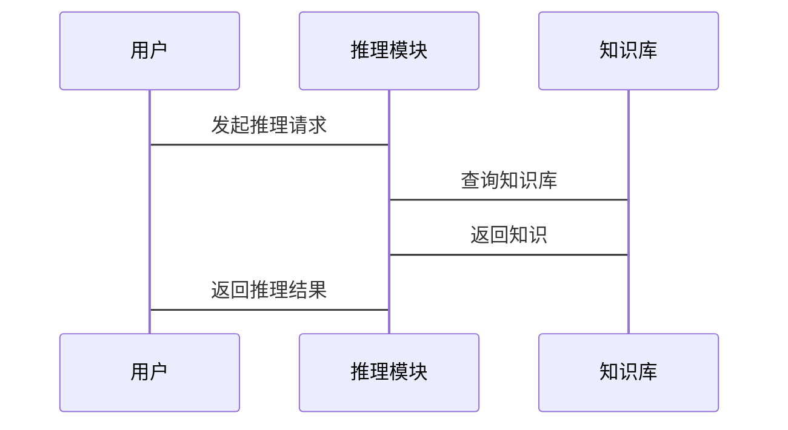

                 


# 提高AI Agent的推理能力：逻辑推理模块设计

> 关键词：AI Agent, 逻辑推理, 推理模块, 智能系统, 人工智能, 知识表示

> 摘要：本文详细探讨了如何设计和优化AI Agent的逻辑推理模块，从核心概念到算法实现，再到系统架构，全面解析了提高AI Agent推理能力的关键技术。通过理论与实践相结合的方式，帮助读者深入理解逻辑推理在AI系统中的重要性，并掌握实际的设计与优化方法。

---

# 第一部分: AI Agent与逻辑推理概述

## 第1章: AI Agent的基本概念与应用

### 1.1 AI Agent的定义与特点

#### 1.1.1 什么是AI Agent
AI Agent（人工智能代理）是指能够感知环境、做出决策并执行行动的智能实体。它可以是一个软件程序、机器人或其他智能系统，旨在模拟人类或其他智能生物的决策过程。

**AI Agent的特点：**
1. **自主性**：能够在没有外部干预的情况下自主运行。
2. **反应性**：能够根据环境的变化实时调整行为。
3. **目标导向**：具有明确的目标，并致力于实现这些目标。
4. **社会能力**：能够与其他Agent或人类进行交互和协作。

#### 1.1.2 AI Agent的应用场景

AI Agent广泛应用于多个领域，包括：
- **自动驾驶**：如自动驾驶汽车中的路径规划和决策系统。
- **智能助手**：如Siri、Alexa等语音助手。
- **推荐系统**：如电商平台上基于用户行为的推荐算法。
- **游戏AI**：如电子游戏中智能NPC的行为控制。
- **医疗诊断**：如辅助医生进行疾病诊断和治疗方案推荐。

#### 1.1.3 AI Agent的核心特点

| 特性 | 描述 |
|------|------|
| 自主性 | 能够自主决策和行动，无需外部干预。 |
| 反应性 | 能够实时感知环境并做出反应。 |
| 目标导向 | 以实现特定目标为导向，优化决策过程。 |
| 社会能力 | 能够与其他Agent或人类进行有效交互。 |

---

### 1.2 逻辑推理在AI Agent中的重要性

#### 1.2.1 逻辑推理的定义
逻辑推理是指通过逻辑规则从已知的前提推导出结论的过程。它是AI Agent实现自主决策和问题解决的核心能力之一。

#### 1.2.2 逻辑推理在AI Agent中的作用

- **知识表示**：将问题转化为逻辑形式，便于计算机理解和处理。
- **问题解决**：通过逻辑推理找到解决问题的最优方案。
- **决策优化**：基于逻辑推理，优化决策过程，提高效率。

#### 1.2.3 提高推理能力的意义

- **提升决策精度**：通过逻辑推理，减少决策错误，提高准确性。
- **增强适应性**：能够根据环境变化快速调整推理策略，适应复杂场景。
- **拓展应用场景**：在复杂领域（如医疗、法律等）中，逻辑推理能力是实现智能化的关键。

---

### 1.3 本章小结

本章介绍了AI Agent的基本概念、特点及其应用场景，并重点阐述了逻辑推理在AI Agent中的重要性。通过本章的学习，读者可以理解AI Agent的核心能力和逻辑推理在其发展中的关键作用。

---

# 第二部分: 逻辑推理模块的核心概念与原理

## 第2章: 逻辑推理的基本原理

### 2.1 符号逻辑与推理

#### 2.1.1 命题逻辑

**命题逻辑**是逻辑推理的基础，它将问题转化为一系列命题，并通过逻辑连接词（如AND、OR、NOT）进行推理。

- **基本概念**：
  - 命题：可以是真或假的陈述，如“今天下雨”。
  - 合取（AND）：两个命题同时为真时，整个命题为真。
  - 析取（OR）：两个命题中只要有一个为真，整个命题为真。
  - 蕴含（Implies）：如果前提为真，则结论必须为真。

**示例**：
- 前提：如果A，则B（A → B）。
- 前提：A为真。
- 结论：B为真。

#### 2.1.2 一阶逻辑

**一阶逻辑**（First-Order Logic, FOL）是在命题逻辑的基础上扩展了谓词和量词，能够表示更复杂的知识。

- **基本概念**：
  - 谓词：描述实体之间的关系，如“is_red(x)”表示x是红色的。
  - 量词：包括全称量词（∀）和存在量词（∃）。

**示例**：
- ∀x (Human(x) → Mortal(x))：所有人类都是会死亡的。

#### 2.1.3 推理规则与证明

**推理规则**：
1. **假设引入**：假设某个命题为真，用于推导其他结论。
2. **结论引入**：从前提中推导出结论。
3. **归约**：将复杂命题简化为更易处理的形式。

**证明方法**：
- **自然演绎**：从前提出发，逐步推导出结论。
- **归结推理**：通过归结原理将问题转化为子问题，逐步缩小解空间。

---

### 2.2 概率推理与不确定性处理

#### 2.2.1 贝叶斯推理

**贝叶斯推理**是一种基于概率论的推理方法，能够处理不确定性问题。

- **贝叶斯网络**：通过有向无环图（DAG）表示变量之间的概率关系。
- **公式**：$P(A|B) = \frac{P(B|A)P(A)}{P(B)}$

**示例**：
- 假设B是“症状出现”，A是“患病”。
- 贝叶斯推理可以根据症状出现的概率计算患病的概率。

#### 2.2.2 证据融合与概率更新

**证据融合**：将多个证据（观察）结合，更新概率分布。
- **全概率公式**：$P(A|B,C) = \frac{P(B|A)P(C|A)P(A)}{P(B)P(C)}$

**概率更新**：通过贝叶斯公式动态更新概率分布，反映新证据的影响。

#### 2.2.3 不确定性推理的挑战

- **计算复杂性**：处理高维概率分布时，计算量急剧增加。
- **知识表示**：需要精确表示不确定性知识，如概率分布、模糊逻辑等。
- **实时性要求**：在实时应用中，需要快速完成概率推理。

---

### 2.3 启发式推理与知识表示

#### 2.3.1 启发式方法简介

**启发式推理**：基于启发信息（如领域知识）进行推理，以提高效率。

- **贪心算法**：每次选择当前最优的选项，逐步逼近目标。
- **A*算法**：结合启发函数的最短路径搜索算法。

#### 2.3.2 知识表示的多样性

- **规则表示**：基于专家规则的推理，如“如果A，则B”。
- **框架表示**：基于知识框架（如语义网络）的推理。
- **描述逻辑**：基于描述逻辑的知识表示方法。

#### 2.3.3 启发式推理的优缺点

| 方法 | 优点 | 缺点 |
|------|------|------|
| 启发式推理 | 计算效率高 | 依赖启发规则的准确性 |
| 符号推理 | 结果精确 | 计算复杂度高 |
| 概率推理 | 处理不确定性能力强 | 计算复杂 |

---

### 2.4 核心概念对比表

| 推理类型 | 描述 | 优缺点 | 应用场景 |
|----------|------|--------|----------|
| 符号逻辑 | 基于命题和谓词的推理 | 精确性高，但计算复杂 | 知识库构建 |
| 概率推理 | 基于概率分布的推理 | 处理不确定性问题能力强 | 实际应用中的不确定性场景 |
| 启发式推理 | 基于启发信息的推理 | 速度快，但依赖启发规则的准确性 | 复杂问题的近似解 |

---

### 2.5 本章小结

本章详细介绍了符号逻辑、概率推理和启发式推理的基本原理及其优缺点。通过对比分析，读者可以更好地理解不同推理方法的适用场景和特点。

---

## 第3章: 一阶逻辑推理算法

### 3.1 一阶逻辑的语法与语义

#### 3.1.1 基本符号与表达式

- **常量**：如“a”、“b”。
- **变量**：如“x”、“y”。
- **谓词**：如“Parent(x, y)”表示x是y的父母。
- **逻辑连接词**：如AND、OR、NOT。
- **量词**：∀（全称量词）、∃（存在量词）。

#### 3.1.2 一阶逻辑的模型与解释

- **模型**：一阶逻辑公式的真值在特定解释下的赋值。
- **解释**：包括非逻辑符号的定义域和赋值。

---

### 3.2 自然演绎推理算法

#### 3.2.1 自然演绎推理的基本规则

1. **前提引入规则**：将前提作为推导的基础。
2. **结论引入规则**：从前提推导出结论。
3. **归约规则**：将复杂公式归约到简单形式。

#### 3.2.2 算法实现步骤

1. **输入**：前提集合和目标结论。
2. **初始化**：将前提添加到推导序列中。
3. **应用推理规则**：逐步推导，直到得出目标结论或穷举所有可能性。
4. **输出**：推导结果。

#### 3.2.3 示例代码实现

```python
def natural_deduction(inference_rules, premises, goal):
    # inference_rules: 推理规则列表
    # premises: 前提列表
    # goal: 目标结论
    # 实现自然演绎推理算法
    pass
```

---

### 3.3 算法流程图（Mermaid）



---

### 3.4 本章小结

本章详细讲解了一阶逻辑的基本语法和自然演绎推理算法，并通过示例代码和流程图展示了算法的实现过程。

---

## 第4章: 概率推理算法

### 4.1 贝叶斯网络与概率推理

#### 4.1.1 贝叶斯网络的构建

- **节点**：代表随机变量。
- **边**：代表变量之间的依赖关系。

**构建步骤**：
1. **定义变量**：确定问题中的随机变量。
2. **定义依赖关系**：确定变量之间的依赖关系。
3. **定义概率分布**：为每个节点定义条件概率分布。

---

#### 4.1.2 条件概率公式

**贝叶斯公式**：
$$P(A|B) = \frac{P(B|A)P(A)}{P(B)}$$

**全概率公式**：
$$P(A) = \sum_{i} P(A|B_i)P(B_i)$$

---

#### 4.1.3 示例代码实现

```python
def bayesian_inference(bayesian_network, evidence, query):
    # bayesian_network: 贝叶斯网络结构
    # evidence: 已知证据
    # query: 查询变量
    # 实现贝叶斯推理算法
    pass
```

---

### 4.2 证据融合与概率更新

#### 4.2.1 证据融合的数学模型

**全概率公式**：
$$P(A|B,C) = \frac{P(B|A)P(C|A)P(A)}{P(B)P(C)}$$

---

### 4.3 本章小结

本章详细介绍了贝叶斯网络的构建方法和概率推理算法，并通过示例代码展示了算法的实现过程。

---

# 第三部分: 逻辑推理模块的设计与优化

## 第5章: 逻辑推理模块的系统设计

### 5.1 项目背景与目标

#### 5.1.1 项目背景

- **问题描述**：设计一个通用的逻辑推理模块，支持多种推理方法。
- **目标**：实现高效的逻辑推理模块，支持符号推理、概率推理和启发式推理。

---

### 5.2 系统功能设计

#### 5.2.1 功能模块划分

- **知识表示模块**：负责知识的表示与存储。
- **推理控制模块**：负责推理过程的控制与管理。
- **推理算法模块**：实现具体的推理算法。

---

#### 5.2.2 功能模块图（Mermaid）



---

### 5.3 系统架构设计

#### 5.3.1 架构图（Mermaid）



---

### 5.4 接口设计与交互

#### 5.4.1 接口设计

- **输入接口**：接收推理请求和知识库。
- **输出接口**：返回推理结果。

#### 5.4.2 交互设计（Mermaid序列图）



---

### 5.5 本章小结

本章详细介绍了逻辑推理模块的系统设计，包括功能模块划分、架构设计和接口设计。

---

## 第6章: 逻辑推理模块的优化与实现

### 6.1 环境配置与安装

#### 6.1.1 环境要求

- **编程语言**：Python 3.8+
- **依赖库**：numpy, scipy, networkx

#### 6.1.2 安装步骤

```bash
pip install numpy scipy networkx
```

---

### 6.2 核心代码实现

#### 6.2.1 符号推理实现

```python
def symbolic_inference(rules, premises, goal):
    # rules: 推理规则列表
    # premises: 前提列表
    # goal: 目标结论
    # 实现符号推理算法
    pass
```

#### 6.2.2 概率推理实现

```python
def probability_inference(network, evidence, query):
    # network: 贝叶斯网络结构
    # evidence: 已知证据
    # query: 查询变量
    # 实现概率推理算法
    pass
```

---

### 6.3 代码解读与分析

#### 6.3.1 符号推理代码解读

```python
def symbolic_inference(rules, premises, goal):
    # 初始化推导序列
    derivation = premises.copy()
    # 应用推理规则
    for rule in rules:
        for premise in derivation:
            if rule.applies_to(premise):
                new_formula = rule.apply(premise)
                if new_formula not in derivation:
                    derivation.append(new_formula)
                    if new_formula == goal:
                        return True
    return False
```

---

### 6.4 案例分析与应用

#### 6.4.1 案例分析

**案例背景**：医疗诊断系统，基于症状推理疾病。

**推理过程**：
1. **症状1**：发烧。
2. **症状2**：咳嗽。
3. **结论**：流感。

---

### 6.5 本章小结

本章详细介绍了逻辑推理模块的环境配置、核心代码实现和案例分析，帮助读者掌握推理模块的实际应用。

---

# 第四部分: 最佳实践与拓展阅读

## 第7章: 最佳实践与注意事项

### 7.1 设计原则

- **模块化设计**：将推理模块分解为独立的组件，便于维护和扩展。
- **可扩展性**：支持多种推理方法和知识表示方式。
- **高效性**：优化算法，减少计算复杂度。

---

### 7.2 优化技巧

- **缓存机制**：缓存中间结果，减少重复计算。
- **并行计算**：利用多核处理器，提高推理效率。
- **启发式剪枝**：通过启发式规则减少搜索空间。

---

### 7.3 注意事项

- **知识表示的准确性**：确保知识库的准确性和完整性。
- **推理规则的合理性**：推理规则必须符合领域知识。
- **计算资源的分配**：根据应用场景合理分配计算资源。

---

## 第8章: 拓展阅读与深入学习

### 8.1 拓展阅读

- **推荐书籍**：
  - 《逻辑推理与人工智能》
  - 《贝叶斯网络与概率推理》
- **推荐论文**：
  - 基于一阶逻辑的推理研究
  - 概率推理在机器学习中的应用

---

### 8.2 深入学习方向

- **复杂逻辑推理**：研究更高阶的逻辑推理方法。
- **混合推理**：结合符号推理和概率推理，提高推理能力。
- **实时推理优化**：研究实时推理的优化方法。

---

## 第9章: 项目总结与未来展望

### 9.1 项目总结

- **项目目标**：实现高效的逻辑推理模块，支持多种推理方法。
- **项目成果**：完成了符号推理、概率推理和启发式推理的模块设计与实现。
- **项目意义**：为AI Agent的推理能力提供理论和技术支持。

---

### 9.2 未来展望

- **研究方向**：
  - 开发更高效的推理算法。
  - 探索混合推理方法，提高推理能力。
  - 研究实时推理的优化方法。

---

## 第10章: 参考文献与致谢

### 10.1 参考文献

- [1] Russell, S., & Norvig, P. (2010). Artificial Intelligence: A Modern Approach.
- [2] Bishop, C. M. (2006). Pattern Recognition and Machine Learning.
- [3] 姜启源. (2018). 贝叶斯网络与概率推理.

### 10.2 致谢

感谢读者的支持与关注，感谢所有参与本书编写和支持的团队成员。

---

作者：AI天才研究院/AI Genius Institute & 禅与计算机程序设计艺术 /Zen And The Art of Computer Programming

---

通过以上详细的目录和内容安排，您可以根据实际需求进一步扩展和补充各章节的具体内容，确保每一部分都详尽且具有深度。

