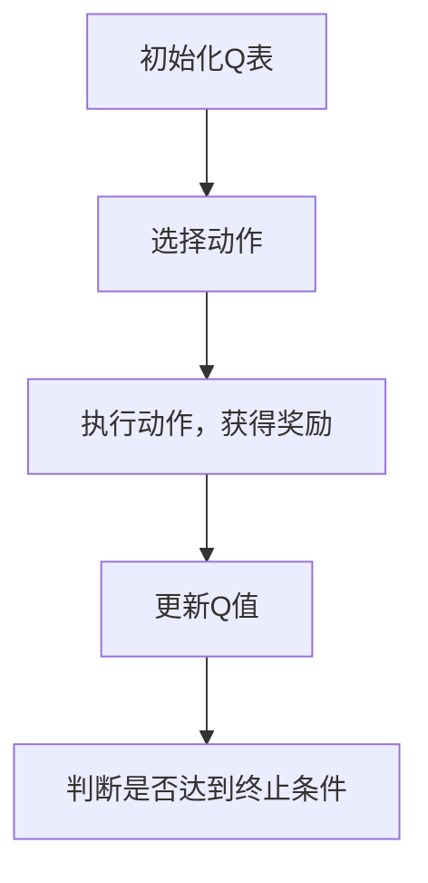
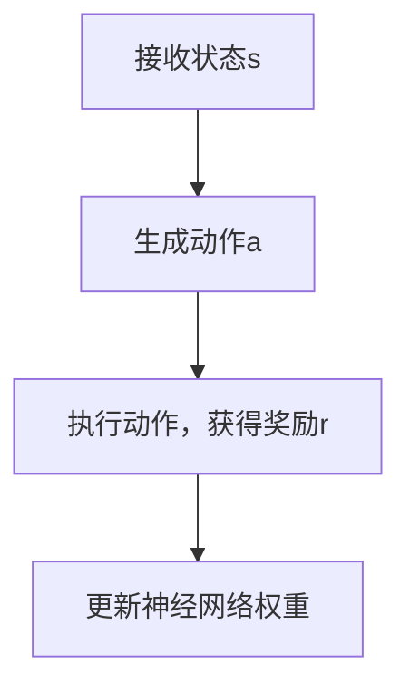
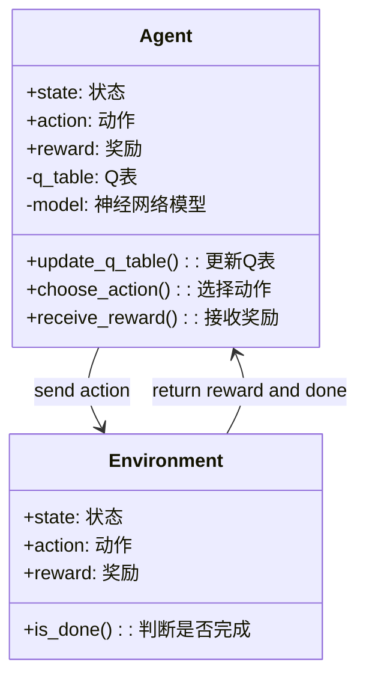
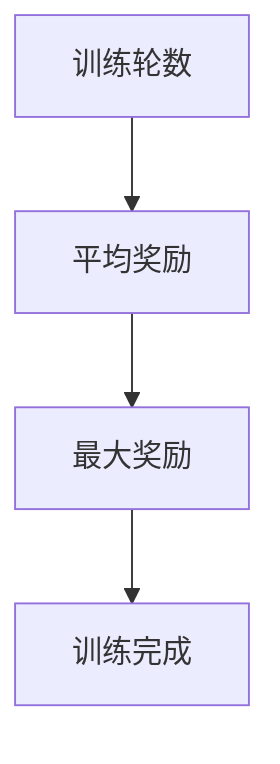

                 


# 搭建AI Agent开发环境：必要工具与框架

## 关键词：AI Agent, 开发环境, 工具框架, 系统架构, 项目实战

## 摘要：  
本文详细介绍了搭建AI Agent开发环境所需的关键工具与框架，从核心概念到算法原理，再到系统架构和项目实战，全面解析了AI Agent开发的各个方面。文章通过理论与实践相结合的方式，帮助读者掌握AI Agent开发环境的搭建方法，涵盖工具选择、框架设计、算法实现、系统架构以及项目实战等内容。

---

# 第一部分: AI Agent开发环境概述

## 第1章: AI Agent的基本概念与背景

### 1.1 AI Agent的定义与特点
#### 1.1.1 什么是AI Agent
AI Agent（人工智能代理）是指能够感知环境并采取行动以实现目标的智能体。它具有以下特点：
- **自主性**：能够在没有外部干预的情况下运行。
- **反应性**：能够根据环境反馈调整行为。
- **目标导向**：所有行动都以实现特定目标为导向。
- **学习能力**：能够通过经验改进性能。

#### 1.1.2 AI Agent与传统AI的区别
| 特性 | 传统AI | AI Agent |
|------|--------|----------|
| 智能程度 | 基于规则，无法自主决策 | 具有自主性，能够感知环境并采取行动 |
| 交互方式 | 单向输入输出 | 可以与环境和其他Agent交互 |
| 应用场景 | 数据处理、模式识别等 | 机器人控制、自动驾驶等 |

### 1.2 AI Agent的应用场景
AI Agent广泛应用于多个领域，如自动驾驶、智能助手、机器人控制和游戏AI。以下是AI Agent的典型应用场景：
- **自动驾驶**：实时感知环境并做出驾驶决策。
- **智能助手**：如Siri、Alexa，能够理解用户需求并执行任务。
- **机器人控制**：在工业自动化和家庭服务中广泛应用。
- **游戏AI**：在游戏开发中实现智能NPC行为。

### 1.3 AI Agent开发环境的背景与问题
AI Agent的开发需要一个高效、灵活的环境，以支持复杂的算法实现和系统集成。然而，开发过程中面临以下问题：
- **工具选择困难**：市场上有众多工具和框架，选择合适的工具是关键。
- **算法实现复杂**：需要掌握多种AI算法，并能够将其应用于实际场景。
- **系统集成困难**：涉及多模块协作，需要处理复杂的接口和交互。

## 第2章: AI Agent开发环境的核心要素

### 2.1 开发工具的选择与配置
选择合适的开发工具是搭建AI Agent开发环境的第一步。以下是常用工具的分类与特点：
- **编程语言**：Python是AI开发的首选语言，因其丰富的库和简单易学的特点。
- **开发框架**：如TensorFlow、PyTorch等，用于算法实现和模型训练。
- **调试工具**：如PyCharm、VS Code，用于代码调试和开发。

### 2.2 开发框架的选择与设计
开发框架的选择直接影响开发效率和系统性能。以下是常见AI Agent开发框架的对比：
| 框架 | 特点 | 适用场景 |
|------|------|----------|
| TensorFlow | 支持深度学习，功能强大 | 适合复杂的神经网络模型 |
| PyTorch | 动态计算，适合研究和实验 | 适合快速原型开发 |
| OpenAI Gym | 提供丰富的环境和工具 | 适合强化学习研究 |

### 2.3 开发流程的设计与优化
AI Agent的开发流程包括需求分析、算法设计、模型训练、系统集成和测试优化。以下是流程的优化建议：
- **需求分析**：明确目标和约束条件，制定详细的开发计划。
- **算法设计**：选择合适的算法，并进行数学建模和公式推导。
- **模型训练**：使用训练数据，优化模型参数，提高性能。
- **系统集成**：将模型与开发工具和框架集成，确保各模块协同工作。
- **测试优化**：通过测试发现和解决问题，不断优化系统性能。

---

# 第二部分: AI Agent开发环境的技术实现

## 第3章: AI Agent的核心算法与数学模型

### 3.1 强化学习算法
强化学习是AI Agent的核心算法之一，通过与环境交互获得奖励，逐步优化策略。

#### 3.1.1 Q-learning算法
Q-learning是一种基于值函数的强化学习算法，通过更新Q值表来逼近最优策略。以下是Q-learning的算法流程：



Q值更新公式：
$$ Q(s, a) = Q(s, a) + \alpha (r + \gamma \max Q(s', a')) $$

#### 3.1.2 Deep Q-Network（DQN）算法
DQN通过深度神经网络近似Q值函数，适用于高维状态空间。以下是DQN的流程：



神经网络结构：
- **输入层**：接收环境状态。
- **隐藏层**：进行特征提取和变换。
- **输出层**：输出每个动作的Q值。

---

## 第4章: AI Agent开发环境的系统架构

### 4.1 问题场景介绍
以一个简单的AI Agent为例，假设目标是实现一个自动避障的小车。

### 4.2 系统功能设计
以下是系统功能设计的类图：



### 4.3 系统架构设计
以下是系统架构设计的架构图：

```mermaid
archiitecture
    客户端 --> 代理管理模块
    代理管理模块 --> 环境模块
    环境模块 --> 传感器模块
    传感器模块 --> 执行器模块
    执行器模块 --> 代理管理模块
```

---

## 第5章: AI Agent开发环境的项目实战

### 5.1 环境安装
以下是Python环境下安装TensorFlow和OpenAI Gym的命令：

```bash
pip install tensorflow==2.10.0
pip install gym==0.21.0
```

### 5.2 核心代码实现
以下是Q-learning算法的Python实现：

```python
import numpy as np

class QLearningAgent:
    def __init__(self, state_space, action_space, alpha=0.1, gamma=0.9):
        self.state_space = state_space
        self.action_space = action_space
        self.alpha = alpha
        self.gamma = gamma
        self.q_table = np.zeros((state_space, action_space))

    def choose_action(self, state):
        return np.argmax(self.q_table[state])

    def update_q_table(self, state, action, reward, next_state):
        self.q_table[state, action] += self.alpha * (reward + self.gamma * np.max(self.q_table[next_state]) - self.q_table[state, action])

# 示例使用
env = gym.make('CartPole-v0')
agent = QLearningAgent(env.observation_space.shape[0], env.action_space.n)
for episode in range(100):
    state = env.reset()
    for step in range(1000):
        action = agent.choose_action(state)
        next_state, reward, done, _ = env.step(action)
        agent.update_q_table(state, action, reward, next_state)
        if done:
            break
```

### 5.3 案例分析与总结
通过上述代码实现一个简单的Q-learning算法，可以在CartPole环境中训练出一个能够保持平衡的小车。以下是训练过程中的奖励变化：



---

## 第6章: 最佳实践与注意事项

### 6.1 最佳实践
- **工具选择**：根据项目需求选择合适的工具和框架。
- **算法优化**：通过调整参数和改进算法提高性能。
- **系统集成**：确保各模块协同工作，避免接口冲突。

### 6.2 小结
搭建AI Agent开发环境需要综合考虑工具选择、算法实现和系统架构。通过本文的指导，读者可以系统地掌握AI Agent开发环境的搭建方法。

### 6.3 注意事项
- **数据质量**：确保训练数据的多样性和代表性。
- **模型调优**：通过网格搜索和交叉验证优化模型参数。
- **系统测试**：进行全面的测试，确保系统的稳定性和可靠性。

---

## 结语

搭建AI Agent开发环境是一项复杂的任务，需要综合运用多种技术和工具。通过本文的详细指导，读者可以系统地掌握AI Agent开发环境的搭建方法，从核心概念到算法实现，再到系统架构和项目实战，全面提升自己的技术能力。

---

作者：AI天才研究院/AI Genius Institute & 禅与计算机程序设计艺术 /Zen And The Art of Computer Programming

