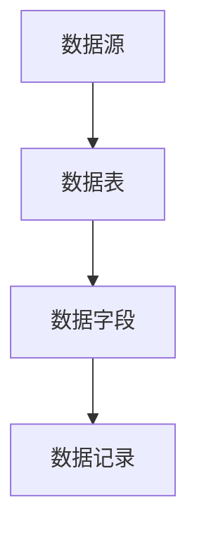
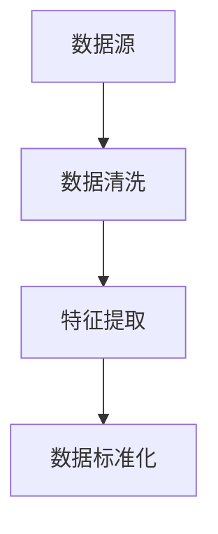
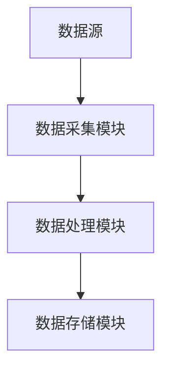

                 


# 数据收集策略：为AI Agent打造高质量数据集

## 关键词：
数据收集策略, AI Agent, 数据集, 数据清洗, 特征工程, 数据预处理, 机器学习

## 摘要：
本文详细探讨了为AI Agent打造高质量数据集的策略，从数据收集的核心概念、算法原理到系统架构和项目实战，全面解析了数据收集的关键环节。通过背景介绍、核心概念、算法原理、系统架构、项目实战以及最佳实践，本文为读者提供了一套系统的方法论，帮助他们在实际应用中高效地收集和处理数据，以支持AI Agent的优化与部署。

---

# 第1章: 数据收集与AI Agent概述

## 1.1 数据收集的重要性

### 1.1.1 数据在AI系统中的核心地位
数据是AI系统的“燃料”，没有高质量的数据，AI Agent难以准确理解和执行任务。数据收集是AI系统的核心环节，决定了AI Agent的性能和可靠性。

### 1.1.2 数据收集的基本概念
数据收集是指从各种数据源中获取数据的过程，包括结构化数据（如表格数据）和非结构化数据（如文本、图像）。数据收集的目标是将分散的数据整合到一个统一的系统中，为后续的数据处理和分析提供基础。

### 1.1.3 数据收集与AI Agent的关系
AI Agent需要依赖数据进行感知、决策和行动。数据收集是AI Agent获取外部信息的关键途径，高质量的数据能够显著提升AI Agent的智能水平和任务执行能力。

## 1.2 AI Agent的背景与应用

### 1.2.1 AI Agent的定义与特点
AI Agent是一种智能体，能够感知环境、自主决策并执行任务。AI Agent的核心能力包括感知、推理、学习和行动。

### 1.2.2 AI Agent的主要应用场景
AI Agent广泛应用于自动驾驶、智能助手、推荐系统等领域。例如，在自动驾驶中，AI Agent通过传感器收集数据，实时感知环境并做出驾驶决策。

### 1.2.3 数据质量对AI Agent性能的影响
数据质量直接影响AI Agent的决策能力。高质量的数据能够提高模型的准确性和鲁棒性，而低质量的数据可能导致错误的决策。

## 1.3 数据收集的挑战与目标

### 1.3.1 数据收集的主要挑战
- 数据源的多样性：数据可能来自不同的来源，格式和质量差异较大。
- 数据隐私与安全：数据收集过程中需要保护用户隐私和数据安全。
- 数据冗余与噪声：数据中可能存在冗余和噪声，影响数据的质量。

### 1.3.2 数据收集的目标与原则
数据收集的目标是获取高质量、相关性和代表性的数据。数据收集的原则包括数据的完整性、准确性和及时性。

### 1.3.3 数据收集的边界与外延
数据收集的边界是指数据范围和数据量的限制，而外延则涉及数据的扩展和优化。

## 1.4 本章小结
本章介绍了数据收集的重要性、AI Agent的背景与应用，以及数据收集的挑战与目标。数据收集是AI Agent的核心环节，高质量的数据是AI Agent成功的关键。

---

# 第2章: 数据收集的核心概念与联系

## 2.1 数据收集的核心概念

### 2.1.1 数据源的分类与特点
数据源可以分为内部数据源和外部数据源。内部数据源包括数据库和日志文件，外部数据源包括API和爬虫获取的网页数据。

### 2.1.2 数据格式与标准化
数据格式包括结构化数据和非结构化数据。数据标准化是将不同格式的数据转换为统一格式的过程，例如将日期格式统一为ISO标准。

### 2.1.3 数据清洗与预处理
数据清洗是指去除噪声数据和冗余数据的过程。数据预处理包括数据清洗、数据转换和数据增强。

## 2.2 数据收集的流程与步骤

### 2.2.1 数据需求分析
在数据收集之前，需要明确数据的需求，包括数据类型、数据量和数据质量要求。

### 2.2.2 数据收集策略制定
根据数据需求制定数据收集策略，包括选择合适的数据源和数据收集方法。

### 2.2.3 数据收集实施与监控
实施数据收集过程，并实时监控数据质量，确保数据的完整性和准确性。

## 2.3 数据收集与AI Agent的关系

### 2.3.1 数据作为AI Agent的输入
AI Agent通过数据源获取数据，作为决策和行动的输入。

### 2.3.2 数据对AI Agent决策的影响
高质量的数据能够提高AI Agent的决策能力，而低质量的数据可能导致错误的决策。

### 2.3.3 数据收集的优化与反馈机制
通过数据收集的反馈机制，优化数据收集策略，提高数据质量。

## 2.4 核心概念对比表

| 概念 | 特点 | 对比点 |
|------|------|--------|
| 数据源 | 数据来源 | 结构化 vs 非结构化 |
| 数据格式 | 数据表示方式 | 结构化 vs 非结构化 |
| 数据清洗 | 数据处理过程 | 去除噪声 vs 数据增强 |

## 2.5 ER实体关系图



## 2.6 本章小结
本章详细介绍了数据收集的核心概念，包括数据源、数据格式和数据清洗。同时，探讨了数据收集与AI Agent的关系，强调了数据质量对AI Agent性能的影响。

---

# 第3章: 数据收集的算法原理与实现

## 3.1 数据清洗算法

### 3.1.1 数据清洗的步骤与流程

1. 数据获取：从数据源获取原始数据。
2. 数据检查：检查数据的完整性、准确性和一致性。
3. 数据清洗：去除噪声数据和冗余数据。
4. 数据验证：验证清洗后的数据是否符合需求。

### 3.1.2 基于规则的数据清洗算法
基于规则的清洗算法通过预定义的规则过滤数据，例如去除空值和重复值。

### 3.1.3 基于统计的异常值检测算法
基于统计的异常值检测算法通过统计方法识别异常值，例如使用Z-score和IQR方法。

## 3.2 数据特征工程

### 3.2.1 特征提取的基本原理
特征提取是将原始数据转换为特征向量的过程，例如从文本数据中提取关键词。

### 3.2.2 基于机器学习的特征选择
基于机器学习的特征选择方法包括Lasso回归和随机森林特征重要性分析。

### 3.2.3 数据增强与特征扩展
数据增强是指通过增加数据的多样性来提高模型的泛化能力，例如对图像数据进行旋转和翻转。

## 3.3 数据预处理的数学模型

### 3.3.1 数据标准化公式
$$ z = \frac{x - \mu}{\sigma} $$
其中，$\mu$是均值，$\sigma$是标准差。

### 3.3.2 数据归一化公式
$$ x_{\text{norm}} = \frac{x - \min(x)}{\max(x) - \min(x)} $$

### 3.3.3 数据降维的PCA算法
$$ \text{PCA}: \text{最大化方差} $$

## 3.4 数据收集的流程图



## 3.5 本章小结
本章介绍了数据清洗算法、数据特征工程和数据预处理的数学模型。通过这些方法，可以有效地提高数据质量，为AI Agent提供高质量的数据输入。

---

# 第4章: 数据收集的系统架构与设计

## 4.1 数据收集的系统架构

### 4.1.1 系统功能模块
- 数据源管理模块：管理各种数据源，例如数据库和API。
- 数据采集模块：从数据源获取数据。
- 数据处理模块：清洗和预处理数据。
- 数据存储模块：存储处理后的数据。

### 4.1.2 系统功能设计
- 数据源管理：支持多种数据源的接入。
- 数据采集：支持批量采集和实时采集。
- 数据处理：支持多种数据清洗和特征工程算法。
- 数据存储：支持多种数据存储格式，例如CSV和数据库。

### 4.1.3 系统架构图



## 4.2 数据收集的实现细节

### 4.2.1 数据源管理
通过配置文件或API接口管理数据源。

### 4.2.2 数据采集
使用爬虫或API接口从数据源获取数据。

### 4.2.3 数据处理
使用Python的Pandas库进行数据清洗和特征工程。

### 4.2.4 数据存储
将处理后的数据存储到数据库或CSV文件中。

## 4.3 数据收集的优化与扩展

### 4.3.1 数据源扩展
增加新的数据源，例如社交媒体数据和物联网设备数据。

### 4.3.2 数据处理优化
优化数据处理算法，提高数据处理效率。

### 4.3.3 数据存储扩展
使用分布式存储系统，提高数据存储容量和访问速度。

## 4.4 本章小结
本章详细介绍了数据收集的系统架构与设计，包括系统功能模块、系统架构图和实现细节。通过优化和扩展，可以进一步提高数据收集系统的性能和能力。

---

# 第5章: 数据收集的项目实战

## 5.1 项目背景与目标

### 5.1.1 项目背景
本项目旨在为一个AI Agent开发一个数据收集系统，收集用户行为数据和环境数据，用于训练和优化AI Agent的决策模型。

### 5.1.2 项目目标
- 收集高质量的数据，支持AI Agent的决策和行动。
- 实现数据收集系统的自动化和高效性。

## 5.2 项目环境与工具

### 5.2.1 环境配置
- 操作系统：Linux或Windows。
- 开发工具：Python、Jupyter Notebook、数据库管理系统。

### 5.2.2 数据源
- 用户行为日志。
- 环境传感器数据。

## 5.3 项目核心实现

### 5.3.1 数据采集模块
使用Python的requests库和BeautifulSoup库从网页获取数据。

### 5.3.2 数据处理模块
使用Pandas库进行数据清洗和特征工程。

### 5.3.3 数据存储模块
将处理后的数据存储到MySQL数据库中。

## 5.4 项目实现代码

### 5.4.1 数据采集代码
```python
import requests
from bs4 import BeautifulSoup

url = 'https://example.com'
response = requests.get(url)
soup = BeautifulSoup(response.text, 'html.parser')
data = [tag.text for tag in soup.find_all('div')]
```

### 5.4.2 数据处理代码
```python
import pandas as pd

df = pd.DataFrame(data)
df.dropna(inplace=True)
df['new_feature'] = df['feature'].apply(lambda x: x.strip())
```

### 5.4.3 数据存储代码
```python
import pymysql

conn = pymysql.connect(host='localhost', user='root', password='password', database='mydb')
cursor = conn.cursor()
cursor.execute('INSERT INTO table (column1, column2) VALUES (%s, %s)', ('value1', 'value2'))
conn.commit()
conn.close()
```

## 5.5 项目案例分析

### 5.5.1 数据收集效果
通过数据收集模块，成功采集了高质量的数据，数据清洗和特征工程显著提高了数据质量。

### 5.5.2 数据分析结果
通过数据分析，发现用户行为数据与环境数据之间的相关性，为AI Agent的决策提供支持。

## 5.6 本章小结
本章通过一个实际项目，详细介绍了数据收集系统的实现过程，包括环境配置、数据采集、数据处理和数据存储。通过代码实现和案例分析，展示了数据收集的实际应用。

---

# 第6章: 数据收集的最佳实践与优化

## 6.1 数据收集的最佳实践

### 6.1.1 数据源选择与管理
选择合适的数据源，管理数据源的访问权限和数据格式。

### 6.1.2 数据质量控制
通过数据清洗和数据增强，确保数据质量。

### 6.1.3 数据安全与隐私保护
遵守数据隐私法规，保护用户隐私和数据安全。

## 6.2 数据收集的优化技巧

### 6.2.1 并行采集
使用多线程或多进程技术，提高数据采集效率。

### 6.2.2 分布式存储
使用分布式存储系统，提高数据存储和访问效率。

### 6.2.3 数据预处理加速
优化数据预处理算法，减少数据处理时间。

## 6.3 数据收集的注意事项

### 6.3.1 数据源的稳定性
确保数据源的稳定性和可靠性。

### 6.3.2 数据处理的可扩展性
设计可扩展的数据处理模块，适应数据量的增长。

### 6.3.3 数据存储的可维护性
设计可维护的数据存储结构，便于数据的管理和维护。

## 6.4 本章小结
本章总结了数据收集的最佳实践和优化技巧，强调了数据安全、数据质量和数据效率的重要性。

---

# 第7章: 总结与展望

## 7.1 本书的核心内容回顾
本书系统地介绍了数据收集的核心概念、算法原理、系统架构和项目实战，为读者提供了完整的数据收集方法论。

## 7.2 数据收集的未来发展趋势
随着AI技术的发展，数据收集将更加智能化和自动化，数据质量将更加重要。

## 7.3 数据收集的挑战与机遇
数据收集的挑战包括数据隐私和数据安全，机遇包括新兴技术的应用和数据价值的挖掘。

## 7.4 作者寄语
数据收集是AI系统的基石，高质量的数据是AI Agent成功的关键。希望本书能够帮助读者在数据收集领域取得更大的成功。

---

# 作者：AI天才研究院/AI Genius Institute & 禅与计算机程序设计艺术 /Zen And The Art of Computer Programming

