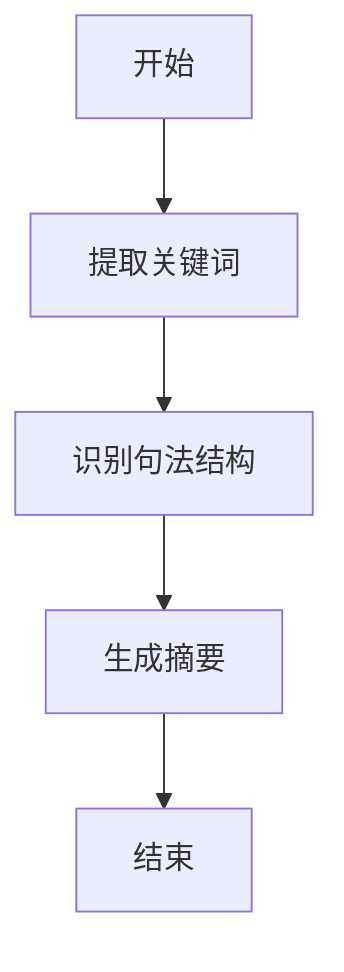
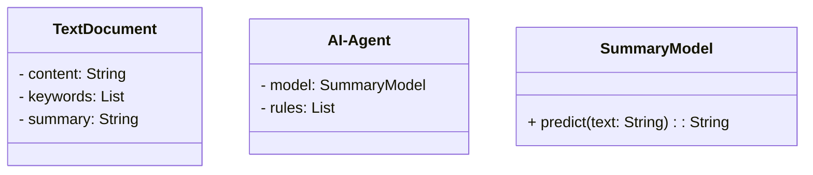
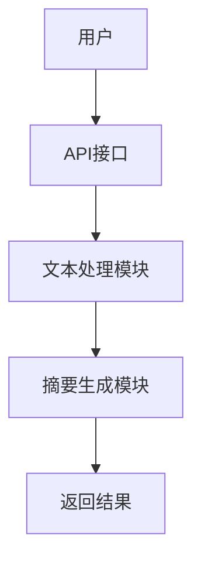
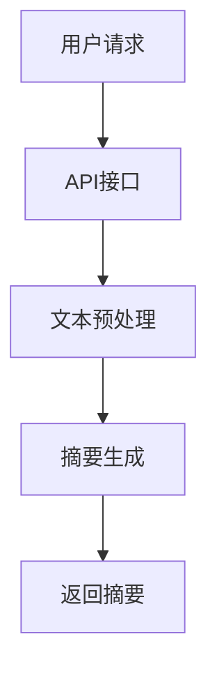
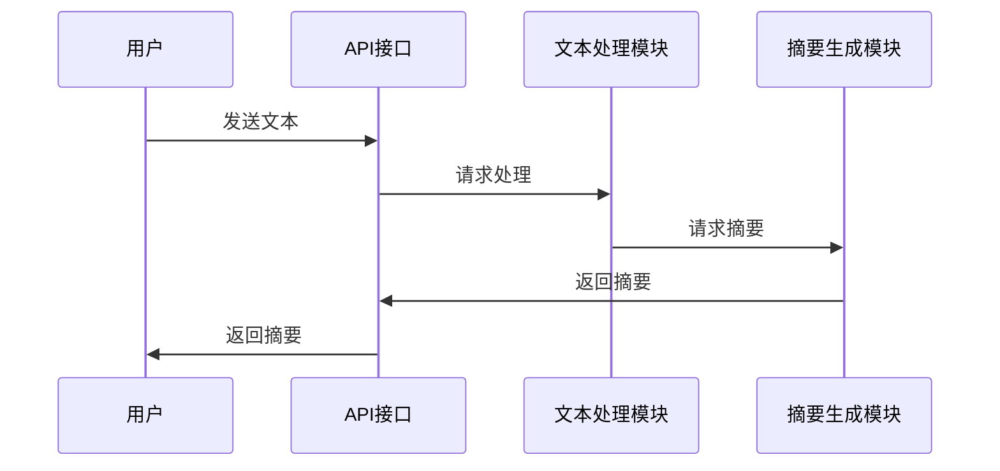

                 


# 文本摘要：让AI Agent提炼关键信息

> **关键词**：文本摘要、AI Agent、自然语言处理、信息抽取、深度学习、机器学习  
> **摘要**：文本摘要技术在信息爆炸的时代变得尤为重要。通过AI Agent提炼关键信息，可以有效地减少信息过载，提高信息处理效率。本文将从核心概念、算法原理、系统设计到项目实战，全面解析文本摘要技术，并探讨其在实际应用中的潜力与挑战。

---

## 第1章: 文本摘要与AI Agent的背景介绍

### 1.1 问题背景与描述

#### 1.1.1 文本信息过载的现状  
在当今信息爆炸的时代，我们每天都会接触到海量的文字信息，包括新闻、社交媒体、邮件、文档等。然而，人们的注意力有限，如何快速提取关键信息成为一个迫切的需求。文本摘要技术通过自动化方式提取文本的核心内容，帮助用户节省阅读时间。

#### 1.1.2 AI Agent在信息处理中的作用  
AI Agent（人工智能代理）是一种能够感知环境、执行任务的智能实体。它可以通过自然语言处理技术，理解用户的意图，并从大量文本中提炼出关键信息。AI Agent不仅能够自动化处理文本摘要，还能根据用户需求动态调整摘要策略。

#### 1.1.3 文本摘要的核心问题与挑战  
文本摘要的核心问题是如何准确地提取文本的主要信息，同时保持语义的连贯性。挑战包括处理歧义性、上下文依赖性以及如何平衡摘要的长度和信息完整性。

---

### 1.2 AI Agent与文本摘要的关系

#### 1.2.1 AI Agent的基本概念  
AI Agent是一种能够执行特定任务的智能系统，它可以分为简单反射型、基于模型的反应型、目标驱动型和实用驱动型四种类型。在文本摘要中，AI Agent通常采用目标驱动型，旨在通过优化算法提取关键信息。

#### 1.2.2 文本摘要的定义与分类  
文本摘要是指从文本中提取关键信息，生成简短、准确的摘要。根据生成方式，文本摘要可以分为基于规则的摘要和基于深度学习的摘要。基于规则的摘要依赖预定义的规则，而基于深度学习的摘要则利用神经网络模型自动学习特征。

#### 1.2.3 AI Agent如何提炼关键信息  
AI Agent通过自然语言处理技术，分析文本的语义结构，识别关键词、句法关系和上下文信息。结合这些信息，AI Agent可以生成符合用户需求的摘要。

---

## 第2章: 文本摘要的核心概念原理

### 2.1 文本摘要的原理与方法

#### 2.1.1 基于规则的文本摘要  
基于规则的摘要方法通过预定义的规则提取文本中的关键信息。例如，可以基于关键词频率、句法结构等规则生成摘要。这种方法简单易懂，但灵活性较差。

#### 2.1.2 基于深度学习的文本摘要  
基于深度学习的摘要方法利用神经网络模型（如Transformer、BERT、GPT）来自动学习文本的特征。这些模型能够捕捉到文本的语义信息，生成更加自然流畅的摘要。

#### 2.1.3 混合方法的优势与挑战  
混合方法结合了基于规则和基于深度学习的优势，通过规则过滤和模型优化来提升摘要的准确性和流畅性。然而，混合方法的复杂性和计算成本较高。

---

### 2.2 AI Agent的实体关系图

#### 2.2.1 ER实体关系图的构建  
以下是AI Agent与文本摘要相关的实体关系图：

```mermaid
er
actor(AI Agent) -|进行| text_document
text_document -|拥有| keywords
text_document -|拥有| summary
keywords -|属于| text_document
summary -|属于| text_document
```

#### 2.2.2 实体关系与文本摘要的关系  
AI Agent通过处理`text_document`，提取`keywords`并生成`summary`，从而实现文本摘要的功能。

#### 2.2.3 ER图的优化与应用  
通过优化ER图，可以更好地理解文本摘要的核心要素和交互关系，为后续的系统设计提供基础。

---

### 2.3 核心概念对比表格

| **核心概念** | **基于规则的摘要** | **基于深度学习的摘要** |
|--------------|---------------------|-------------------------|
| **原理**     | 预定义规则           | 神经网络自动学习         |
| **优点**     | 实现简单，计算成本低 | 摘要质量高，语义连贯     |
| **缺点**     | 灵活性差             | 计算成本高，训练需求大   |
| **应用场景** | 简单文本摘要         | 复杂文本摘要             |

---

## 第3章: 文本摘要算法原理

### 3.1 基于规则的摘要算法

#### 3.1.1 算法流程图



#### 3.1.2 优缺点分析  
基于规则的摘要算法实现简单，但灵活性差，难以处理复杂的文本结构。

#### 3.1.3 实际案例分析  
以一篇新闻报道为例，通过关键词提取和句法分析生成摘要。

---

### 3.2 基于深度学习的摘要算法

#### 3.2.1 Transformer模型原理  
Transformer模型通过自注意力机制捕捉文本的全局信息，生成高质量的摘要。

#### 3.2.2 BERT与GPT在文本摘要中的应用  
BERT用于编码文本，GPT用于解码摘要，两者结合可以提升摘要的准确性和流畅性。

#### 3.2.3 深度学习算法的优缺点  
深度学习算法具有强大的表达能力，但需要大量的数据和计算资源。

---

### 3.3 数学模型与公式

#### 3.3.1 概率论基础  
概率论是文本摘要算法的基础，例如计算关键词的出现概率：

$$ P(word) = \frac{\text{词频}}{\text{总词数}} $$

#### 3.3.2 变分推断公式  
变分推断用于优化摘要的表达，例如：

$$ \argmax_{z} \text{P}(z|x) $$

#### 3.3.3 注意力机制公式  
注意力机制通过加权计算词向量：

$$ \text{Attention}(Q, K, V) = \text{softmax}(\frac{QK^T}{\sqrt{d}})V $$

---

## 第4章: 文本摘要系统设计

### 4.1 项目背景与目标

#### 4.1.1 项目背景  
本文旨在设计一个基于AI Agent的文本摘要系统，解决信息过载问题。

#### 4.1.2 项目目标  
实现一个能够自动提取关键信息的文本摘要系统。

#### 4.1.3 项目范围  
系统支持多种文本类型，包括新闻、邮件和文档。

---

### 4.2 系统功能设计

#### 4.2.1 领域模型类图



---

### 4.3 系统架构设计

#### 4.3.1 分层架构图



#### 4.3.2 组件交互图



---

### 4.4 系统交互设计

#### 4.4.1 序列图



---

## 第5章: 文本摘要系统实现

### 5.1 环境搭建与配置

#### 5.1.1 开发环境安装  
需要安装Python、TensorFlow、Keras等工具。

#### 5.1.2 依赖库安装  
安装必要的依赖库，例如：

```bash
pip install numpy
pip install matplotlib
pip install transformers
```

---

### 5.2 核心代码实现

#### 5.2.1 摘要生成代码

```python
from transformers import pipeline

summarizer = pipeline("summarization")
text = "..."  # 输入文本
summary = summarizer(text, max_length=100, min_length=30, do_sample=False)
print(summary[0]['summary_text'])
```

#### 5.2.2 代码解读与分析  
上述代码利用Hugging Face的Transformers库，通过预训练的模型生成摘要。

---

## 第6章: 最佳实践与小结

### 6.1 最佳实践

#### 6.1.1 选择合适的模型  
根据具体场景选择适合的摘要模型。

#### 6.1.2 数据优化  
优化数据预处理和特征提取，提升摘要质量。

#### 6.1.3 模型调优  
通过超参数调优和模型微调，提升摘要性能。

---

### 6.2 小结

文本摘要技术在信息处理中具有重要意义。通过AI Agent的辅助，我们可以更高效地提取关键信息，减少信息过载。未来，随着深度学习技术的不断进步，文本摘要将更加智能化和个性化。

---

## 作者：AI天才研究院/AI Genius Institute & 禅与计算机程序设计艺术 /Zen And The Art of Computer Programming

---

以上是文章的详细目录和部分内容的初步规划，您可以根据需要进一步扩展每一部分的具体内容，添加更多的技术细节和实例分析。

