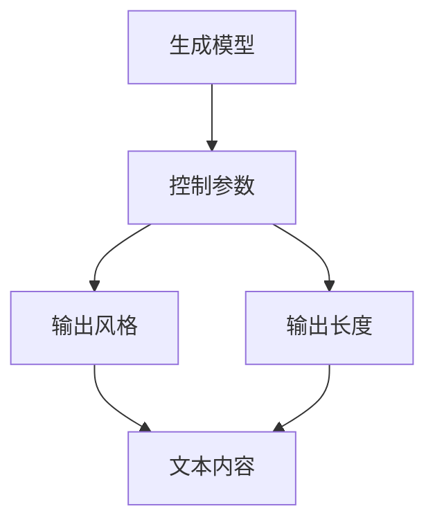
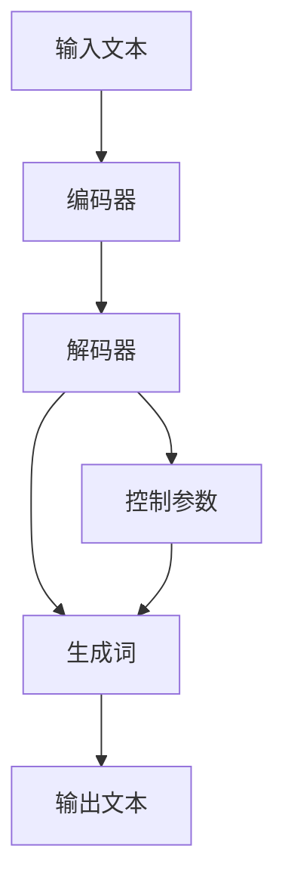
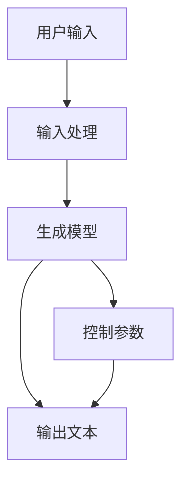
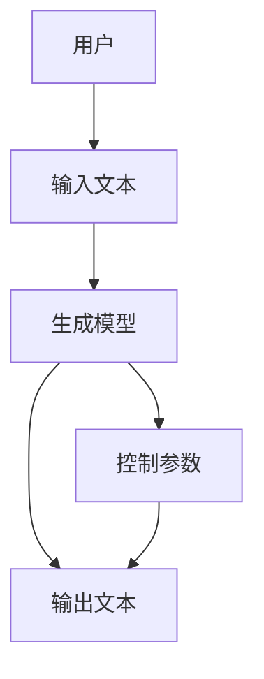

                 

# 文本生成控制：调节AI Agent的输出风格和长度

> **关键词**：文本生成控制，AI Agent，输出风格，输出长度，生成模型，自然语言处理

> **摘要**：本文将详细探讨如何调节AI Agent的文本生成输出风格和长度。通过分析文本生成控制的核心概念、算法原理、数学模型、系统架构设计以及实际项目案例，我们将深入理解如何通过技术手段实现对生成文本的精准控制，满足不同场景下的多样化需求。

---

## 第一部分: 文本生成控制概述

### 第1章: 文本生成控制的背景与概念

#### 1.1 什么是文本生成控制
文本生成控制是指在生成文本的过程中，通过调节某些参数或策略，使得生成的文本在风格、长度、语气等多个维度上符合特定需求。例如，生成一段正式的商业邮件、一个简洁的新闻标题或一个幽默的社交媒体帖子。

- **输出风格**：文本的语气和表达方式，如正式、简洁、幽默、技术性等。
- **输出长度**：文本的字数或句子数量，如短文本、中等文本、长文本。
- **风格与长度的相互影响**：不同的风格可能需要不同的长度来最佳表达。

#### 1.2 文本生成控制的核心问题
文本生成控制涉及以下几个核心问题：
1. 如何量化和表示文本风格？
2. 如何调整生成模型的参数以控制输出长度？
3. 如何平衡风格和长度之间的关系，避免生成文本偏离预期目标？

#### 1.3 文本生成控制的应用场景
文本生成控制在多个领域有广泛应用：
1. **自然语言处理**：生成高质量的摘要、翻译文本、对话系统等。
2. **人机交互**：优化聊天机器人、智能助手的输出，使其更符合用户需求。
3. **内容创作**：个性化内容生成，如新闻、广告、文学创作等。

---

### 第2章: 文本生成控制的核心概念与联系

#### 2.1 文本生成模型的原理
文本生成控制依赖于生成模型的实现。常见的生成模型包括基于转换器（Transformer）的模型和基于循环神经网络（RNN）的模型。

- **转换器模型**：通过自注意力机制捕捉文本中的长距离依赖关系，适用于长文本生成。
- **解码器模型**：生成文本的过程通常基于解码器结构，逐步生成每个词并结合上下文信息。

#### 2.2 文本生成控制的数学模型
文本生成控制的核心是通过调整生成模型的参数或引入额外的控制变量，来实现对生成文本的风格和长度的调节。

- **概率生成模型**：生成模型通常基于概率分布，通过调整参数来改变分布的形状。
- **风格向量**：引入一个风格向量来表示不同风格的特征，将其融入生成模型中。
- **长度惩罚**：通过引入长度惩罚因子，控制生成文本的长度。

#### 2.3 文本生成控制的实体关系图
以下是文本生成控制的核心实体关系图：

---

### 第3章: 文本生成控制的算法原理

#### 3.1 基于转换器的生成模型
转换器模型（如GPT、BERT）通过自注意力机制和前馈网络实现生成任务。生成过程通常包括编码器和解码器两部分：

- **编码器**：将输入文本编码为一个固定长度的向量。
- **解码器**：逐步生成输出文本，每一步都依赖于当前的生成结果和输入编码。

#### 3.2 基于解码器的控制方法
解码器是生成模型的核心部分，通过调整解码器的参数或引入控制策略，可以实现对生成文本的风格和长度的控制。

- **温度调节**：通过调整生成过程中的温度参数，控制生成结果的多样性。温度越高，生成结果越多样化；温度越低，生成结果越集中。
- **采样策略**：通过调整采样策略（如贪婪采样、随机采样、模拟采样），控制生成结果的质量和多样性。
- **长度惩罚**：通过引入长度惩罚因子，防止生成过长或过短的文本。

#### 3.3 文本生成控制的算法流程图
以下是文本生成控制的算法流程图：

---

### 第4章: 文本生成控制的数学模型与公式

#### 4.1 概率生成模型
生成模型通常基于概率分布，通过调整概率参数来控制生成文本的风格和长度。

- **条件概率公式**：
  $$P(y|x) = \prod_{i=1}^{n} P(y_i|x, y_{<i})$$
  其中，$x$ 是输入文本，$y$ 是生成的输出文本，$y_{<i}$ 表示生成的前 $i-1$ 个词。

- **风格向量的引入**：
  $$s = [s_1, s_2, ..., s_k]$$
  其中，$s$ 是风格向量，$s_k$ 表示第 $k$ 种风格的特征。

- **长度惩罚函数**：
  $$L = \alpha \cdot \text{length}(y) + (1-\alpha)\cdot \text{loss}(y)$$
  其中，$\alpha$ 是长度惩罚因子，$\text{length}(y)$ 是生成文本的长度，$\text{loss}(y)$ 是生成模型的损失函数。

---

### 第5章: 文本生成控制的系统分析与架构设计

#### 5.1 系统功能设计
文本生成控制系统需要实现以下功能：
1. **风格调节**：通过调整风格参数，生成不同风格的文本。
2. **长度调节**：通过调整长度参数，生成不同长度的文本。
3. **综合调节**：同时调节风格和长度，生成符合特定需求的文本。

#### 5.2 系统架构设计
以下是文本生成控制系统的架构设计图：

- **用户输入**：用户输入需要生成的文本或参数。
- **输入处理**：对输入文本进行预处理，提取特征或生成初始向量。
- **生成模型**：基于预处理后的输入，生成候选文本。
- **控制参数**：调整生成模型的参数或引入控制向量，实现对生成文本的风格和长度控制。
- **输出文本**：生成并输出符合要求的文本。

#### 5.3 接口设计与交互流程
以下是文本生成控制系统的交互流程图：

---

## 第二部分: 文本生成控制的实现与应用

### 第6章: 文本生成控制的数学模型与公式

#### 6.1 概率生成模型
生成模型基于概率分布生成文本，通过调整概率参数实现对生成文本的控制。

- **条件概率公式**：
  $$P(y|x) = \prod_{i=1}^{n} P(y_i|x, y_{<i})$$
  其中，$x$ 是输入文本，$y$ 是生成的输出文本，$y_{<i}$ 表示生成的前 $i-1$ 个词。

- **风格向量的引入**：
  $$s = [s_1, s_2, ..., s_k]$$
  其中，$s$ 是风格向量，$s_k$ 表示第 $k$ 种风格的特征。

- **长度惩罚函数**：
  $$L = \alpha \cdot \text{length}(y) + (1-\alpha)\cdot \text{loss}(y)$$
  其中，$\alpha$ 是长度惩罚因子，$\text{length}(y)$ 是生成文本的长度，$\text{loss}(y)$ 是生成模型的损失函数。

### 第7章: 文本生成控制的系统分析与架构设计

#### 7.1 系统功能设计
文本生成控制系统需要实现以下功能：
1. **风格调节**：通过调整风格参数，生成不同风格的文本。
2. **长度调节**：通过调整长度参数，生成不同长度的文本。
3. **综合调节**：同时调节风格和长度，生成符合特定需求的文本。

#### 7.2 系统架构设计
以下是文本生成控制系统的架构设计图：

---

## 第三部分: 文本生成控制的项目实战

### 第8章: 文本生成控制的数学模型与公式

#### 8.1 概率生成模型
生成模型基于概率分布生成文本，通过调整概率参数实现对生成文本的控制。

- **条件概率公式**：
  $$P(y|x) = \prod_{i=1}^{n} P(y_i|x, y_{<i})$$
  其中，$x$ 是输入文本，$y$ 是生成的输出文本，$y_{<i}$ 表示生成的前 $i-1$ 个词。

- **风格向量的引入**：
  $$s = [s_1, s_2, ..., s_k]$$
  其中，$s$ 是风格向量，$s_k$ 表示第 $k$ 种风格的特征。

- **长度惩罚函数**：
  $$L = \alpha \cdot \text{length}(y) + (1-\alpha)\cdot \text{loss}(y)$$
  其中，$\alpha$ 是长度惩罚因子，$\text{length}(y)$ 是生成文本的长度，$\text{loss}(y)$ 是生成模型的损失函数。

---

## 第四部分: 文本生成控制的优化与扩展

### 第9章: 文本生成控制的系统优化

#### 9.1 系统性能优化
文本生成控制系统需要考虑以下性能优化措施：
1. **模型压缩**：通过剪枝、量化等技术，减少生成模型的参数数量。
2. **并行计算**：利用GPU或TPU加速生成过程，提高生成速度。
3. **动态调整**：根据实时反馈动态调整生成参数，提高生成结果的质量。

#### 9.2 系统扩展
文本生成控制系统可以通过以下方式实现扩展：
1. **多语言支持**：支持多种语言的文本生成，满足全球化需求。
2. **多模态生成**：结合图像、音频等多模态信息，生成更丰富的文本内容。
3. **实时生成**：支持实时交互生成，适用于聊天机器人、智能客服等场景。

---

## 第五部分: 结论与展望

### 第10章: 文本生成控制的总结与展望

#### 10.1 总结
文本生成控制是一种通过调节生成模型的参数或引入额外的控制变量，实现对生成文本的风格和长度的精确控制的技术。通过对生成模型的深入分析和系统设计，我们可以实现高质量、多样化的文本生成。

#### 10.2 展望
未来，文本生成控制技术将朝着以下几个方向发展：
1. **更复杂的控制维度**：引入更多维度的控制参数，如情感、语气、风格等。
2. **更高效的生成算法**：通过优化算法和硬件，提高生成速度和质量。
3. **更广泛的应用场景**：在教育、医疗、金融等领域，实现更智能化、个性化的文本生成。

---

## 作者：AI天才研究院/AI Genius Institute & 禅与计算机程序设计艺术 /Zen And The Art of Computer Programming

