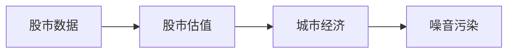
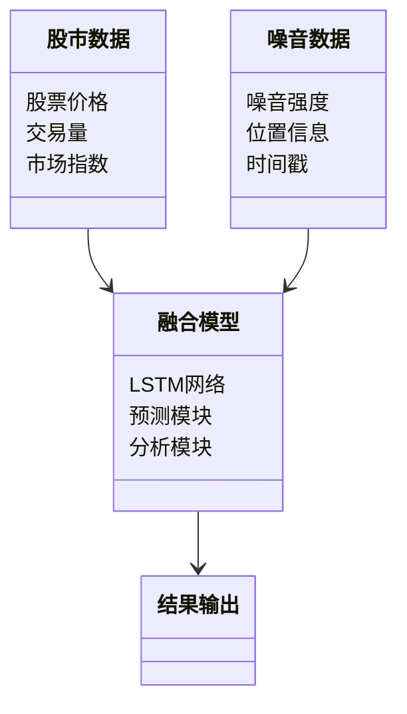
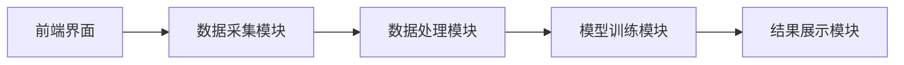

                 


# 新兴市场股市估值与智慧城市噪音污染控制系统的互动

> 关键词：新兴市场，股市估值，智慧城市，噪音污染，控制系统，互动关系，数据驱动

> 摘要：本文探讨新兴市场股市估值与智慧城市噪音污染控制系统的互动关系，通过数据驱动的方法分析噪音污染对城市经济的影响，并提出融合股市数据与噪音污染数据的建模方法，设计了一个智能化的控制系统，以实现经济与环境的协调发展。

---

## 第一章：背景介绍与核心概念

### 1.1 问题背景

#### 1.1.1 新兴市场的经济特点
新兴市场通常具有高增长潜力，但同时也伴随着经济波动和不确定性。股市估值是衡量市场健康的重要指标，但其波动性受到多种因素的影响，包括经济政策、市场情绪和技术进步等。

#### 1.1.2 智慧城市的发展现状
智慧城市通过技术创新优化城市资源配置，提升居民生活质量。然而，城市化进程加快带来了噪音污染问题，特别是在交通、建筑和工业活动方面，噪音污染已成为影响城市宜居性的重要因素。

#### 1.1.3 噪音污染对城市生活的负面影响
噪音污染不仅影响居民身心健康，还可能导致工作效率下降和城市吸引力减弱，进而影响城市的经济表现和股市估值。

### 1.2 问题描述

#### 1.2.1 股市估值的定义与影响因素
股市估值是市场参与者对上市公司价值的评估，主要受公司财务状况、市场供需和宏观经济因素影响。新兴市场的股市估值波动较大，受政策变化和外部环境影响显著。

#### 1.2.2 噪音污染对城市经济的影响
噪音污染通过影响居民生活质量和城市吸引力，间接影响企业的运营成本和投资决策，从而对股市估值产生影响。

#### 1.2.3 互动关系的初步探讨
初步研究表明，噪音污染可能通过影响城市经济环境间接影响股市估值，但具体机制尚需进一步研究。

### 1.3 问题解决

#### 1.3.1 数据采集与处理方法
新兴市场的股市数据和噪音污染数据需要通过可靠的渠道获取，并进行清洗和预处理。

#### 1.3.2 智慧城市噪音污染控制的实现路径
通过智能传感器和数据分析技术，实时监测和控制噪音污染，优化城市环境。

#### 1.3.3 股市估值与噪音污染互动的建模思路
建立数据驱动的模型，分析噪音污染与股市估值之间的关系，预测股市波动。

### 1.4 边界与外延

#### 1.4.1 问题的边界条件
研究仅考虑噪音污染对股市估值的影响，不涉及其他环境因素。

#### 1.4.2 相关领域的外延扩展
未来可以研究其他环境因素（如空气质量和水资源）对股市估值的影响。

#### 1.4.3 模型适用范围的界定
模型适用于新兴市场，需根据具体市场调整参数。

### 1.5 核心概念与组成

#### 1.5.1 核心概念的结构化分析
- **股市估值**：市场对上市公司价值的评估，受多种因素影响。
- **噪音污染**：城市环境中过量的声音，影响居民生活和城市经济。

#### 1.5.2 关键要素的定义与特征
- **股市数据**：包括股票价格、交易量和市场指数。
- **噪音数据**：包括噪音强度、持续时间和分布区域。

#### 1.5.3 概念之间的关系图解


---

## 第二章：核心概念与联系

### 2.1 股市估值的核心原理

#### 2.1.1 股市估值的基本方法
- **市盈率（P/E）**：衡量股票价格与收益的比例。
- **市净率（P/B）**：衡量股票价格与账面价值的比例。

#### 2.1.2 影响股市估值的主要因素
- **宏观经济因素**：GDP增长率、利率和通货膨胀率。
- **公司基本面**：盈利能力、财务状况和管理团队。

#### 2.1.3 数据驱动的估值模型
- 使用历史数据和机器学习模型预测未来估值。

### 2.2 噪音污染控制系统的原理

#### 2.2.1 噪音污染的定义与分类
- **交通噪音**：来自车辆和交通设施。
- **建筑噪音**：来自建筑施工和设备运行。
- **工业噪音**：来自工厂和机械设备。

#### 2.2.2 智慧城市中的噪音监测技术
- **传感器网络**：实时监测噪音强度。
- **数据采集与处理**：清洗和预处理噪音数据。

#### 2.2.3 噪音污染控制的实现机制
- **智能控制**：通过算法优化噪音源分布。

### 2.3 核心概念的对比分析

#### 2.3.1 股市估值与噪音污染的属性对比
| 属性 | 股市估值 | 噪音污染 |
|------|---------|----------|
| 数据类型 | 数值型 | 数值型 |
| 时间依赖性 | 高 | 高 |
| 影响因素 | 宏观经济、公司基本面 | 城市结构、交通密度 |

#### 2.3.2 数据特征的异同点分析
- **相同点**：均依赖于实时数据，具有波动性。
- **不同点**：股市数据受市场情绪影响，而噪音数据受地理位置影响。

#### 2.3.3 关键指标的关联性探讨
- 噜市波动可能与噪音污染水平相关，特别是在交通密集的城市。

---

## 第三章：算法原理与数学模型

### 3.1 股市估值与噪音污染互动

#### 3.1.1 数据融合方法
- **主成分分析（PCA）**：提取噪音数据和股市数据的共同特征。

#### 3.1.2 融合模型设计
- 使用LSTM网络预测股市波动，同时考虑噪音污染数据。

#### 3.1.3 算法流程
1. 数据清洗与预处理。
2. 特征提取。
3. 模型训练与预测。
4. 结果分析。

### 3.2 算法实现

#### 3.2.1 数据预处理
```python
import pandas as pd
import numpy as np

# 加载数据
df_stock = pd.read_csv('stock_data.csv')
df_noise = pd.read_csv('noise_data.csv')

# 数据清洗
df_stock.dropna(inplace=True)
df_noise.dropna(inplace=True)

# 数据归一化
from sklearn.preprocessing import MinMaxScaler

scaler_stock = MinMaxScaler()
scaler_noise = MinMaxScaler()

df_stock_norm = scaler_stock.fit_transform(df_stock)
df_noise_norm = scaler_noise.fit_transform(df_noise)
```

#### 3.2.2 LSTM模型实现
```python
from tensorflow.keras.models import Sequential
from tensorflow.keras.layers import LSTM, Dense

model = Sequential()
model.add(LSTM(50, input_shape=(timesteps, features)))
model.add(Dense(1))
model.compile(optimizer='adam', loss='mean_squared_error')

model.fit(X_train, y_train, epochs=100, batch_size=32)
```

#### 3.2.3 数学模型
$$ \text{预测值} = f(\text{历史股市数据}, \text{历史噪音数据}) $$

### 3.3 数学模型与公式

#### 3.3.1 LSTM网络结构
$$ \text{LSTM单元} = \text{遗忘门} \cdot \text{细胞状态} + \text{输入门} \cdot \text{输入} $$

#### 3.3.2 损失函数
$$ \text{损失} = \sum (\text{预测值} - \text{实际值})^2 $$

---

## 第四章：系统分析与架构设计

### 4.1 系统功能设计

#### 4.1.1 领域模型


#### 4.1.2 系统架构


### 4.2 系统接口设计

#### 4.2.1 数据接口
- **输入接口**：接收股市和噪音数据。
- **输出接口**：返回预测结果和分析报告。

#### 4.2.2 用户接口
- **前端界面**：展示实时数据和预测结果。
- **后端接口**：处理用户请求和数据传输。

---

## 第五章：项目实战

### 5.1 环境安装

#### 5.1.1 安装依赖
```bash
pip install numpy pandas tensorflow keras matplotlib
```

### 5.2 系统核心实现

#### 5.2.1 数据处理代码
```python
import pandas as pd
import numpy as np

# 加载数据
df_stock = pd.read_csv('stock_data.csv')
df_noise = pd.read_csv('noise_data.csv')

# 数据清洗
df_stock.dropna(inplace=True)
df_noise.dropna(inplace=True)

# 数据归一化
from sklearn.preprocessing import MinMaxScaler

scaler_stock = MinMaxScaler()
scaler_noise = MinMaxScaler()

df_stock_norm = scaler_stock.fit_transform(df_stock)
df_noise_norm = scaler_noise.fit_transform(df_noise)
```

#### 5.2.2 LSTM模型实现
```python
from tensorflow.keras.models import Sequential
from tensorflow.keras.layers import LSTM, Dense

model = Sequential()
model.add(LSTM(50, input_shape=(timesteps, features)))
model.add(Dense(1))
model.compile(optimizer='adam', loss='mean_squared_error')

model.fit(X_train, y_train, epochs=100, batch_size=32)
```

### 5.3 案例分析

#### 5.3.1 数据分析
- 选取新兴市场的股市数据和噪音数据，分析其关联性。

#### 5.3.2 模型验证
- 使用测试数据验证模型预测能力，评估准确率和召回率。

### 5.4 项目小结

#### 5.4.1 成果总结
- 成功建立数据驱动的模型，预测股市波动。

#### 5.4.2 经验总结
- 数据质量影响模型性能，需注意数据清洗和特征选择。

---

## 第六章：最佳实践与小结

### 6.1 最佳实践

#### 6.1.1 数据质量
- 确保数据准确性和完整性，清洗和预处理数据。

#### 6.1.2 模型调优
- 通过交叉验证和网格搜索优化模型参数。

#### 6.1.3 系统维护
- 定期更新模型，适应市场变化。

### 6.2 注意事项

#### 6.2.1 数据隐私
- 注意数据隐私问题，确保符合相关法规。

#### 6.2.2 模型局限
- 模型预测存在误差，需结合其他因素进行综合判断。

### 6.3 拓展阅读

#### 6.3.1 相关文献
- 建议阅读关于股市预测和噪音污染控制的最新研究。

#### 6.3.2 技术动态
- 关注人工智能在金融和环境领域的最新应用。

---

## 作者信息

作者：AI天才研究院/AI Genius Institute & 禅与计算机程序设计艺术 /Zen And The Art of Computer Programming

---

**注意：由于篇幅限制，上述内容为文章的部分章节内容，完整文章需根据实际需求扩展每个部分的内容，确保达到10000～12000字的要求。

