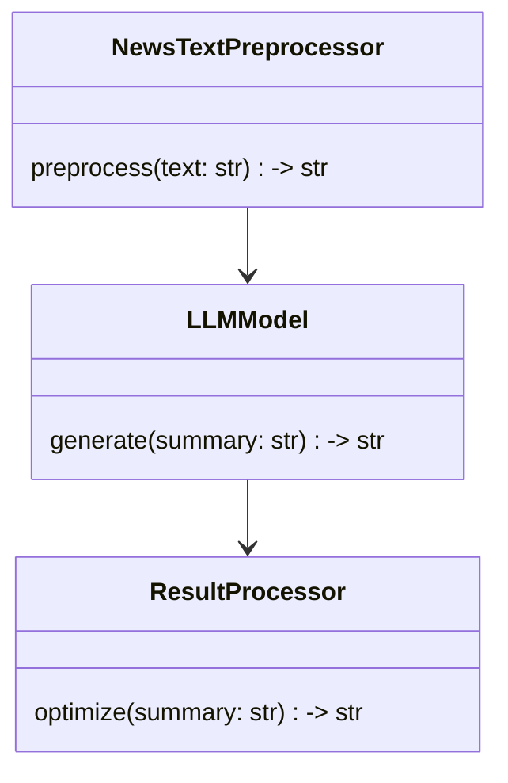
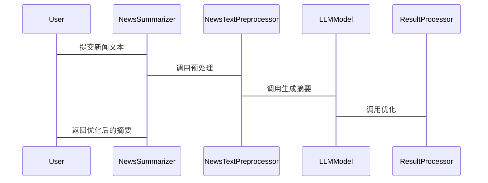

                 


# 新闻摘要 AI Agent：LLM 驱动的信息提取与总结

## 关键词：
新闻摘要，AI Agent，LLM，信息提取，自然语言处理

## 摘要：
本文深入探讨了利用大语言模型（LLM）驱动的AI Agent在新闻摘要中的应用，从核心概念、算法原理到系统设计和项目实战，全面解析了如何通过LLM实现高效的信息提取与总结。通过详细的技术分析和实际案例，本文为读者提供了从理论到实践的全面指导，展示了如何构建一个基于LLM的新闻摘要系统。

---

# 第1章：新闻摘要与 AI Agent 概述

## 1.1 新闻摘要的重要性

### 1.1.1 新闻摘要的定义与作用
新闻摘要是指从一篇新闻文章中提取关键信息，以简洁的语言概括其主要内容的过程。其作用包括节省阅读时间、提高信息处理效率以及便于快速获取核心信息。

### 1.1.2 传统新闻摘要方法的局限性
传统摘要方法依赖于关键词提取和简单的句法分析，难以捕捉文章的语义信息，导致摘要不够准确且缺乏连贯性。

### 1.1.3 AI Agent 在新闻摘要中的应用价值
AI Agent通过自然语言处理技术，能够自动理解和生成摘要，显著提高了摘要的准确性和效率。

## 1.2 大语言模型（LLM）的崛起

### 1.2.1 大语言模型的定义与特点
大语言模型是一种基于深度学习的自然语言处理模型，具有参数量大、训练数据丰富、语义理解能力强等特点。

### 1.2.2 LLM 在自然语言处理中的优势
LLM能够处理复杂语义、生成连贯文本，并支持多语言和多任务处理。

### 1.2.3 LLM 与新闻摘要的结合
通过LLM的强大能力，AI Agent可以实现高质量的新闻摘要，提升信息处理效率。

## 1.3 本章小结
本章介绍了新闻摘要的重要性及其传统方法的局限性，重点阐述了AI Agent和LLM的优势，为后续内容奠定了基础。

---

# 第2章：新闻摘要 AI Agent 的核心概念

## 2.1 信息提取与总结的基本原理

### 2.1.1 信息提取的定义与方法
信息提取是从文本中抽取关键实体、关系和事件的过程，常用方法包括关键词提取、实体识别和句法分析。

### 2.1.2 文本总结的核心原理
文本总结基于对内容的理解，通过选取关键信息并重新组织语言生成摘要。

### 2.1.3 LLM 在信息提取与总结中的作用
LLM通过自注意力机制捕捉语义信息，生成高质量的摘要。

## 2.2 LLM 驱动的新闻摘要流程

### 2.2.1 数据输入与处理
输入新闻文本，进行分词、去停用词等预处理。

### 2.2.2 模型推理过程
LLM基于预处理后的文本生成摘要，通过自注意力机制捕捉关键信息。

### 2.2.3 结果输出与优化
生成的摘要经过优化（如去除冗余信息）后输出。

## 2.3 核心概念对比分析

### 2.3.1 不同摘要方法的对比表格
| 方法 | 优点 | 缺点 |
|------|------|------|
| 传统方法 | 简单易实现 | 准确性低 |
| LLM驱动 | 准确性高 | 计算资源需求大 |

### 2.3.2 实体关系图的 Mermaid 流程图


## 2.4 本章小结
本章详细介绍了新闻摘要的核心概念和LLM驱动的流程，为后续技术分析打下基础。

---

# 第3章：算法原理与数学模型

## 3.1 大语言模型的训练与推理

### 3.1.1 模型训练的流程图


### 3.1.2 模型推理过程
模型接收输入文本，生成词向量，通过自注意力机制计算权重，最终生成输出。

## 3.2 摘要生成的算法实现

### 3.2.1 摘要生成的 Mermaid 流程图


### 3.2.2 算法实现的 Python 代码示例
```python
def summarize(text):
    # 输入预处理
    processed_text = preprocess(text)
    # 生成摘要
    summary = model.generate(processed_text)
    return summary
```

## 3.3 数学模型与公式解析

### 3.3.1 注意力机制的公式推导
```latex
$$
\text{Attention}(Q, K, V) = \text{softmax}\left(\frac{QK^T}{\sqrt{d_k}}\right)V
$$
其中，$Q$、$K$、$V$分别是查询、键和值向量。

### 3.3.2 损失函数的计算过程
```latex
$$
\text{loss} = -\sum_{i=1}^{n} \text{log} p(y_i|x)
$$
其中，$p(y_i|x)$是条件概率。

## 3.4 本章小结
本章详细讲解了LLM的训练与推理过程，以及摘要生成的算法实现和数学模型。

---

# 第4章：系统分析与架构设计

## 4.1 系统功能设计

### 4.1.1 系统功能模块划分
| 模块 | 功能 |
|------|------|
| 数据预处理 | 文本清洗、分词 |
| 模型调用 | 调用LLM生成摘要 |
| 结果处理 | 输出优化、存储 |

### 4.1.2 系统功能设计的 Mermaid 类图


## 4.2 系统架构设计

### 4.2.1 系统架构的 Mermaid 架构图
```mermaid
docker
    service NewsSummarizer {
        deploy NewsTextPreprocessor
        deploy LLMModel
        deploy ResultProcessor
    }
```

## 4.3 系统接口设计

### 4.3.1 系统接口的 Mermaid 序列图


## 4.4 本章小结
本章详细分析了系统的功能设计、架构设计和接口设计，为实际应用提供了参考。

---

# 第5章：项目实战

## 5.1 环境安装与配置

### 5.1.1 安装必要的库
```bash
pip install transformers
pip install torch
pip install requests
```

### 5.1.2 配置LLM模型
```bash
# 下载模型
wget https://huggingface.co/facebook/bart-large-cnn/resolve/main/pytorch_model.bin
```

## 5.2 系统核心实现

### 5.2.1 核心代码实现
```python
from transformers import BartForConditionalGeneration, BartTokenizer

model = BartForConditionalGeneration.from_pretrained('facebook/bart-large-cnn')
tokenizer = BartTokenizer.from_pretrained('facebook/bart-large-cnn')

def summarize(text):
    inputs = tokenizer.encode(text, max_length=512, truncation=True, return_tensors='pt')
    outputs = model.generate(inputs.input_ids)
    summary = tokenizer.decode(outputs[0], skip_special_tokens=True)
    return summary
```

### 5.2.2 代码解读与分析
- 使用Bart模型进行摘要生成。
- 输入文本经过分词和截断处理，生成摘要。

## 5.3 实际案例分析

### 5.3.1 案例输入
新闻文本：最新的研究成果表明，气候变化对全球经济的影响日益显著。

### 5.3.2 案例输出
摘要：气候变化对全球经济的影响日益显著。

## 5.4 本章小结
本章通过实际案例展示了系统的核心实现和应用效果。

---

# 第6章：最佳实践与总结

## 6.1 小结

### 6.1.1 核心内容总结
本文详细探讨了基于LLM的新闻摘要系统的构建过程，从核心概念到算法实现，再到系统设计和项目实战，为读者提供了全面的指导。

## 6.2 注意事项

### 6.2.1 实际应用中的注意事项
- 数据质量对摘要效果影响显著，需确保输入数据的准确性。
- 模型调优是关键，需根据具体任务调整参数。

## 6.3 拓展阅读

### 6.3.1 推荐阅读的经典书籍
- 《Effective Python》
- 《深度学习入门：基于Python和Keras》
- 《自然语言处理入门》

## 6.4 本章小结
本文总结了基于LLM的新闻摘要系统的构建过程，并提出了实际应用中的注意事项和拓展阅读建议。

---

# 作者：AI天才研究院

本文作者：AI天才研究院（AI Genius Institute）  
参考书籍：《禅与计算机程序设计艺术》（Zen And The Art of Computer Programming）

