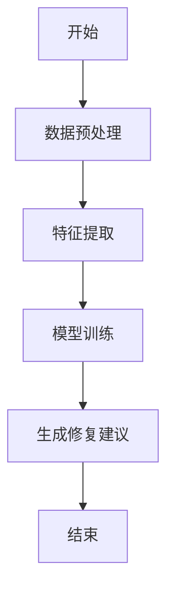

                 


# 智能个人信用修复建议系统

## 关键词：智能信用修复、个人信用、数据驱动、人工智能、修复建议系统

## 摘要：  
随着社会信用体系的不断完善，个人信用修复已成为一个重要的社会问题。本文提出了一种基于人工智能和数据分析的智能个人信用修复建议系统，通过量化分析和算法优化，为个人提供精准的信用修复建议。本文从背景、概念、算法、系统架构、项目实战等角度进行了详细探讨，旨在为信用修复领域提供一种创新的解决方案。

---

## 第1章: 背景介绍

### 1.1 问题背景  
- 个人信用修复的重要性  
- 传统信用修复的局限性  
- 智能信用修复的需求与痛点  

### 1.2 问题描述  
- 信用修复的核心问题是什么？  
- 个人信用数据的复杂性与多样性  
- 修复建议的个性化与动态性  

### 1.3 问题解决  
- 智能信用修复的基本思路  
- 数据驱动的修复策略  
- 人工智能在信用修复中的应用  

### 1.4 系统边界与外延  
- 系统功能边界  
- 修复建议的适用范围  
- 系统与外部环境的交互  

---

## 第2章: 核心概念与联系

### 2.1 核心概念原理  
- 信用评分模型的定义与作用  
- 修复建议算法的原理与流程  
- 数据分析与挖掘的核心作用  

### 2.2 核心概念对比表格  
| 概念 | 描述 | 特点 |  
|------|------|------|  
| 信用评分 | 衡量个人信用风险的指标 | 客观性、量化性 |  
| 修复建议 | 提供改善信用的具体方法 | 针对性、可操作性 |  
| 数据分析 | 从数据中提取有价值的信息 | 精准性、动态性 |  

### 2.3 ER实体关系图  
```mermaid
er
actor: 用户  
database: 信用数据  
model: 评分模型  
suggestion: 修复建议  
actor --> database: 提供数据  
database --> model: 训练模型  
model --> suggestion: 生成建议  
actor <-- suggestion: 提供修复方案  
```

---

## 第3章: 算法原理讲解

### 3.1 算法原理概述  
- 信用修复的核心算法  
- 算法的输入与输出  
- 算法的优缺点  

### 3.2 算法流程图  


### 3.3 算法数学模型  
$$ \text{信用评分} = \sum_{i=1}^{n} w_i x_i + b $$  
其中，$w_i$ 是特征权重，$x_i$ 是特征值，$b$ 是偏置项。

---

## 第4章: 系统分析与架构设计方案

### 4.1 问题场景介绍  
- 信用修复的具体场景与挑战  

### 4.2 项目介绍  
- 系统目标与功能  

### 4.3 系统功能设计  
- 领域模型（Mermaid 类图）  

### 4.4 系统架构设计  
- 系统架构图（Mermaid 架构图）  

### 4.5 系统接口设计  
- API 接口定义  

### 4.6 系统交互流程图  
- 序列图（Mermaid 序列图）  

---

## 第5章: 项目实战

### 5.1 环境安装  
- 必要工具与依赖安装  

### 5.2 系统核心实现  
- 修复建议系统的核心代码  

### 5.3 代码应用解读与分析  
- 核心代码的功能与实现细节  

### 5.4 实际案例分析  
- 典型案例的详细分析与解决过程  

### 5.5 项目小结  
- 项目实现的关键点与经验总结  

---

## 第6章: 总结与展望

### 6.1 系统总结  
- 系统的优势与不足  

### 6.2 改进方向与未来展望  
- 系统的优化空间与未来发展  

### 6.3 最佳实践 Tips  
- 使用中的注意事项与优化建议  

### 6.4 作者寄语  
- 对读者的鼓励与启发  

---

## 作者：AI天才研究院/AI Genius Institute & 禅与计算机程序设计艺术 /Zen And The Art of Computer Programming

